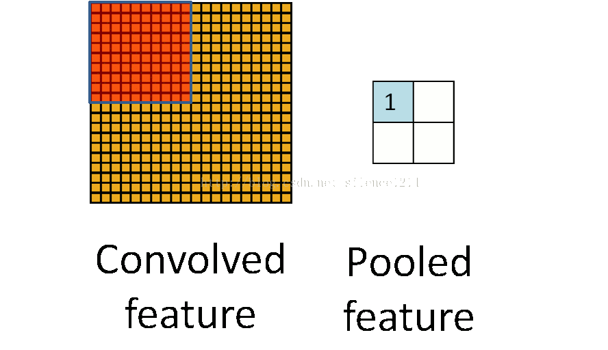

## 概念
**卷积神经网络(Convolutional Neural Networks)** 是一种在空间上共享参数的神经网络。使用数层卷积，而不是数层的矩阵相乘。在图像的处理过程中，每一张图片都可以看成一张“薄饼”，其中包括了图片的高度、宽度和深度（即颜色，用RGB表示）。

在不改变权重的情况下，把这个上方具有k个输出的小神经网络对应的小块滑遍整个图像，可以得到一个宽度、高度不同，而且深度也不同的新图像。

卷积时有很多种填充图像的方法，以下主要介绍两种，一种是相同填充，一种是有效填充。

如图中紫色方框所示，左边是有效填充，右边是相同填充。在相同填充中，超出边界的部分使用补充0的办法，使得输入输出的图像尺寸相同。而在有效填充中，则不使用补充0的方法，不能超出边界，因此往往输入的尺寸大于输出的尺寸。

## 卷积过程
**深度为1的filter卷积计算：**
$$a_{i,j}=f(\sum_{m=0}^{2}\sum_{n=0}^{2}w_{m,n}x_{i+m,j+n}+w_b)$$

**深度大于1的filter卷积计算：**
$$a_{i,j}=f(\sum_{d=0}^{D-1}\sum_{m=0}^{F-1}\sum_{n=0}^{F-1}w_{d,m,n}x_{d,i+m,j+n}+w_b)$$

回顾整个过程，就是一层一层地增加网络深度，最终得到一个又深又窄的表示，然后把其连接到全连接层，然后训练分类器。

**例如：LeNet-5中的卷积与池化分析**

在LeNet-5中，输入层是32x32的尺寸。
- 在第一次卷积中，使用了6个卷积核，得到了C1:6张28x28的特征图。**(注:6个卷积核即为6个filter，这时每个filter都是一个二维权重矩阵，将6个filter与输入图像矩阵分别进行卷积计算，得到6个矩阵输出，即为6张特征图)**
- 然后进行下采样，得到S2:特征图宽、高变为原来的1/2，即28/2=14，特征图尺寸变为14x14，特征图张数不变。
- 再进行第二次卷积，使用了16个卷积核，得到了C3:16张10x10的特征图。**(注：16个卷积核即为16个filter，此时每个filter都有6个二维权重矩阵对应输入的6张原始特征图，进行卷积最后得到16张特征图)**
- 然后进行下采样，得到S4:特征图宽、高变为原来的1/2，即10/2=5，特征图尺寸变为5x5，特征图张数不变。
- 之后进入卷积层C5，120张1x1全连接后的特征图，与S4全连接。

**综上：1、filter的个数与输出的特征图数量一致；2、每个filter中的权重矩阵个数与输入的特征图数量一致**

## 局部连接与权重共享

总体而言，局部连接和权重共享都是减少参数的办法，使得特征提取更为有效。
上图中左半部分，是全连接神经网络的示例。图中是一个1000x1000的图像，下一隐藏层有106个神经元，那么就会有1000x1000x106=1012个参数。
上图右半部分，是局部连接神经网络的示例。图中依然是一个1000x1000的图像，下一隐藏层有106个神经元，但是使用了一个10x10的卷积核，连接到了10x10的局部图像，那么则会有10x10x106=108个参数。
可见局部连接可以很大幅度减少参数的数量。

在实际应用中，有一些情况比较特殊，涉及到了统计不变性的问题。比如我们想识别图像中的动物类别，那么动物在图片中的位置（左上角、中间或是右下角）是不重要的，这叫平移不变性；再比如说，在识别数字的过程中，数字的颜色并不影响结果；又或者说，在语言处理中，一些词汇在句子中的位置并不影响其代表的含义。当两种输入可以获得同样的信息，那么我们就应该共享权重而且利用这些输入来共同训练权重。
在上图中的左半部分，是未使用权重共享的局部连接神经网络的示例。
在上图中的右半部分，则使用了权重共享。图中是一个1000x1000的图像，有100个10x10的卷积核，最终会有100x10x10=10k个参数。使用局部连接和权重共享都大大地减小了参数数量。而共享权重使得统计不变性问题得到了有效解决。

## 池化

通过卷积后，为了引入不变性，同时防止过拟合问题或欠拟合问题、降低计算量，我们常进行池化处理。池化过程如上图所示。因此池化过后，通常图像的宽度和高度会变成原来的1/2。
其中包括了Max pooling 、 Mean pooling和Stochastic pooling三种池化方法。
两种较为常用的是：Max pooling和Mean pooling。Max pooling是选择kernel范围之内的最大值；Mean pooling则是选择kernel范围之内的平均值。

## TensorFlow代码
```python
class CNN(object):
	def __init__(self):
		self.x=tf.placeholder('float',shape=[None,784])
		self.y_=tf.placeholder('float',shape=[None,10])
		self.keep_prob=tf.placeholder('float')
	## 权重初始化
	def weight_variable(self,shape):
		initial=tf.truncated_normal(shape,stddev=0.1)#截断的产生正太分布的函数
		return tf.Variable(initial)
	def bias_variable(self,shape):
		initial=tf.constant(0.1,shape=shape)
		return tf.Variable(initial)
	def conv2d(self,x,w):
		return tf.nn.conv2d(x,w,strides=[1,1,1,1],padding='SAME')#padding='SAME'相同填充
	def max_pool_2x2(self,x):
		return tf.nn.max_pool(x,ksize=[1,2,2,1],strides=[1,2,2,1],padding='SAME')#使用2x2的网格以max pooling的方法池化
	####构建卷积模型
	def makeModel(self):
		#第一层卷积1---28*28
		w_conv1=self.weight_variable([5,5,1,32])#5*5权重矩阵，1为输入通道filter，32为输出filter即为32张特征图
		b_conv1=self.bias_variable([32])
		x_image=tf.reshape(self.x,[-1,28,28,1]) #使用reshape将输入转换为四维的tensor，其中第一维的－1是指我们可以先不指定，第二三维是指图像的大小，第四维对应颜色通道数目，灰度图对应1，rgb图对应3.
		## 32---28*28
		h_conv1=tf.nn.relu(self.conv2d(x_image,w_conv1)+b_conv1)
		## 32---14*14
		h_pool1=self.max_pool_2x2(h_conv1)

		#第二层卷积
		w_conv2=self.weight_variable([5,5,32,64])
		b_conv2=self.bias_variable([64])
		## 64---14*14
		h_conv2=tf.nn.relu(self.conv2d(h_pool1,w_conv2)+b_conv2)
		## 64---7*7
		h_pool2=self.max_pool_2x2(h_conv2)

		#加入一个有1024个神经元的全连接层。之后把刚才池化后输出的张量reshape成一个一维向量，再将其与权重相乘，加上偏置项，再通过一个ReLU激活函数
		w_fc1=self.weight_variable([7*7*64,1024])
		b_fc1=self.bias_variable([1024])
		h_pool2_flat=tf.reshape(h_pool2,[-1,7*7*64])
		h_fc1=tf.nn.relu(tf.matmul(h_pool2_flat,w_fc1)+b_fc1)

		# Dropout
		h_fc1_drop=tf.nn.dropout(h_fc1,self.keep_prob)

		#输出层softmax
		w_fc2=self.weight_variable([1024,10])
		b_fc2=self.bias_variable([10])
		y_conv=tf.nn.softmax(tf.matmul(h_fc1_drop,w_fc2)+b_fc2)

		return y_conv
	####训练和评估模型
	def train_and_eval_model(self):
		y_conv=self.makeModel()
		cross_entropy=-tf.reduce_sum(self.y_*tf.log(y_conv))
		train_step=tf.train.AdamOptimizer(1e-4).minimize(cross_entropy)
		correct_prediction=tf.equal(tf.argmax(y_conv,1),tf.argmax(self.y_,1))
		accuracy=tf.reduce_mean(tf.cast(correct_prediction,'float'))
		with tf.Session() as sess:
			sess.run(tf.initialize_all_variables())
			for i in range(20000):
				batch=mnist.train.next_batch(50)
				if i%100 == 0:
					train_accuracy=accuracy.eval(feed_dict={self.x:batch[0],self.y_:batch[1],self.keep_prob:1.0})##Session.run和Tensor.eval
					print('step %d,training accuracy %g'%(i,train_accuracy))
				train_step.run(feed_dict={self.x:batch[0],self.y_:batch[1],self.keep_prob:0.5})
			print('test accuracy %g'%accuracy.eval(feed_dict={self.x:mnist.test.images,self.y_:mnist.test.labels,self.keep_prob:1.0}))
```
