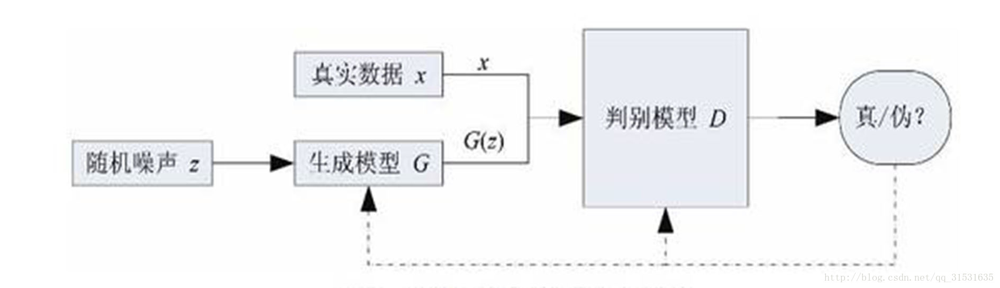
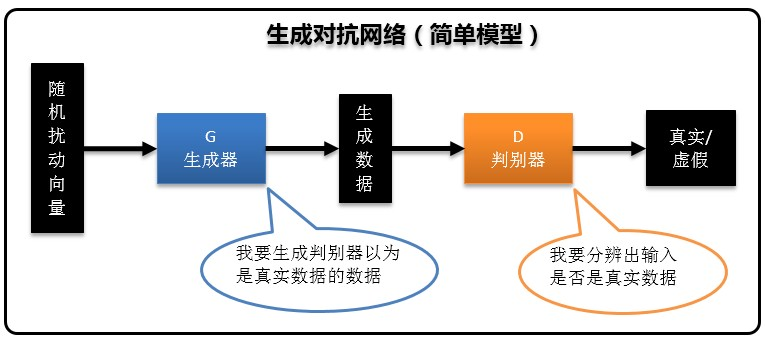
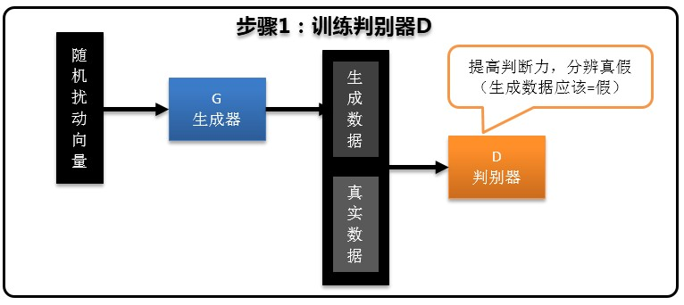
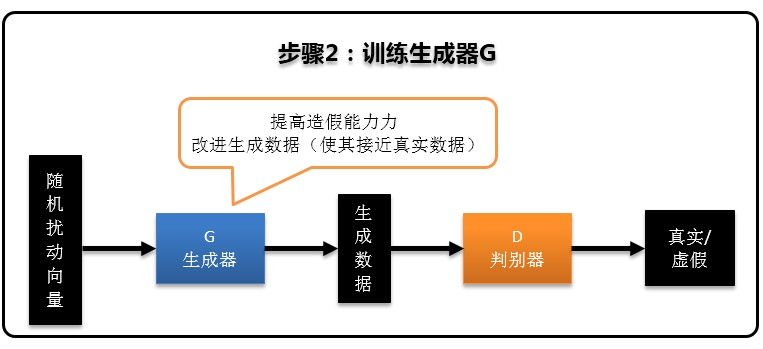
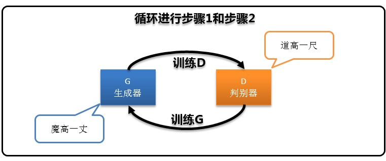
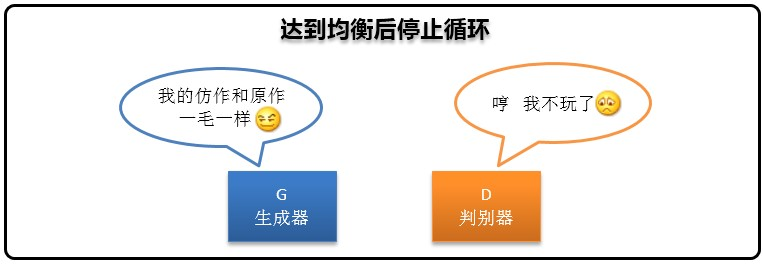

## 生成对抗网络GAN
### 概念
GAN全称是`Generative Adversarial Nets`。在GAN中有2个网络，一个网络用于生成数据，叫做“生成器”。另一个网络用于判别生成数据是否接近于真实，叫做“判别器”。二者介于博弈论中的二人零和博弈：  
> 在严格竞争下，一方的收益必然意味着另一方的损失，博弈各方的收益和损失相加总和永远为“零”，双方不存在合作的可能。  

双方争个你死我活，在相互争斗中同时历练成长，即通过这种生成器G和判别器D对抗学习的方式来对真实数据进行学习来得到一个新的无限接近真实数据分布的数据分布。二者在斗争中协同合作最终达到共同的目标，在整个训练过程中，判别器不得不教导生成器如何在生成的数据上微作调整。  
新的数据分布的作用：  
> 作为一个具有“无限”生成能力的模型，GAN的直接应用就是建模，生成与真实数据分布一致的数据样本，例如可以生成图像、视频等。GAN可以用于解决标注数据不足时的学习问题，例如无监督学习、半监督学习等；GAN还可以用于语音和语言处理、例如生成对话、由文本生成图像、生成数字、人脸等物体对象，构成各种逼真的室内外场景，从分割图像恢复原图像，给黑白图像上色，从物体轮廓恢复物体图像，从低分辨率图像生成高分辨率图像等。

GAN的优化过程是一个`极小极大博弈`问题，优化目标是达到`纳什均衡`，使生成器估测到数据样本的分布。
  
- `极大极小博弈：`由上图生成模型G生成的样本数据$G(z)$(也称为`fake data`即造假数据)，与真实数据x到底有多接近这样一个评判标准，你可以想象成损失函数，即标签数据与训练得到数据之间差异的描述，当损失函数最小时，即为标签数据与训练数据得到值之间的差异最小化。
- `纳什均衡：`生成器G通过不断的训练学习来加强自己的造假能力也就是生成$G(z)$，让判别器D无法判别出$G(z)$和x有啥区别。而判别器D就是通过不断训练学习来提升自己的判断能力，区别出$G(z)$和x

### GAN模型的实现步骤

### GAN的原理
#### 输入
- 生成器G：随机噪声分布z(通常为高斯噪声分布)
- 判别器D：真实数据x以及生成器生成造假数据$G(z)$

#### 输出
当判别器D判别概率等于0.5时，输出$G(z)=x$

#### 过程
