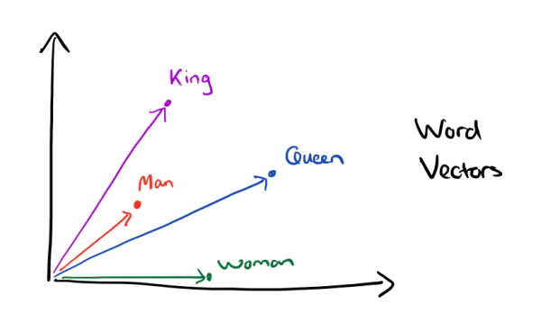
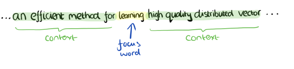

`前言`
> **word2vec** 是google在2013年推出的一个NLP工具，它的特点是将所有的词向量化，这样词与词之间就可以定量的去度量他们之间的关系，挖掘词之间的联系。虽然源码是开源的，但是谷歌的代码库国内无法访问，因此本文的讲解word2vec原理以Github上的[word2vec](https://github.com/tmikolov/word2vec)代码为准。
<!--more-->
***************

## 词向量基础
### one hot representation
用词向量来表示词并不是word2vec的首创，在很久之前就出现了。最早的词向量是很冗长的，它使用是词向量维度大小为整个词汇表的大小，对于每个具体的词汇表中的词，将对应的位置置为1。比如我们有下面的5个词组成的词汇表，词"Queen"的序号为2， 那么它的词向量就是(0,1,0,0,0)。同样的道理，词"Woman"的词向量就是(0,0,0,1,0)。这种词向量的编码方式我们一般叫做1-of-N representation或者one hot representation.

One hot representation用来表示词向量非常简单，但是却有很多问题。最大的问题是我们的词汇表一般都非常大，比如达到百万级别，这样每个词都用百万维的向量来表示简直是内存的灾难。这样的向量其实除了一个位置是1，其余的位置全部都是0，表达的效率不高，能不能把词向量的维度变小呢？
### Distributed representation
Distributed representation可以解决One hot representation的问题，它的思路是通过训练，将每个词都映射到一个较短的词向量上来。所有的这些词向量就构成了向量空间，进而可以用普通的统计学的方法来研究词与词之间的关系。这个较短的词向量维度是多大呢？这个一般需要我们在训练时自己来指定。

比如下图我们将词汇表里的词用"Royalty","Masculinity", "Femininity"和"Age"4个维度来表示，King这个词对应的词向量可能是(0.99,0.99,0.05,0.7)。当然在实际情况中，我们并不能对词向量的每个维度做一个很好的解释。

有了用Distributed representation表示的较短的词向量，我们就可以较容易的分析词之间的关系了，比如我们将词的维度降维到2维，有一个有趣的研究表明，用下图的词向量表示我们的词时，我们可以发现：
$$\vec {King} - \vec {Man} + \vec {Woman} = \vec {Queen}$$

可见我们只要得到了词汇表里所有词对应的词向量，那么我们就可以做很多有趣的事情了。不过，怎么训练得到合适的词向量呢？一个很常见的方法是使用神经网络语言模型。

**word2vec** 做的事情很简单，大致来说，就是构建了一个多层神经网络，然后在给定文本中获取对应的输入和输出，在训练过程中不断修正神经网络中的参数，最后得到词向量。
## 神经网络语言模型：CBOW、Skip-Gram
word2vec采用的是 **n元语法模型(n-gram model)**，即假设一个词只与周围n个词有关，而与文本中的其他词无关。

CBOW模型能够根据输入周围n-1个词来预测出这个词本身，而skip-gram模型能够根据词本身来预测周围有哪些词。也就是说，CBOW模型的输入是某个词A周围的n个单词的词向量之和，输出是词A本身的词向量；而skip-gram模型的输入是词A本身，输出是词A周围的n个单词的词向量(对的，要循环n遍)
### CBOW
CBOW模型的训练输入是某一个特征词的上下文相关的词对应的词向量，而输出就是这特定的一个词的词向量。比如下面这段话，我们的上下文大小取值为4，特定的这个词是"Learning"，也就是我们需要的输出词向量,上下文对应的词有8个，前后各4个，这8个词是我们模型的输入。由于CBOW使用的是词袋模型，因此这8个词都是平等的，也就是不考虑他们和我们关注的词之间的距离大小，只要在我们上下文之内即可

　这样我们这个CBOW的例子里，我们的输入是8个词向量，输出是所有词的softmax概率（训练的目标是期望训练样本特定词对应的softmax概率最大），对应的CBOW神经网络模型输入层有8个神经元，输出层有词汇表大小个神经元。隐藏层的神经元个数我们可以自己指定。通过DNN的反向传播算法，我们可以求出DNN模型的参数，同时得到所有的词对应的词向量。这样当我们有新的需求，要求出某8个词对应的最可能的输出中心词时，我们可以通过一次DNN前向传播算法并通过softmax激活函数找到概率最大的词对应的神经元即可。
### Skip-gram
Skip-Gram模型和CBOW的思路是反着来的，即输入是特定的一个词的词向量，而输出是特定词对应的上下文词向量。还是上面的例子，我们的上下文大小取值为4， 特定的这个词"Learning"是我们的输入，而这8个上下文词是我们的输出。

这样我们这个Skip-Gram的例子里，我们的输入是特定词， 输出是softmax概率排前8的8个词，对应的Skip-Gram神经网络模型输入层有1个神经元，输出层有词汇表大小个神经元。隐藏层的神经元个数我们可以自己指定。通过DNN的反向传播算法，我们可以求出DNN模型的参数，同时得到所有的词对应的词向量。这样当我们有新的需求，要求出某1个词对应的最可能的8个上下文词时，我们可以通过一次DNN前向传播算法得到概率大小排前8的softmax概率对应的神经元所对应的词即可。
## word2vec的使用
word2vec也使用了CBOW与Skip-Gram来训练模型与得到词向量，但是并没有使用传统的DNN模型。最先优化使用的数据结构是用霍夫曼树来代替隐藏层和输出层的神经元，霍夫曼树的叶子节点起到输出层神经元的作用，叶子节点的个数即为词汇表的小大。 而内部节点则起到隐藏层神经元的作用。

word2vec有两种改进方法，一种是基于Hierarchical Softmax的，另一种是基于Negative Sampling的。
### 霍夫曼树
霍夫曼树的建立过程如下：
输入：权值为(w1,w2,...wn)的n个节点
输出：对应的霍夫曼树
1）将(w1,w2,...wn)看做是有n棵树的森林，每个树仅有一个节点。
2）在森林中选择根节点权值最小的两棵树进行合并，得到一个新的树，这两颗树分布作为新树的左右子树。新树的根节点权重为左右子树的根节点权重之和。
3） 将之前的根节点权值最小的两棵树从森林删除，并把新树加入森林。
4）重复步骤2）和3）直到森林里只有一棵树为止。
下面我们用一个具体的例子来说明霍夫曼树建立的过程，我们有(a,b,c,d,e,f)共6个节点，节点的权值分布是(16,4,8,6,20,3)。
首先是最小的b和f合并，得到的新树根节点权重是7.此时森林里5棵树，根节点权重分别是16,8,6,20,7。此时根节点权重最小的6,7合并，得到新子树，依次类推，最终得到下面的霍夫曼树。

那么霍夫曼树有什么好处呢？一般得到霍夫曼树后我们会对叶子节点进行霍夫曼编码，由于权重高的叶子节点越靠近根节点，而权重低的叶子节点会远离根节点，这样我们的高权重节点编码值较短，而低权重值编码值较长。这保证的树的带权路径最短，也符合我们的信息论，即我们希望越常用的词拥有更短的编码。如何编码呢？一般对于一个霍夫曼树的节点（根节点除外），可以约定左子树编码为0，右子树编码为1.如上图，则可以得到c的编码是00。

在word2vec中，约定编码方式和上面的例子相反，即约定左子树编码为1，右子树编码为0，同时约定左子树的权重不小于右子树的权重。
### 基于Hierarchical Softmax的word2vec模型
#### 传统神经网络的局限性
理论上说，无论是CBOW模型还是skip-gram模型，其具体的实现都可以用神经网络来完成。问题在于，这样做的计算量太大了。我们可以简略估计一下。首先定义一些变量的含义:
- n:一个词的上下文包含的词数，与n-gram中n的含义相同
- m:词向量的长度，通常在10~100
- h:隐藏层的规模，一般在100量级
- N:词典的规模，通常在1W~10W
- T:训练文本中单词个数

以CBOW为例，输入层为n-1个单词的词向量，长度为m(n-1)，隐藏层的规模为h,输出层的规模为N。那么前向的时间复杂度就是o(m(n-1)h+hN) = o(hN) 这还是处理一个词所需要的复杂度。如果要处理所有文本，则需要o(hNT)的时间复杂度。这个是不可接受的。同时我们也注意到，o(hNT)之中，h和T的值相对固定，想要对其进行优化，主要还是应该从N入手。而输出层的规模之所以为N，是因为这个神经网络要完成的是N选1的任务。

如上图所示，传统的神经网络词向量语言模型，里面一般有三层，输入层（词向量），隐藏层和输出层（softmax层）。里面最大的问题在于从隐藏层到输出的softmax层的计算量很大，因为要计算所有词的softmax概率，再去找概率最大的值。这个模型如下图所示。其中V是词汇表的大小，

那么可不可以减小N的值呢？答案是可以的。**解决的思路就是将一次分类分解为多次分类，这也是Hierarchical Softmax的核心思想。** 举个栗子，有[1,2,3,4,5,6,7,8]这8个分类，想要判断词A属于哪个分类，我们可以一步步来，首先判断A是属于[1,2,3,4]还是属于[5,6,7,8]。如果判断出属于[1,2,3,4]，那么就进一步分析是属于[1,2]还是[3,4]，以此类推，如图中所示的那样。这样一来，就把单个词的时间复杂度从o(h*N)降为o(h*logN)，更重要的减少了内存的开销。

从上面可以看到从输入到输出，中间是一个树形结构，其中的每一个节点都完成一个二分类(logistic分类)问题。那么就存在一个如何构建树的问题。这里采用huffman树，因为这样构建的话，出现频率越高的词所经过的路径越短，从而使得所有单词的平均路径长度达到最短。

#### 模型概述
word2vec对传统模型做了改进。
- 首先，对于从输入层到隐藏层的映射，没有采取神经网络的线性变换加激活函数的方法，而是采用简单的对所有输入词向量求和并取平均的方法。比如输入的是三个4维词向量：(1,2,3,4),(9,6,11,8),(5,10,7,12),那么我们word2vec映射后的词向量就是(5,6,7,8)。由于这里是从多个词向量变成了一个词向量。
- 第二个改进就是从隐藏层到输出的softmax层这里的计算量改进。为了避免要计算所有词的softmax概率，word2vec采样了霍夫曼树来代替从隐藏层到输出softmax层的映射。我们在上一节已经介绍了霍夫曼树的原理。如何映射呢？这里就是理解word2vec的关键所在了。

由于我们把之前所有都要计算的从输出softmax层的概率计算变成了一颗二叉霍夫曼树，那么我们的softmax概率计算只需要沿着树形结构进行就可以了。如下图所示，我们可以沿着霍夫曼树从根节点一直走到我们的叶子节点的词w2。

和之前的神经网络语言模型相比，我们的霍夫曼树的所有内部节点就类似之前神经网络隐藏层的神经元,其中，根节点的词向量对应我们的投影后的词向量，而所有叶子节点就类似于之前神经网络softmax输出层的神经元，叶子节点的个数就是词汇表的大小。在霍夫曼树中，隐藏层到输出层的softmax映射不是一下子完成的，而是沿着霍夫曼树一步步完成的，因此这种softmax取名为"Hierarchical Softmax"。

如何“沿着霍夫曼树一步步完成”呢？在word2vec中，我们采用了二元逻辑回归的方法，即规定沿着左子树走，那么就是负类(霍夫曼树编码1)，沿着右子树走，那么就是正类(霍夫曼树编码0)。判别正类和负类的方法是使用sigmoid函数，即：
$$P(+) = \sigma(x_w^T\theta) = \frac{1}{1+e^{-x_w^T\theta}}$$
其中$x_w$是当前内部节点的词向量，而θ则是我们需要从训练样本求出的逻辑回归的模型参数。

使用霍夫曼树有什么好处呢？首先，由于是二叉树，之前计算量为V,现在变成了$log_2V$。第二，由于使用霍夫曼树是高频的词靠近树根，这样高频词需要更少的时间会被找到，这符合我们的贪心优化思想。

容易理解，被划分为左子树而成为负类的概率为P(−)=1−P(+)。在某一个内部节点，要判断是沿左子树还是右子树走的标准就是看P(−),P(+)谁的概率值大。而控制P(−),P(+)谁的概率值大的因素一个是当前节点的词向量，另一个是当前节点的模型参数θ。

对于上图中的$w_2$，如果它是一个训练样本的输出，那么我们期望对于里面的隐藏节点$n(w_2,1)$的P(−)概率大，$n(w_2,2)$的P(−)概率大，$n(w_2,3)$的P(+)概率大。

　　　　回到基于Hierarchical Softmax的word2vec本身，我们的目标就是找到合适的所有节点的词向量和所有内部节点θ, 使训练样本达到最大似然。那么如何达到最大似然呢？
#### 模型梯度计算
我们使用最大似然法来寻找所有节点的词向量和所有内部节点θ。先拿上面的$w_2$例子来看，我们期望最大化下面的似然函数：
$$\prod_{i=1}^3P(n(w_i),i) = (1- \frac{1}{1+e^{-x_w^T\theta_1}})(1- \frac{1}{1+e^{-x_w^T\theta_2}})\frac{1}{1+e^{-x_w^T\theta_3}}$$
对于所有的训练样本，我们期望最大化所有样本的似然函数乘积。

为了便于我们后面一般化的描述，我们定义输入的词为w,其从输入层词向量求和平均后的霍夫曼树根节点词向量为$x_w$, 从根节点到w所在的叶子节点，包含的节点总数为$l_w$, w在霍夫曼树中从根节点开始，经过的第i个节点表示为$p^w_i$,对应的霍夫曼编码为$d^w_i∈{0,1}$,其中$i=2,3,...l_w$。而该节点对应的模型参数表示为$θ^w_i$, 其中$i=1,2,...l_{w-1}$，没有$i=l_w$是因为模型参数仅仅针对于霍夫曼树的内部节点。

定义w经过的霍夫曼树某一个节点j的逻辑回归概率为$P(d^w_j|x_w,θ^w_{j-1})$，其表达式为：
$$P(d_j^w|x_w, \theta_{j-1}^w)= \begin{cases}  \sigma(x_w^T\theta_{j-1}^w)& {d_j^w=0}\\ 1-  \sigma(x_w^T\theta_{j-1}^w) & {d_j^w = 1} \end{cases}$$

那么对于某一个目标输出词w,其最大似然为：
$$\prod_{j=2}^{l_w}P(d_j^w|x_w, \theta_{j-1}^w) = \prod_{j=2}^{l_w} [\sigma(x_w^T\theta_{j-1}^w)] ^{1-d_j^w}[1-\sigma(x_w^T\theta_{j-1}^w)]^{d_j^w}$$

在word2vec中，由于使用的是随机梯度上升法，所以并没有把所有样本的似然乘起来得到真正的训练集最大似然，仅仅每次只用一个样本更新梯度，这样做的目的是减少梯度计算量。这样我们可以得到w的对数似然函数L如下：
$$L= log \prod_{j=2}^{l_w}P(d_j^w|x_w, \theta_{j-1}^w) = \sum\limits_{j=2}^{l_w} ((1-d_j^w) log [\sigma(x_w^T\theta_{j-1}^w)]  + d_j^w log[1-\sigma(x_w^T\theta_{j-1}^w)])$$

要得到模型中w词向量和内部节点的模型参数θ, 我们使用梯度上升法即可。首先我们求模型参数$θ^w_{j-1}$的梯度：
$$\frac{\partial L}{\partial \theta_{j-1}^w}=(1-d_j^w)\frac{(\sigma(x_w^T\theta_{j-1}^w)(1-\sigma(x_w^T\theta_{j-1}^w)}{\sigma(x_w^T\theta_{j-1}^w)}x_w - d_j^w \frac{(\sigma(x_w^T\theta_{j-1}^w)(1-\sigma(x_w^T\theta_{j-1}^w)}{1- \sigma(x_w^T\theta_{j-1}^w)}x_w=(1-d_j^w)(1-\sigma(x_w^T\theta_{j-1}^w))x_w -  d_j^w\sigma(x_w^T\theta_{j-1}^w)x_w=(1-d_j^w-\sigma(x_w^T\theta_{j-1}^w))x_w$$

如果大家看过之前写的逻辑回归原理小结，会发现这里的梯度推导过程基本类似。
同样的方法，可以求出xw的梯度表达式如下：
$$\frac{\partial L}{\partial x_w} = (1-d_j^w-\sigma(x_w^T\theta_{j-1}^w))\theta_{j-1}^w$$

有了梯度表达式，我们就可以用梯度上升法进行迭代来一步步的求解我们需要的所有的$θ^w_{j-1}$和$x_w$。
#### 基于Hierarchical Softmax的CBOW模型
由于word2vec有两种模型：CBOW和Skip-Gram,我们先看看基于CBOW模型时， Hierarchical Softmax如何使用。

首先我们要定义词向量的维度大小M，以及CBOW的上下文大小2c,这样我们对于训练样本中的每一个词，其前面的c个词和后面的c个词作为了CBOW模型的输入,该词本身作为样本的输出，期望softmax概率最大。

在做CBOW模型前，我们需要先将词汇表建立成一颗霍夫曼树。

对于从输入层到隐藏层（投影层），这一步比较简单，就是对w周围的2c个词向量求和取平均即可，即：
$$x_w = \frac{1}{2c}\sum\limits_{i=1}^{2c}x_i$$
第二步，通过梯度上升法来更新我们的$θ^w_{j-1}$和$x_w$，注意这里的$x_w$是由2c个词向量相加而成，我们做梯度更新完毕后会用梯度项直接更新原始的各个$x_i(i=1,2,,,,2c)$，即：
$$\theta_{j-1}^w = \theta_{j-1}^w + \eta  (1-d_j^w-\sigma(x_w^T\theta_{j-1}^w))x_w$$
$$x_w= x_w +\eta  (1-d_j^w-\sigma(x_w^T\theta_{j-1}^w))\theta_{j-1}^w \;(i =1,2..,2c)$$
其中η为梯度上升法的步长。

这里总结下基于Hierarchical Softmax的CBOW模型算法流程，梯度迭代使用了随机梯度上升法：

输入：基于CBOW的语料训练样本，词向量的维度大小M，CBOW的上下文大小2c,步长η
输出：霍夫曼树的内部节点模型参数θ，所有的词向量w
- 基于语料训练样本建立霍夫曼树。
- 随机初始化所有的模型参数θ，所有的词向量w
- 进行梯度上升迭代过程，对于训练集中的每一个样本(context(w),w)做如下处理：
    - e=0， 计算$x_w= \frac{1}{2c}\sum\limits_{i=1}^{2c}x_i$
    - for j = 2 to $l_w$, 计算：
$f = \sigma(x_w^T\theta_{j-1}^w)$
$g = (1-d_j^w-f)\eta$
$e = e + g\theta_{j-1}^w$
$\theta_{j-1}^w= \theta_{j-1}^w + gx_w$
    - 对于$context(w)$中的每一个词向量$x_i$(共2c个)进行更新：
$x_i = x_i + e$
    - 如果梯度收敛，则结束梯度迭代，否则回到步骤3继续迭代。

#### 基于Hierarchical Softmax的Skip-Gram模型
现在我们先看看基于Skip-Gram模型时， Hierarchical Softmax如何使用。此时输入的只有一个词w,输出的为2c个词向量context(w)。

我们对于训练样本中的每一个词，该词本身作为样本的输入， 其前面的c个词和后面的c个词作为了Skip-Gram模型的输出,，期望这些词的softmax概率比其他的词大。

Skip-Gram模型和CBOW模型其实是反过来的，在上一篇已经讲过。

在做CBOW模型前，我们需要先将词汇表建立成一颗霍夫曼树。

对于从输入层到隐藏层（投影层），这一步比CBOW简单，由于只有一个词，所以，即xw就是词w对应的词向量。

第二步，通过梯度上升法来更新我们的$θ^w_{j-1}$和$x_w$，注意这里的$x_w$周围有2c个词向量，此时如果我们期望$P(x_i|x_w),i=1,2...2c$最大。此时我们注意到由于上下文是相互的，在期望$P(x_i|x_w),i=1,2...2c$最大化的同时，反过来我们也期望$P(x_w|x_i),i=1,2...2c$最大。那么是使用$P(x_i|x_w)$好还是$P(x_w|x_i)$好呢，word2vec使用了后者，这样做的好处就是在一次迭代时，我们不是更新$x_w$一个词，而是$x_i,i=1,2...2c$共2c个词。这样整体的迭代会更加的均衡。因为这个原因，Skip-Gram模型并没有和CBOW模型一样对输入进行迭代更新，而是对2c个输出进行迭代更新。

这里总结下基于Hierarchical Softmax的Skip-Gram模型算法流程，梯度迭代使用了随机梯度上升法：

输入：基于Skip-Gram的语料训练样本，词向量的维度大小M，Skip-Gram的上下文大小2c,步长η
输出：霍夫曼树的内部节点模型参数θ，所有的词向量w
- 基于语料训练样本建立霍夫曼树。
- 随机初始化所有的模型参数θ，所有的词向量w,
- 进行梯度上升迭代过程，对于训练集中的每一个样本(w,context(w))做如下处理：
  - for i =1 to 2c:
    - e=0
    - for j = 2 to $l_w$, 计算：
$f = \sigma(x_i^T\theta_{j-1}^w)$
$g = (1-d_j^w-f)\eta$
$e = e + g\theta_{j-1}^w$
$\theta_{j-1}^w= \theta_{j-1}^w+ gx_i$
    - $x_i = x_i + e$
  - 如果梯度收敛，则结束梯度迭代，算法结束，否则回到步骤a继续迭代。

### word2vec大致流程
- **分词/词干提取和词形还原。** 中文和英文的nlp各有各的难点，中文的难点在于需要进行分词，将一个个句子分解成一个单词数组。而英文虽然不需要分词，但是要处理各种各样的时态，所以要进行词干提取和词形还原。
- **构造词典，统计词频。** 这一步需要遍历一遍所有文本，找出所有出现过的词，并统计各词的出现频率。
- **构造树形结构。** 依照出现概率构造Huffman树。如果是完全二叉树，则简单很多，后面会仔细解释。需要注意的是，所有分类都应该处于叶节点。

- **生成节点所在的二进制码。** 拿上图举例，22对应的二进制码为00,而17对应的是100。也就是说，这个二进制码反映了节点在树中的位置，就像门牌号一样，能按照编码从根节点一步步找到对应的叶节点。
- **初始化各非叶节点的中间向量和叶节点中的词向量。** 树中的各个节点，都存储着一个长为m的向量，但叶节点和非叶结点中的向量的含义不同。叶节点中存储的是各词的词向量，是作为神经网络的输入的。而非叶结点中存储的是中间向量，对应于神经网络中隐含层的参数，与输入一起决定分类结果。
- **训练中间向量和词向量。** 对于CBOW模型，首先将词A附近的n-1个词的词向量相加作为系统的输入，并且按照词A在步骤4中生成的二进制码，一步步的进行分类并按照分类结果训练中间向量和词向量。举个栗子，对于绿17节点，我们已经知道其二进制码是100。那么在第一个中间节点应该将对应的输入分类到右边。如果分类到左边，则表明分类错误，需要对向量进行修正。第二个，第三个节点也是这样，以此类推，直到达到叶节点。因此对于单个单词来说，最多只会改动其路径上的节点的中间向量，而不会改动其他节点。

