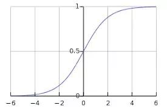
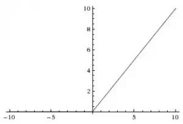
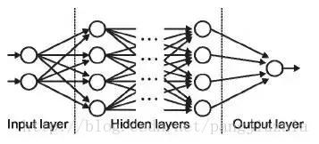
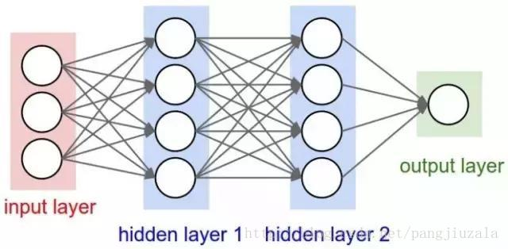
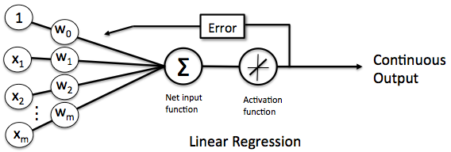
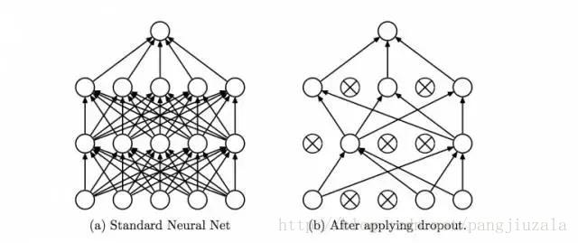
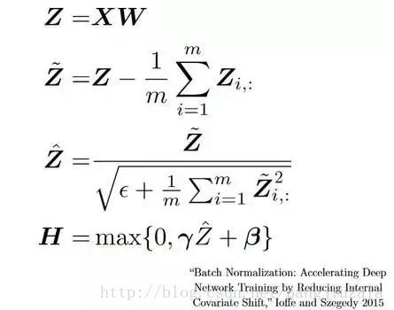

## 神经网络
### 神经元(感知器)  
神经元是形成神经网络的基本结构。神经元接收输入，处理它并产生输出，而这个输出被发送到其他神经元用于进一步处理或者作为最终输出进行输出。  
  
可以看到，一个感知器有如下组成部分：
- 输入权值：一个感知器可以接收多个输入 $(x_1, x_2,...,x_n\mid x_i\in\Re)$，每个输入上都有一个权值$w_i\in\Re$。我们随机初始化权重，并在模型训练过程中更新这些权重。训练后的神经网络对其输入赋予较高的权重，这是它认为与不那么重要的输入相比更为重要的输入。为零的权重则表示特定的特征是微不足道的。
- 偏差：有一个偏置项$b\in\Re$，即为上图中的$w_0$。它被加到权重与输入相乘的结果中。基本上添加偏差的目的是来改变权重与输入相乘所得结果的范围的。
- 激活函数：感知器的激活函数可以有很多选择，如
  - Sigmoid激活函数$\sigma(x)=\frac{1}{1+e^{-x}}\qquad$
  
  - 阶跃函数
  $f(z)=\begin{cases}1\qquad z>0\\0\qquad otherwise\end{cases}$
  - ReLU(整流线性单位) $f(x)=max(x,0)$
  
  - tanh函数$f(x)=\frac{1-e^{-2x}}{1+e^{-2x}}$
  
- 输出：感知器的输出由下面的公式来计算：  
  $y=f(\mathrm{w}\bullet\mathrm{x}+b)\qquad$

### 输入/输出/隐藏层
输入层是接收数据的那一层，本质上是网络的第一层。而输出层是生成输出的那一层，也可以说是网络的最终层。处理层是网络中的隐藏层，这些隐藏层是对传入数据执行特定任务并将其生成的输出传递到下一层的那些层。输入层和输出层是我们可见的，而中间层则是隐藏的。  
  

### MLP(多层感知器)
单个神经元将无法执行高度复杂的任务。因此使用堆栈的神经元来生成我们所需要的输出。在最简单的网络中，我们将有一个输入层、一个隐藏层和一个输出层。每一层都有多个神经元，并且每个层中的所有神经元都连接到下一层的所有神经元。这些网络也可以称为完全连接的网络。
  

### 正向传播(Forward Propagation)
正向传播是指输入通过隐藏层到输出层的运动。在正向传播中，信息沿着一个单一方向前进。输入层将输入提供给隐藏层，然后生成输出。这过程中是没有反向运动的。

### 成本函数/损失函数(Cost Function)
当我们建立一个网络时，网络试图将输出预测得尽可能靠近实际值。我们使用成本/损失函数来衡量网络的准确性。而成本/损失函数会在发生错误时尝试惩罚网络。我们在运行网络时的目标是提高我们的预测精度并减少误差，从而较大限度地降低成本。最优化的输出是那些成本/损失函数值最小的输出。

### 线性单元
感知器有一个问题，当面对的数据集不是线性可分的时候，“感知器规则”可能无法收敛，这就意味着我们永远也无法完成一个感知器的训练。为了解决这个问题，我们使用一个可导的线性函数来替代感知器的阶跃函数，这种感知器就叫做`线性单元`。线性单元在面对线性不可分的数据集时，会收敛到一个最佳的近似上。  
  
替换了线性激活函数后，线性单元将返回一个实数值而不是0,1分类。因此线性单元用来解决回归问题而不是分类问题。

### 监督学习
监督学习是指为了训练一个模型，我们要提供这样一堆训练样本：每个训练样本既包括输入特征$x$，也包括对应的输出$y$($y$也叫做标记`label`)。用这样的样本去训练模型，让模型既看到我们提出的每个问题(输入特征$x$)，也看到对应问题的答案(标记$y$)。当模型看到足够多的样本之后，它就能总结出其中的一些规律，获取预测最接近真实结果相对应的权重。  
- 回归分析(Regression Analysis)：其数据集是给定一个函数和它的一些坐标点，然后通过回归分析的算法，来估计原函数的模型，求出一个最符合这些已知数据集的函数解析式。然后它就可以用来预估其他未知输出的数据了，你输入一个自变量它就会根据这个模型解析式输出一个因变量，这些自变量就是特征向量，因变量就是标签。而且标签的值是建立在连续范围的。
- 分类(Classification)：其数据集，由特征向量和它们的标签组成，当你学习了这些数据之后，给你一个只知道特征向量而不知道标签的数据，让你求它的标签是哪一个？其和回归的主要区别就是输出结果是离散的还是连续的。

### 非监督学习
非监督学习的训练样本中只有$x$而没有$y$。模型可以总结出特征$x$的一些规律，但是无法知道其对应的答案$y$。输入特征没有对应的`label`，数据类别未知，需要根据样本间的相似性对样本集进行分类(聚类`clustering`)试图使类内差距最小化，类间差距最大化。通俗点将就是实际应用中，不少情况下无法预先知道样本的标签，也就是说没有训练样本对应的类别，因而只能从原先没有样本标签的样本集开始学习分类器设计。  
无监督学习的方法分为两大类：
- 一类为基于概率密度函数估计的直接方法：指设法找到各类别在特征空间的分布参数，再进行分类
- 另一类是称为基于样本间相似性度量的简洁聚类方法：其原理是设法定出不同类别的核心或初始内核，然后依据样本与核心之间的相似性度量将样本聚集成不同的类别。  

利用聚类结果，可以提取数据集中隐藏信息，对未来数据进行分类和预测。应用于数据挖掘，模式识别，图像处理等。

### 梯度下降(Gradient Descent)

### 学习率(Learning Rate)
学习率被定义为每次迭代中成本函数中最小化的量。简单的说，我们下降到成本函数的最小值的速率是学习率。

### 反向传播(Backpropagation)
当我们定义神经网络时，我们为我们的节点分配随机权重和偏差值。一旦我们收到单次迭代的输出，我们就可以计算出网络的错误，然后将该错误与成本函数的梯度一起反馈给网络以更新网络的权重，最后更新这些权重，以便减少后续迭代中的错误。使用成本函数的梯度的权重的更新被称为`反向传播`。在反向传播中，网络的运动是向后的，错误随着梯度从外层通过隐藏层流回，权重被更新。

### 批次(Batches)
在训练神经网络的同时，不用一次发送整个输入，我们将输入分成几个随机大小相等的块。与整个数据集一次性馈送到网络时建立的模型相比，批量训练数据使得模型更加广义化。

### 周期(Epochs)
周期被定义为向前和向后传播中所有批次的单次训练迭代，这就意味着一个周期是整个输入数据的单次向前和向后传递。你可以选择你用来训练网络的周期数量，更多的周期将显示出更高的网络准确性，然而，网络融合也需要更长的时间。另外，如果周期数太高，网络可能会过度拟合。

### 丢弃(Dropout)
Dropout是一种正则化技术，可防止网络过度拟合。顾名思义，在训练期间，隐藏层中的一定数量的神经元被随机地丢弃，这意味着训练发生在神经网络的不同组合的神经网络的几个架构上。你可以将Dropout视为一种综合技术，然后将多个网络的输出用于产生最终输出。

### 批量归一化(Batch Normalization)
通俗点，批量归一化可以被认为是河流中设定的特定检查点的水坝。这样做的目的是在于确保数据的分发与希望获得的下一层相同。当我们训练神经网络时，权重在梯度下降的每一个步骤之后都会改变，这会改变数据的形状如何发送到下一层。故在将数据发送到下一层之前明确规范化数据。

### 卷积神经网络

### 数据增强(Data Augmentation)
数据增强是指从给定数据导出的新数据的添加，这可能被证明对预测有益。例如，如果你使光线变亮，可能更容易在较暗的图像中看到猫，或者例如数字识别中的9可能会稍微倾斜或旋转，在这种情况下，旋转将解决问题并提高我们的模型的准确性。通过旋转或增亮，我们正在提高数据的质量，这被称为`数据增强`。

### 循环神经网络

### 消失梯度问题(Vanishing Gradient Problem)
激活函数的梯度非常小的情况下会出现消失梯度问题。在权重乘以这些低梯度时的反向传播过程中，它们往往变得非常小，并且随着网络进一步深入而“消失”，这使得神经网络忘记了长距离依赖，对循环神经网络来说是个问题，长期依赖对于网络来说是非常重要的。可以通过使用不具有小梯度的激活函数`ReLU`来解决。

### 激增梯度问题(Exploding Gradient Problem)
跟消失梯度问题相反，激活函数的梯度过大，导致了激增梯度问题。在方向传播期间，它使特定节点的权重相对于其他节点的权重非常高，这使得它们不重要。这可以通过剪切梯度来轻松解决，使其不超过一定值。
