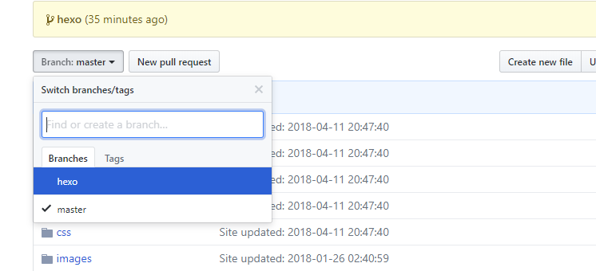
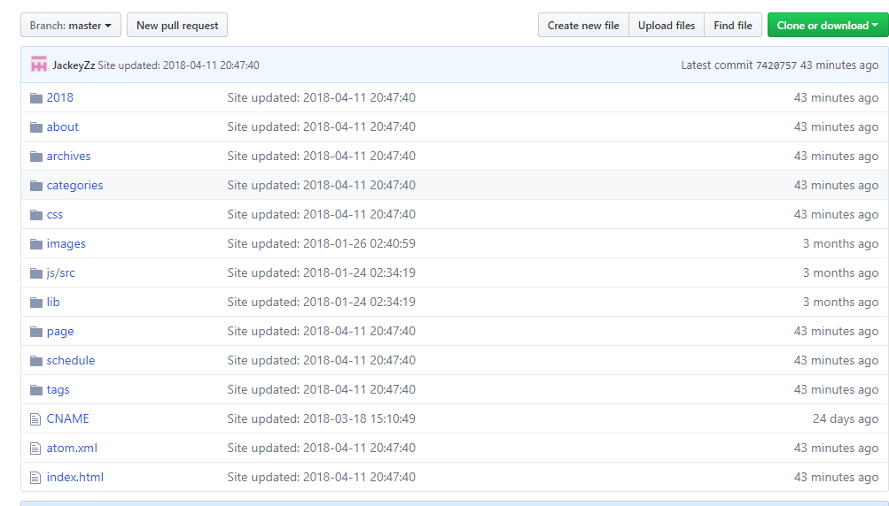
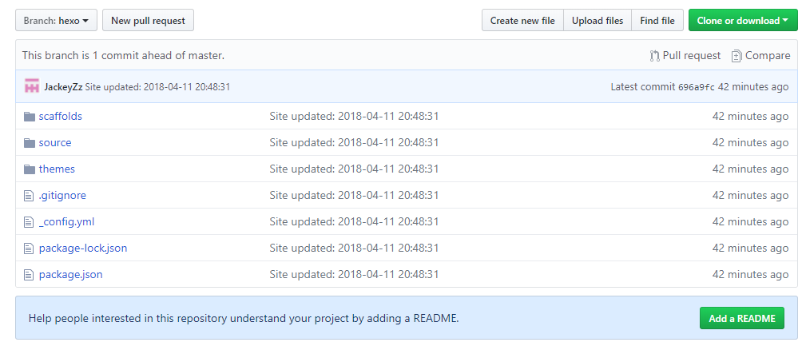
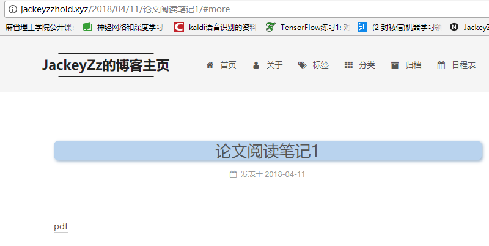
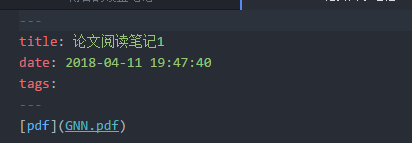
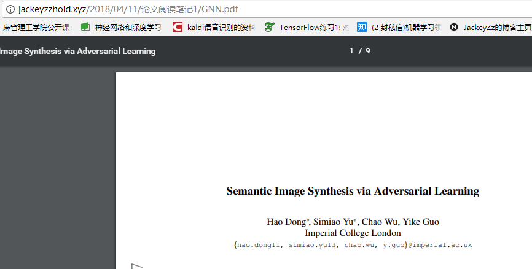
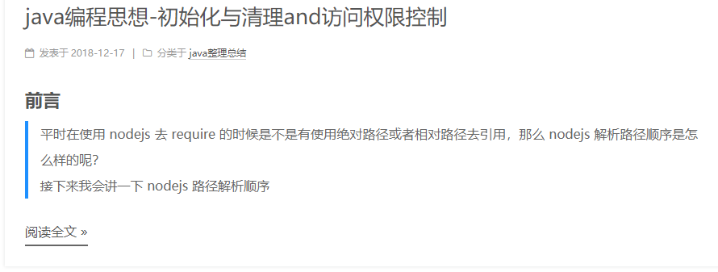
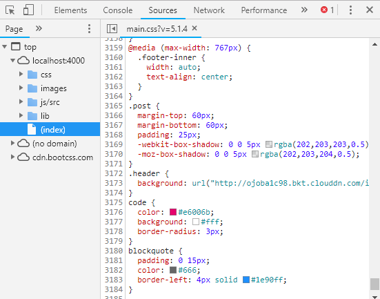

## github pages设置多分支master和hexo
在github上创建两个分支master和hexo，其中master分支存放生成的静态网页，hexo分支用来存放网站的原始文件，也就是平时写文章的文件所在地。
- 先在github上创建分支

- 安装使用最新版的`hexo-deployer-git`插件
```java
npm install git+git@github.com:hexojs/hexo-deployer-git.git --save
```
- 在文件`_config.yml`中设置  
```java
deploy:
  - type: git
    repo: http://github.com/JackeyZz/JackeyZz.github.io.git
    branch: master
  - type: git
    repo: http://github.com/JackeyZz/JackeyZz.github.io.git
    branch: hexo
    extend_dirs: /
    ignore_hidden: false
    ignore_pattern:
        public: .
```
这里是为了`hexo deploy`时将静态文件和原始文件上传到master分支和hexo分支上。即为  

  
- 更换电脑时通过git重新下载整个项目，然后在本地切换到远端的hexo分支  
```java
git checkout origin/hexo
```
就能重新获得所有的源文件，重新进行修改发布。(注意对于从git下载下来的项目，最好将`.git`文件删除后重新生成，否则会出现错误)  
这时需要在新电脑上down下来的文件夹上通过`git bash`依次执行下列指令：  
```java
npm install hexo
npm install
npm install hexo-deployer-git
(不需要hexo init这条指令)
```  
## 设置pdf链接
其实这个问题只是本地`url`的小问题，浏览器自身是支持pdf显示的，跟`github pages`和`hexo`没什么关系。  
在执行`hexo g`后，会生成`public`的文件夹，其中都是静态网页，而`github pages`的网页`url`就是对应这个文件夹产生的。因此只要使用`[名称](相对路径)`就可以在博客中嵌入pdf文章。例如当阅读需要嵌入pdf的博客文章时  
  
显然它的`url`是文件夹`public`里对应的博客文章所生成的静态网页的文件夹里面，如`2018/04/11/论文阅读笔记1/#more`，故使用相对路径就可完成嵌入`pdf`文件。
  


## 设置sidebar
`sidebar`的前端网页在文件夹`themes/next/layout/_macro/sidebar.swig`
## 如何设置文章主页显示内容

在要显示的内容后面添加`<!--more-->`，表示前面的内容是要在主页上面显示的，同时支持markdown的编排语法。
## 如何设置页面元素样式
如何把字体、页宽、按钮大小等等一些细节的东西调到自己喜欢的样式呢？那就是通过浏览器元素定位，调到自己喜欢的样式，然后加到`themes/next/source/css/_custom/custom.styl`文件下面。
- 首先定位页面元素：用谷歌或者火狐浏览器打开博客页面，按下F12进入调试。先点击定位按钮，然后选择元素，然后在定位出来的样式进行修改，调到自己喜欢的样子。

- 添加到样式文件：打开`themes/next/source/css/_custom/custom.styl`，把调试好的样式加进去，保存后Ctrl+F5就能看到效果了，前提是在本地运行的。

但并不是所有的样式都能调，像页宽，多说评论的样式在custom.styl文件是无效的
