## Java GC概述
Java GC(Garbage Collection,垃圾收集,垃圾回收)机制，是Java与C++/C的主要区别之一，一种在Java虚拟机中的自动内存管理和垃圾清扫机制。概括地说，该机制对JVM中的内存进行标记，并确定哪些内存需要回收，根据一定的回收策略，自动的回收内存，永不停息(Never Stop)的保证JVM中的内存空间，防止出现内存泄漏和溢出问题。
### stop-the-world
`stop-the-world`会在任何一种GC算法中发生，它意味着JVM因为需要执行GC而停止了应用程序的执行。当`stop-the-world`发生时，除GC所需的线程外，所有的线程都进入等待状态，直到GC任务完成。GC优化很多时候就是减少`stop-the-world`的发生。
### JVM GC回收垃圾的区域
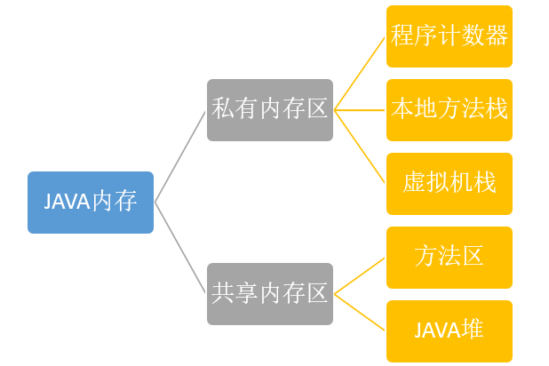  
私有内存区伴随着线程的产生而产生，一旦线程中止，私有内存区也会自动消除。故GC内存回收主要是针对共享内存区。

| 区域名称 | 特性 |
| --- | --- |
| java堆 | java虚拟机管理的内存中最大的一块，所有线程共享，几乎所有的对象实例和数组都在这类分配内存。GC主要就是在java堆中进行的 |
| 方法区 | 用于存储已被虚拟机加载的类信息、常量、静态变量、即时编译器编译后的代码等数据。但是已经被最新的JVM取消了。现在被加载的类作为元数据加载到底层操作系统的本地内存区 |
### JVM GC的分类
GC主要在java堆进行，故对java堆进行描述：  
堆内存是由存活和死亡的对象组成的。存活的对象是应用可以访问到的，不会被垃圾回收。死亡的对象是应用不可访问尚且还没被垃圾收集器回收掉的对象。一直到垃圾收集器把这些对象回收掉之前，它们会一直占据堆内存空间。堆是应用程序在运行期间请求操作系统分配给自己的向高地址扩展的数据结构，是不连续的内存区域。即:程序运行时动态申请某个大小的内存空间。  
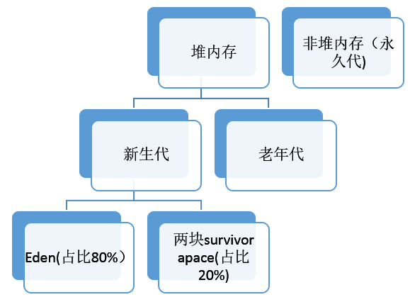  
- 新生代(新域):存储所有新生成的对象  
刚刚新建的对象在`Eden(伊甸园)`中，当`Eden`充满时，经历一次`Minor GC`,`Eden`中的存活对象就会被移动到第一块`survivor space S0`，`Eden`被清空；等`Eden`区再满了，就再触发一次`Minor GC`,`Eden`和`S0`中的存活对象又会被复制送入第二块`survivor space S1`。`S0`和`Eden`被清空，然后下一轮`S0`和`S1`交换角色，如此循环往复。如果对象的复制次数达到16次，该对象就会被送到老年代中。
- 老年代(旧域):新域中的对象，经过了一定次数的GC循环后，被移入旧域

| GC名称   | 介绍 |
| -------- | ---- |
| Minor GC | 发生在新生代，频率高，速度快(大部分对象活不过一次Minor GC) |
| Major GC | 发生在老年代，速度慢 |
| Full GC | 清理整个堆空间 |
- 永久域：存储类和方法对象，从配置的角度看，这个域是独立的，不包括在JVM堆内。默认为4M

当我们创建一个对象后，它在堆内存的位置变化(如果`Major GC`之后还是老年代不足，则JVM抛出内存不足的异常)：
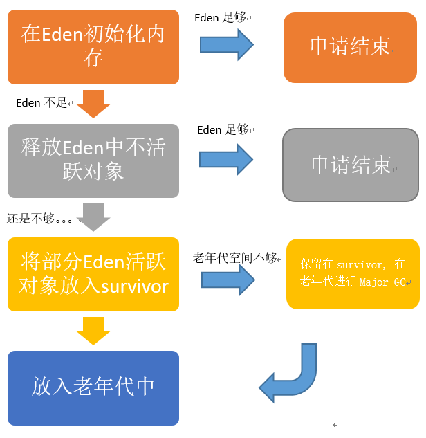
### 设置两个`survivor space`的原因
最大的好处就是解决了内存碎片化。  
假设只有一个`survivor`区，则当`Eden`和`survivor`各有一些存活对象时触发`Minor GC`,此时将`Eden`区的存活对象硬放到`survivor`区中，显然这两部分对象所占有的内存是不连续的，也就导致了内存碎片化。
  
显然建立两个`survivor`区可以解决内存碎片化的问题。刚刚新建的对象在`Eden`中，经历一次`Minor GC`，`Eden`中的存活对象就会被移动到第一块`survivor space S0`，`Eden`被清空；等`Eden`区再满了，就再触发一次`Minor GC`，`Eden`和`S0`中的存活对象又会被复制送入第二块`survivor space S1`(这个过程非常重要，因为这种复制算法保证了`S1`中来自`S0`和`Eden`两部分的存活对象占用连续的内存空间，避免了碎片化的发生)。`S0`和`Eden`被清空，然后下一轮`S0`与`S1`交换角色，如此循环往复。
  
## 对象存活判断
判断对象是否存活一般有两种方式：
- 引用计数：每个对象有一个引用计数属性，新增一个引用时计数加1，引用释放时计数减1，计数为0时可以回收。此方法简单，无法解决对象相互循环引用的问题。
- 可达性分析：从`GC Roots`开始向下搜索，搜索所走过的路径称为引用链。当一个对象到`GC Roots`没有任何引用链相连时，则证明此对象是不可用的，为不可达对象。如下图：Object5、6、7虽然互有关联，但它们到`GC Roots`是不可达的，因此也会被判定为可回收的对象。

即使在可达性分析算法中不可达的对象，JVM也并不是马上对其回收，因为要真正宣告一个对象死亡，至少要经历两次标记过程：第一次是在可达性分析后发现没有与`GC Roots`相连接的引用链，第二次是GC对在`F-Queue`执行队列中的对象进行的小规模标记(对象需要覆盖`finalize()`方法且没被调用过)。

在Java语言中，`GC Roots`包括：
- 虚拟机栈中引用的对象
- 方法区中类静态属性实体引用的对象
- 方法区中常量引用的对象
- 本地方法栈中JNI引用的对象

## 垃圾收集算法
- 分代收集算法是将对象的生命周期按长短进行划分
- 分区收集算法是将整个堆空间划分为连续的不同小区间，每个小区间独立使用，独立回收，这样做的好处是可以控制一次回收多少个小区间。  

在相同条件下，堆空间越大，一次GC耗时就越长，从而产生的停顿也越长。为了更好地控制GC产生的停顿时间，将一块大的内存区域分割成多个小块，根据目标停顿时间，每次合理地回收若干个小区间(而不是整个堆)，从而减少一次GC所产生的停顿。
### 分代收集算法
- 在新生代中每次垃圾收集都能发现大批对象已死，只有少量存活，因此选用复制算法，只需要付出少量存活对象的复制成本就可以完成收集。  
- 在老年代中因为对象存活率高、没有额外空间对它进行分配担保，就必须采用“标记-清理”或“标记-整理”算法来进行回收，不必进行内存复制，且直接腾出空闲内存。

#### 新生代-复制算法
该算法的核心是将可用内存按容量划分为大小相等的两块，每次只用其中一块，当这一块的内存用完，就将还存活的对象复制到另外一块上面，然后把已使用过的内存空间一次清理掉。即为两块`survivor space`。
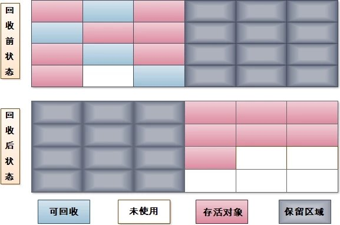  
由于新生代的98%的对象都是生存周期极短的，所以将新生代划分为一块较大的`Eden`区和两块较小的`survivor`区(`HotSpot`默认`Eden`和`survivor`的大小比例为8:1)，每次只用`Eden`和其中一块`survivor`。当发生`Minor GC`时，将`Eden`和`survivor`中还存活的对象一次性地拷贝到另外一块`survivor`上，最后清理掉`Eden`和刚才用过的`survivor`的空间。当`survivor`空间不够用(不足以保存尚存活的对象)时，需要依赖老年代进行空间分配担保机制，这部分内存直接进入老年代。

#### 老年代-标记清除算法
该算法分为“标记”和“清除”两个阶段：首先标记出所有需要回收的对象(可达性分析)，在标记完成后统一清理掉所有被标记的对象  
该算法会有以下两个问题：
- 效率问题：标记和清除过程的效率都不高
- 空间问题：标记清除后会产生大量不连续的内存碎片，空间碎片太多可能会导致在运行过程中需要分配较大对象时无法找到足够的连续内存而不得不提前触发另一次垃圾收集  
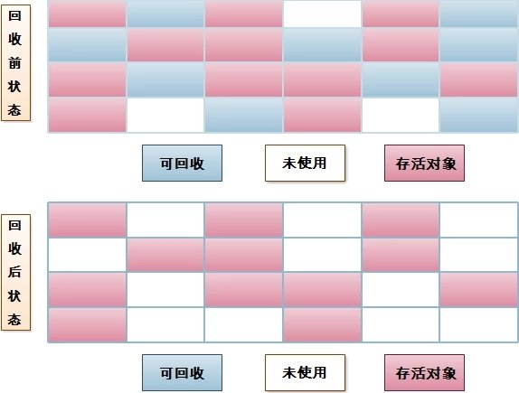  

#### 老年代-标记整理算法
标记清除算法会产生内存碎片问题，而复制算法需要有额外的内存担保空间，于是针对老年代的特点，有了标记整理算法。标记整理算法的标记过程与标记清除算法相同，但后续步骤不再对可回收对象直接清理，而是让所有存活的对象都向一端移动，然后清理掉端边界以外的内存。
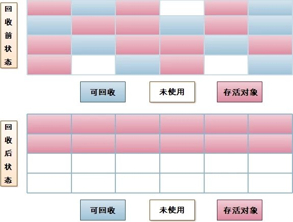

#### 永久代-方法区回收
在方法区进行垃圾回收一般“性价比”较低，因为在方法区主要回收两部分内容：废弃常量和无用的类。回收废弃常量与回收其他年代中的对象类似，但要判断一个类是否无用则条件相当苛刻：
- 该类所有的实例都已经被回收，java堆中不存在该类的任何实例
- 该类对应的`class`对象没有在任何地方被引用(也就是在任何地方都无法通过反射访问该类的方法)
- 加载该类的`ClassLoader`已经被回收  

但即使满足以上条件也未必一定会回收，`HotSpot VM`还提供了`-Xnoclassgc`参数控制(关闭`class`的垃圾回收功能)。因此在大量使用动态代理、`CGLib`等字节码框架的应用中一定要关闭该选项，开启VM的类卸载功能，以保证方法区不会溢出。

## 垃圾收集器
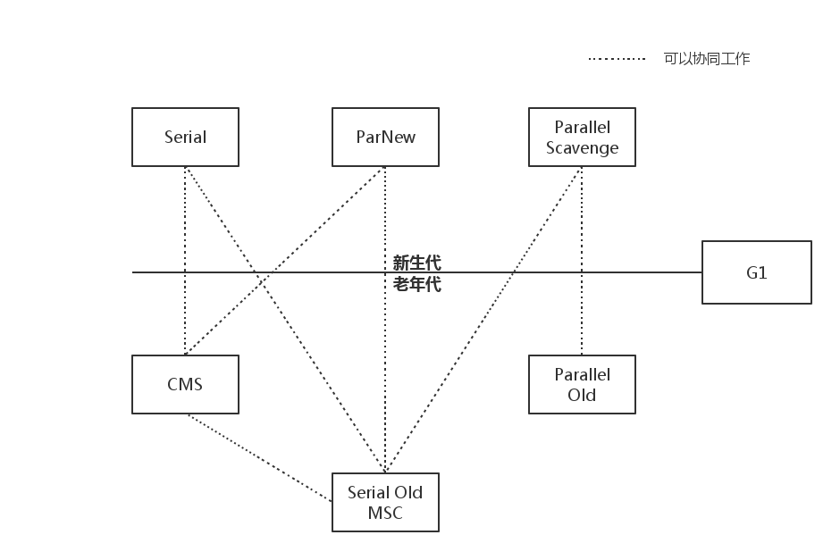  
### 新生代
#### Serial收集器
Serial收集器是Hotspot运行在Client模式下的默认新生代收集器，它的特点是只用一个CPU/一条收集线程去完成GC工作，且在进行垃圾收集时必须暂停其他所有的工作线程("stop the world"，即为STW)。  
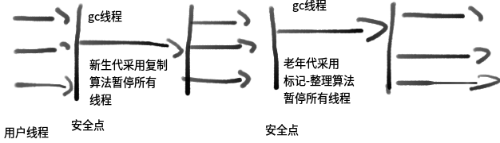   
虽然是单线程收集，但它却简单而高效。在VM管理内存不大的情况下(收集几十M到一两百M的新生代)，停顿时间完全可以控制在几十毫秒~一百多毫秒内。

#### ParNew收集器
ParNew收集器其实是Serial的多线程版本，除了使用多线程进行GC外，包括Serial可用的所有控制参数、收集算法、STW、对象分配规则、回收策略等都与Serial完全一样(也是VM启用CMS收集器`-x:+UseConcMarkSweepGC`的默认新生代收集器)  
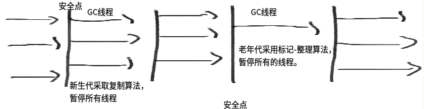   
由于存在线程切换的开销，ParNew收集器在单CPU的环境中比不上Serial，且在通过超线程技术实现的两个CPU的环境中也不能100%保证能超越Serial。但随着可用的CPU数量的增加，收集效率肯定也会大大增加(ParNew收集器收集线程数与CPU数量相同，因此在CPU数量过大的环境中，可用`-xx:ParallelGCThreads`参数控制GC线程数)。

#### Parallel Scavenge收集器
与ParNew类似，Parallel Scavenge也是使用复制算法，也是并行多线程收集器。但与其他收集器关注尽可能缩短垃圾收集时间不同，Parallel Scavenge更关注系统吞吐量：  
`系统吞吐量=运行用户代码时间(运行用户代码时间+垃圾收集时间)`  
停顿时间越短就越适用于用户交互的程序，良好的响应速度能提升用户的体验；而高吞吐量则适用于后台运算而不需要太多交互的任务，可以最高效率地利用CPU时间，尽快地完成程序的运算任务，Parallel Scavenge提供了如下参数设置系统吞吐量：

| Parallel Scavenge参数 | 描述 |
| --- | --- |
| `MaxGCPauseMillis` | (毫秒数)收集器将尽力保证内存回收花费的时间不超过设定值，但如果太小将会导致GC的频率增加 |
| `GCTimeRatio` | (整数：`0<GCTimeRatio<100`)是垃圾收集时间占总时间的比率 |
| `xx:+UseAdaptiveSizePolicy` | 启用GC自适应的调节策略：不再需要手工指定`-Xmn、-xx:survivorRatio、-xx:PretenureSizeThreshold`等细节参数，VM会根据当前系统的运行情况收集性能监控信息，动态调整这些参数以提供最合适的停顿时间或最大的吞吐量 |
### 老年代
#### Serial Old收集器
Serial Old是Serial收集器的老年代版本，同样是单线程收集器，使用“标记-整理”算法  
   
应用场景如下：
- JDK1.5之前与Parallel Scavenge收集器搭配使用
- 作为CMS收集器的后备预案，在并发收集发生`Concurrent Mode Failure`时启用

#### Parallel Old收集器
是Parallel Scavenge的老年代版本，使用多线程和“标记-整理”算法，吞吐量优先，主要与Parallel Scavenge配合在注重吞吐量和CPU资源敏感系统内使用：
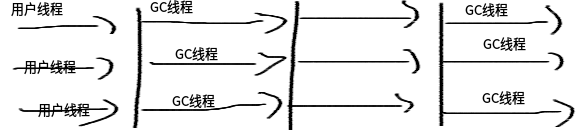

#### CMS收集器
CMS(Concurrent Mark Sweep)收集器是一款具有划时代意义的收集器，真正意义上的并发收集器。CMS是一种以获取最短回收停顿时间为目标的收集器(又被称为多并发低暂停的收集器)，基于“标记-清除”算法实现，整个GC过程分为：
- 初始标记
- 并发标记(GC Roots Tracing过程)
- 重新标记
- 并发清除  
其中初始标记和重新标记仍需STW，但初始标记仅只标记一下GC Roots能直接关联到的对象，速度很快；而重新标记则是为了修正并发标记期间因用户程序继续运行而导致标记产生变动的那一部分对象的标记记录，虽然一般比初始标记阶段稍长，但要远小于并发标记时间。
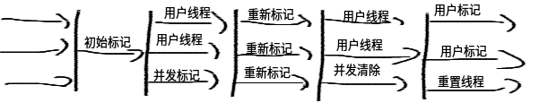  
由于整个GC过程耗时最长的并发标记和并发清除阶段的GC过程可与用户线程一起工作，所以总体上CMS的GC过程是与用户线程一起并发地执行的。

CMS的缺点：
- `CMS默认启动的回收线程数=(CPU数目+3)/4`。当CPU数>4时，GC线程最多占用不超过25%的CPU资源；但当CPU数<=4时，GC线程可能就会过多的占用用户CPU资源，从而导致应用程序变慢，总吞吐量降低。
- 无法处理浮动垃圾(指在CMS并发清理阶段用户线程运行而产生的新垃圾)。
- CMS采用“标记-清除”算法实现，可能会产生大量的内存碎片，内存碎片过多可能会导致无法分配大对象而提前触发Full GC。

### 分区收集-G1收集器
G1(Garbage-First)是一款面向服务端应用的收集器，主要目标用于配备多CPU的服务器治理大内存。G1将整个java堆划分为多个大小相等的独立区域(Region)，虽然还保留有新生代和老年代的概念，但不再是物理隔离的了，都是一部分Region(不需要连续)的集合。  
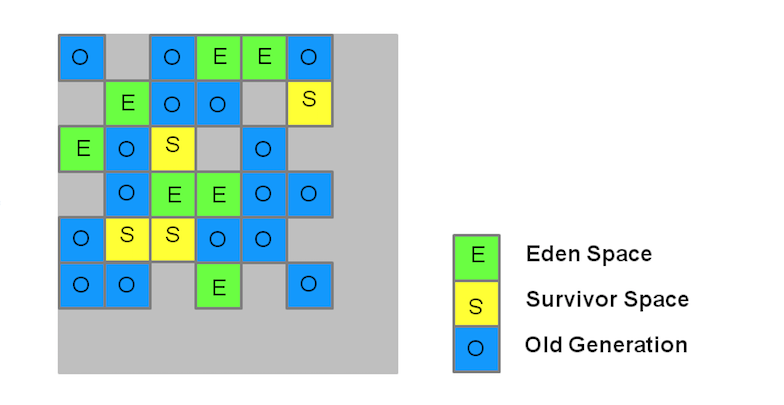  
每块区域既有可能属于O区，也有可能属于Y区，因此不需要一次就对整个老年代/新生代回收。而是当线程并发寻找可回收的对象时，有些区块包含可回收的对象要比其他区块多很多。虽然在清理这些区块时G1仍然需要暂停应用程序，但可以用相对较少的时间优先回收垃圾较多的Region(这也是G1命名的来源)。这种方式保证了G1可以在有限的时间内获取尽可能高的收集效率。

#### 新生代收集
  
G1的新生代收集跟ParNew类似：存活的对象被转移到一个/多个Survivor Region。如果存活时间达到阈值，这部分对象就会被提升到老年代。
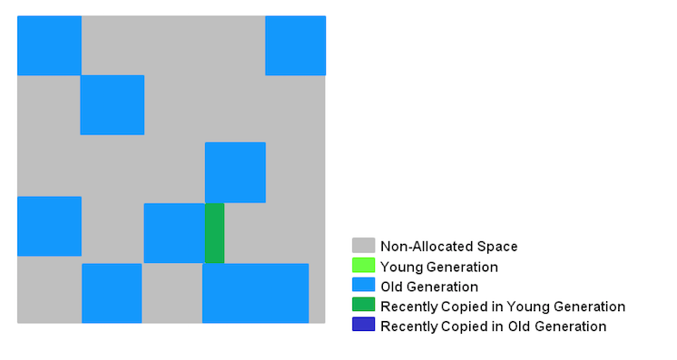  
G1的新生代收集特点如下：
- 一整块堆内存被分为多个Regions
- 存活对象被拷贝到新的Survivor区或老年代
- 新生代内存由一组不连续的heap区组成，这种方法使得可以动态调整各代区域尺寸
- Young GCs会有STW事件，进行时所有应用程序线程都会被暂停
- 多线程并发GC

#### 老年代收集
G1老年代GC执行步骤如下：
- 初始标记:附着一次新生代GC，以标记Survivor中可能引用到老年代对象的Regions。
- 扫描根区域:扫描Survivor中能够引用到老年代的references。但必须在Minor GC触发前执行完
- 并发标记:在整个堆中查找存活对象，但该阶段可能会被Minor GC中断
- 重新标记:完成堆内存中存活对象的标记，使用`snapshot-at-the-beginning(SATB,起始快照)`算法，比CMS所用算法要快得多(空Region直接被移除并回收，并计算所有区域的活跃度)
- 清理
  - STW:在含有存活对象和完全空闲的区域上进行统计
  - STW:擦除`Remembered Sets`
  - Concurrent:重置空regions并将它们返还给空闲列表(free list)
- 拷贝清理

G1老年代GC特点如下：
- 并发标记阶段
  - 在与应用程序并发执行的过程中会计算活跃度信息
  - 这些活跃度信息标识出那些regions最合适在STW期间回收
  - 不像CMS有清理阶段
- 再次标记阶段
  - 使用SATB算法比CMS快得多
  - 空regions直接被回收
- 拷贝/清理阶段
  - 新生代和老年代同时回收
  - 老年代内存回收会基于它的活跃度信息
