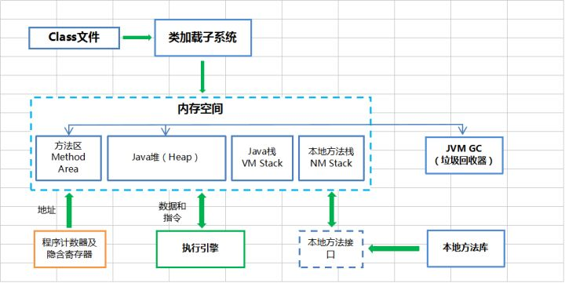
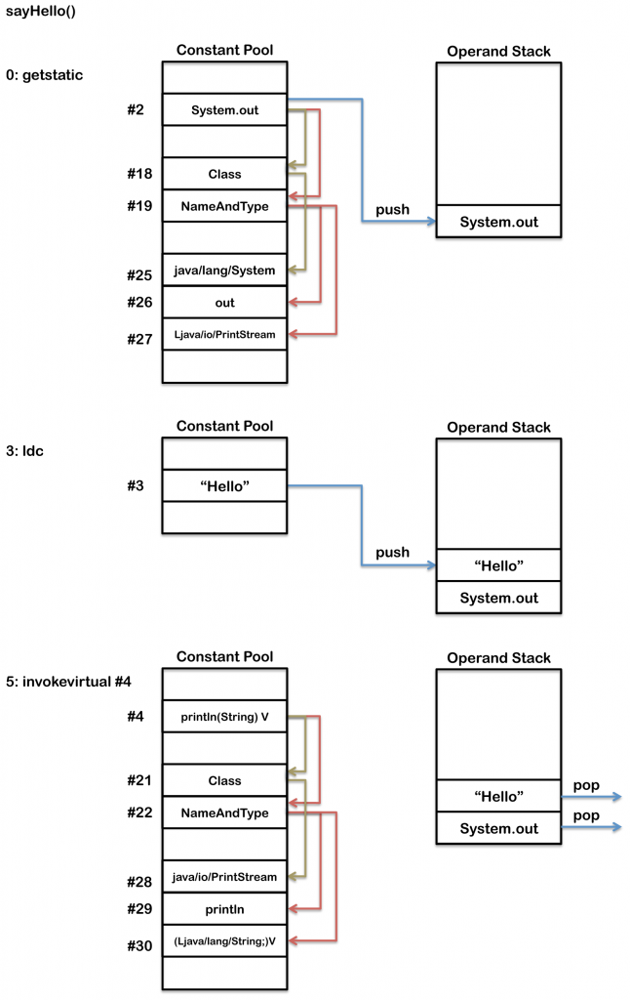
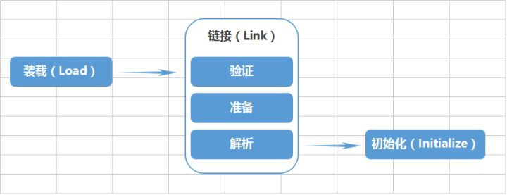
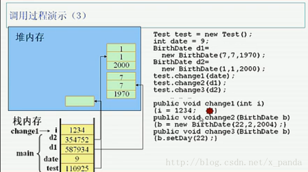

## JVM的基础概念
JVM的中文名称叫Java虚拟机，它是由软件技术模拟出计算机运行的一个虚拟的计算机，作用是将编写的java程序“翻译”给系统。java程序经过编译，产生`.class`文件，JVM才能识别并运行它，JVM针对每一个操作系统开发其对应的解释器，故只要其操作系统有对应版本的JVM，则java编译后的代码就能够运行起来，这就是java能`一次编译，到处运行`的原因。
## JVM的生命周期
- JVM在Java程序开始执行的时候才运行，程序结束时就停止
- 一个Java程序会开启一个JVM进程
- JVM中线程分为：`守护线程`和`普通线程`。守护线程是JVM自己使用的线程，例如垃圾回收(GC)；普通线程一般是Java程序的线程，只要JVM中有普通线程在执行，那么JVM就不会停止。   
`Hotspot JVM`(JVM一种版本)系统的后台进程与触发`public static void main(String[])`函数的主线程以及主线程创建的其他线程一起运行。  
系统线程主要有下面几个：

| 线程 | 定义作用 |
| ------------ | ------------- |
| 虚拟机线程(VM thread) | 这个线程等待JVM到达`安全点操作`出现。这些操作必须要在独立的线程里执行，因为当堆修改无法进行时，线程都需要JVM位于安全点，这些操作的类型都有：`stop-the-world`垃圾回收、线程栈`dump`、线程暂停、线程偏向锁`biased locking`解除 |
| 周期性任务线程 | 这线程负责定时器事件(也就是中断),用来调度周期性操作的执行 |
| GC线程 | 这些线程支持JVM中不同的垃圾回收活动 |
| 编译器线程 | 这些线程在运行时将字节码动态编译成本地平台相关的机器码 |
| 信号分发线程 | 这个线程接收发送到JVM的信号并调用适当的JVM方法处理 |

## JVM的结构体系

### `Class`文件
一个编译后的类文件包含下面的结构：
```
ClassFile {
    u4            magic;
    u2            minor_version;
    u2            major_version;
    u2            constant_pool_count;
    cp_info        contant_pool[constant_pool_count – 1];
    u2            access_flags;
    u2            this_class;
    u2            super_class;
    u2            interfaces_count;
    u2            interfaces[interfaces_count];
    u2            fields_count;
    field_info        fields[fields_count];
    u2            methods_count;
    method_info        methods[methods_count];
    u2            attributes_count;
    attribute_info    attributes[attributes_count];
}
```
| 类文件结构 | 作用 |
| --- | --- |
| magic,minor_version,major_version | 类文件的版本信息和用于编译这个类的JDK版本 |
| constant_pool | 类似于符号表，尽管它包含更多数据 |
| access_flags | 提供这个类的描述符列表 |
| this_class | 提供这个类全名的常量池(contant_pool)索引，比如`org/jamesdbloom/foo/Bar` |
| super_class |提供这个类的父类符号引用的常量池索引 |
| interfaces | 指向常量池的索引数组，提供那些被实现的接口的符号引用 |
| fileds | 提供每个字段完整描述的常量池索引数组 |
| methods | 指向`contant_pool`的索引数组，用于表示每个方法签名的完整描述。如果这个方法不是抽象方法也不是`native`方法，那么就会显示这个函数的字节码
| attributes | 不同值的数组，表示这个类的附加信息，包括`RetentionPolicy.CLASS`和`RetentionPolicy.RUNTIME`注解 |
编译简单类：
```
public class Test1 {
    public static void main(String[]) {
        System.out.println("Hello world!!");
    }
}
```
查看`.class`文件：
```
F:\Android\javaEEwork\Thread_JackeyZz\src\com\JackeyZz\test>javap -v -p -s -sysinfo -constants Test1.class
Classfile /F:/Android/javaEEwork/Thread_JackeyZz/src/com/JackeyZz/test/Test1.class
  Last modified 2018-3-15; size 435 bytes
  MD5 checksum 9cb937b07256ec27a56324c631219379
  Compiled from "Test1.java"
public class com.JackeyZz.test.Test1
  minor version: 0
  major version: 52
  flags: ACC_PUBLIC, ACC_SUPER
Constant pool:
   #1 = Methodref          #6.#15         // java/lang/Object."<init>":()V
   #2 = Fieldref           #16.#17        // java/lang/System.out:Ljava/io/PrintStream;
   #3 = String             #18            // hello world!!
   #4 = Methodref          #19.#20        // java/io/PrintStream.println:(Ljava/lang/String;)V
   #5 = Class              #21            // com/JackeyZz/test/Test1
   #6 = Class              #22            // java/lang/Object
   #7 = Utf8               <init>
   #8 = Utf8               ()V
   #9 = Utf8               Code
  #10 = Utf8               LineNumberTable
  #11 = Utf8               main
  #12 = Utf8               ([Ljava/lang/String;)V
  #13 = Utf8               SourceFile
  #14 = Utf8               Test1.java
  #15 = NameAndType        #7:#8          // "<init>":()V
  #16 = Class              #23            // java/lang/System
  #17 = NameAndType        #24:#25        // out:Ljava/io/PrintStream;
  #18 = Utf8               hello world!!
  #19 = Class              #26            // java/io/PrintStream
  #20 = NameAndType        #27:#28        // println:(Ljava/lang/String;)V
  #21 = Utf8               com/JackeyZz/test/Test1
  #22 = Utf8               java/lang/Object
  #23 = Utf8               java/lang/System
  #24 = Utf8               out
  #25 = Utf8               Ljava/io/PrintStream;
  #26 = Utf8               java/io/PrintStream
  #27 = Utf8               println
  #28 = Utf8               (Ljava/lang/String;)V
{
  public com.JackeyZz.test.Test1();
    descriptor: ()V
    flags: ACC_PUBLIC
    Code:
      stack=1, locals=1, args_size=1
         0: aload_0
         1: invokespecial #1                  // Method java/lang/Object."<init>":()V
         4: return
      LineNumberTable:
        line 18: 0

  public static void main(java.lang.String[]);
    descriptor: ([Ljava/lang/String;)V
    flags: ACC_PUBLIC, ACC_STATIC
    Code:
      stack=2, locals=1, args_size=1
         0: getstatic     #2                  // Field java/lang/System.out:Ljava/io/PrintStream;
         3: ldc           #3                  // String hello world!!
         5: invokevirtual #4                  // Method java/io/PrintStream.println:(Ljava/lang/String;)V
         8: return
      LineNumberTable:
        line 21: 0
        line 22: 8
}
SourceFile: "Test1.java"
```
这个`.class`文件展示了三个主要部分：常量池、构造器方法和`main`方法
- 常量池：提供了通常由符号表提供的相同信息
- 方法：每一个方法包含四个区域
  - 签名和访问标签
  - 字节码
  - LineNumberTable:为调试器提供源码中的每一行对应的字节码信息。上面的例子中，java源码里的第21行与`main`函数字节码序号0相关，第22行与字节码序号8相关。
  - LocalVariableTable:列出了所有栈帧中的局部变量。

`main`方法需要用运行时常量池中的指向符号引用的真实引用。第一个操作码`getstatic`从`System`类中将`out`静态变量压到操作数栈。下一个操作码`ldc`把字符串`hello world!!`压栈到操作数栈。最后`invokevirtual`操作符会调用`System.out`变量的`println`方法，从操作数栈作弹出`hello world!!`变量作为`println`的一个参数，并在当前线程开辟一个新栈帧。

### Java类加载机制
`.class`文件由类装载器装载后，在JVM中将形成一份描述`class`结构的元信息对象，通过该元信息对象可以获知`class`的结构信息：如构造函数、属性和方法等，Java允许用户借由这个`class`相关的元信息对象间接调用`class`对象的功能。  
虚拟机把描述类的数据从`class`文件加载到内存，并对数据进行校验，转换解析和初始化，最终形成可以被虚拟机直接使用的Java类型，这就是虚拟机的类加载机制。
#### 类的加载
`类的加载`指的是将类的`.class`文件中的二进制数据读入到内存中，将其放在运行时数据区的方法区中，然后在堆区创建一个`java.lang.Class`对象，用来封装类在方法区内的数据结构。类的加载的最终产品是位于堆区中的`class`对象，`class`对象封装了类在方法区内的数据结构，并且向java程序员提供了访问方法区的数据结构的接口。
#### 类加载器
`类加载器`也可以称为`类加载子系统`，JVM默认提供三个类加载器：
- `BootStrap ClassLoader`:称之为启动类加载器，是最顶层的类加载器，负责加载JDK中的核心类库，如`rt.jar` `resources.jar` `charsets.jar`等
- `Extension ClassLoader`:称之为扩展类加载器，负责加载Java的扩展类库，默认加载`$JAVA_HOME`中的`jre/lib/*.jar`或`-Djava.ext.dirs`指定目录下的jar包
- `App ClassLoader`:称之为系统类加载器，负责加载应用程序classpath目录下所有jar和class文件  

除了三个默认的`ClassLoader`之外，还可以自定义`ClassLoader`，但必须继承`java.lang.ClassLoader`类。  

#### 类的加载过程
- 装载(Load)：查找并加载类的二进制数据(查找和导入`class`文件)
  - 1、通过一个类的全限定名来获取其定义的二进制字节流
  - 2、将这个字节流所代表的静态存储结构转换为方法区的运行时数据结构
  - 3、在java堆中生成一个代表这个类的`java.lang.Class`对象，作为对方法区中这些数据的访问入口
- 链接(Link)
  - 验证：连接阶段的第一步，目的在于确保`class`文件的字节流中包含的信息符合当前虚拟机的要求，并且不会危害虚拟机自身的安全
    - 文件格式验证:验证字节流是否符合`class`文件格式的规范
    - 元数据验证:对字节码描述的信息进行语义分析，以保证其描述的信息符合java语言规范的要求
    - 字节码验证:通过数据流和控制流分析，确定程序语义是合法的、符合逻辑的
    - 符号引用验证:确保解析动作能正确执行
  - 准备：为类的静态变量分配内存，并将其初始化为默认值
    - 这时候进行内存分配的仅包括类变量`static`,而不包括实例变量，实例变量会在对象实例化时随着对象一块分配在java堆中
    - 这里所设置的初始值通常情况下是数据类型默认的零值(如0、0L、null、false等)，而不是被在java代码中被显示地赋予的值

    假设一个类的变量的定义为：`public static int value=3;`那么变量`value`在准备阶段过后的初始值为0，而不是3，因为这时候尚未开始执行任何java方法，而把`value`赋值为3的`putstatic`指令是在程序编译后，存放于类构造器`<clinit>()`方法之中的，所以把`value`赋值为3的动作将在初始化阶段才会执行。
  - 解析：虚拟机将常量池内的符号引用替换为直接引用的过程，解析动作主要针对类或接口、字段、类方法、接口方法、方法类型、方法句柄和调用限定符7类符号引用进行。符号引用就是一组符号来描述目标，可以是任何字面量；直接引用就是直接指向目标的指针、相对偏移量或一个间接定位到目标的句柄。

- 初始化(Initialize)：对类的静态变量，静态代码块执行初始化操作  
初始化，为类的静态变量赋予正确的初始值，JVM负责对类进行初始化，主要对类变量进行初始化。在java中对类变量进行初始值设定有两种方式：
  - 声明类变量是指定初始值
  - 使用静态代码块为类变量指定初始值

### 类执行机制
JVM是基于堆栈的虚拟机。JVM为每个新创建的线程都分配一个堆栈，也就是说，对于一个java程序来说，它的运行就是通过对堆栈的操作来完成的。堆栈以帧为单位保存线程的状态。JVM对堆栈只进行两种操作：以帧为单位的压栈和出栈操作。  
JVM执行`class`字节码，线程创建后，都会产生程序计数器(pc)和栈(Stack),程序计数器存放下一条要执行的指令在方法内的偏移量，栈中存放一个个栈帧，每个栈帧对应着每个方法的每次调用，而栈帧又是有局部变量区和操作数栈两部分组成，局部变量区用于存放方法中的局部变量和参数，操作数栈中用于存放方法执行过程中产生的中间结果。

### JVM内存空间
#### 方法区
在JVM中，`类型信息`和`类静态变量`都保存在方法区中，类型信息是由类加载器在类加载过程中从类文件中提取出来的信息。常量池也存放在方法区。程序中所有的线程共享一个方法区，所以访问方法区的信息必须确保线程是安全的。方法区也可以被垃圾回收，但条件非常苛刻，必须在该类没有任何引用的情况下。类型信息包括：
- 类型的全名
- 类型的父类型全名
- 该类型是一个类还是接口
- 类型的修饰符
- 所有父接口全名的列表
- 类型的字段信息
- 类型的方法信息
- 所有静态类变量信息
- 一个指向类加载器的引用
- 一个指向`class`类的引用
- 基本类型的常量池  

为了更高效的访问所有保存在方法区中的数据，在方法区中，除了保存上边的这些类型信息之外，还是一个为了加快存取速度而设计的数据结构：`方法列表`，它保存了这个类可能调用的所有实例方法的引用，保存那些父类中调用的方法。
#### Java堆
- 当java通过`new`创建一个类的实例对象或者数组时，都在堆中为新的对象分配内存
- 虚拟机中只有一个堆，程序中所有的线程都共享它
- 堆占用的内存空间是最多的
- 堆的存取类型为管道类型，先进先出
- 在程序运行中，可以动态的分配堆的内存大小
- 堆的内存资源回收是交给`JVM GC`进行管理的

操作系统有一个记录空闲内存地址的链表，当系统收到程序的申请时，会遍历该链表，寻找第一个空间大于所申请空间的堆结点，然后将该结点从空闲结点链表中删除，并将该结点的空间分配给程序，另外，对于大多数系统，会在这块内存空间中的首地址处记录本次分配的大小，这样代码中的`delete`语句才能正确的释放本内存空间。但由于找到的堆结点的大小不一定正好等于申请的大小，系统会自动的将多余的那部分重新放入空闲链表中。这时由`new`分配的内存，一般速度比较慢，而且容易产生内存碎片，不过用起来最方便。另外，在WINDOWS下，最好的方式是用`VirtualAlloc`分配内存，它不是在堆，也不是在栈，而是直接在进程的地址空间中保留一块内存，虽然这种方法用起来不方便，但是速度快，也是最灵活的。  
堆内存是向高地址扩展的数据结构，是不连续的内存区域。由于系统是用链表来存储的空闲内存地址的，自然是不连续的，而链表的遍历方向是由低地址向高地址。
#### Java栈
在Java栈中只保存基础数据类型(四类八种)和自定义对象的引用，注意只是对象的引用而不是对象本身，对象是保存在堆区中的。
- `String\Integer\Byte\Short\Long\Character\Boolean`这六个属于包装类型，存放于堆中
- 栈内的数据在超过其作用域后，会被自动释放，不由`JVM GC`管理
- 每一个线程都包含一个栈区，每个栈中的数据都是私有的，其他栈不能访问
- 每个线程都会建立一个操作栈，每个栈又包含了若干个栈帧，每个栈帧对应着每个方法的每次调用，每个栈帧包含了三部分：
  - 局部变量区：方法内基本类型变量、对象引用、returnAddress地址(代码执行到哪一行)
  - 操作数栈区：存放方法执行过程中产生的中间结果
  - 运行环境区：动态链接、正确的方法返回相关信息、异常捕捉

在windows下，栈是向低地址扩展的数据结构，是一块连续的内存区域。栈顶的地址和栈的最大容量是系统预先规定好的，在WINDOWS下,栈的大小是固定的(是一个编译时就确定的常数),如果申请的空间超过了栈的剩余空间时，将提示`overflow`。因此能从栈获得的空间较小。由系统自动分配，速度较快，但程序员是无法控制的。  
`堆内存与栈内存：`  
- 基础数据类型直接在栈空间分配，方法的形式参数，直接在栈空间分配，当方法调用完成后从栈空间回收。  
- 引用数据类型，需要用new来创建，既在栈空间分配一个地址空间，又在堆空间分配对象的类变量 。方法的引用参数，在栈空间分配一个地址空间，并指向堆空间的对象区，当方法调用完成后从栈空间回收。
- 局部变量new出来时，在栈空间和堆空间中分配空间，当局部变量生命周期结束后，栈空间立刻被回收，堆空间区域等待GC回收。
- 方法调用时传入的literal参数，先在栈空间分配，在方法调用完成后从栈空间收回。
- 字符串常量、static在DATA区域分配，this在堆空间分配。数组既在栈空间分配数组名称，又在堆空间分配数组实际的大小。


#### 本地方法栈(java中的jni调用)
用于支持native方法的执行，存储了每个native方法调用的状态。对于本地方法接口，实现JVM并不要求一定要有它的支持。

### 程序计数器及隐含寄存器
- 在JVM的概念模型里，字节码解释器工作时就是通过改变这个计数器的值来选取下一条需要执行的字节码指令。分支、循环、跳转、异常处理、线程恢复等基础功能都需要依赖这个计数器来完成。  
- JVM的多线程是通过线程轮流切换并分配处理器执行时间的方式来实现的，为了各条线程之间的切换后计数器能恢复到正确的执行位置，所以每条线程都会有一个独立的程序计数器
- 程序计数器仅占很小的一块内存空间
- 当线程正在执行一个java方法，程序计数器记录的是正在执行的JVM字节码指令的地址。如果正在执行的是一个native(本地方法),那么这个计数器的值则为空(Underfined)
- 程序计数器这个内存区域是唯一一个在JVM规范中没有规定任何`OutOfMemoryError`(内存不足错误)的区域

### JVM执行引擎
在JVM规范中制定了虚拟机字节码执行引擎的概念模型，这个模型称之为JVM执行引擎的统一外观。在JVM实现中，可能会有两种执行方式:解释执行(通过解释器执行)和编译执行(通过即时编译器产生本地代码)
- 输入：字节码文件
- 处理过程：等效字节码解析过程
- 输出：执行结果

### 本地方法接口(JNI)
JNI是`Java Native Interface`的缩写，它提供了若干的API实现了Java和其他语言的通信(主要是c和c++)
### JVM GC
[GC链接](http://jackeyzzhold.xyz/2018/03/20/java-GC/#more)
### 本地方法库
