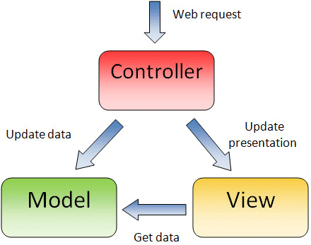
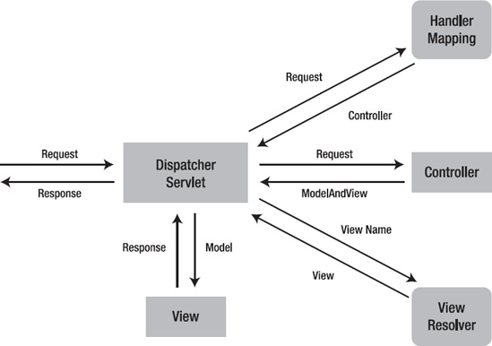
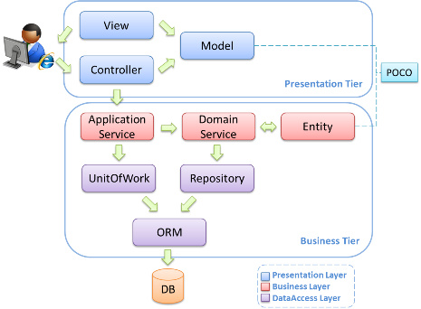
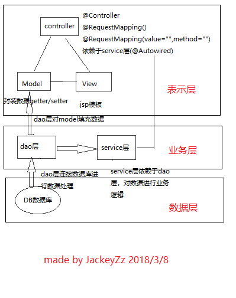
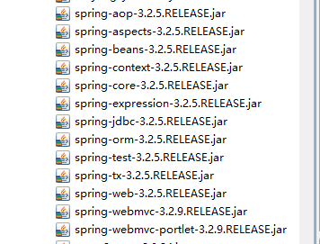
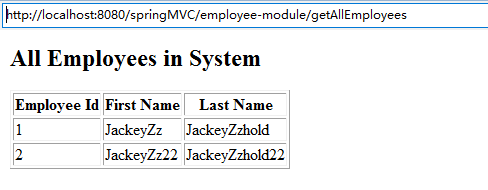

## SpringMVC框架介绍和简单实例
### MVC框架简介
**模型-视图-控制器(MVC)** 是一个总所周知的以设计界面应用程序为基础的设计模式。它主要通过分离模型、视图及控制器在应用程序中的角色将业务逻辑从界面中解耦。

- **模型**  
封装应用程序数据在视图层展示。类似于结构体，将数据变量封装到model类中，并编写setter与getter方法对数据进行交互。通常由`POJO`对象组成，在业务层被处理，在持久层(数据层)被持久(也就是在数据库中对数据进行存取处理)。
- **视图**  
在前端展示这些数据，不包含任何业务逻辑。通常是用JSP标准标签库(JSTL)编写的JSP模板。
- **控制器**  
负责接收来自用户的请求，并调用后台服务(manager或者dao)来处理业务逻辑。通常是由dispatcher servlet负责。  
在一个Spring MVC应用程序中，控制器是唯一你需要在java web部署描述文件(即`web.xml`)中配置的servlet。通常被称作`Dispatcher Servlet`，实现了前端控制器设计模式。并且每个web请求必须通过它以便它能够管理整个请求的生命周期。  
当一个web请求发送到Spring MVC应用程序，`dispatcher servlet`首先接受请求。然后它组织那些在Spring web应用程序上下文配置的(例如实际请求处理控制器和视图解析器)或者使用注解配置的组件，所有的这些都需要处理该请求。


通常一个web应用是3层架构，即`数据-业务-表示`。MVC实际上是表示层的一部分，而业务层与Dao层类并不属于MVC框架的一部分。


### SpringMVC的简单实例
根据框架层次可得到各个层的内容以及层之间的依赖关系。
  
使用注解配置Spring，定义一个controller类，必须有`@Controller`注解，标志着这个类
为控制器，当收到web请求时，它会寻找一个合适的handler方法去处理这个请求，这就需要控制器通过一个或多个handler映射去把每个请求映射到handler方法。因此控制器类的方法需要被`@RequestMapping`注解装饰，使它们成为handler方法。
handler方法处理完请求后，它把控制权委托给视图名与handler方法返回值相同的视图。为了提供一个灵活的方法，一个handler方法返回的值并不代表一个视图的实现而是一个逻辑视图，即没有任何文件扩展名。你可以将这些逻辑视图映射到正确的实现，并将这些实现写入到上下文文件，这样你就可以轻松的更改视图层代码甚至不用修改请求handler类的代码。  
为一个逻辑名称匹配正确的文件是视图解析器的责任。一旦控制器类已将一个视图名称解析到一个视图实现，它会根据视图实现的设计来渲染对应对象。  
#### 第一步、配置Spring MVC的环境  
将Spring mvc需要的jar包导入到`/WEB-INF/lib/`中
  
**(注：里面一些jar包并不是必需的。习惯性将所有jar包一次性导入项目)**  
#### 第二步、配置前端控制器，在web.xml声明Servlet(即Dispatcher Servlet)来接收所有类型的请求。
```
<?xml version="1.0" encoding="UTF-8"?>
<web-app version="2.5"
	xmlns="http://java.sun.com/xml/ns/javaee"
	xmlns:xsi="http://www.w3.org/2001/XMLSchema-instance"
	xsi:schemaLocation="http://java.sun.com/xml/ns/javaee
	http://java.sun.com/xml/ns/javaee/web-app_2_5.xsd">
 <display-name></display-name>    
    <welcome-file-list>
        <welcome-file>index.jsp</welcome-file>
    </welcome-file-list>
      <!-- 该监听器将在Web容器启动时激活Spring -->
    <listener>
        <listener-class>org.springframework.web.context.ContextLoaderListener</listener-class>
    </listener>
    <!-- 处理由JavaBeans,Introspector的使用而引起的缓冲泄露,建议配置此监听器 -->
    <listener>
        <listener-class>org.springframework.web.util.IntrospectorCleanupListener</listener-class>
    </listener>
      <!--configure the setting of springmvcDispatcherServlet and configure the mapping-->
    <servlet>
        <servlet-name>springmvc</servlet-name>
        <servlet-class>org.springframework.web.servlet.DispatcherServlet</servlet-class>
        <init-param>
              <param-name>contextConfigLocation</param-name>
              <param-value>/WEB-INF/spring-servlet.xml</param-value>
          </init-param>
          <load-on-startup>1</load-on-startup>
    </servlet>
    <servlet-mapping>
        <servlet-name>springmvc</servlet-name>
        <url-pattern>/</url-pattern>
    </servlet-mapping>
</web-app>
```
**web.xml的知识点**  
1、`web.xml`的加载过程(引用)  
在`web-app`元素内，元素的配置顺序与工程的加载顺序无关，加载过程为：
- 启动一个web项目，web容器(如tomcat)读取`web.xml`文件，读取其中的配置信息
- 容器创建一个servlet上下文(servletContext)，这个web项目所有部分共享这个上下文。当web服务器启动时，会为每一个web应用程序(webapps下的每个目录就是一个应用程序)创建一块共享的存储区域，即为servletContext，也就是同一个web应用程序中，所有的servlet和jsp都可以共享同一个区域。servlet上下文为web服务器启动时创建，服务器关闭时销毁。例如`http://localhost/test/aaa.html` 则应用上下文为test。
- 容器将`<context-param>`转换为键值对，交给servletContext
- 容器创建`<listener>`中的监听实例
- 触发contextInitialized方法，listener被调用(当Servlet 容器启动或终止Web 应用时，会触发ServletContextEvent 事件，该事件由ServletContextListener 来处理。在 ServletContextListener 接口中定义了处理ServletContextEvent 事件的两个方法contextInitialized；contextDestroyed，`web.xml`有contextLoaderListener监听器，spring等框架实现了本监听器的接口方法)
- 调用完contextInitialized方法后，容器再对filter初始化
- 容器对`web.xml`中的指定`load-on-startup`的值为正数Servlet初始化(优先级1,2,3...->递减)，负数或不指定则在该Servlet调用时初始化(springMVC的初始化为此阶段)  

2、`<servlet>`配置控制器dispatcher servlet，`<init-param>`初始化servlet参数，`<param-value>`配置servlet参数初始化值的位置在`/WEB-INF/spring-servlet.xml`。创建web project时的web.xml可能显示的位置是`classpath:...`这里的位置是在`/WEB-INF/classes`里面，也就是在`src`里面，一般`src`里面的文件也会在Navigator模式下的`/WEB-INF/classes`里面。  
3、`<servlet-mapping>`含有`<servlet-name>`和`<url-pattern>`
- `<servlet-name>:`servlet的名字，唯一性和一致性，与`<servlet>`元素中声明的名字一致。
- `<url-pattern>:`指定相对于Servlet的URL的路径。该路径相对于web应用程序上下文的根路径。`<servlet-mapping>`将URL模式映射到某个Servlet,即该Servlet处理的URL。  

4、加载Servlet的过程  
容器的Context对象对请求路径(URL)做出处理，去掉请求URL的上下文路径后，按路径映射规则和Servlet映射路径(`<url-pattern>`)做匹配，如果匹配成功，则调用这个Servlet处理请求。  
5、servlet容器对url的匹配过程  
当一个请求发送到servlet容器的时候，容器先会将请求的url减去当前应用上下文的路径作为servlet的映射url，比如我访问的是`http://localhost/test/aaa.html`，我的应用上下文是test，容器会将`http://localhost/test去掉`，剩下的`/aaa.html`部分拿来做servlet的映射匹配。这个映射匹配过程是有顺序的，而且当有一个servlet匹配成功以后，就不会去理会剩下的servlet了(filter不同，后文会提到)。其匹配规则和顺序如下：
- 精确路径匹配。例子：比如servletA 的url-pattern为 `/test`，servletB的url-pattern为 `/*` ，这个时候，如果我访问的url为`http://localhost/test` ，这个时候容器就会先进行精确路径匹配，发现`/test`正好被servletA精确匹配，那么就去调用servletA，也不会去理会其他的servlet了。
- 最长路径匹配。例子：servletA的url-pattern为`/test/*`，而servletB的url-pattern为`/test/a/*`，此时访问`http://localhost/test/a`时，容器会选择路径最长的servlet来匹配，也就是这里的servletB。
- 扩展匹配，如果url最后一段包含扩展，容器将会根据扩展选择合适的servlet。例子：servletA的url-pattern：`*.action`
- 如果前面三条规则都没有找到一个servlet，容器会根据url选择对应的请求资源。如果应用定义了一个default servlet，则容器会将请求丢给default servlet  

6、`<url-pattern>/</url-pattern>`  
会匹配到`/springmvc`这样的路径型url，不会匹配到模式为`*.jsp`这样的后缀型url。  
`<url-pattern>/*</url-pattern>`  
会匹配所有的url：路径型的和后缀型的url(包括`/springmvc`，`.jsp`，`.js`和`*.html`等)。  
#### 第三步、servlet参数初始化的xml文件
```
<?xml version="1.0" encoding="UTF-8"?>
<beans xmlns:xsi="http://www.w3.org/2001/XMLSchema-instance"   
    xmlns="http://www.springframework.org/schema/beans"  
    xmlns:mvc="http://www.springframework.org/schema/mvc"  
    xmlns:context="http://www.springframework.org/schema/context"  
    xmlns:aop="http://www.springframework.org/schema/aop"  
    xmlns:tx="http://www.springframework.org/schema/tx"  
    xsi:schemaLocation="http://www.springframework.org/schema/beans
        http://www.springframework.org/schema/beans/spring-beans-4.2.xsd
        http://www.springframework.org/schema/mvc
        http://www.springframework.org/schema/mvc/spring-mvc-4.2.xsd
        http://www.springframework.org/schema/context
		http://www.springframework.org/schema/context/spring-context-4.2.xsd">    
    <context:annotation-config />   
    <context:component-scan base-package="com.JackeyZz.controller"/>
    <context:component-scan base-package="com.JackeyZz.dao"/>
    <context:component-scan base-package="com.JackeyZz.model"/>
    <context:component-scan base-package="com.JackeyZz.service"/>
    <bean class="org.springframework.web.servlet.mvc.annotation.DefaultAnnotationHandlerMapping" />
    <bean class="org.springframework.web.servlet.mvc.annotation.AnnotationMethodHandlerAdapter" />
    <bean class="org.springframework.web.servlet.view.InternalResourceViewResolver">
        <property name="prefix" value="/WEB-INF/pages/" />
        <property name="suffix" value=".jsp" />
    </bean>
</beans>
```
**Spring MVC视图解析器知识点**  
1、注解映射器  
`<bean class="org.springframework.web.servlet.mvc.annotation.DefaultAnnotationHandlerMapping" />`  
2、注解适配器  
`<bean class="org.springframework.web.servlet.mvc.annotation.AnnotationMethodHandlerAdapter" />`  
3、视图解析器配置前缀和后缀`prefix`和`suffix`，如此就可以在程序中不指定jsp路径的前后缀。
#### 第四步、Model层类
```
public class EmployeeVO implements Serializable{
	private static final long serialVersionUID=1L;
	private Integer id;
	private String firstName;
	private String lastName;
	//getter and setter
}
```
model层封装了应用程序的数据。由dao层进行填充数据。
#### 第五步、DAO层类
```
public interface EmployeeDAO {

	public List<EmployeeVO> getAllEmployees();
}

@Repository
public class EmployeeDAOImpl implements EmployeeDAO{

	public List<EmployeeVO> getAllEmployees(){
		List<EmployeeVO> employees=new ArrayList<EmployeeVO>();
		EmployeeVO vo1=new EmployeeVO();
		vo1.setId(1);
		vo1.setFirstName("JackeyZz");
		vo1.setLastName("JackeyZzhold");
		employees.add(vo1);
		EmployeeVO vo2=new EmployeeVO();
		vo2.setId(2);
		vo2.setFirstName("JackeyZz22");
		vo2.setLastName("JackeyZzhold22");
		employees.add(vo2);
		return employees;
	}
}
```
DAO层分为一个接口interface和继承该接口的实现类。主要实现连接数据库，并与model层和数据库进行数据交互。`@Repository`是spring的注解形式，对应存储层Bean。另外`@Service`，`@Controller`对应业务层Bean和表示层Bean。Dao层服务于Service层进行业务逻辑的实现。
#### 第六步、Service层类
```
public interface EmployeeManager {
	public List<EmployeeVO> getAllEmployees();
}

@Service
public class EmployeeManagerImpl implements EmployeeManager{
	@Autowired
	EmployeeDAO dao;
	public List<EmployeeVO> getAllEmployees(){
		return dao.getAllEmployees();
	}
}
```
Service层也分为一个接口和继承该接口的实现类。主要依赖于DAO层的数据进行业务逻辑的实现。注解形式`@Service`对应业务层Bean，注解形式`@Autowired`表示自动依赖于后面紧接的类层。
#### 第七步、Controller层类
```
@Controller
@RequestMapping("/employee-module")
public class EmployeeController {

	@Autowired
	EmployeeManager manager;

	@RequestMapping(value="/getAllEmployees",method=RequestMethod.GET)
	public String getAllEmployees(Model model){
		model.addAttribute("employees",manager.getAllEmployees());
		for(EmployeeVO ev : manager.getAllEmployees()){
			System.out.println(ev.toString());
		}
		return "employeesListDisplay";
	}
}
```
控制层依赖于Service层进行业务逻辑后的数据，再通过响应用户请求将数据映射到view层展示。注解`@Controller`对应展示层Bean，注解`@RequestMapping`会将HTTP的url路径映射到控制器中，如`@RequestMapping("/employee-module")`表示url路径必须含有`/employee-module`才能访问到Controller层类上，类中注解`@RequestMapping(value="/getAllEmployees",method=RequestMethod.GET)`则表示url路径必须含有`/getAllEmployees`才能访问到`getAllEmployees`方法。故总路径应为`.../employee-module/getAllEmployees`。其中`method=RequestMethod.GET`表示处理从url进来的请求所用的HTTP方法，为GET方法。  
数据绑定通过Model类以及Model类的addAttribute方法将数据绑定到对应的控件中。最后返回view层的jsp文件。
#### 第八步、view层jsp文件
```
<%@ taglib prefix="c" uri="http://java.sun.com/jsp/jstl/core"%>
<%@ taglib prefix="fmt" uri="http://java.sun.com/jsp/jstl/fmt"%>
<html>
<head>
    <title>Spring MVC Hello World</title>
</head>
<body>
    <h2>All Employees in System</h2>
    <table border="1">
        <tr>
            <th>Employee Id</th>
            <th>First Name</th>
            <th>Last Name</th>
        </tr>
        <c:forEach items="${employees}" var="employee">
            <tr>
                <td>${employee.id}</td>
                <td>${employee.firstName}</td>
                <td>${employee.lastName}</td>
            </tr>
        </c:forEach>
    </table>
</body>
</html>
```
其中`items="${employees}"`对应addAttribute方法的参数进行数据绑定，然后再对数据进行遍历，展示到前端。
#### 第九步、运行服务器，输入url

