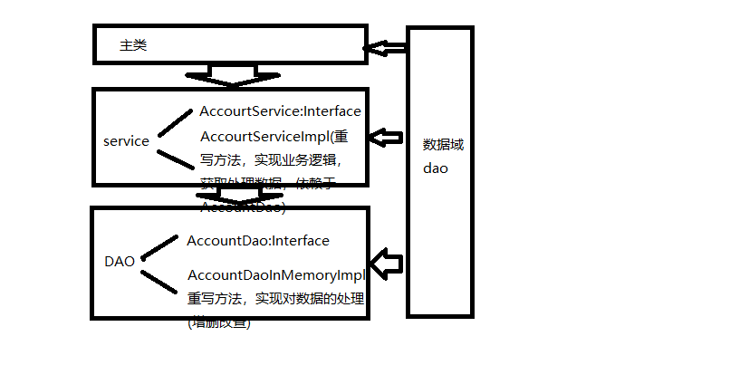

## Spring IoC容器
Spring Application Framework的核心是其IoC(控制反转)容器。该容器的工作职责包括对应用程序的对象进行实例化、初始化、装配以及在对象的整个生命周期中提供其他spring功能。那些构成应用程序主要部分且由spring容器进行管理的对象被称为Bean。虽然它们都是普通的java对象-也被称为POJO，却由spring容器实例化和装配，并进行管理。
### 配置元数据
需要向spring容器提供相关信息，以便实例化Bean并指定如何对这些Bean进行装配。所提供的信息被称为配置元数据。spring容器首先获取应用程序中编写的类并与配置元数据结合在一起，然后创建和转配Bean。
- xml格式   
所有的Bean都被定义在<beans>元素中，而每一个Bean则使用<bean>元素进行定义。如accountService Bean有一个被称为accountDao的属性(property)，而该属性又满足了配置中所定义的accountDao Bean。

```
<?xml version="1.0" encoding="UTF-8"?>
<beans xmlns="http://www.springframework.org/schema/beans"
	xmlns:xsi="http://www.w3.org/2001/XMLSchema-instance"
	xmlns:p="http://www.springframework.org/schema/p"
	xmlns:context="http://www.springframework.org/schema/context"
	xmlns:tx="http://www.springframework.org/schema/tx"
	xsi:schemaLocation="http://www.springframework.org/schema/beans http://www.springframework.org/schema/beans/spring-beans-3.1.xsd
		http://www.springframework.org/schema/tx http://www.springframework.org/schema/tx/spring-tx-4.0.xsd
		http://www.springframework.org/schema/context http://www.springframework.org/schema/context/spring-context-4.0.xsd">

		<bean id="accountService" class="com.JackeyZz.service.AccountServiceImpl">
			<property name="accountDao" ref="accountDao"></property>
		</bean>

		<bean id="accountDao" class="com.JackeyZz.dao.AccountDaoInMemoryImpl">
		</bean>
</beans>
```

- 基于注解  
注解@Service和@Repository被用来定义两个Bean，它们也是注解@Component的具体形式。注解@Autowired通常用来指定在运行时被spring容器所注入的Bean依赖。

```
@Service("accountService")
public class AccountServiceImpl implements AccountService{

	private AccountDao accountDao;
	@Autowired
	public void setAccountDao(AccountDao accountDao){
		this.accountDao=accountDao;
	}
}

@Repository("accountDao")
public class AccountDaoInMemoryImpl implements AccountDao{
}
```

- 基于java  
使用注解@Configuration的java类来定义Bean，使用注解@Bean定义具体的Bean，并通过调用set或者合适的构造函数实现依赖注入。

```
import org.springframework.context.annotation.Bean;
import org.springframework.context.annotation.Configuration;

import com.JackeyZz.dao.AccountDao;
import com.JackeyZz.dao.AccountDaoInMemoryImpl;
import com.JackeyZz.service.AccountService;
import com.JackeyZz.service.AccountServiceImpl;

@Configuration
public class BeanConfiguration {

	@Bean
	public AccountService accountService(){
		AccountServiceImpl bean=new AccountServiceImpl();
		bean.setAccountDao(accountDao());
		return bean;
	}
	@Bean
	public AccountDao accountDao(){
		AccountDaoInMemoryImpl bean=new AccountDaoInMemoryImpl();
		return bean;
	}
}
```

### 配置和使用容器
Spring容器也是一个Java对象，在某些特定的时间点被创建，并允许管理应用程序的其他部分。

显然，在分层体系结构中，每一层仅仅与它下面的那一层进行交互，并且不知道所使用的来自下层的Bean的具体实现。这样的一种体系结构方法可以帮助开发人员使应用程序更加模块化和可测试。  
在主类中，通过使用

```
//AnnotationConfigApplicationContext applicationContext=
				//new AnnotationConfigApplicationContext(BeanConfiguration.class);
		ClassPathXmlApplicationContext applicationContext=new
				 ClassPathXmlApplicationContext("/beans.xml");

		AccountService accountService=applicationContext.getBean(
				"accountService", AccountService.class);
```

通过构造函数的对应参数来获取并实例化spring容器，再由spring容器的实例通过getBean内部访问accountService Bean。又因为service依赖于dao，因此各层模块实现松散耦合性。
