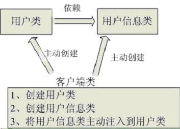
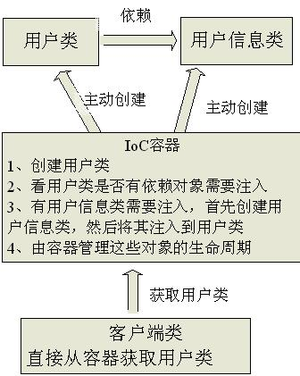
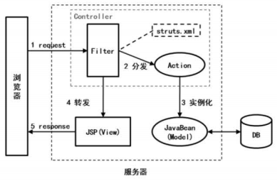

## ssh框架介绍与简单实例
### ssh框架简介
#### spring
Spring是一个J2EE开发的强大框架，提供了管理业务对象的一致方法并且鼓励了注入对接口编程而不是对类编程的良好习惯。通俗点说，就是通过xml形式或者注解形式将类集合成一个个封装后的Bean，再由spring容器进行管理访问，实现类层模块的松散耦合。spring有两个主要的概念或者说设计思想，即为IoC(控制反转)和DI(依赖注入)。
##### IoC-Inversion of Control
Ioc意味着将你设计好的对象交给容器控制，而不是传统的在你的对象内部直接控制。Ioc很好的体现了面向对象设计法则之一--好莱坞法则：别找我们，我们找你。  
所有的类封装成Bean都会在spring容器中登记，告诉spring你是个什么东西，你需要什么东西，然后spring会在系统运行到适当的时候，把你要的东西主动给你，同时也把你交给其他需要你的东西。所有的类的创建、销毁都由 spring来控制，也就是说控制对象生存周期的不再是引用它的对象，而是spring。对于某个具体的对象而言，以前是它控制其他对象，现在是所有对象都被spring控制
- 谁控制谁，控制什么  
传统Java SE程序设计，我们直接在对象内部通过new进行创建对象，是程序主动去创建依赖对象；而Ioc是有专门一个容器来创建这些对象，即由Ioc容器来控制对象的创建以及外部资源的获取。
- 为何是反转，哪些方面反转了  
传统应用程序是由我们自己在对象中主动控制去直接获取依赖对象，即为正转；而反转则是由容器帮忙创建及注入依赖对象，对象只是被动的接收依赖对象，即为依赖对象的获取被反转了。  

传统程序设计都是主动去创建相关对象然后再组合起来的。`EmployeeDAO dao=new EmployeeDAO()`使用传统方法不仅强耦合性，而且代码繁杂，`EmployeeDAO` 类需要构造方法。
  
而在Ioc/DI容器，在客户端中不再主动去创建这些对象。`@Autowired EmployeeDAO dao;`其中`@Autowired`注释，它可以对类成员变量、方法及构造函数进行标注，完成自动装配的工作。当容器扫描到该注释时，就会在Ioc容器中自动寻找对应的Bean，并装配给该对象的属性。  

##### DI-Dependency Injection
组件之间依赖关系由容器在运行期决定，形象的说，即由容器动态的将某个依赖关系注入到组件之中。
- 谁依赖于谁：应用程序依赖于Ioc容器
- 为什么需要依赖：应用程序需要Ioc容器来提供对象需要的外部资源
- 谁注入谁：Ioc容器注入应用程序某个对象，应用程序依赖的对象
- 注入了什么：注入某个对象所需要的外部资源(包括对象、资源、常量数据)  

通俗点说，比如对象A需要操作数据库，以前我们总是要在A中自己编写代码来获得一个Connection对象，有了 spring我们就只需要告诉spring，A中需要一个Connection，至于这个Connection怎么构造，何时构造，A不需要知道。在系统运行时，spring会在适当的时候制造一个Connection，然后像打针一样，注射到A当中，这样就完成了对各个对象之间关系的控制。A需要依赖 Connection才能正常运行，而这个Connection是由spring注入到A中的，依赖注入的名字就这么来的。
#### Struts2
Struts2是轻量级的MVC框架，主要解决了请求分发的问题，重心在控制层和表现层。低侵入性，与业务层代码的耦合度很低。实现了MVC，并提供了一系列API，采用模式化方式简化业务开发过程。  
不同框架实现MVC的方式比较：  
Servlet:  
  
Spring:  
  
Struts2:  
  
Struts2利用过滤器，拦截客户端的请求。客户端发送请求，经过Struts2的过滤器，将HttpServletRequest参数和HttpServletResponse参数封装，利用java反射机制将请求分派给映射的Action。根据Action的执行结果，转向其他Action或jsp页面。
#### Hibernate
Hibernate是一个开源ORM(Object/Relationship Mipping)框架，它是对象关联关系映射的持久层框架 ，它对JDBC做了轻量级的封装，而程序员可以使用面向对象的思想来操纵数据库。  
五个核心接口：
- Configuration:负责配置并启动Hibernate，创建SessionFactory
- SessionFactory:负责初始化Hibernate，创建session对象
- Session:负责被持久化对象CRUD操作
- Transaction:负责事物相关的操作
- Query:负责执行各种数据库查询

Hibernate核心接口  

- Configuration  
Configuration是Hibernate的入口，负责将配置文件信息加载到内存，并创建一个sessionFactory对象，把读入的配置信息加载到sessionFactory对象的内存里。
- SessionFactory  
负责创建session实例，每个sessionFactory实例对应一个数据库。sessionFactory是重量级的，占用缓存较大。  
`特点：`  
1，线程安全，同一个实例可以被应用的多个线程共享  
2，重量级，不能随意创建和销毁他的实例，一个数据库，只需要创建一个SessionFactory的实例。  
3，以后对Configuration对象势力作出的修改都不会影响已经创建好的SessionFactory实例，如果需要使用基于改动后的Configuration实例的SessionFactory，需要从Configuration对象中重新创建新的SessionFactory实例。  
`用法：`  
```java
Configuration config = new Configuration();   
ServiceRegistry  sr = new ServiceRegistryBuilder().applySettings(config.getProperties()).buildServiceRegistry();
SessionFactory sessionFactory = config.buildSessionFactory(sr);
```
- session
session是Hibernate持久化操作的基础，负责管理所有与持久化有关的操作，是轻量级的，也是非线程安全的。创建和销毁不会消耗太多资源，可以为每一个请求分配一个session。  
`特点：`  
1，不是线程安全的，应该避免多个线程共享同一个Session实例。  
2，Session实例是轻量级的。  
3，Session对象内部有一个缓存，被称为Hibernate第一缓存，他存放被当前工作单元中加载的对象，每个Session实例都有自己的缓存。  
`用法：`  
```java
Session session = sessionFactory.openSession();
常用方法：
session.save();
session.update();
session.saveOrUpdate();
session.delete();
```
- transaction
transaction负责Hibernate的数据库事务，其实Hibernate本身并不具有事务管理的能力，只是对底层事务接口进行了封装，这样有利于在不同环境或容器中移植，也可以直接访问底层的事务接口。  
`用法：`
```java
Transaction tx=session.beginTransaction();
```
- Query和Criteria
都是负责Hibernate的查询操作。  
Query实例封装了一个HQL(Hibernate Query Language)查询语句，HQL与SQL有些类似，只是HQL是面向对象的，它操作的是持久化类的类名和属性名，而SQL操作的是表名和字段名。  
Criteria实例完全封装了字符串形式的查询语句，它比Query实例更加面向对象，更适合执行动态查询。

Hibernate基本执行流程

### ssh框架的简单实例
SSH的执行流程为：  
- jsp页面，提交表单或者点击链接会触发一个action
- action交给struts2处理，读取struts.xml文件，在配置中找到对应的action。
- 根据struts.xml文件中找到的class="...Action"交给Spring，读取Spring容器的配置文件applicationContext文件。根据配置文件找到xxx.xxx.action.xxxAction类，其中有一个属性是xxxService，并提供setxxxService()方法，由配置文件得知该xxxService对象由Spring容器依赖注入，set注入。
- 取得xxxService对象(接口对接口实现类的一个引用)后，调用它的方法。后面就是访问DAO。
- 执行的结果会在action的对应的方法中以字符串的形式给出。然后根据struts.xml中的result找到下一步要执行的动作，是跳转到页面显示还是继续交给其他的action处理。  


  
#### 第一步、配置ssh框架环境
添加spring,struts2以及Hibernate的jar包。
#### 第二步、web.xml的配置
```
<filter>
    <filter-name>struts2</filter-name>
    <filter-class>org.apache.struts2.dispatcher.ng.filter.StrutsPrepareAndExecuteFilter</filter-class>
  </filter>
  <filter-mapping>
    <filter-name>struts2</filter-name>
    <url-pattern>/*</url-pattern>
  </filter-mapping>
  <!-- Spring框架的核心监听器 -->
  <listener>
    <listener-class>org.springframework.web.context.ContextLoaderListener</listener-class>
  </listener>
  <context-param>
    <param-name>contextConfigLocation</param-name>
    <param-value>classpath:applicationContext.xml</param-value>
  </context-param>

   <filter>
   	<filter-name>OpenSessionInviewFilter</filter-name>
   	<filter-class>org.springframework.orm.hibernate4.support.OpenSessionInViewFilter</filter-class>
   </filter>
  <filter-mapping>
  	<filter-name>OpenSessionInviewFilter</filter-name>
  	<url-pattern>*.action</url-pattern>
  </filter-mapping>
```
`web.xml`配置文件主要包括三个部分：
- Struts、Hibernate的过滤器配置
- Spring监听激活
- Spring、Hibernate的初始化配置文件的位置  
`Filter`过滤器的配置节点介绍：  
- `<filter>`指定一个过滤器
- `<filter-name>`用于为过滤器指定一个名字，该元素的内容不能为空
- `<filter-class>`元素用于指定过滤器的完整的限定类名
- `<init-param>`元素用于为过滤器指定初始化参数，它的子元素`<param-name>`指定参数的名字，`<param-value>`指定参数的值。在过滤器中，可以使用FilterConfig接口对象来访问初始化参数。
- `<filter-mapping>`元素用于设置一个Filter所负责拦截的资源。一个Filter拦截的资源可通过两种方式来指定：Servlet名称和资源访问的请求路径。`<filter-name>`子元素用于设置filter的注册名称。该值必须是在`<filter>`元素中声明过的过滤器的名字。`<url-pattern>`设置filter所拦截的请求路径(过滤器关联的URL样式)
#### 第三步、application.xml的配置
```java
<!-- 引入外部属性文件 -->
	<context:property-placeholder location="classpath:jdbc.properties"/>
	<!-- 配置c3p0连接池 -->
	<bean id="dataSource" class="com.mchange.v2.c3p0.ComboPooledDataSource">
		<property name="driverClass" value="${jdbc.driverClass}"></property>
		<property name="jdbcUrl" value="${jdbc.url}"></property>
		<property name="user" value="${jdbc.username}"></property>
		<property name="password" value="${jdbc.password}"></property>
	</bean>

	<!-- 配置Hibernate的相关属性,与数据库链接相关的 -->
	<bean id="sessionFactory" class="org.springframework.orm.hibernate3.LocalSessionFactoryBean">
		<!-- 注入连接池 -->
		<property name="dataSource" ref="dataSource"></property>
		<!-- 配置 hibernate属性 -->
		<property name="hibernateProperties">
			<props>
				<prop key="hibernate.dialect">org.hibernate.dialect.MySQLDialect</prop>
				<prop key="hibernate.show_sql">true</prop>
				<prop key="hibernate.format_sql">true</prop>
				<prop key="hibernate.hbm2ddl.auto">update</prop>
			</props>
		</property>
		<!-- 加载hibernate中的映射文件,源代码中是以数组的形式来写的，所以这里用list标签 -->
		<property name="mappingResources">
			<list>
				<value>com/JackeyZz/employee/domain/Department.hbm.xml</value>
				<value>com/JackeyZz/employee/domain/Employee.hbm.xml</value>
			</list>
		</property>
	</bean>
	<!-- 配置Action的类 -->
	<!--
		scope="prototype"  默认是singleton，即单例的，只在容器初始化时创建一次
		prototype 是表示在每个调用时都会产生新的实例
	 -->
	<bean id="employeeAction" class="com.JackeyZz.employee.action.EmployeeAction" scope="prototype">
		<property name="employeeService" ref="employeeService"></property>
		<property name="departmentService" ref="departmentService"></property>
	</bean>
	<bean id="departmentAction" class="com.JackeyZz.employee.action.DepartmentAction" scope="prototype">
		<property name="departmentService" ref="departmentService"></property>
	</bean>
	<!-- 配置业务层的类 -->
	<bean id="employeeService" class="com.JackeyZz.employee.service.impl.EmployeeServiceImpl">
		<property name="employeeDao" ref="employeeDao"></property>
	</bean>
	<bean id="departmentService" class="com.JackeyZz.employee.service.impl.DepartmentServiceImpl">
		<property name="departmentDao" ref="departmentDao"></property>
	</bean>
	<!-- 配置工具类 -->
	<bean id="hibernateUtil" class="com.JackeyZz.employee.util.HibernateUtil">
		<property name="sessionFactory" ref="sessionFactory"></property>
	</bean>
	<!-- 配置DAO的类 -->
	<bean id="employeeDao" class="com.JackeyZz.employee.dao.impl.EmployeeDaoImpl">
		<property name="hibernateUtil" ref="hibernateUtil"></property>
	</bean>
	<bean id="departmentDao" class="com.JackeyZz.employee.dao.impl.DepartmentDaoImpl">
		<property name="hibernateUtil" ref="hibernateUtil"></property>
	</bean>
	<!-- 配置事务管理器 -->
	<bean id="transactionManager" class="org.springframework.orm.hibernate3.HibernateTransactionManager">
		<property name="sessionFactory" ref="sessionFactory"></property>
	</bean>

	<!-- 开启注解事务 -->
	<tx:annotation-driven transaction-manager="transactionManager"/>
```

`applicationContext.xml`配置文件主要包括三个部分：
- Hibernate的配置  
  - 引入外部属性文件：`<context:property-placeholder location="..."/>`
  - 配置c3p0连接池
  - 配置Hibernate的相关属性-sessionFactory:注入连接池、配置属性、加载映射文件
- Struts2的Action配置、依赖注入
- 配置事务管理器，依赖注入会话工厂sessionFactory

Hibernate主要是使用它的`ORM机制`，然后把传统的关系型数据库操作，转换成面向对象的方式来操作。`ORM机制`可以将对应的数据库的表，映射为一个对象(比如department)，然后在表单对应的input的name上，填写对应对象的对应属性，最后在保存的时候，在提交的action中，定义一个department的对象实例，那么这些数据就会自动保存在这个对象中了，然后只需要保存这个对象就ok。  
`sessionFactory`接口负责初始化Hibernate,它充当数据存储源的代理，并负责创建Session对象。  
Hibernate的`Session`用来表示应用程序和数据库的一次交互(会话)。在这个Session中，包含了一般的持久化方法(CRUD)，即create、Retrieve(读取查询)、Update、Delete。而且Session是一个轻量级对象(线程不安全)，通常将每个Session实例和一个数据库事务绑定，也就是每执行一个数据库事务，都应该先创建一个新的Session实例，在使用Session后，还需要关闭Session。
#### 第四步、struts.xml的配置
```java
<struts>
	<!-- Action 是一个类 -->
	<!-- include节点是struts中组件化的方式 可以将每个功能模块独立到一个XML配置文件中，然后用include节点引入进来 -->
	<!-- <include file="struts-default.xml"></include>   -->
	<!-- package提供了将多个Action组织为一个模块的方式
		package名字必须是唯一的
		package可以扩展，即继承   父package必须在子package前配置
		name:package名称
		extends:继承父package的名称
		abstract:设置package的属性为抽象的 ，抽象的package不能定义action 取值为true|false
		namespace:定义package的命名空间，影响url地址，例如定义为/test,则为http://localhost:8080/工程名/test/XX.action
	 -->
	<!-- Action 是一个类 -->
	<!-- Action配置    一个Action可以多次映射（只要action配置中的name不同）
			name:action名称    访问路径：http://localhost:8080/工程名/test/product_save.action
			class:对应的类
			method:调用Action中的方法名
		*是匹配
	-->

	<!-- 由于Action交由spring管理，这里便不再需要在class属性中指定类路径了，只需要配置属性值为spring中的id -->
	<package name="ssh" extends="struts-default" namespace="/">
		<action name="employee_*" class="employeeAction" method="{1}">
			<result name="input">/index.jsp</result>
			<result name="success" type="redirect">/frame.jsp</result>
			<result name="findAll">/frame/listEmployee.jsp</result>
			<result name="saveUI">/frame/addEmployee.jsp</result>
			<result name="saveSuccess" type="redirectAction">employee_findAll.action</result>
			<result name="editSuccess">/frame/editEmployee.jsp</result>
			<result name="updateSuccess" type="redirectAction">employee_findAll.action</result>
			<result name="deleteSuccess" type="redirectAction">employee_findAll.action</result>
		</action>
		<action name="department_*" class="departmentAction" method="{1}">
			<result name="findAll">/frame/listDep.jsp</result>
			<result name="saveUI">/frame/addDepartment.jsp</result>
			<!-- 添加成功就重定向到action -->
			<result name="saveSuccess" type="redirectAction">department_findAll.action</result>
			<result name="editSuccess">/frame/editDepartment.jsp</result>
			<result name="updateSuccess" type="redirectAction">department_findAll.action</result>
			<result name="deleteSuccess" type="redirectAction">department_findAll.action</result>
		</action>
	</package>
</struts>    
```
`<action name="employee_*" class="employeeAction" method="{1}">`当用到method={数字}时，相应的前面的action是要出现`*`通配符来搭配。假设对应的jsp中：`<form action="employee_save" method="post">`,那么struts会将`employee_save`这个action安装`employee_*`的格式解析，把该数字对应位置的字符串取出来，放到`method={}`这个中括号里代替数字的位置。  
其中，class和method属性锁定了后台执行函数，当jsp的action锁定了`struts.xml`中的action,将class中的类交给了spring管理(故此处不需要类的路径，只需要表明spring的属性Bean ID)完成类层的依赖注入关系，同时在Spring配置文件中找到对应的class的类并跳入某Action类进行业务处理，method即为要处理的业务方法，最后一层一层调用方法，返回结果返回到`Struts.xml`识别result值，再映射到下一步动作(静态显示jsp或者重定向.action)。
#### 第五步、domain层(model层)以及映射文件
`Department.java`
```java
public class Department {
	private Integer did;	//部门id
	private String dname;	//部门名称
	private String ddesc;	//部门描述
	private Set<Employee> employees = new HashSet<Employee>();
	public Integer getDid() {
		return did;
	}
	public void setDid(Integer did) {
		this.did = did;
	}
	public String getDname() {
		return dname;
	}
	public void setDname(String dname) {
		this.dname = dname;
	}
	public String getDdesc() {
		return ddesc;
	}
	public void setDdesc(String ddesc) {
		this.ddesc = ddesc;
	}
	public Set<Employee> getEmployees() {
		return employees;
	}

	public void setEmployees(Set<Employee> employees) {
		this.employees = employees;
	}
	public Department() {
		// TODO Auto-generated constructor stub
	}
}
```
`Department.hbm.xml`
```java
<?xml version="1.0" encoding="UTF-8"?>
<!DOCTYPE hibernate-mapping PUBLIC "-//Hibernate/Hibernate Mapping DTD 3.0//EN"
"http://hibernate.sourceforge.net/hibernate-mapping-3.0.dtd">
<!-- Generated 2016-9-12 9:12:35 by Hibernate Tools 3.4.0.CR1 -->
<hibernate-mapping>
	<class name="com.JackeyZz.employee.domain.Department" table="department">
		<id name="did" column="did">
			<generator class="native"></generator>
		</id>
		<property name="dname" column="dname" length="20"></property>
		<property name="ddesc" column="ddesc"></property>

		<!--
			配置关联关系的映射
			name对应类中的属性
			class对应属性属于哪个类
			column对应该属性对应数据库中的哪一列，该列是外键
			cascade="delete"  是一个级联属性，删除部门时该部门下的员工一起删除
			inverse="true"    放弃外键维护权 true是放弃，false是不放弃
		 -->
		<set name="employees" cascade="delete" inverse="true">
			<key column="dno"></key>
			<one-to-many class="com.JackeyZz.employee.domain.Employee"/>
		</set>
	</class>
</hibernate-mapping>
```
xxx.hbm.xml主要实现数据库的表的字段与domain层的属性变量关联。其中`<id name="xx" column="xx"> <generator class="native"></generator></id>`设置主键映射，`native`是HIbernate主键生成器的实现算法之一。`<property>`是配置普通属性的映射，其中`name`与`column`名称一致实现关联。`<set>`实现与其他数据表的级联关系。
#### 第六步、DAO层实现数据库连接以及CRUD操作
`HibernateUtil.java`
```java
public class HibernateUtil {
	private static SessionFactory sessionFactory;
	private static Session session;
	public void setSessionFactory(SessionFactory sessionFactory) {
		// TODO Auto-generated method stub
		this.sessionFactory = sessionFactory;
	}
	//获取SessionFactory
	public static SessionFactory getSessionFactory() {
		return sessionFactory;
	}
	//获取Session
	public static Session getSession() {
		session = sessionFactory.openSession();
		return session;
	}
	//关闭Session
	public static void closeSession(Session session) {
		if(session != null) {
			session.close();
		}
	}
}
```
通过这个工具类实现创建会话工厂`sessionFactory`以及打开会话`session`，为对操作数据库表做准备。  
`DepartmentDao.java`
```java
/*
 * 部门管理的DAO层接口
 */
public interface DepartmentDao {
	int findCount();
	List<Department> findByPage(int begin, int pageSize);
	void save(Department department);
	Department findById(Integer did);
	void update(Department department);
	void delete(Department department);
	List<Department> findAll();
}
```
`DepartmentDaoImpl.java`
```java
/*
 * 部门管理DAO层的实现类
 */
public class DepartmentDaoImpl implements DepartmentDao {
	private HibernateUtil hibernateUtil;
	private Session session;

	public void setHibernateUtil(HibernateUtil hibernateUtil) {
		this.hibernateUtil = hibernateUtil;
	}
	//统计总的数目
	public int findCount() {
		String hql = "select count(*) from Department";
		session = hibernateUtil.getSession();
		Query query = session.createQuery(hql);
		int count = ((Long) query.setCacheable(true).uniqueResult()).intValue();
		if(count > 0 ) {
			//System.out.println(count);
			return count;
		}
		hibernateUtil.closeSession(session);
		return 0;
	}
	@SuppressWarnings("unchecked")
	//查询每页显示的数据
	public List<Department> findByPage(int begin, int pageSize) {
		String hql = "from Department";
		session = hibernateUtil.getSession();
		Query query = session.createQuery(hql);
		//按参数位置绑定查询条件
		System.out.println(begin);
		System.out.println(pageSize);
		query.setFirstResult(begin);
		query.setMaxResults(pageSize);
		List<Department> list = query.list();
		hibernateUtil.closeSession(session);
		return list;
	}
	//DAO中实现存储部门的方法
	public void save(Department department) {
		session = hibernateUtil.getSession();
		session.save(department);
		hibernateUtil.closeSession(session);
	}
	//DAO中根据部门id查询部门
	public Department findById(Integer did) {
		session = hibernateUtil.getSession();
		Department department = (Department) session.get(Department.class, did);
		hibernateUtil.closeSession(session);
		return department;
	}
	//DAO中修改部门的方法
	public void update(Department department) {
		session = hibernateUtil.getSession();
		Transaction transaction = session.beginTransaction();
		session.update(department);
		transaction.commit();
		hibernateUtil.closeSession(session);
	}
	//DAO中删除部门的方法
	public void delete(Department department) {
		session = hibernateUtil.getSession();
		Transaction transaction = session.beginTransaction();
		session.delete(department);
		transaction.commit();
		hibernateUtil.closeSession(session);
	}
	//查询所有部门的方法
	public List<Department> findAll() {
		String hql = "from Department";
		session = hibernateUtil.getSession();
		Query query = session.createQuery(hql);
		List<Department> list = query.list();
		hibernateUtil.closeSession(session);
		return list;
	}
}
```
#### 第七步、Service层类的实现
`DepartmentService.java`
```java
/**
 * 部门业务层的接口
 */
public interface DepartmentService {
	PageBean<Department> findByPage(Integer currPage);
	void save(Department department);
	Department findById(Integer did);
	void update(Department department);
	void delete(Department department);
	List<Department> findAll();
}
```
`DepartmentServiceImpl.java`
```java
/**
 * 部门业务层的实现类
 */
@Transactional
public class DepartmentServiceImpl implements DepartmentService {
	//注入部门管理的DAO
	private DepartmentDao departmentDao;
	public void setDepartmentDao(DepartmentDao departmentDao) {
		this.departmentDao = departmentDao;
	}
	//分页查询部门的方法
	public PageBean<Department> findByPage(Integer currPage) {
		PageBean<Department> pageBean = new PageBean<Department>();
		//封装当前页数
		pageBean.setCurrPage(currPage);
		//封装每页显示的记录数
		int pageSize = 3;	//每页显示3条
		pageBean.setPageSize(pageSize);
		//封装总记录数
		int totalCount = departmentDao.findCount();
		pageBean.setTotalCount(totalCount);
		//封装总页数
		double tc = totalCount;
		Double num = Math.ceil(tc/pageSize);	//向上取整
		pageBean.setTotalPage(num.intValue());
		//封装每页显示的数据
		int begin = (currPage - 1)*pageSize;
		List<Department> list = departmentDao.findByPage(begin, pageSize);
		pageBean.setList(list);
		return pageBean;
	}
	//业务层保存部门的方法
	public void save(Department department) {
		departmentDao.save(department);
	}
	//业务层根据部门id查询部门的方法
	public Department findById(Integer did) {
		// TODO Auto-generated method stub
		return departmentDao.findById(did);
	}
	//业务层实现的部门更新方法
	public void update(Department department) {
		departmentDao.update(department);
	}
	//业务层删除部门的方法
	public void delete(Department department) {
		departmentDao.delete(department);
	}
	public List<Department> findAll() {
		return departmentDao.findAll();
	}
}
```
#### 第八步、Action层(controller)的实现
```java
/**
 * 部门管理的Action类
 * 利用模型驱动ModelDriven<Department>接收页面的参数,可以是表单提交的数据，也可以是某个参数值
 * 然后调用service层
 */
public class DepartmentAction extends ActionSupport implements ModelDriven<Department>{
	//模型驱动使用的对象
	private Department department = new Department();
	public Department getModel() {
		return department;
	}
	//注入部门管理的service
	private DepartmentService departmentService;
	public void setDepartmentService(DepartmentService departmentService) {
		this.departmentService = departmentService;
	}
	//分页功能
	private Integer currPage=1;
	public void setCurrPage(Integer currPage) {
		this.currPage = currPage;
	}
	//提供查询的方法
	public String findAll() {
		PageBean<Department> pageBean = departmentService.findByPage(currPage);
		//将pageBean存入值栈中
		ActionContext.getContext().getValueStack().push(pageBean);
		return "findAll";
	}
	//添加部门的方法
	public String saveUI() {
		return "saveUI";
	}
	//添加部门执行的方法
	public String save() {
		departmentService.save(department);
		return "saveSuccess";
	}
	//编辑部门的方法
	public String edit() {
		department = departmentService.findById(department.getDid());
		return "editSuccess";
	}
	//修改部门执行的方法
	public String update() {
		departmentService.update(department);
		return "updateSuccess";
	}
	//删除部门的方法
	public String delete() {
		//删除之前先查询是否有该部门
		department = departmentService.findById(department.getDid());
		departmentService.delete(department);
		return "deleteSuccess";
	}
}
```
#### 第九步、前端jsp的实现
`addDepartment.jsp`
```java
<%@ page language="java" import="java.util.*" contentType="text/html; charset=UTF-8"%>
<%@ taglib uri="/struts-tags" prefix="s" %>
<%
String path = request.getContextPath();
String basePath = request.getScheme()+"://"+request.getServerName()+":"+request.getServerPort()+path+"/";
%>
<html>
<head></head>
<body>
<table border="0" width="600px">
<tr>
<td align="center" style="font-size:24px; color:#666"> 部门添加</td>
</tr>
<tr>
<td align="right" >
<a href="javascript:document.getElementById('saveForm').submit()">保存</a> &nbsp;&nbsp;
<a href="javascript:history.go(-1)">退回 </a>
</td>
</tr>
</table>
<br/>
<br/>
<!-- action对应一个action标签，id对应提交时的对应关系 -->
<s:form id="saveForm" action="department_save" method="post" namespace="/" theme="simple">
	<table style="font-size::16px">
		<tr>
		  <td>部门名称：</td>
		  <td><s:textfield name="dname"/></td>
		</tr>
		<tr>
		  <td>部门介绍：</td>
		  <td></td>
		</tr>
		<tr>
		  <td width="10%"></td>
		  <td>
		     <s:textarea rows="5" cols="50" name="ddesc"></s:textarea>
		  </td>
		</tr>
	</table>
</s:form>
</body>
</html>
```
