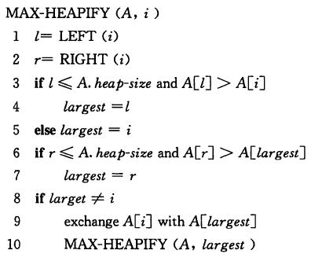
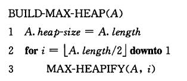

## 堆(heap)
### 特性  
- 结构性：用数组表示的完全二叉树
- 有序性：任一结点的关键字是其子树所有结点的最大值(或最小值)。即最大堆或最小堆

### java实现

#### 计算节点的父节点和左右孩子节点的索引

```java
public int left(int i){
    return (i+1)*2-1;
}
public int right(int i){
    return (i+1)*2;
}
public int parent(int i){
    if(i==0){
        return -1;
    }
    return (i-1)/2;
}
```

#### 维护堆的性质
对于两个大根堆，将一个元素作为这两个大根堆的父节点，构成一个新的堆，但是新堆可能不符合大根堆的性质。因此需要在这个节点和它的孩子节点中选出最大的，如果最大的节点就是这个节点，那么新堆符合大根堆的性质，否则，将这个节点与最大节点交换，但是交换后该节点在新的位置上的子树也可能不符合大根堆的性质，故需要递归进行，直至这个节点比孩子节点都大或者为子节点为止(这个过程也叫做元素下降)。  
算法导论伪代码：  
  
对应的java代码

```java
public void heapify(T[] a,int i,int heapLength){
    int l=left(i);
    int r=right(i);
    int largest=-1;
    if(l<heapLength&&a[i].compareTo(a[l])<0){
        largest=l;
    }else{
        largest=i;
    }
    if(r<heapLength&&a[largest].compareTo(a[r])<0){
        largest=r;
    }
    if(i!=largest){
        T temp=a[i];
        a[i]=a[largest];
        a[largest]=temp;

        heapify(a,largest,heapLength);
    }
}
```

#### 建堆  
将单个元素看做大根堆或者小根堆。假设数组中最后一个堆元素的下标为i，则数组中最后一个有孩子节点的元素就是j=parent(i)。于是从j到0，对每一元素调用heapify方法，堆就建好了。  
算法导论伪代码：  
  
对应java代码实现：

```java
public  void buildHeap(T[] a, int heapLength) {
    // 从后往前看，lengthParent - 1处的元素是第一个有孩子节点的节点
    int lengthParent = parent(heapLength - 1);
    // 最初，parent(length)之后的所有元素都是叶子结点；
    // 因为大于length/2处元素的孩子节点如果存在，那么
    // 它们的数组下标值必定大于length，这与事实不符；
    // 在数组中，孩子元素必定在父亲元素的后面，从后往前
    // 对元素调用maxHeapify，保证了元素的孩子都是
    // 大根堆
    for(int i = lengthParent; i >= 0; i--){
        heapify(a, i, heapLength);
    }
}
```

### Other ways
#### 建堆:将已经存在的N个元素按最大堆或最小堆的要求存放在一个一维数组中。
方法1、通过插入操作，将N个元素一个个相继插入到一个初始为空的堆中， 其时间代价最大为O(NlogN)。将插入元素放置堆中最后一个元素，通过比较插入元素与其父节点的值的大小，调整堆中元素。

```java_堆栈
//向最大堆中插入元素，用向下过滤实现，元素总个数加1
public void insert(String s){
    if(isFull()){
        System.out.println("堆已满！");
        return;
    }
    int temp=Integer.parseInt(s);
    int i=number;//指向插入元素后堆中的最后一个元素的位置
    for(;i>0&&Integer.parseInt(data[(i-1)/2])<temp;i=(i-1)/2){
        data[i]=data[(i-1)/2];//向下过滤
    }
    data[i]=temp+"";
    number++;
}
```

方法2、在线性时间复杂度下建立最大堆或者最小堆
- 将N个元素按输入顺序存入，先满足完全二叉树的结构特性
- 调整各结点位置，以满足最大堆或者最小堆的有序特性

```java
//将按顺序存入数组的元素，调整为最大堆，元素的总个数不变
public void adjust(int number){
    if(number<=1){
        //最大堆只有一个元素时不需要调节
        return;
    }
    int parent,child;
    parent=(number-1-1)/2;
    for(;parent>=0;parent--){
        int temp=Integer.parseInt(data[parent]);
        child=2*parent+1;
    }
}
```

## 栈(stack)
### 概念
又名堆栈，它是一种先进后出(FILO)的线性表。其限制是仅允许在表的一端进行插入和删除运算。这一端被称为栈顶，相对地，把另一端称为栈底。向一个栈插入新元素又称作进栈、入栈或压栈，它是把新元素放到栈顶元素的上面，使之成为新的栈顶元素；从一个栈删除元素又称作出栈或退栈，它是把栈顶元素删除掉，使其相邻的元素成为新的栈顶元素。  
### java实现
#### 采用数组的形式实现

```java
//进栈
public void push(Object obj){
    if(top==objs.length-1){
        System.out.println("栈已满");
    }
    objs[++top]=obj;
}
//出栈
public void pop(Object obj) throws Exception{
    if(top==-1){
        throw new Exception("Stack is empty!");
    }
    return objs[top--];
}
//检查容量是否足够，在原有数组基础上创建新数组
public void ensureCapacity(int top){
    int len=objs.length;
    if(top>len){
        Object[] temp=objs;
        objs=new Object[2*objs.length];
        System.arraycopy(temp,0,objs,0,temp.length);
    }
}
```

#### 采用链表中节点的方式实现

```java
/*
**链表实现
*/
public class LinkedList{
    private class Data{
        private Object obj;
        private Data next=null;
        Data(Object obj){
            this.obj=obj;
        }
    }

    private Data first=null;

    //链表插入
    public void insertFirst(Object obj){
        Data data=new Data(obj);
        data.next=first;
        first=data;
    }
    //链表删除
    public Object deleteFirst() throws Exception{
        if(first==null){
            throw new Exception("empty!");
        }
        Data temp=first;
        first=first.next;
        return temp.obj;
    }
}
/*
*栈的实现
*/
public class LinkedListStack{
    private LinkedList ll=new LinkedList();
    //进栈
    public void push(Object obj){
        ll.insertFirst(obj);
    }
    //出栈
    public Object pop() throws Exception{
        return ll.deleteFirst();
    }
}
```

## 队列
队列是一种先进先出的数据结构。
### java实现
#### 变量构造函数初始化

```java
private int maxSize; //定义队列长度
private int[] arrQueue;
private int rear; //尾指针
private int front; //头指针
private int empty; //元素个数
public Queue(int s){
    maxSize=s;
    arrQueue=new int[s];
    rear=-1;
    front=0;
    empty=0;
}
```

#### 实现插入方法

```java
public void insert(int m){
    if(rear==maxSize-1){  //处理循环
        rear=-1;
    }
    arrQueue[++rear]=m; //尾指针加1
    empty++;
}
```

#### 实现出栈的方法，即为取得队列的头元素

```java
public int remove(){
    int temp=arrQueue[front++];
    if(front==maxSize){
        front=0;
    }
    empty--;
    return temp;
}
```

#### 判断队列是否为空，或者为满

```java
public boolean isEmpty(){
    return (empty==0)
}
public boolean isFull(){
    return (empty==maxSize)
}
```

#### 返回队列长度

```java
public int qLong(){
    return empty;
}
```
