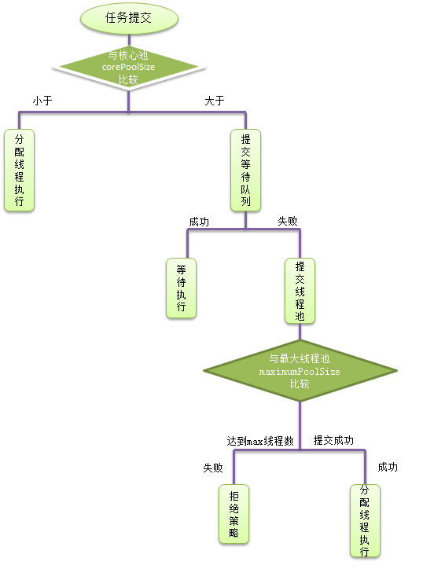

`前言`
> java成神之路基础篇之并发编程。
不积跬步无以至千里，不积小流无以成江海。
<!--more-->
**************

## Java 并发编程
### 并发与并行
- 什么是并发、什么是并行

> 并行：是两个任务同时运行，就是甲任务进行的同时，乙任务也在进行。(需要多核CPU)
并发：指两个任务都请求运行，而处理器只能按受一个任务，就把这两个任务安排轮流进行，由于时间间隔较短，使人感觉两个任务都在运行。（表面看是CPU在同时执行多个任务，其实实际上是因为CPU瞬间切换到其他任务的速度特别快，在不同的任务之间一直在不停的切换，给不同的任务分配了不同的时间。）

- 并发与并行的不同解释
  - 并行是指两个或者多个事件在同一时刻发生；而并发是指两个或多个事件在同一时间间隔发生。
  - 并行是在不同实体上的多个事件，并发是在同一实体上的多个事件。
  - 并发在一台处理器上“同时”处理多个任务，并行在多台处理器上同时处理多个任务

### 什么是线程，与进程的区别
#### 线程与进程的区别
- 定义

<table><td bgcolor=palegreen>
进程:具有一定独立功能的程序关于某个数据集合上的一次运行活动,进程是系统进行资源分配和调度的一个独立单位.
</table>
<table><tr><td bgcolor=pink>
线程:进程的一个实体,是CPU调度和分派的基本单位,它是比进程更小的能独立运行的基本单位.线程自己基本上不拥有系统资源,只拥有一点在运行中必不可少的资源(如程序计数器,一组寄存器和栈),但是它可与同属一个进程的其他的线程共享进程所拥有的全部资源.
</td></tr></table>

- 关系

一个线程可以创建和撤销另一个线程;同一个进程中的多个线程之间可以并发执行.
相对进程而言，线程是一个更加接近于执行体的概念，它可以与同进程中的其他线程共享数据，但拥有自己的栈空间，拥有独立的执行序列。

- 区别

进程和线程的主要差别在于它们是不同的操作系统资源管理方式。
进程有独立的地址空间，一个进程崩溃后，在保护模式下不会对其它进程产生影响，而线程只是一个进程中的不同执行路径。线程有自己的堆栈和局部变量，但线程之间没有单独的地址空间，一个线程死掉就等于整个进程死掉，所以多进程的程序要比多线程的程序健壮，但在进程切换时，耗费资源较大，效率要差一些。但对于一些要求同时进行并且又要共享某些变量的并发操作，只能用线程，不能用进程。
<table><td bgcolor=palegreen>

1) 简而言之,一个程序至少有一个进程,一个进程至少有一个线程。
2) 线程的划分尺度小于进程，使得多线程程序的并发性高。
3) 另外，进程在执行过程中拥有独立的内存单元，而多个线程共享内存，从而极大地提高了程序的运行效率。
4) 线程在执行过程中与进程还是有区别的。每个独立的线程有一个程序运行的入口、顺序执行序列和程序的出口。但是线程不能够独立执行，必须依存在应用程序中，由应用程序提供多个线程执行控制。
5) 从逻辑角度来看，多线程的意义在于一个应用程序中，有多个执行部分可以同时执行。但操作系统并没有将多个线程看做多个独立的应用，来实现进程的调度和管理以及资源分配。这就是进程和线程的重要区别。
</table>

- 优缺点
线程和进程在使用上各有优缺点：
  - 线程执行开销小，但不利于资源的管理和保护；而进程正相反。
  - 同时，线程适合于在SMP机器上运行，而进程则可以跨机器迁移。

#### 线程的实现
- 继承Thread类
- 实现Runnable接口
- 实现Callable接口
- 线程池
```java
public class Thread_Test {
	public static void main(String[] args){
//		Thread_task1 mt = new Thread_task1();
//		mt.start();

//		Thread thread = new Thread(new Thread_task2());
//		thread.start();

      Callable<String> callable = new Thread_task4();
      FutureTask<String> futureTask = new FutureTask<>(callable);
      Thread t = new Thread(futureTask);
      t.start();
      System.out.println(futureTask.get());
	}
}

// 实现线程1 - 继承Thread
class Thread_task1 extends Thread{

	@Override
	public void run(){
		for(int i = 0; i < 20; i++){
			System.out.println(Thread.currentThread() + "-->" + i);
		}
	}

}
// 实现线程2 - 实现runnable接口
class Thread_task2 implements Runnable{
	@Override
	public void run(){
		for(int i = 0; i < 20; i++){
			System.out.println(Thread.currentThread() + "-->" + i);
		}
	}
}
// 实现线程3 - 实现callable接口
class Thread_task4 implements Callable<String>{
	@Override
	public String call() throws Exception{
		for(int i = 0; i < 5; i++){
			System.out.println(Thread.currentThread() + "-->" + i);
		}
		return "thread out";
	}
}
```
`区别：`
- Thread类本身也是实现了Runnable接口，因此也是实现了Runnable接口中的run方法。
- 当使用继承Thread类去实现线程时，我们需要重写run方法，因为Thread类中的run方法本身什么事情都不干。
- 当使用实现Runnable接口去实现线程时，我们需要重写run方法，然后使用new Thread(Runnable)这种方式来生成线程对象，这个时候线程对象中的run方法才会去执行我们自己实现的Runnable接口中的run方法。

#### 线程的状态
Java中的线程的生命周期大体可分为5种状态。
<table><td bgcolor=palegreen>

- 新建(NEW)：新创建了一个线程对象。
- 可运行(RUNNABLE)：线程对象创建后，其他线程(比如main线程）调用了该对象的start()方法。该状态的线程位于可运行线程池中，等待被线程调度选中，获取cpu 的使用权 。
- 运行(RUNNING)：可运行状态(runnable)的线程获得了cpu 时间片（timeslice） ，执行程序代码。
- 阻塞(BLOCKED)：阻塞状态是指线程因为某种原因放弃了cpu 使用权，也即让出了cpu timeslice，暂时停止运行。直到线程进入可运行(runnable)状态，才有机会再次获得cpu timeslice 转到运行(running)状态。阻塞的情况分三种：
  - 等待阻塞：运行(running)的线程执行o.wait()方法，JVM会把该线程放入等待队列(waitting queue)中。
  - 同步阻塞：运行(running)的线程在获取对象的同步锁时，若该同步锁被别的线程占用，则JVM会把该线程放入锁池(lock pool)中。
  - 其他阻塞：运行(running)的线程执行Thread.sleep(long ms)或t.join()方法，或者发出了I/O请求时，JVM会把该线程置为阻塞状态。当sleep()状态超时、join()等待线程终止或者超时、或者I/O处理完毕时，线程重新转入可运行(runnable)状态。
- 死亡(DEAD)：线程run()、main() 方法执行结束，或者因异常退出了run()方法，则该线程结束生命周期。死亡的线程不可再次复生。
</table>


#### 线程的优先级
java 中的线程优先级的范围是1～10，默认的优先级是5。“高优先级线程”会优先于“低优先级线程”执行。
java 中有两种线程：用户线程和守护线程。可以通过isDaemon()方法来区别它们：如果返回false，则说明该线程是“用户线程”；否则就是“守护线程”。
用户线程一般用户执行用户级任务，而守护线程也就是“后台线程”，一般用来执行后台任务。

每个线程都有一个优先级。“高优先级线程”会优先于“低优先级线程”执行。每个线程都可以被标记为一个守护进程或非守护进程。在一些运行的主线程中创建新的子线程时，子线程的优先级被设置为等于“创建它的主线程的优先级”，当且仅当“创建它的主线程是守护线程”时“子线程才会是守护线程”。

当Java虚拟机启动时，通常有一个单一的非守护线程（该线程通过是通过main()方法启动）。JVM会一直运行直到下面的任意一个条件发生，JVM就会终止运行：
- 调用了exit()方法，并且exit()有权限被正常执行。
- 所有的“非守护线程”都死了(即JVM中仅仅只有“守护线程”)。

```java
public class Thread_Test {
	public static void main(String[] args){
		Thread_task3 t1 = new Thread_task3("t1");
		Thread_task3 t2 = new Thread_task3("t2");
		t1.setPriority(1);
		t2.setPriority(10);
		t1.start();
		t2.start();
	}
}
// 实现设置线程优先级
class Thread_task3 extends Thread{
	public Thread_task3(String name){
		super(name);
	}
	@Override
	public void run(){
		for(int i = 0; i < 5; i++){
			System.out.println(Thread.currentThread().getName() +
					"-->" + i + "(" + Thread.currentThread().getPriority()
					+ ")" + Thread.currentThread().isDaemon());
		}
	}
}
/*
t2-->0(10)false
t1-->0(1)false
t2-->1(10)false
t1-->1(1)false
t2-->2(10)false
t2-->3(10)false
t2-->4(10)false
t1-->2(1)false
t1-->3(1)false
t1-->4(1)false
*/
```
`设置优先级并非就一定是优先级的线程先执行，只是优先级较高的线程有较大的几率先执行。`
`总结：`
- 用户线程和守护线程的区别

<table><tr><td bgcolor=palegreen>
用户线程和守护线程都是线程，区别是Java虚拟机在所有用户线程dead后，程序就会结束。当程序中只有主线程和守护线程(即只有一个用户线程和守护线程)时，主线程结束后，守护线程也随即结束；当程序中包括主线程、其他用户线程和守护线程时，即使主线程结束，只要程序中还有用户线程在执行，则守护线程就不会结束。
</table>

- 用户线程和守护线程的适用场景

<table><tr><td bgcolor=pink>
由两者的区别及dead时间点可知，守护线程不适合用于输入输出或计算等操作，因为用户线程执行完毕，程序就dead了，适用于辅助用户线程的场景，如JVM的垃圾回收，内存管理都是守护线程，还有就是在做数据库应用的时候，使用的数据库连接池，连接池本身也包含着很多后台线程，监听连接个数、超时时间、状态等。
</table>

- 创建守护线程

<table><tr><td bgcolor=palegreen>

调用线程对象的方法setDaemon(true)，设置线程为守护线程。
1)thread.setDaemon(true)必须在thread.start()之前设置。
2)在Daemon线程中产生的新线程也是Daemon的。
3)不是所有的应用都可以分配给Daemon线程来进行服务，比如读写操作或者计算逻辑。因为Daemon Thread还没来得及进行操作，虚拟机可能已经退出了。
</table>

- Java守护线程和Linux守护进程

<table><tr><td bgcolor=pink>
两者不是一个概念。Linux守护进程是后台服务进程，没有控制台。
在Windows中，你可以运行javaw来达到释放控制台的目的，在Unix下你加&在命令的最后就行了。所以守护进程并非一定需要的。
</table>

#### 线程调度
线程调度是指系统为线程分配处理器使用权的过程，主要调度方式分两种，分别是协同式线程调度和抢占式线程调度。
- 协同式线程调度

<table><tr><td bgcolor=palegreen>
线程执行时间由线程本身来控制，线程把自己的工作执行完之后，要主动通知系统切换到另外一个线程上。最大好处是实现简单，且切换操作对线程自己是可知的，没啥线程同步问题。坏处是线程执行时间不可控制，如果一个线程有问题，可能一直阻塞在那里。
</table>

- 抢占式调度

<table><tr><td bgcolor=pink>
每个线程将由系统来分配执行时间，线程的切换不由线程本身来决定（Java中，Thread.yield()可以让出执行时间，但无法获取执行时间）。线程执行时间系统可控，也不会有一个线程导致整个进程阻塞。
</table>

Java线程调度就是抢占式调度。 希望系统能给某些线程多分配一些时间，给一些线程少分配一些时间，可以通过设置线程优先级来完成。Java语言一共10个级别的线程优先级（Thread.MIN_PRIORITY至Thread.MAX_PRIORITY），在两线程同时处于ready状态时，优先级越高的线程越容易被系统选择执行。但优先级并不是很靠谱，因为Java线程是通过映射到系统的原生线程上来实现的，所以线程调度最终还是取决于操作系统。

### 线程池
多线程的异步执行方式，虽然能够最大限度发挥多核计算机的计算能力，但是如果不加控制，反而会对系统造成负担。线程本身也要占用内存空间，大量的线程会占用内存资源并且可能会导致Out of Memory。即便没有这样的情况，大量的线程回收也会给GC带来很大的压力。
为了避免重复的创建线程，线程池的出现可以让线程进行复用。通俗点讲，当有工作来，就会向线程池拿一个线程，当工作完成后，并不是直接关闭线程，而是将这个线程归还给线程池供其他任务使用。
#### 线程池的使用
Java通过Executors提供四种线程池，分别为：
<table><tr><td bgcolor=palegreen>

- newCachedThreadPool创建一个可缓存线程池，如果线程池长度超过处理需要，可灵活回收空闲线程，若无可回收，则新建线程。
- newFixedThreadPool 创建一个定长线程池，可控制线程最大并发数，超出的线程会在队列中等待。
- newScheduledThreadPool 创建一个定长线程池，支持定时及周期性任务执行。
- newSingleThreadExecutor 创建一个单线程化的线程池，它只会用唯一的工作线程来执行任务，保证所有任务按照指定顺序(FIFO, LIFO, 优先级)执行
</table>
```java
// 实现线程池1 - newCachedThreadPool
		ExecutorService cachedThreadPool = Executors.newCachedThreadPool();
		for(int i = 0; i < 10; i++){
			final int index = i; // final 修饰基本类型，值不能改变
			Thread.sleep(index * 1000);
			cachedThreadPool.execute(new Runnable() {
				@Override
				public void run() {
					System.out.println(Thread.currentThread() + "-->" + index);
				}
			});
		}
/*
线程池为无限大，当执行第二个任务时第一个任务已经完成，会复用执行第一个任务的线程，而不用每次新建线程。
output(sleep):
Thread[pool-1-thread-1,5,main]-->0
Thread[pool-1-thread-1,5,main]-->1
Thread[pool-1-thread-1,5,main]-->2
Thread[pool-1-thread-1,5,main]-->3
Thread[pool-1-thread-1,5,main]-->4
Thread[pool-1-thread-1,5,main]-->5
Thread[pool-1-thread-1,5,main]-->6
Thread[pool-1-thread-1,5,main]-->7
Thread[pool-1-thread-1,5,main]-->8
Thread[pool-1-thread-1,5,main]-->9
output(no sleep):
Thread[pool-1-thread-5,5,main]-->4
Thread[pool-1-thread-2,5,main]-->1
Thread[pool-1-thread-4,5,main]-->3
Thread[pool-1-thread-3,5,main]-->2
Thread[pool-1-thread-1,5,main]-->0
Thread[pool-1-thread-6,5,main]-->5
Thread[pool-1-thread-7,5,main]-->6
Thread[pool-1-thread-9,5,main]-->8
Thread[pool-1-thread-8,5,main]-->7
Thread[pool-1-thread-10,5,main]-->9
*/

// 实现线程池2 - newFixedThreadPool
		ExecutorService fixedThreadPool = Executors.newFixedThreadPool(3);
		for(int i = 0; i < 10; i++){
			final int index = i; // final 修饰基本类型，值不能改变
			//Thread.sleep(index * 1000);
			fixedThreadPool.execute(new Runnable() {
				@Override
				public void run() {
					System.out.println(Thread.currentThread() + "-->" + index);
					try {
						Thread.sleep(2000);
					} catch (InterruptedException e) {
						// TODO Auto-generated catch block
						e.printStackTrace();
					}
				}
			});
		}
/*
output: 因为线程池大小为3，每个任务输出index后sleep 2秒，所以每两秒打印3个数字，同时线程复用
Thread[pool-1-thread-1,5,main]-->0
Thread[pool-1-thread-3,5,main]-->2
Thread[pool-1-thread-2,5,main]-->1
Thread[pool-1-thread-1,5,main]-->3
Thread[pool-1-thread-3,5,main]-->4
Thread[pool-1-thread-2,5,main]-->5
Thread[pool-1-thread-1,5,main]-->6
Thread[pool-1-thread-2,5,main]-->8
Thread[pool-1-thread-3,5,main]-->7
Thread[pool-1-thread-1,5,main]-->9
*/

// 实现线程池3 - newScheduledThreadPool
		ScheduledExecutorService scheduledThreadPool = Executors.newScheduledThreadPool(5);
		for(int i = 0; i < 10; i++){
			final int index = i; // final 修饰基本类型，值不能改变
			//Thread.sleep(index * 1000);
			scheduledThreadPool.schedule(new Runnable() {
				@Override
				public void run() {
					System.out.println(Thread.currentThread() + "-->" + index);
					try {
						Thread.sleep(2000);
					} catch (InterruptedException e) {
						// TODO Auto-generated catch block
						e.printStackTrace();
					}
				}
			}, 3, TimeUnit.SECONDS);
		}
/*
output: 线程池加载线程后，延迟3秒执行
Thread[pool-1-thread-5,5,main]-->4
Thread[pool-1-thread-1,5,main]-->0
Thread[pool-1-thread-2,5,main]-->1
Thread[pool-1-thread-3,5,main]-->2
Thread[pool-1-thread-4,5,main]-->3
Thread[pool-1-thread-5,5,main]-->5
Thread[pool-1-thread-1,5,main]-->6
Thread[pool-1-thread-3,5,main]-->8
Thread[pool-1-thread-4,5,main]-->9
Thread[pool-1-thread-2,5,main]-->7
*/

// 实现线程池4 - newSingleThreadExecutor
		ExecutorService singleThreadPool = Executors.newSingleThreadExecutor();
		for(int i = 0; i < 10; i++){
			final int index = i; // final 修饰基本类型，值不能改变
			//Thread.sleep(index * 1000);
			singleThreadPool.execute(new Runnable() {
				@Override
				public void run() {
					System.out.println(Thread.currentThread() + "-->" + index);
					try {
						Thread.sleep(2000);
					} catch (InterruptedException e) {
						// TODO Auto-generated catch block
						e.printStackTrace();
					}
				}
			});
		}
/*
output： 创建一个单线程化的线程池，它只会用唯一的工作线程来执行任务，保证所有任务按照指定顺序(FIFO, LIFO, 优先级)执行
Thread[pool-1-thread-1,5,main]-->0
Thread[pool-1-thread-1,5,main]-->1
Thread[pool-1-thread-1,5,main]-->2
Thread[pool-1-thread-1,5,main]-->3
Thread[pool-1-thread-1,5,main]-->4
Thread[pool-1-thread-1,5,main]-->5
Thread[pool-1-thread-1,5,main]-->6
Thread[pool-1-thread-1,5,main]-->7
Thread[pool-1-thread-1,5,main]-->8
Thread[pool-1-thread-1,5,main]-->9
*/
```

#### 线程池原理
- 首先先清楚一个线程池执行器里面的具体构造(如ThreadPoolExecutor)：
  - corePoolSize，线程池核心池大小。即线程池可同时并发运行的最大线程数。当执行线程池的prestartAllCoreThreads()方法，线程池会提前创建并启动所有核心线程。
  - 线程池允许的最大线程数。其大小必定大于等于核心池大小
  - keepAliveTime。表示线程没有任务时最多保持多久后停止
  - 堵塞队列。用于存储等待执行的任务，当线程池中的线程数大于核心池大小时，线程会进入堵塞队列进行堵塞等待
  - 线程工厂。用于创建线程
  - handle。表示当拒绝处理任务时的策略
    - AbortPolicy:丢弃任务并抛出RejectedExecutionException
    - CallerRunsPolicy：只要线程池未关闭，该策略直接在调用者线程中，运行当前被丢弃的任务。显然这样做不会真的丢弃任务，但是，任务提交线程的性能极有可能会急剧下降。
    - DiscardOldestPolicy：丢弃队列中最老的一个请求，也就是即将被执行的一个任务，并尝试再次提交当前任务。
    - DiscardPolicy：丢弃任务，不做任何处理
- 线程池如何处理任务
  - 如果当前线程池中的线程数目小于corePoolSize，则每来一个任务，就会创建一个线程去执行这个任务；
  - 如果当前线程池中的线程数目>=corePoolSize，则每来一个任务，会尝试将其添加到任务缓存队列当中，若添加成功，则该任务会等待空闲线程将其取出去执行；若添加失败（一般来说是任务缓存队列已满），则会尝试创建新的线程去执行这个任务；如果当前线程池中的线程数目达到maximumPoolSize，则会采取任务拒绝策略进行处理；
  - 如果线程池中的线程数量大于corePoolSize时，如果某线程空闲时间超过keepAliveTime，线程将被终止，直至线程池中的线程数目不大于corePoolSize；如果允许为核心池中的线程设置存活时间，那么核心池中的线程空闲时间超过keepAliveTime，线程也会被终止。
- 线程池的关闭
  - shutdown()。不会立即终止线程池，而是要等所有任务缓存队列中的任务都执行完后才终止，但再也不会接受新的任务
  - shutdownNow()。立即终止线程池，并尝试打断正在执行的任务，并且清空任务缓存队列，返回尚未执行的任务
- 线程池的执行(execute())


ExecutorService中的submit(),invokeAll(),invokeAny()都是调用的execute方法，所以execute是核心中的核心。execute(Runnable command)源码：
```java
public void execute(Runnable command) {
        if (command == null)
            throw new NullPointerException();
　　　　// 1.当前线程数量小于corePoolSize，则创建并启动线程。
        int c = ctl.get();
        if (workerCountOf(c) < corePoolSize) {
            if (addWorker(command, true))
　　　　　　　　// 成功，则返回
private boolean addWorker(Runnable firstTask, boolean core) {
        retry:
　　　　 // 外层循环，用于判断线程池状态
        for (;;) {
            int c = ctl.get();
            int rs = runStateOf(c);
            // Check if queue empty only if necessary.
            if (rs >= SHUTDOWN &&
                ! (rs == SHUTDOWN &&
                   firstTask == null &&
                   ! workQueue.isEmpty()))
                return false;
　　　　　　 // 内层的循环，任务是将worker数量加1
            for (;;) {
                int wc = workerCountOf(c);
                if (wc >= CAPACITY ||
                    wc >= (core ? corePoolSize : maximumPoolSize))
                    return false;
                if (compareAndIncrementWorkerCount(c))
                    break retry;
                c = ctl.get();  // Re-read ctl
                if (runStateOf(c) != rs)
                    continue retry;
                // else CAS failed due to workerCount change; retry inner loop
            }
        }
　　　　// worker加1后，接下来将woker添加到HashSet<Worker>中，并启动worker
        boolean workerStarted = false;
        boolean workerAdded = false;
        Worker w = null;
        try {
            final ReentrantLock mainLock = this.mainLock;
            w = new Worker(firstTask);
            final Thread t = w.thread;
            if (t != null) {
                mainLock.lock();
                try {
                    // Recheck while holding lock.
                    // Back out on ThreadFactory failure or if
                    // shut down before lock acquired.
                    int c = ctl.get();
                    int rs = runStateOf(c);

                    if (rs < SHUTDOWN ||
                        (rs == SHUTDOWN && firstTask == null)) {
                        if (t.isAlive()) // precheck that t is startable
                            throw new IllegalThreadStateException();
                        workers.add(w);
                        int s = workers.size();
                        if (s > largestPoolSize)
                            largestPoolSize = s;
                        workerAdded = true;
                    }
                } finally {
                    mainLock.unlock();
                }
　　　　　　　　　// 如果往HashSet<Worker>添加成功，则启动该线程
                if (workerAdded) {
                    t.start();
                    workerStarted = true;
                }
            }
        } finally {
            if (! workerStarted)
                addWorkerFailed(w);
        }
        return workerStarted;
    }
```

执行流程：
<table><tr><td bgcolor=palegreen>

1、判断线程池当前是否为可以添加worker线程的状态，可以则继续下一步，不可以return false：
    A、线程池状态>shutdown，可能为stop、tidying、terminated，不能添加worker线程
    B、线程池状态=shutdown，firstTask不为空，不能添加worker线程，因为shutdown状态的线程池不接收新任务
      C、线程池状态=shutdown，firstTask=null，workQueue为空，不能添加worker线程，因为firstTask为空是为了添加一个没有任务的线程再从workQueue获取task，而workQueue为空，说明添加无任务线程已经没有意义
2、线程池当前线程数量是否超过上限（corePoolSize 或 maximumPoolSize），超过了return false，没超过则对workerCount+1，继续下一步
3、在线程池的ReentrantLock保证下，向Workers  Set中添加新创建的worker实例，添加完成后解锁，并启动worker线程，如果这一切都成功了，return  true，如果添加worker入Set失败或启动失败，调用addWorkerFailed()逻辑
</table>

#### 为什么不允许使用 Executors 创建线程池
线程池不允许使用Executors去创建，而是通过ThreadPoolExecutor的方式，这样的处理方式让写的人更加明确线程池的运行规则，规避资源耗尽的风险。
Executors各个方法的弊端：
- newFixedThreadPool和newSingleThreadExecutor:
主要问题是堆积的请求处理队列可能会耗费非常大的内存，甚至OOM。这两个线程池是线程池大小是固定。SingleThreadPool是单个线程的线程池。FixedThreadPool在应对平稳流量的时候，能有效的处理，缺点就是可能无法应付突发性大流量。
- newCachedThreadPool和newScheduledThreadPool:
主要问题是线程数最大数是Integer.MAX_VALUE，可能会创建数量非常多的线程，甚至OOM。

使用ThreadPoolExecutor创建线程池。
```java
//构造一个线程池
ThreadPoolExecutor threadPool = new ThreadPoolExecutor(
							1,1,10,TimeUnit.SECONDS,
							new ArrayBlockingQueue<Runnable>(1),
							new ThreadPoolExecutor.DiscardOldestPolicy());
threadPool.execute(() -> {
		            try {
		            		handlerMappingSummaryJobRunnable.run();//执行 方法
		            } catch (Exception e) {
		            	e.printStackTrace();
		            }finally{
	            	threadPool.shutdown();// 关闭线程池
		            }
	            });

//public ThreadPoolExecutor(
//  				int corePoolSize, - 线程池核心池的大小。
//                              int maximumPoolSize, - 线程池的最大线程数。
//                              long keepAliveTime, - 当线程数大于核心时，此为终止前多余的空闲线程等待新任务的最长时间。
//                              TimeUnit unit, - keepAliveTime 的时间单位。
//                              BlockingQueue<Runnable> workQueue, - 用来储存等待执行任务的队列。
//                              ThreadFactory threadFactory, - 线程工厂。
//                              RejectedExecutionHandler handler)  - 拒绝策略。

```
#### 自己设计线程池

### 线程安全
#### 死锁
- 定义

多线程以及多进程改善了系统资源的利用率并提高了系统 的处理能力。然而，并发执行也带来了新的问题——死锁。所谓死锁是指多个线程因竞争资源而造成的一种僵局（互相等待），若无外力作用，这些进程都将无法向前推进。所谓死锁是指两个或两个以上的线程在执行过程中，因争夺资源而造成的一种互相等待的现象，若无外力作用，它们都将无法推进下去。  
`实例：`某计算机系统中只有一台打印机和一台输入 设备，进程P1正占用输入设备，同时又提出使用打印机的请求，但此时打印机正被进程P2 所占用，而P2在未释放打印机之前，又提出请求使用正被P1占用着的输入设备。这样两个进程相互无休止地等待下去，均无法继续执行，此时两个进程陷入死锁状态。
`简单死锁实例：`

- 死锁产生原因
  - 系统资源的竞争
  - 进程顺序推进非法
  - 死锁产生的必要条件(满足以下条件死锁才可能发生)
    - 互斥条件：资源是互斥的，不是共享的
    - 不剥夺条件：资源不能强行被剥夺
    - 循环等待条件：存在进程资源的循环等待环路
    - 请求和保持条件：“吃着碗里的，看着锅里的”
#### 死锁如何排查
#### 线程安全和内存模型的关系

### 锁
- CAS
- 乐观锁与悲观锁
- 数据库相关锁机制
- 分布式锁
- 偏向锁
- 轻量级锁
- 重量级锁
- monitor
- 锁优化
- 锁消除
- 锁粗化
- 自旋锁
- 可重入锁
- 阻塞锁
- 死锁


### synchronized
- synchronized 是如何实现的？
- synchronized 和 lock 之间关系
- 不使用 synchronized 如何实现一个线程安全的单例
- synchronized 和原子性、可见性和有序性之间的关系

### volatile
- happens-before
- 内存屏障
- 编译器指令重排和 CPU 指令重
- volatile 的实现原理
- volatile 和原子性
- 可见性和有序性之间的关系
- 有了 symchronized 为什么还需要 volatile

### sleep 和 wait
### wait 和 notify
### notify 和 notifyAll
### ThreadLocal
### 写一个死锁的程序
### 写代码来解决生产者消费者问题
### 并方包
- Thread
- Runnable
- Callable
- ReentrantLock
- ReentrantReadWriteLock
- Atomic*
- Semaphore
- CountDownLatch
- ConcurrentHashMap
- Executors
