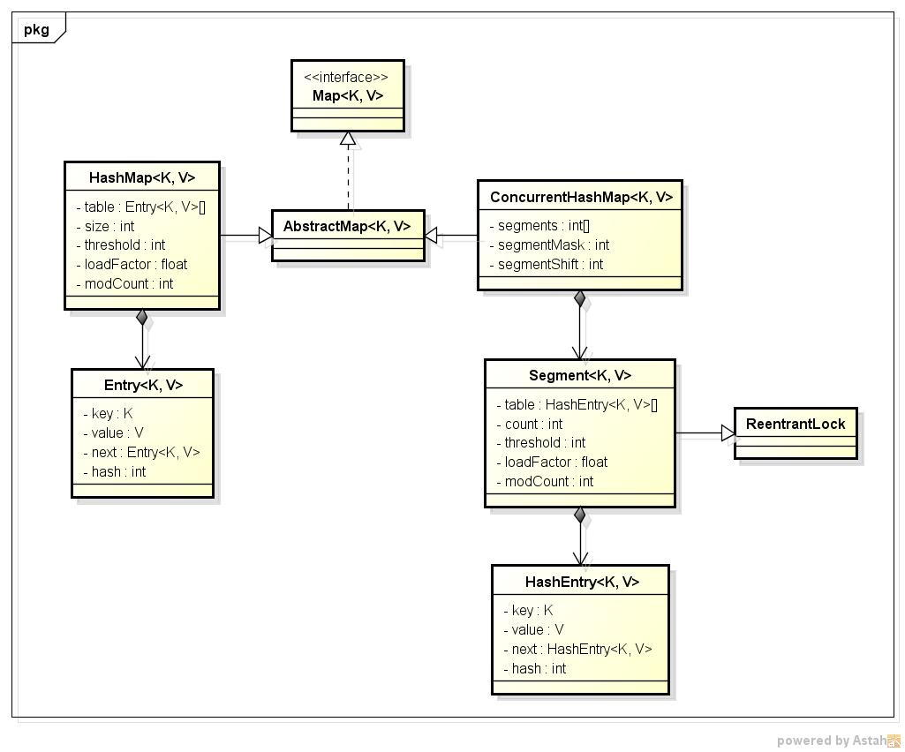

`前言`
> java成神之路基础篇之基础知识。
不积跬步无以至千里，不积小流无以成江海。
<!--more-->
**************

## 基本数据类型
### 8种基本数据类型：整型、浮点型、布尔型、字符型
- 整型(4种)
  - byte：8位
  - short: 16位
  - int: 32位
  - long: 64位
- 浮点型(2种)
  - float: 32位。直接赋值时必须在数字后加上f或F
  - double：64位。赋值时可以加d或D也可以不加
- 布尔型(1种)
  - boolean：true,false
- 字符型(1种)
  - char：16位。本质是数，故是整数类型，可以用`+`连接，内部是先转换成数字相加，再转回char

### 什么是浮点型？什么是单精度和双精度？为什么不能用浮点型表示金额？
- 浮点类型，即带小数部分的数据。有两种常用数据类型：float类型，double类型。
  - 表示形式有十进制数形式、科学计数法形式（例如，5.12e2（5.12*10^2）,5.12E2（5.12*10^2）,e或E代表指数为10）。
  - 三种特殊的浮点数值：正无穷大（正数除以0，POSITIVE_INFINITY表示）、负无穷大（负数除以0，NEGATIVE_INFINITY表示）、非数（0.0除以0.0，或一个负数开方得到一个非数，NaN表示，NaN不与任何数值相等，包括NaN）。
- 单精度和双精度
  - 单精度(float)：1位符号，8位指数，23位小数。

精度主要取决于尾数部分的位数，float为23位，除去全部为0的情况以外，最小为2的-23次方，约等于1.19乘以10的-7次方，所以float小数部分只能精确到后面6位，加上小数点前的一位，即有效数字为7位
  - 双精度(double)：1位符号，11位指数，52位小数

double 尾数部分52位，最小为2的-52次方，约为2.22乘以10的-16次方，所以精确到小数点后15位，有效位数为16位
- 不能用浮点型表示金额-`精度丢失`
`在程序里写的10进制小数，计算机内部无法用二进制的小数来精确的表达。原因在于：`
由于浮点数在计算机内部的表达方式如上图：符号位+阶码+尾数，因此对于二进制小数，小数点右边能表达的值是 1/2, 1/4, 1/8, 1/16, 1/32, 1/64, 1/128 … 1/(2^n），因此并不能够正确表示10进制的小数值。
`实例：`
可以这样查看一下一个float的内部表示（以0.09f为例）： 
`Float.floatToRawIntBits(0.09f)`
你将会得到：1035489772， 这是10进制的， 转化成二进制， 在前面加几个0补足 32位就是：
`0 01111011 01110000101000111101100`
你可以看到它分成了3段：第一段代表了符号(s) : 0 正数；第二段是阶码(e)：01111011，对应的10进制是123；第三段是尾数(M)。
你看到了尾数和阶码，就会明白这其实是所谓的科学计数法: (-1)^s * M * 2^e
对于阶码e，一共有8位，这是个有符号数， 特别是按照IEEE754规范， 如果不是0或者255， 那就需要减去一个叫偏置量的值，对于float 是127。所以 E = e - 127 = 123-127 = -4
对于尾数M ，如果阶码不是0或者255， 他其实隐藏了一个小数点左边的一个1（节省空间，充分压榨每一个bit啊）。即 M = 1.01110000101000111101100
现在写出来就是: 
1.01110000101000111101100 * 2^-4 
=0.000101110000101000111101100 
= 1/16 + 1/64 + 1/128+ 1/256 + …. 
= 0.0900000035762786865234375
`结论：`这就是0.09的内部表示， 很明显他比0.09更大一些， 是不精确的！

## 自动拆装箱
### 什么是包装类型、什么是基本类型、什么是自动拆装箱
> 在实际程序使用中，程序界面上用户输入的数据都是以字符串类型进行存储的。而程序开发中，我们需要把字符串数据，根据需求转换成指定的基本数据类型，如年龄需要转换成int类型，考试成绩需要转换成double类型等。那么，想实现字符串与基本数据之间转换怎么办呢？

Java中提供了相应的对象来解决该问题，`基本数据类型对象包装类`：java将基本数据类型值封装成了对象。封装成对象有什么好处？可以提供更多的操作基本数值的功能。
8种基本类型对应的包装类如下：

其中需要注意int对应的是Integer，char对应的Character，其他6个都是基本类型首字母大写即可。
`基本数据类型对象包装类特点：用于在基本数据和字符串之间进行转换:`
<table><td bgcolor=palegreen>
将字符串转成基本类型：
</table>

```java
System.out.println(Integer.parseInt("123") + 2);
//打印结果为 125
```
  - 将基本数值转成字符串有3种方式：
    - 基本类型直接与`""`相连接即可；`34+""`
    -  调用String的valueOf方法；String.valueOf(34)；

    - 调用包装类中的toString方法；Integer.toString(34)；

- 基本类型和对象转换
使用int类型与Integer对象转换进行演示，其他基本类型转换方式相同。
  - 基本数值---->包装对象

```java
  Integer i = new Integer(4);//使用构造函数函数
  Integer ii = new Integer("4");//构造函数中可以传递一个数字字符串
```

```java
  Integer iii = Integer.valueOf(4);//使用包装类中的valueOf方法
  Integer iiii = Integer.valueOf("4");//使用包装类中的valueOf方法
```
  - 包装对象---->基本数值
  
```java
  int num = i.intValue();
```
- 自动装箱拆箱
在需要的情况下，基本类型与包装类型可以通用。有些时候我们必须使用引用数据类型时，可以传入基本数据类型。
> 比如：基本类型可以使用运算符直接进行计算，但是引用类型不可以。而基本类型包装类作为引用类型的一种却可以计算，原因在于，Java”偷偷地”自动地进行了对象向基本数据类型的转换。

相对应的，引用数据类型变量的值必须是new出来的内存空间地址值，而我们可以将一个基本类型的值赋值给一个基本类型包装类的引用。原因同样在于Java又”偷偷地”自动地进行了基本数据类型向对象的转换。
>1. 自动拆箱：对象转成基本数值
>2. 自动装箱：基本数值转成对象

```java
Integer i = 4;//自动装箱。相当于Integer i = Integer.valueOf(4);
i = i + 5;//等号右边：将i对象转成基本数值(自动拆箱) i.intValue() + 5; 加法运算完成后，再次装箱，把基本数值转成对象。
```
> 3. 自动装箱(byte常量池)细节的演示:
当数值在byte范围之内时，进行自动装箱，不会新创建对象空间而是使用原来已有的空间。

```java
Integer a = new Integer(3);
Integer b = new Integer(3);
System.out.println(a==b);//false
System.out.println(a.equals(b));//true

System.out.println("---------------------");
Integer x = 127;
Integer y = 127;
//在jdk1.5自动装箱时，如果数值在byte范围之内，不会新创建对象空间而是使用原来已有的空间。
System.out.println(x==y); //true
System.out.println(x.equals(y)); //true
```

### Integer 的缓存机制
`实例：`
```java
public class JavaIntegerCache {
    public static void main(String... strings) {
        Integer integer1 = 3;
        Integer integer2 = 3;
        if (integer1 == integer2)
            System.out.println("integer1 == integer2");
        else
            System.out.println("integer1 != integer2");
        Integer integer3 = 300;
        Integer integer4 = 300;
        if (integer3 == integer4)
            System.out.println("integer3 == integer4");
        else
            System.out.println("integer3 != integer4");
    }
}
//output
integer1 == integer2
integer3 != integer4
```
在Java中，== 比较的是对象引用，而equals比较的是值。但是由于Integer的缓存机制，通过使用相同的对象引用实现了缓存和重用。这种Integer缓存策略仅在自动装箱(autoboxing)(相当于调用valueOf方法)的时候有用，使用构造器创建的 Integer 对象不能被缓存。上面的规则适用于整数区间 -128 到 +127。
```java
public static Integer valueOf(int i) {
       if (i &amp;gt;= IntegerCache.low &amp;amp;&amp;amp; i &amp;lt;= IntegerCache.high)
           return IntegerCache.cache[i + (-IntegerCache.low)];
       return new Integer(i);
   }
```
在创建新的Integer对象之前会先在 IntegerCache.cache 中查找。有一个专门的 Java 类来负责 Integer 的缓存。
```java
private static class IntegerCache {
        static final int low = -128;
        static final int high;
        static final Integer cache[];

        static {
            // high value may be configured by property
            int h = 127;
            String integerCacheHighPropValue =
                sun.misc.VM.getSavedProperty("java.lang.Integer.IntegerCache.high");
            if (integerCacheHighPropValue != null) {
                try {
                    int i = parseInt(integerCacheHighPropValue);
                    i = Math.max(i, 127);
                    // Maximum array size is Integer.MAX_VALUE
                    h = Math.min(i, Integer.MAX_VALUE - (-low) -1);
                } catch( NumberFormatException nfe) {
                    // If the property cannot be parsed into an int, ignore it.
                }
            }
            high = h;

            cache = new Integer[(high - low) + 1];
            int j = low;
            for(int k = 0; k &amp;lt; cache.length; k++)
                cache[k] = new Integer(j++);

            // range [-128, 127] must be interned (JLS7 5.1.7)
            assert IntegerCache.high &amp;gt;= 127;
        }

        private IntegerCache() {}
    }
```
Javadoc 详细的说明这个类是用来实现缓存支持，并支持 -128 到 127 之间的自动装箱过程。最大值 127 可以通过 JVM 的启动参数 -XX:AutoBoxCacheMax=size 修改。 缓存通过一个 for 循环实现。从小到大的创建尽可能多的整数并存储在一个名为 cache 的整数数组中。这个缓存会在 Integer 类第一次被使用的时候被初始化出来。以后，就可以使用缓存中包含的实例对象，而不是创建一个新的实例(在自动装箱的情况下)。
- 其他缓存对象
有 ByteCache 用于缓存 Byte 对象；有 ShortCache 用于缓存 Short 对象；有 LongCache 用于缓存 Long 对象；有 CharacterCache 用于缓存 Character 对象。
Byte，Short，Long 有固定范围: -128 到 127。对于 Character, 范围是 0 到 127。除了 Integer 可以通过参数改变范围外，其它的都不行。

## String
### 字符串的不可变性
`实例：`
```java
  String c1=new String("abc");
  String c2=new String("abc");
  String c3=c1;
  c1 = "han"
```


一旦一个String对象在内存中创建，它将是不可改变的，所有的String类中方法并不是改变String对象自己，而是重新创建一个新的String对象。这就是`字符串的不可变性`。
`使用StringBuffer 或者 StringBuilder可以修改字符串`。

### JDK 6 和 JDK 7 中 substring 的原理及区别
`substring(start, end)`截取字符串的某一段子字符串。
#### JDK 6

String是通过字符数组实现的。在jdk 6 中，String类包含三个成员变量：char value[]， int offset，int count。他们分别用来存储真正的字符数组，数组的第一个位置索引以及字符串中包含的字符个数。
当调用substring方法的时候，会创建一个新的string对象，但是这个string的值仍然指向堆中的同一个字符数组。这两个对象中只有count和offset 的值是不同的。
`导致的问题：`如果你有一个很长很长的字符串，但是当你使用substring进行切割的时候你只需要很短的一段。这可能导致性能问题，因为你需要的只是一小段字符序列，但是你却引用了整个字符串（因为这个非常长的字符数组一直在被引用，所以无法被回收，就可能导致内存泄露）。在JDK 6中，一般用以下方式来解决该问题，原理其实就是生成一个新的字符串并引用他。
```java
x = x.substring(x, y) + ""
```
#### JDK 7

在jdk 7 中，substring方法会在堆内存中创建一个新的数组。

### replaceFirst、replaceAll、replace 区别
> replaceFirst与replaceAll中的匹配字符串用到了正则表达式，而replace则没有。

`实例：`
```java
String s = "my.test.txt";
System.out.println(s.replace(".", "#"));
System.out.println(s.replaceAll(".", "#"));
System.out.println(s.replaceFirst(".", "#"));

//Output
my#test#txt
###########
#y.test.txt

s.replaceFirst("\\.", "#")

//Output
my#test.txt
```
部分被正则表达式识别的字符列表：
- `.`匹配除换行符以外的任意字符
- `^`匹配字符串的开始
- `$`匹配字符串的结束
- `*`重复零次或更多次
- `+`重复一次或更多次
- `?`重复零次或一次

### String 对“+”的重载
在Java中是不支持重载运算符的，String的+是java中唯一的一个重载运算符，那么java使如何实现这个加号的呢？我们先看一段代码：
```java
public static void main(String[] args) {
    String s1 = "yves";
    String s2 = s1 + "he";
}
```
反编译结果如下：
```java
public static void main(String[] args) {
    String s1 = "yves";
    String s2 = (new StringBuilder(String.valueOf(s1))).append("he").toString();
}
```
`结论：`其实String对+的支持其实就是使用了StringBuilder以及他的append、toString两个方法。
### 字符串拼接的几种方式和区别
- 直接用“+”号：jvm底层还是调用StringBuilder的append方法，每拼接一个字符串会创建对象，损耗性能。
- 使用String的方法concat：申请一个char类型的buf数组，将需要拼接的字符串都放在这个数组里，最后再转换成String对象。
- 使用StringBuilder的append：
- 使用StringBuffer的append：append方法加了sychronized关键字，因此是线程安全的。

`结论：`
- 无论如何直接用“+”号连接字符串都是最慢的
- 在拼接少数字符串（不超过4个）的时候，concat效率是最高的
- 多个字符串拼接的时候，StringBuilder/StringBuffer的效率是碾压的
- 在不需要考虑线程安全问题的时候，使用StringBuilder的效率比StringBuffer更高

### String.valueOf 和 Integer.toString 的区别
二者都是将int转换成String类型的。
其中String.valueOf有大量的重载方法，其重载方法核心代码是将JAVA基本类型(int,double,boolean等)和对象(Object)通过不同的处理方式转换成String型，而String.valueOf(int)中调用了Integer.toString的方法。

### switch对String的支持
自java 1.7以后, java switch开始支持String类型。
```java
public class SwitchString {
    public static void main(String[] args) {
        switch (args[0]) {
	    case "A" : break;
            case "B" : break;
            default :
	}//switch
    }
}
```
`反编译得到：`
```java
public class SwitchString {
    public SwitchString() {
    }

    public static void main(String[] var0) {
        String var1 = var0[0];
        byte var2 = -1;
        switch(var1.hashCode()) {
        case 65:
            if (var1.equals("A")) {
                var2 = 0;
            }
            break;
        case 66:
            if (var1.equals("B")) {
                var2 = 1;
            }
        }

        switch(var2) {
        case 0:
        case 1:
        default:
        }
    }
}
```
`结论：`java中switch支持String，是利用String的hash值，本质上是switch-int结构。由于String的Hash可能会冲突，即两个不同的String可能计算出相同的hash值，因此利用到了equals方法来防止hash冲突的问题。最后利用switch-byte结构，精确匹配。
### 字符串池、常量池（运行时常量池、Class 常量池）、intern
#### 字符串池
String类是我们使用频率非常高的一种对象类型。JVM为了提升性能和减少内存开销，避免字符串的重复创建，其维护了一块特殊的内存空间，即字符串池（String Pool）。字符串池由String类私有的维护。
`创建字符串的两种方式：`
- 采用字面值的方式赋值
```java
  String str = 'aaa';
  String str1 = 'aaa';
  System.out.println(str == str1); //output: True
```
采用字面值的方式创建一个字符串时，JVM首先会去字符串池中查找是否存在"aaa"这个对象，如果不存在，则在字符串池中创建"aaa"这个对象，然后将池中"aaa"这个对象的引用地址返回给字符串常量str，这样str会指向池中"aaa"这个字符串对象；如果存在，则不创建任何对象，直接将池中"aaa"这个对象的地址返回，赋给字符串常量。因此str与str1指向同一个对象的引用地址，这类似于`Integer的缓存机制，采用字面值方式赋值也类似于自动装箱`。
- `new`关键字新建一个字符串对象
```java
  String str3 = new String('aaa');
  String str4 = new String('aaa');
  System.out.println(str3 == str4); //output: false
```
采用new关键字新建一个字符串对象时，JVM首先在字符串池中查找有没有"aaa"这个字符串对象，如果有，则不在池中再去创建"aaa"这个对象了，直接在堆中创建一个"aaa"字符串对象，然后将堆中的这个"aaa"对象的地址返回赋给引用str3，这样，str3就指向了堆中创建的这个"aaa"字符串对象；如果没有，则首先在字符串池中创建一个"aaa"字符串对象，然后再在堆中创建一个"aaa"字符串对象，然后将堆中这个"aaa"字符串对象的地址返回赋给str3引用，这样，str3指向了堆中创建的这个"aaa"字符串对象。
`字符串池的实现有一个前提条件：`String对象是不可变的。因为这样可以保证多个引用可以同事指向字符串池中的同一个对象。如果字符串是可变的，那么一个引用操作改变了对象的值，对其他引用会有影响，这样显然是不合理的。
`字符串池的优缺点：`字符串池的优点就是避免了相同内容的字符串的创建，节省了内存，省去了创建相同字符串的时间，同时提升了性能；另一方面，字符串池的缺点就是牺牲了JVM在常量池中遍历对象所需要的时间，不过其时间成本相比而言比较低。
`总结：`
- 每一个字符串常量都指向字符串池中或者堆内存中的一个字符串实例；
- 字符串对象值是固定的，一旦创建就不能再修改；
- 字符串常量或者常量表达式中的字符串都被使用方法String.intern()在字符串池中保留了唯一的实例

#### 常量池
```java
String s1 = "Hello";
String s2 = "Hello";
String s3 = "Hel" + "lo";
String s4 = "Hel" + new String("lo");
String s5 = new String("Hello");
String s6 = s5.intern();
String s7 = "H";
String s8 = "ello";
String s9 = s7 + s8;

System.out.println(s1 == s2);  // true
System.out.println(s1 == s3);  // true
System.out.println(s1 == s4);  // false
System.out.println(s1 == s9);  // false
System.out.println(s4 == s5);  // false
System.out.println(s1 == s6);  // true
```
平时所说的内存就是运行时数据区（Runtime Data Area），其中与字符串的创建有关的是方法区（Method Area）、堆区（Heap Area）和栈区（Stack Area）。
- 方法区：存储类信息、常量、静态变量。全局共享。
- 堆区：存放对象和数组。全局共享。
- 栈区：基本数据类型、对象的引用都存放在这。线程私有

`关于常量池的JVM运行机制：`
- .java文件编译后得到.class文件，里面包含了类的信息，其中有一块叫做常量池（Constant Pool）的区域，`.class常量池和内存中的常量池并不是一个东西`
- .class文件常量池主要存储的就包括字面量，字面量包括类中定义的常量，由于String是不可变的，所以字符串“Hello”就存放在这
- 当.class文件，即一个类被加载之后，类信息就存储在非堆的方法区中。在方法区中，有一块叫做`运行时常量池（Runtime Constant Pool）`,它是每个类私有的，每个class文件中的“常量池”被加载器加载之后就映射存放在这,但String不是。
- String会在堆区中创建一个对象，同时会在字符串池（String Pool）存放一个它的引用。此时只是class类刚刚被加载，方法内部中的str并没有被创建，而String对象已经创建在于堆中。字符串池的位置在方法区上面的驻留字符串（Interned Strings）的位置，与运行时常量池是两个完全不同的存储区域，字符串常量池是全局共享的。字符串调用String.intern()方法后，其引用就存放在String Pool中。
- 当主线程开始创建str变量的，虚拟机会去字符串池中找是否有equals(“...”)的String，如果相等就把在字符串池中“...”的引用复制给str。如果找不到相等的字符串，就会在堆中新建一个对象，同时把引用驻留在字符串池，再把引用赋给str。
- 每当一个方法被执行时就会在栈区中创建一个栈帧（Stack Frame），基本数据类型和对象引用就存在栈帧中局部变量表（Local Variables）。

#### intern
`intern()`:常量池中存在当前字符串，就会直接返回当前字符串；如果常量池中没有此字符串，会将此字符串放入常量池中后，再返回。
`版本的不同:`
在JDK1.6中，调用str.intern()方法，则先在常量池中寻找是否有等于str的对象，若没有，然后会在堆中创建一个str的对象，并在常量池中存储它的引用并返回。然而在1.7中调用intern()，如果这个字符串在常量池中是第一次出现，则不会重新创建对象，直接返回它在堆中的引用。

## 熟悉Java中各种关键字
- Volatile：修饰的成员变量在每次被线程访问时，都强迫从主内存中重读该成员变量的值。而且，当成员变量发生变化时，强迫线程将变化值回写到主内存。这样在任何时刻，两个不同的线程总是看到某个成员变量的同一个值。
- transient：需要实现Serilizable接口，将不需要序列化的属性前添加关键字transient，序列化对象的时候，这个属性就不会序列化到指定的目的地中。(这个字段的生命周期仅存于调用者的内存中而不会写到磁盘里持久化)
- instanceof：一个二元操作符，和==、>、<是同一类的。测试它左边的对象是否是它右边的类的实例，返回boolean类型的数据
- final(最终的不可被改变)：方法和类都可用final来修饰；final修饰的类是不能被继承的；final修饰的方法是不能被子类重写。常量的定义：final修饰的属性就是常量
- static(静态的)：属性和方法都可以用static修饰，直接使用类名、属性和方法名。只有内部类可以使用static关键字修饰，调用直接使用类名、内部类类名进行调用。static可以独立存在
- synchronized(线程，同步)：一个时间内只能有一个线程得到执行。另一个线程必须等待当前线程执行完这个代码块以后才能执行该代码块
- const：常量，常数(用于修改字段或局部变量的声明)

## 集合类
collection
├List
│├LinkedList
│├ArrayList
│└Vector
│　└Stack
└Set
Map
├Hashtable
├HashMap
└WeakHashMap
### ArrayList 和 LinkedList 和 Vector 的区别
- Arraylist和Vector是采用数组方式存储数据，此数组元素数大于实际存储的数据以便增加插入元素，都允许直接序号索引元素，但是插入数据要涉及到数组元素移动等内存操作，所以插入数据慢，查找有下标，所以查询数据快，Vector由于使用了synchronized方法-线程安全，所以性能上比ArrayList要差。
  - ArrayList实现了可变大小的数组。它允许所有元素，包括null。ArrayList没有同步。size，isEmpty，get，set方法运行时间为常数。但是add方法开销为分摊的常数，添加n个元素需要O(n)的时间。其他的方法运行时间为线性。每个ArrayList实例都有一个容量（Capacity），即用于存储元素的数组的大小。这个容量可随着不断添加新元素而自动增加，但是增长算法并没有定义。当需要插入大量元素时，在插入前可以调用ensureCapacity方法来增加ArrayList的容量以提高插入效率。
  - Vector非常类似ArrayList，但是Vector是同步的。由Vector创建的Iterator，虽然和ArrayList创建的Iterator是同一接口，但是，因为Vector是同步的，当一个Iterator被创建而且正在被使用，另一个线程改变了Vector的状态（例如，添加或删除了一些元素），这时调用Iterator的方法时将抛出ConcurrentModificationException，因此必须捕获该异常。
- LinkedList使用双向链表实现存储，按序号索引数据需要进行向前或向后遍历，但是插入数据时只需要记录本项前后项即可，插入数据较快。
LinkedList的内部实现中，并不是用普通的数组来存放数据的，而是使用结点<Node>来存放数据的，有一个指向链表头的结点first和一个指向链表尾的结点last。不同于ArrayList只能在数组末尾添加数据，LinkList可以很方便在链表头或者链表尾插入数据，或者在指定结点前后插入数据，还提供了取走链表头或链表尾的结点，或取走中间某个结点，还可以查询某个结点是否存在。add()方法默认在链表尾部插入数据。总之，LinkedList提供了大量方便的操作方法，并且它的插入或增加等方法的效率明显高于ArrayList类型，但是查询的效率要低一点，因为它是一个双向链表

### SynchronizedList 和 Vector 的区别
- SynchronizedList中的add(),remove()等方法是使用同步代码块包裹ArrayList的方法实现的；Vector则是使用同步方法实现的。但是一方面ArrayList和Vector的底层实现基本一样
- 如果使用add方法，那么他们的扩容机制不一样(ArrayList和Vector的区别)
- SynchronizedList可以指定锁定的对象
- SynchronizedList有很好的扩展和兼容功能。他可以将所有的List的子类转成线程安全的类。
- 使用SynchronizedList的时候，进行遍历时要手动进行同步处理。

### HashMap、HashTable、ConcurrentHashMap 区别
#### HashTable
- 底层数组+链表实现，无论key还是value都不能为null，线程安全，实现线程安全的方式是在修改数据时锁住整个HashTable，效率低，ConcurrentHashMap做了相关优化
- 初始size为11，扩容：newsize = oldsize*2+1
- 计算index的方法：index = (hash & 0x7FFFFFFF) % tab.length

#### HashMap
- 底层数组+链表实现，可以存储null键和null值，线程不安全
- 初始size为16，扩容：newsize = oldsize*2，size一定为2的n次幂
- 扩容针对整个Map，每次扩容时，原来数组中的元素依次重新计算存放位置，并重新插入
- 插入元素后才判断该不该扩容，有可能无效扩容（插入后如果扩容，如果没有再次插入，就会产生无效扩容）
- 当Map中元素总数超过Entry数组的75%，触发扩容操作，为了减少链表长度，元素分配更均匀
- 计算index方法：index = hash & (tab.length – 1)

HashMap的初始值还要考虑加载因子:
- 哈希冲突：若干Key的哈希值按数组大小取模后，如果落在同一个数组下标上，将组成一条Entry链，对Key的查找需要遍历Entry链上的每个元素执行equals()比较。
- 加载因子：为了降低哈希冲突的概率，默认当HashMap中的键值对达到数组大小的75%时，即会触发扩容。因此，如果预估容量是100，即需要设定100/0.75＝134的数组大小。
- 空间换时间：如果希望加快Key查找的时间，还可以进一步降低加载因子，加大初始大小，以降低哈希冲突的概率。

HashMap和Hashtable都是用hash算法来决定其元素的存储，因此HashMap和Hashtable的hash表包含如下属性：
- 容量（capacity）：hash表中桶的数量
- 初始化容量（initial capacity）：创建hash表时桶的数量，HashMap允许在构造器中指定初始化容量
- 尺寸（size）：当前hash表中记录的数量
- 负载因子（load factor）：负载因子等于“size/capacity”。负载因子为0，表示空的hash表，0.5表示半满的散列表，依此类推。轻负载的散列表具有冲突少、适宜插入与查询的特点（但是使用Iterator迭代元素时比较慢）

除此之外，hash表里还有一个“负载极限”，“负载极限”是一个0～1的数值，“负载极限”决定了hash表的最大填满程度。当hash表中的负载因子达到指定的“负载极限”时，hash表会自动成倍地增加容量（桶的数量），并将原有的对象重新分配，放入新的桶内，这称为rehashing。
HashMap和Hashtable的构造器允许指定一个负载极限，HashMap和Hashtable默认的“负载极限”为0.75，这表明当该hash表的3/4已经被填满时，hash表会发生rehashing。
“负载极限”的默认值（0.75）是时间和空间成本上的一种折中：
- 较高的“负载极限”可以降低hash表所占用的内存空间，但会增加查询数据的时间开销，而查询是最频繁的操作（HashMap的get()与put()方法都要用到查询）
- 较低的“负载极限”会提高查询数据的性能，但会增加hash表所占用的内存开销
程序猿可以根据实际情况来调整“负载极限”值。

#### ConcurrentHashMap
- 层采用分段的数组+链表实现，线程安全
- 通过把整个Map分为N个Segment，可以提供相同的线程安全，但是效率提升N倍，默认提升16倍。(读操作不加锁，由于HashEntry的value变量是 volatile的，也能保证读取到最新的值。)
- Hashtable的synchronized是针对整张Hash表的，即每次锁住整张表让线程独占，ConcurrentHashMap允许多个修改操作并发进行，其关键在于使用了锁分离技术
- 有些方法需要跨段，比如size()和containsValue()，它们可能需要锁定整个表而而不仅仅是某个段，这需要按顺序锁定所有段，操作完毕后，又按顺序释放所有段的锁
- 扩容：段内扩容（段内元素超过该段对应Entry数组长度的75%触发扩容，不会对整个Map进行扩容），插入前检测需不需要扩容，有效避免无效扩容

Hashtable和HashMap都实现了Map接口，但是Hashtable的实现是基于Dictionary抽象类的。Java5提供了ConcurrentHashMap，它是HashTable的替代，比HashTable的扩展性更好。

HashMap基于哈希思想，实现对数据的读写。当我们将键值对传递给put()方法时，它调用键对象的hashCode()方法来计算hashcode，然后找到bucket位置来存储值对象。当获取对象时，通过键对象的equals()方法找到正确的键值对，然后返回值对象。HashMap使用链表来解决碰撞问题，当发生碰撞时，对象将会储存在链表的下一个节点中。HashMap在每个链表节点中储存键值对对象。当两个不同的键对象的hashcode相同时，它们会储存在同一个bucket位置的链表中，可通过键对象的equals()方法来找到键值对。如果链表大小超过阈值（TREEIFY_THRESHOLD,8），链表就会被改造为树形结构。

在HashMap中，null可以作为键，这样的键只有一个，但可以有一个或多个键所对应的值为null。当get()方法返回null值时，即可以表示HashMap中没有该key，也可以表示该key所对应的value为null。因此，在HashMap中不能由get()方法来判断HashMap中是否存在某个key，应该用containsKey()方法来判断。而在Hashtable中，无论是key还是value都不能为null。

Hashtable是线程安全的，它的方法是同步的，可以直接用在多线程环境中。而HashMap则不是线程安全的，在多线程环境中，需要手动实现同步机制。

Hashtable与HashMap另一个区别是HashMap的迭代器（Iterator）是fail-fast迭代器，而Hashtable的enumerator迭代器不是fail-fast的。所以当有其它线程改变了HashMap的结构（增加或者移除元素），将会抛出ConcurrentModificationException，但迭代器本身的remove()方法移除元素则不会抛出ConcurrentModificationException异常。但这并不是一个一定发生的行为，要看JVM。

先看一下简单的类图：

从类图中可以看出来在存储结构中ConcurrentHashMap比HashMap多出了一个类Segment，而Segment是一个可重入锁。

ConcurrentHashMap是使用了锁分段技术来保证线程安全的。

锁分段技术：首先将数据分成一段一段的存储，然后给每一段数据配一把锁，当一个线程占用锁访问其中一个段数据的时候，其他段的数据也能被其他线程访问。

ConcurrentHashMap提供了与Hashtable和SynchronizedMap不同的锁机制。Hashtable中采用的锁机制是一次锁住整个hash表，从而在同一时刻只能由一个线程对其进行操作；而ConcurrentHashMap中则是一次锁住一个桶。

ConcurrentHashMap默认将hash表分为16个桶，诸如get、put、remove等常用操作只锁住当前需要用到的桶。这样，原来只能一个线程进入，现在却能同时有16个写线程执行，并发性能的提升是显而易见的。

### Set 和 List 区别？Set 如何保证元素不重复？
- List继承了Collection，是有序的列表。
  - 数据取出方式：for、迭代器（Iterator）、增强for.
  - 实现类有ArrayList、LinkedList、Vector、Stack等。
    - ①ArrayList是基于数组实现的，是一个数组队列。可以动态的增加容量.
    - ②LinkedList是基于链表实现的，是一个双向循环列表。可以被当做堆栈使用.
    - ③Vector是基于数组实现的，是一个矢量队列，是线程安全的.
    - ④Stack是基于数组实现的，是栈，它继承与Vector，特性是FILO（先进后出）.
  - List使用场景：
    - 在实际的应用中如果使用到队列，栈，链表，首先可以想到使用List。
    - 不同的场景下面使用不同的工具类，效率才能更高。 
      - ①当集合中对插入元素数据的速度要求不高，但是要求快速访问元素数据，则使用ArrayList.
      - ②当集合中对访问元素数据速度要求不高，但是对插入和删除元素数据速度要求高的情况，则使用LinkedList.
      - ③当集合中有多线程对集合元素进行操作时候，则使用Vector.但是现在Vector现在一般不再使用，如需在多线程下使用，可以用CopyOnWriteArrayList，在java.util.concurrent包下。 
      ④当集合中有需求是希望后保存的数据先读取出来，则使用Stack.
- set集合可以存储多个对象，但并不会记住元素的存储顺序，也不允许集合中有重复元素(不同的set集合有不同的判断方法)。
  - 数据取出方式有：迭代器（Iterator）、增强for循环.
  - 实现类有HashSet、LinkedHashSet、TreeSet等。
    - ①HashSet采用哈希表结构存储数据，保证元素唯一性的方式依赖于：hashCode()与equals()方法.元素的存与取的顺序不能保证一致.允许放null值，只能一个null.
    - ②LinkedHashSet元素唯一不能重复，底层结构是 哈希表结构 + 链表结构，元素的存与取的顺序一致.
    - ③TreeSet的本质是一个"有序的，并且没有重复元素"的集合，它是二叉树实现的。TreeSet中的元素支持2种排序方式：自然排序或者根据创建TreeSet时提供的Comparator进行排序。不允许放入null值。
  - Set使用场景：
    - HashSet是基于Hash算法实现的，其性能通常都优于TreeSet。为快速查找而设计的
    - Set，通常都应该使用HashSet，在我们需要排序的功能时，才使用TreeSet。

`set保证元素不重复：`
set中插入数据时，先比较hashCode：
- 如果hashCode相同才会比较equals，equals相同，则两个对象相同，不能插入，equals不同，可以插入；
- 如果hashCode不同，就直接插入了，两个对象hashCode不相等，他们equals一定是false。

### Java 8 中 stream 相关用法
### apache 集合处理工具类的使用、不同版本的JDK中HashMap的实现的区别以及原因
### Collection 和 Collections 区别
`java.util.Collection` 是一个集合接口（集合类的一个顶级接口）。它提供了对集合对象进行基本操作的通用接口方法。Collection接口在Java 类库中有很多具体的实现。Collection接口的意义是为各种具体的集合提供了最大化的统一操作方式，其直接继承接口有List与Set。
 Collection   
├List   
│├LinkedList   
│├ArrayList   
│└Vector   
│　└Stack   
└Set
`Collections`则是集合类的一个工具类/帮助类，其中提供了一系列静态方法，用于对集合中元素进行排序、搜索以及线程安全等各种操作。
- 排序(sort)
- 混排（Shuffling）
- 反转(Reverse)
- 替换所以的元素(Fill)
- 拷贝(Copy)
- 返回Collections中最小元素(min)
- 返回Collections中最大元素(max)
- lastIndexOfSubList 返回指定源列表中最后一次出现指定目标列表的起始位置
- IndexOfSubList 返回指定源列表中第一次出现指定目标列表的起始位置
- Rotate 根据指定的距离循环移动指定列表中的元素

### Arrays.asList 获得的 List 使用时需要注意什么
使用工具类Arrays.asList()把数组转换成集合时，不能使用其修改集合相关的方法，它的add/remove/clear方法会抛出UnsupportOperationException异常        
说明：asList的返回对象是一个Arrays内部类,并没有实现集合的修改方法。Arrays.asList体现的是适配器模式，只是转换接口，后台的数据仍是数组。
Arrays.asList():
- 该方法不适用于基本数据类型（byte,short,int,long,float,double,boolean）
- 该方法将数组与列表链接起来，当更新其中之一时，另一个自动更新
- 不支持add和remove方法

asList返回的ArrayList并不是我们熟悉的java.util.ArrayList，而是另一个类：
```java
private static class ArrayList extends AbstractList 
    implements RandomAccess, java.io.Serializable
```

将其转化为等修改操作：
```java
Integer[] datas = new Integer[]{1,2,3,4,5};
ArrayList arrayList = new ArrayList<>(Arrays.asList(datas));
```

### Enumeration 和 Iterator 区别
```java
      Iterator iter = table.entrySet().iterator();
       while(iter.hasNext()) {
           //System.out.println("iter:"+iter.next());
           iter.next();
       }

       Enumeration enu = table.elements();
         while(enu.hasMoreElements()) {
             //System.out.println("enu:"+enu.nextElement());
             enu.nextElement();
         }
```

- 函数接口不同
  - Enumeration只有2个函数接口。通过Enumeration，我们只能读取集合的数据，而不能对数据进行修改。
  - Iterator只有3个函数接口。Iterator除了能读取集合的数据之外，也能数据进行删除操作。
- Iterator支持fail-fast机制，而Enumeration不支持。
  - Enumeration 是JDK 1.0添加的接口。使用到它的函数包括Vector、Hashtable等类，这些类都是JDK 1.0中加入的，Enumeration存在的目的就是为它们提供遍历接口。Enumeration本身并没有支持同步，而在Vector、Hashtable实现Enumeration时，添加了同步。
  - 而Iterator 是JDK 1.2才添加的接口，它也是为了HashMap、ArrayList等集合提供遍历接口。Iterator是支持fail-fast机制的：当多个线程对同一个集合的内容进行操作时，就可能会产生fail-fast事件。

### fail-fast 和 fail-safe
#### 快速失败（fail—fast）
在用迭代器遍历一个集合对象时，如果遍历过程中对集合对象的内容进行了修改（增加、删除、修改），则会抛出Concurrent Modification Exception。
> 原理：迭代器在遍历时直接访问集合中的内容，并且在遍历过程中使用一个 modCount 变量。集合在被遍历期间如果内容发生变化，就会改变modCount的值。每当迭代器使用hashNext()/next()遍历下一个元素之前，都会检测modCount变量是否为expectedmodCount值，是的话就返回遍历；否则抛出异常，终止遍历。

注意：这里异常的抛出条件是检测到 modCount！=expectedmodCount 这个条件。如果集合发生变化时修改modCount值刚好又设置为了expectedmodCount值，则异常不会抛出。因此，不能依赖于这个异常是否抛出而进行并发操作的编程，这个异常只建议用于检测并发修改的bug。

场景：java.util包下的集合类都是快速失败的，不能在多线程下发生并发修改（迭代过程中被修改）。
#### 安全失败（fail—safe）
采用安全失败机制的集合容器，在遍历时不是直接在集合内容上访问的，而是先复制原有集合内容，在拷贝的集合上进行遍历。
> 原理：由于迭代时是对原集合的拷贝进行遍历，所以在遍历过程中对原集合所作的修改并不能被迭代器检测到，所以不会触发Concurrent Modification Exception。

缺点：基于拷贝内容的优点是避免了Concurrent Modification Exception，但同样地，迭代器并不能访问到修改后的内容，即：迭代器遍历的是开始遍历那一刻拿到的集合拷贝，在遍历期间原集合发生的修改迭代器是不知道的。

场景：java.util.concurrent包下的容器都是安全失败，可以在多线程下并发使用，并发修改。

| | Fail Fast Iterator | Fail Safe Iterator |
| ------ | ------ | ------|
|Throw ConcurrentModification Exception|Yes|No|
|Clone object|No|Yes|
|Memory Overhead|No|Yes|
|Examples|HashMap,Vector,ArrayList,HashSet|CopyOnWriteArrayList,ConcurrentHashMap|

### CopyOnWriteArrayList、ConcurrentSkipListMap
Java世界里存在两种实现key-value的数据结构：Hash、TreeMap，这两种数据结构各自都有着优缺点。
- Hash表：插入、查找最快，为O(1)；如使用链表实现则可实现无锁；数据有序化需要显式的排序操作。
- 红黑树：插入、查找为O(logn)，但常数项较小；无锁实现的复杂性很高，一般需要加锁；数据天然有序。

然而，还有第三种实现key-value的数据结构：SkipList。SkipList有着不低于红黑树的效率，但是其原理和实现的复杂度要比红黑树简单多了。
#### SkipList
Skip List称之为跳表，它是一种可以替代平衡树的数据结构，其数据元素默认按照key值升序，天然有序。Skip list让已排序的数据分布在多层链表中，以0-1随机数决定一个数据的向上攀升与否，通过“空间来换取时间”的一个算法，在每个节点中增加了向前的指针，在插入、删除、查找时可以忽略一些不可能涉及到的结点，从而提高了效率。
`特性：`
- 由很多层结构组成，level是通过一定的概率随机产生的
- 每一层都是一个有序的链表，默认是升序，也可以根据创建映射时所提供的Comparator进行排序，具体取决于使用的构造方法
- 最底层(Level 1)的链表包含所有元素
- 如果一个元素出现在Level i 的链表中，则它在Level i 之下的链表也都会出现
- 每个节点包含两个指针，一个指向同一链表中的下一个元素，一个指向下面一层的元素


`SkipList的查找：` (查找元素21)
- 比较3，大于，往后找（9），
- 比9大，继续往后找（25），但是比25小，则从9的下一层开始找（16）
- 16的后面节点依然为25，则继续从16的下一层找
- 找到21

`SkipList的插入：`
- 查找合适的位置。这里需要明确一点就是在确认新节点要占据的层次K时，采用丢硬币的方式，完全随机。如果占据的层次K大于链表的层次，则重新申请新的层，否则插入指定层次
- 申请新的节点
- 调整指针


#### ConcurrentSkipListMap
ConcurrentSkipListMap其内部采用SkipLis数据结构实现。为了实现SkipList，ConcurrentSkipListMap提供了三个内部类来构建这样的链表结构：Node、Index、HeadIndex。其中Node表示最底层的单链表有序节点、Index表示为基于Node的索引层，HeadIndex用来维护索引层次。ConcurrentSkipListMap是通过HeadIndex维护索引层次，通过Index从最上层开始往下层查找，一步一步缩小查询范围，最后到达最底层Node时，就只需要比较很小一部分数据了。
具体见`API`

#### CopyOnWriteArrayList
Copy-On-Write简称COW，是一种用于程序设计中的优化策略。其基本思路是，从一开始大家都在共享同一个内容，当某个人想要修改这个内容的时候，才会真正把内容Copy出去形成一个新的内容然后再改，这是一种延时懒惰策略。从JDK1.5开始Java并发包里提供了两个使用CopyOnWrite机制实现的并发容器,它们是CopyOnWriteArrayList和CopyOnWriteArraySet。CopyOnWrite容器非常有用，可以在非常多的并发场景中使用到。
`CopyOnWrite容器:`
CopyOnWrite容器即写时复制的容器。通俗的理解是当我们往一个容器添加元素的时候，不直接往当前容器添加，而是先将当前容器进行Copy，复制出一个新的容器，然后新的容器里添加元素，添加完元素之后，再将原容器的引用指向新的容器。这样做的好处是我们可以对CopyOnWrite容器进行并发的读，而不需要加锁，因为当前容器不会添加任何元素。所以CopyOnWrite容器也是一种读写分离的思想，读和写不同的容器。


## 枚举
### 枚举的用法
```java
public class EnumDemo {
    public static void main(String[] args){
        //直接引用
        Day day =Day.MONDAY;
    }
}
//定义枚举类型
enum Day {
    MONDAY, TUESDAY, WEDNESDAY,
    THURSDAY, FRIDAY, SATURDAY, SUNDAY
}
```
定义枚举类型时我们使用的关键字是enum,枚举类型Day中分别定义了从周一到周日的值，这里要注意，值一般是大写的字母，多个值之间以逗号分隔。同时我们应该知道的是枚举类型可以像类(class)类型一样，定义为一个单独的文件，当然也可以定义在其他类内部，更重要的是枚举常量在类型安全性和便捷性都很有保证，如果出现类型问题编译器也会提示我们改进，但务必记住枚举表示的类型其取值是必须有限的，也就是说每个值都是可以枚举出来的
### 枚举的实现
在使用关键字enum创建枚举类型并编译后，编译器会为我们生成一个相关的类，这个类继承了Java API中的java.lang.Enum类，也就是说通过关键字enum创建枚举类型在编译后事实上也是一个类类型而且该类继承自java.lang.Enum类。
`反编译如下：`
```java
//反编译Day.class
final class Day extends Enum
{
    //编译器为我们添加的静态的values()方法
    public static Day[] values()
    {
        return (Day[])$VALUES.clone();
    }
    //编译器为我们添加的静态的valueOf()方法，注意间接调用了Enum也类的valueOf方法
    public static Day valueOf(String s)
    {
        return (Day)Enum.valueOf(com/zejian/enumdemo/Day, s);
    }
    //私有构造函数
    private Day(String s, int i)
    {
        super(s, i);
    }
     //前面定义的7种枚举实例
    public static final Day MONDAY;
    public static final Day TUESDAY;
    public static final Day WEDNESDAY;
    public static final Day THURSDAY;
    public static final Day FRIDAY;
    public static final Day SATURDAY;
    public static final Day SUNDAY;
    private static final Day $VALUES[];

    static
    {    
        //实例化枚举实例
        MONDAY = new Day("MONDAY", 0);
        TUESDAY = new Day("TUESDAY", 1);
        WEDNESDAY = new Day("WEDNESDAY", 2);
        THURSDAY = new Day("THURSDAY", 3);
        FRIDAY = new Day("FRIDAY", 4);
        SATURDAY = new Day("SATURDAY", 5);
        SUNDAY = new Day("SUNDAY", 6);
        $VALUES = (new Day[] {
            MONDAY, TUESDAY, WEDNESDAY, THURSDAY, FRIDAY, SATURDAY, SUNDAY
        });
    }
}
```
从反编译的代码可以看出编译器确实帮助我们生成了一个Day类(注意该类是final类型的，将无法被继承)而且该类继承自java.lang.Enum类，该类是一个抽象类(稍后我们会分析该类中的主要方法)，除此之外，编译器还帮助我们生成了7个Day类型的实例对象分别对应枚举中定义的7个日期，这也充分说明了我们前面使用关键字enum定义的Day类型中的每种日期枚举常量也是实实在在的Day实例对象，只不过代表的内容不一样而已。注意编译器还为我们生成了两个静态方法，分别是values()和 valueOf()，稍后会分析它们的用法，到此我们也就明白了，使用关键字enum定义的枚举类型，在编译期后，也将转换成为一个实实在在的类，而在该类中，会存在每个在枚举类型中定义好变量的对应实例对象，如上述的MONDAY枚举类型对应public static final Day MONDAY;，同时编译器会为该类创建两个方法，分别是values()和valueOf()

`枚举是线程安全的：`
由反编译代码可知，枚举属性都是static类型的，因为static类型的属性会在类被加载之后被初始化，由Java的ClassLoader机制（源码级别）和Java类的加载、链接和初始化中可知，当一个Java类第一次被真正使用到的时候，静态资源被初始化、Java类的加载和初始化过程都是线程安全的。所以，创建一个enum类型是线程安全的。
### Enum 类
Enum类是抽象类。ordinal()方法，该方法获取的是枚举变量在枚举类中声明的顺序，下标从0开始，如日期中的MONDAY在第一个位置，那么MONDAY的ordinal值就是0，如果MONDAY的声明位置发生变化，那么ordinal方法获取到的值也随之变化，注意在大多数情况下我们都不应该首先使用该方法，毕竟它总是变幻莫测的。compareTo(E o)方法则是比较枚举的大小，注意其内部实现是根据每个枚举的ordinal值大小进行比较的。name()方法与toString()几乎是等同的，都是输出变量的字符串形式。至于valueOf(Class<T> enumType, String name)方法则是根据枚举类的Class对象和枚举名称获取枚举常量，注意该方法是静态的。`具体看API`
`Attension:Enum类内部会有一个构造函数，该构造函数只能有编译器调用，我们是无法手动操作的`
### 枚举与单例
`用枚举实现的单例是最好的方式`
- 枚举写法简单
```java
public enum EasySingleton{
    INSTANCE;
}
```
你可以通过`EasySingleton.INSTANCE`来访问。
- 枚举自己处理序列化

我们知道，以前的所有的单例模式都有一个比较大的问题，就是一旦实现了Serializable接口之后，就不再是单例得了，因为，每次调用 readObject()方法返回的都是一个新创建出来的对象，有一种解决办法就是使用readResolve()方法来避免此事发生。但是，为了保证枚举类型像Java规范中所说的那样，每一个枚举类型极其定义的枚举变量在JVM中都是唯一的，在枚举类型的序列化和反序列化上，Java做了`特殊的规定`：==在序列化的时候Java仅仅是将枚举对象的name属性输出到结果中，反序列化的时候则是通过java.lang.Enum的valueOf方法来根据名字查找枚举对象==。同时，编译器是不允许任何对这种序列化机制的定制的，因此禁用了writeObject、readObject、readObjectNoData、writeReplace和readResolve等方法。 我们看一下这个valueOf方法：
```java
public static <T extends Enum<T>> T valueOf(Class<T> enumType,String name) {  
            T result = enumType.enumConstantDirectory().get(name);  
            if (result != null)  
                return result;  
            if (name == null)  
                throw new NullPointerException("Name is null");  
            throw new IllegalArgumentException(  
                "No enum const " + enumType +"." + name);  
        }  
```
从代码中可以看到，代码会尝试从调用enumType这个Class对象的enumConstantDirectory()方法返回的map中获取名字为name的枚举对象，如果不存在就会抛出异常。再进一步跟到enumConstantDirectory()方法，就会发现到最后会以反射的方式调用enumType这个类型的values()静态方法，也就是上面我们看到的编译器为我们创建的那个方法，然后用返回结果填充enumType这个Class对象中的enumConstantDirectory属性。
所以，JVM对序列化有保证。

- 枚举实例创建是thread-safe(线程安全的)
在Java的ClassLoader机制（源码级别）和Java类的加载、链接和初始化中，当一个Java类第一次被真正使用到的时候静态资源被初始化、Java类的加载和初始化过程都是线程安全的。所以，创建一个enum类型是线程安全的。


### Java 枚举如何比较
在枚举中使用`==`和equals比较效果是一样的，查看源码可以知道枚举的equals方法还是通过`==`来比较的

### switch 对枚举的支持
```java
enum Color {GREEN,RED,BLUE}
public class EnumDemo4 {

    public static void printName(Color color){
        switch (color){
            case BLUE: //无需使用Color进行引用
                System.out.println("蓝色");
                break;
            case RED:
                System.out.println("红色");
                break;
            case GREEN:
                System.out.println("绿色");
                break;
        }
    }
    public static void main(String[] args){
        printName(Color.BLUE);
        printName(Color.RED);
        printName(Color.GREEN);
        //蓝色
        //红色
        //绿色
    }
}
```

## IO
### 字符流、字节流、输入流、输出流、
### 同步、异步、阻塞、非阻塞、Linux 5种IO模型
### BIO、NIO 和 AIO 的区别、三种 IO 的用法与原理、netty
#### 同步、异步
- 同步方法调用一旦开始，调用者必须等到方法调用返回后，才能继续后续的行为。
- 异步方法调用更像一个消息传递，一旦开始，方法调用就会立即返回，调用者就可以继续后续的操作。而，异步方法通常会在另外一个线程中，“真实”地执行着。整个过程，不会阻碍调用者的工作。

#### 事件分离器
在IO读写时，把 IO请求 与 读写操作 分离调配进行，需要用到事件分离器。根据处理机制的不同，事件分离器又分为：同步的Reactor和异步的Proactor。

Reactor模型：
- 应用程序在事件分离器注册 读就绪事件 和 读就绪事件处理器
- 事件分离器等待读就绪事件发生
- 读就绪事件发生，激活事件分离器，分离器调用 读就绪事件处理器（即：可以进行读操作了，开始读）
- 读事件处理器开始进行读操作，把读到的数据提供给程序使用

Proactor模型：
- 应用程序在事件分离器注册 读完成事件 和 读完成事件处理器，并向操作系统发出异步读请求
- 事件分离器等待操作系统完成读取
- 在分离器等待过程中，操作系统利用并行的内核线程执行实际的读操作，并将结果数据存入用户自定义缓冲区，最后通知事件分离器读操作完成
- 事件分离器监听到 读完成事件 后，激活 读完成事件的处理器
- 读完成事件处理器 处理用户自定义缓冲区中的数据给应用程序使用

同步和异步的区别就在于 读 操作由谁完成：同步的Reactor是指程序发出读请求后，由分离器监听到可以进行读操作时（需要获得读操作条件）通知事件处理器进行读操作，异步的Proactor是指程序发出读请求后，操作系统立刻异步地进行读操作了，读完之后在通知分离器，分离器激活处理器直接取用已读到的数据。
#### 同步阻塞IO（BIO）
我们熟知的Socket编程就是BIO，`一个socket连接一个处理线程（这个线程负责这个Socket连接的一系列数据传输操作）`。阻塞的原因在于：操作系统允许的线程数量是有限的，多个socket申请与服务端建立连接时，服务端不能提供相应数量的处理线程，没有分配到处理线程的连接就会阻塞等待或被拒绝。

#### 同步非阻塞IO（NIO）
New IO是对BIO的改进，基于Reactor模型。我们知道，一个socket连接只有在特点时候才会发生数据传输IO操作，大部分时间这个“数据通道”是空闲的，但还是占用着线程。NIO作出的改进就是“`一个请求一个线程`”，在连接到服务端的众多socket中，只有需要进行IO操作的才能获取服务端的处理线程进行IO。这样就不会因为线程不够用而限制了socket的接入。客户端的socket连接到服务端时，就会在事件分离器注册一个 IO请求事件 和 IO 事件处理器。在该连接发生IO请求时，IO事件处理器就会启动一个线程来处理这个IO请求，不断尝试获取系统的IO的使用权限，一旦成功（即：可以进行IO），则通知这个socket进行IO数据传输。

BIO与NIO一个比较重要的不同，是我们使用BIO的时候往往会引入多线程，每个连接一个单独的线程；而NIO则是使用单线程或者只使用少量的多线程，每个连接共用一个线程。
NIO的最重要的地方是当一个连接创建后，不需要对应一个线程，这个连接会被注册到多路复用器上面，所以所有的连接只需要一个线程就可以搞定，当这个线程中的多路复用器进行轮询的时候，发现连接上有请求的话，才开启一个线程进行处理，也就是一个请求一个线程模式。

在NIO的处理方式中，当一个请求来的话，开启线程进行处理，可能会等待后端应用的资源(JDBC连接等)，其实这个线程就被阻塞了，当并发上来的话，还是会有BIO一样的问题。

NIO还提供了两个新概念：Buffer和Channel

Buffer:
- 是一块连续的内存块。
- 是 NIO 数据读或写的中转地。

Channel:
- 数据的源头或者数据的目的地
- 用于向 buffer 提供数据或者读取 buffer 数据 ,buffer 对象的唯一接口。
- 异步 I/O 支持

Buffer作为IO流中数据的缓冲区，而Channel则作为socket的IO流与Buffer的传输通道。客户端socket与服务端socket之间的IO传输不直接把数据交给CPU使用，而是先经过Channel通道把数据保存到Buffer，然后CPU直接从Buffer区读写数据，一次可以读写更多的内容。

使用Buffer提高IO效率的原因（这里与IO流里面的BufferedXXStream、BufferedReader、BufferedWriter提高性能的原理一样）：IO的耗时主要花在数据传输的路上，普通的IO是一个字节一个字节地传输，而采用了Buffer的话，通过Buffer封装的方法（比如一次读一行，则以行为单位传输而不是一个字节一次进行传输）就可以实现“一大块字节”的传输。比如：IO就是送快递，普通IO是一个快递跑一趟，采用了Buffer的IO就是一车跑一趟。很明显，buffer效率更高，花在传输路上的时间大大缩短。

#### 异步阻塞IO（AIO）
NIO是同步的IO，是因为程序需要IO操作时，必须获得了IO权限后亲自进行IO操作才能进行下一步操作。AIO是对NIO的改进（所以AIO又叫NIO.2），它是基于Proactor模型的。每个socket连接在事件分离器注册 IO完成事件 和 IO完成事件处理器。程序需要进行IO时，向分离器发出IO请求并把所用的Buffer区域告知分离器，分离器通知操作系统进行IO操作，操作系统自己不断尝试获取IO权限并进行IO操作（数据保存在Buffer区），操作完成后通知分离器；分离器检测到 IO完成事件，则激活 IO完成事件处理器，处理器会通知程序说“IO已完成”，程序知道后就直接从Buffer区进行数据的读写。

也就是说：AIO是发出IO请求后，由操作系统自己去获取IO权限并进行IO操作；NIO则是发出IO请求后，由线程不断尝试获取IO权限，获取到后通知应用程序自己进行IO操作。

## 反射
### 反射与工厂模式、反射有什么用
### Class 类、java.lang.reflect.*

## 动态代理
### 静态代理、动态代理
### 动态代理和反射的关系
### 动态代理的几种实现方式
### AOP
## 序列化
### 什么是序列化与反序列化
>把对象转换为字节序列的过程称为对象的序列化。
把字节序列恢复为对象的过程称为对象的反序列化。
　　
### 为什么序列化
对象的序列化主要有两种用途：
- 把对象的字节序列永久地保存到硬盘上，通常存放在一个文件中；
- 在网络上传送对象的字节序列。

在很多应用中，需要对某些对象进行序列化，让它们离开内存空间，入住物理硬盘，以便长期保存。比如最常见的是Web服务器中的Session对象，当有 10万用户并发访问，就有可能出现10万个Session对象，内存可能吃不消，于是Web容器就会把一些seesion先序列化到硬盘中，等要用了，再把保存在硬盘中的对象还原到内存中。

当两个进程在进行远程通信时，彼此可以发送各种类型的数据。无论是何种类型的数据，都会以二进制序列的形式在网络上传送。发送方需要把这个Java对象转换为字节序列，才能在网络上传送；接收方则需要把字节序列再恢复为Java对象。

`序列化API：`
- java.io.ObjectOutputStream代表对象输出流，它的writeObject(Object obj)方法可对参数指定的obj对象进行序列化，把得到的字节序列写到一个目标输出流中。
- java.io.ObjectInputStream代表对象输入流，它的readObject()方法从一个源输入流中读取字节序列，再把它们反序列化为一个对象，并将其返回。

`只有实现了Serializable和Externalizable接口的类的对象才能被序列化`。Externalizable接口继承自 Serializable接口，实现Externalizable接口的类完全由自身来控制序列化的行为，而仅实现Serializable接口的类可以 采用默认的序列化方式 。

`对象序列化包括如下步骤：`
- 创建一个对象输出流，它可以包装一个其他类型的目标输出流，如文件输出流；
- 通过对象输出流的writeObject()方法写对象。

`对象反序列化的步骤如下：`
- 创建一个对象输入流，它可以包装一个其他类型的源输入流，如文件输入流；
- 通过对象输入流的readObject()方法读取对象。
```java
public class Person implements Serializable{
  ...
}

// 序列化
ObjectOutputStream oo = new ObjectOutputStream(
                          new FileOutputStream(new File("E:/Person.txt")));
oo.writeObject(person);
// 反序列化
ObjectInputStream ois = new ObjectInputStream(new FileInputStream(
                          new File("E:/Person.txt")));
Person person = (Person) ois.readObject();
```

### 序列化底层原理
具体可见([博客入口](https://cloud.tencent.com/developer/article/1125165))
### 序列化与单例模式
- 单例：就是单例模式就是在整个全局中（无论是单线程还是多线程），该对象只存在一个实例，而且只应该存在一个实例，没有副本。
- 序列化对单例有破坏
  - 通过对某个对象的序列化与反序列化得到的对象是一个新的对象，这就破坏了单例模式的单例性。
  - 我们知道readObject()的时候，底层运用了反射的技术，
  序列化会通过反射调用无参数的构造方法创建一个新的对象。这破坏了对象的单例性。
- 解决方案：
在需要的单例的对象类中添加
```java
    private Object readResolve() {
        return singleton;
    }
}
```
hasReadResolveMethod:如果实现了serializable 或者 externalizable接口的类中包含readResolve则返回true
invokeReadResolve:通过反射的方式调用要被反序列化的类的readResolve方法

### protobuf
`Protobuf是一个高性能、易扩展的序列化框架。`
### 为什么说序列化并不安全
因为序列化的对象数据转换为二进制，并且完全可逆。但是在RMI调用时所有private字段的数据都以明文二进制的形式出现在网络的套接字上，这显然是不安全的。
`解决方案:`
- 序列化Hook化（移位和复位）
- 序列数据加密和签名
- 利用transient的特性解决
- 打包和解包代理

## 注解
### 元注解
### 自定义注解
### Java 中常用注解使用
### 注解与反射的结合
### Spring 常用注解
## JMS
### 什么是Java消息服务、JMS消息传送模型
## JMX
### java.lang.management.*
### javax.management.*
## 泛型
### 泛型与继承、类型擦除
### 泛型中 KTVE?
### object 等的含义
### 泛型各种用法
### `List<object>`和原始类型List之间的区别
### `List<?>`和`List<Object>`之间的区别是什么
### 限定通配符和非限定通配符
### 上下界限定符 extends 和 super
## 单元测试
### junit
### mock
### mockito
### 内存数据库（h2）
## 正则表达式
### java.lang.util.regex.*
## 常用的 Java 工具库
### commons.lang
### `commons.*...`
### guava-libraries
### netty
## API & SPI
### API、API 和 SPI 的关系和区别
### 如何定义 SPI、SPI 的实现原理
## 异常
### 异常类型、正确处理异常、自定义异常
### Error 和 Exception
### 异常链、try-with-resources
### finally 和 return 的执行顺序
## 时间处理
### 时区、冬令时和夏令时、时间戳、Java 中时间 API
### 格林威治时间、CET,UTC,GMT,CST 几种常见时间的含义和关系
### SimpleDateFormat 的线程安全性问题
### Java 8 中的时间处理
### 如何在东八区的计算机上获取美国时间
## 编码方式
### Unicode
### 有了Unicode为啥还需要UTF-8
### GBK、GB2312、GB18030 之间的区别
### UTF8、UTF16、UTF32 区别
### URL编解码
### Big Endian 和 Little Endian
### 如何解决乱码问题
## 语法糖
### Java 中语法糖原理、解语法糖
语法糖：switch 支持 String 与枚举、泛型、自动装箱与拆箱、方法变长参数、枚举、内部类、条件编译、 断言、数值字面量、for-each、try-with-resource、Lambda 表达式
