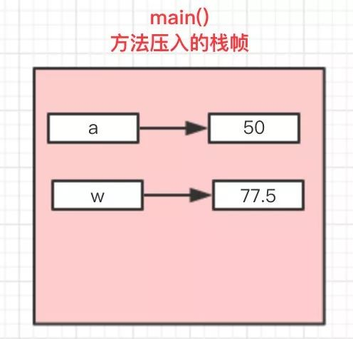
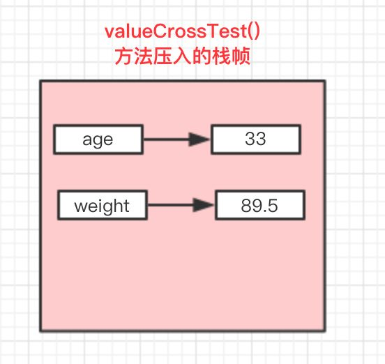
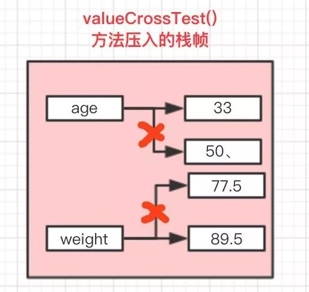
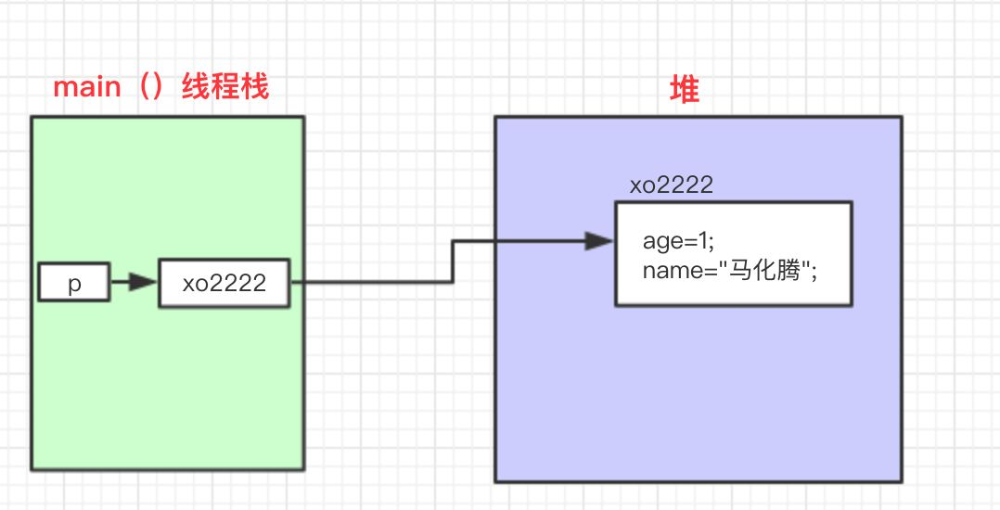
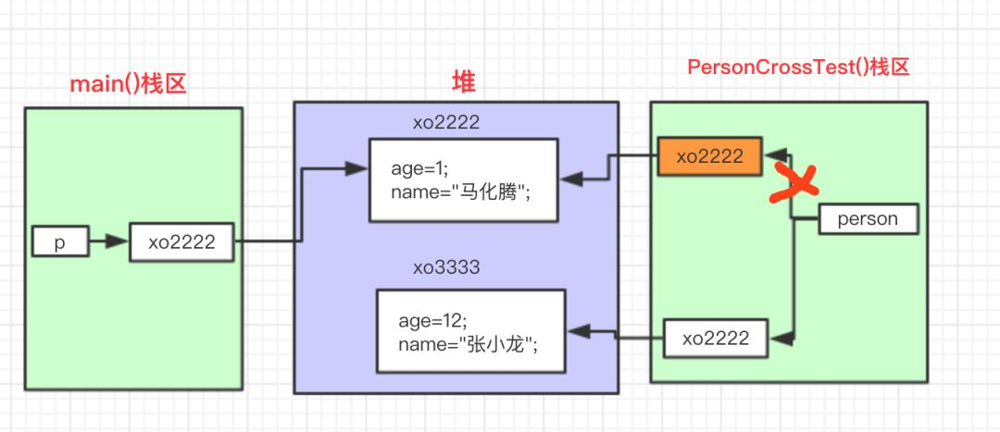

`前言`
> java成神之路基础篇之面向对象，包括面向对象、平台无关性、值传递、封装、继承、多态
不积跬步无以至千里，不积小流无以成江海。
<!--more-->
**************

## 什么是面向对象
### 面向对象
Object Oriented简称OO ：像C++，JAVA等语言。  
面向对象是一种思想，是基于面向过程而言的。面向对象是将功能等封装至对象中，由对象实现解决问题的具体细节。因此不同于过程为主体的面向过程的思想，面向对象以对象，也就是数据为第一位，而方法或者是算法过程作为其次，这是对数据的一种优化，操作更加方便，简化了过程。  
通俗实例：A、B、C一起打牌。  
面向对象：`A.play_with(B, C)`或者`B.play_with(A, C)`或者`C.play_with(A, B)`  
解决问题：抽象出对象，由对象执行动作。  
### 面向过程
Procedure Oriented 简称PO ：像C语言。  
面向过程在解决问题时，会将解决问题的过程拆分成一个个子过程，即为一个个方法函数。然后按照一定的顺序执行完这些方法，问题也就解决了。
通俗实例：A、B、C一起打牌。
面向过程：`play_with(A, B, C)`
解决问题：拆分成动作，并将数据丢进去执行该动作。
### 面向对象的三大基本特征和五大基本原则
三大基本特征：
- 封装：由面向对象思想将事物的属性以及解决问题的动作封装为对象，即抽象为类。封装性为一种基本特征，区别为对象的创建(可见[博客入口](http://jackeyzzhold.xyz/2018/11/02/java%E7%BC%96%E7%A8%8B%E6%80%9D%E6%83%B3-%E5%AF%B9%E8%B1%A1/#more))，是具体如何进行将事物抽象封装为对象的。
- 继承：
- 多态

五大基本原则：
- 单一职责原则(SRP)
- 开放封闭原则(OCP)
- 里氏替换原则(LSP)
- 依赖倒置原则(DIP)
- 接口分离原则(ISP)

#### 封装
封装，就是把客观事物封装成抽象的类，并且类可以把自己的数据和方法只让可信的类或者对象操作，对不可信的进行信息隐藏。一个类就是一个封装了数据以及操作这些数据的代码的逻辑实体。在一个对象内部，某些代码或某些数据可以是私有的，不能被外界访问。通过这种方式，对象对内部数据提供了不同级别的保护，以防止程序中无关的部分意外的改变或错误的使用了对象的私有部分。
#### 继承
继承，指可以让某个类型的对象获得另一个类型的对象的属性的方法。它支持按级分类的概念。继承是指这样一种能力：它可以使用现有类的所有功能，并在无需重新编写原来的类的情况下对这些功能进行扩展。 通过继承创建的新类称为“子类”或“派生类”，被继承的类称为“基类”、“父类”或“超类”。继承的过程，就是从一般到特殊的过程。要实现继承，可以通过 “继承”（Inheritance）和“组合”（Composition）来实现。继承概念的实现方式有二类：实现继承与接口继承。实现继承是指直接使用 基类的属性和方法而无需额外编码的能力；接口继承是指仅使用属性和方法的名称、但是子类必须提供实现的能力。
#### 多态
多态，是指一个类实例的相同方法在不同情形有不同表现形式。多态机制使具有不同内部结构的对象可以共享相同的外部接口。这意味着，虽然针对不同对象的具体操作不同，但通过一个公共的类，它们（那些操作）可以通过相同的方式予以调用。
#### 单一职责原则SRP(Single Responsibility Principle)
是指一个类的功能要单一，不能包罗万象。如同一个人一样，分配的工作不能太多，否则一天到晚虽然忙忙碌碌的，但效率却高不起来。

#### 开放封闭原则OCP(Open－Close Principle)
一个模块在扩展性方面应该是开放的而在更改性方面应该是封闭的。比如：一个网络模块，原来只服务端功能，而现在要加入客户端功能，那么应当在不用修改服务端功能代码的前提下，就能够增加客户端功能的实现代码，这要求在设计之初，就应当将服务端和客户端分开，公共部分抽象出来。

#### 里式替换原则LSP(the Liskov Substitution Principle LSP)
子类应当可以替换父类并出现在父类能够出现的任何地方。比如：公司搞年度晚会，所有员工可以参加抽奖，那么不管是老员工还是新员工，也不管是总部员工还是外派员工，都应当可以参加抽奖，否则这公司就不和谐了。

#### 依赖倒置原则DIP(the Dependency Inversion Principle DIP)
具体依赖抽象，上层依赖下层。假设B是较A低的模块，但B需要使用到A的功能，这个时候，B不应当直接使用A中的具体类： 而应当由B定义一抽象接口，并由A来实现这个抽象接口，B只使用这个抽象接口：这样就达到了依赖倒置的目的，B也解除了对A的依赖，反过来是A依赖于B定义的抽象接口。通过上层模块难以避免依赖下层模块，假如B也直接依赖A的实现，那么就可能 造成循环依赖。一个常见的问题就是编译A模块时需要直接包含到B模块的cpp文件，而编译B时同样要直接包含到A的cpp文件。

#### 接口分离原则ISP(the Interface Segregation Principle ISP)
模块间要通过抽象接口隔离开，而不是通过具体的类强耦合起来

#### 耦合
简单地说，软件工程中对象之间的耦合度就是对象之间的依赖性。指导使用和维护对象的主要问题是对象之间的多重依赖性。对象之间的耦合越高，维护成本越高。因此对象的设计应使类和构件之间的耦合最小。

有软硬件之间的耦合，还有软件各模块之间的耦合。
耦合性是程序结构中各个模块之间相互关联的度量。它取决于各个模块之间的接口的复杂程度、调用模块的方式以及哪些信息通过接口。

耦合可以分为以下几种，它们之间的耦合度由高到低排列如下：
- 内容耦合。
当一个模块直接修改或操作另一个模块的数据时，或一个模块不通过正常入口而转入另一个模块时，这样的耦合被称为内容耦合。内容耦合是最高程度的耦合，应该避免使用之。
- 公共耦合。
两个或两个以上的模块共同引用一个全局数据项，这种耦合被称为公共耦合。在具有大量公共耦合的结构中，确定究竟是哪个模块给全局变量赋了一个特定的值是十分困难的。
- 外部耦合。
一组模块都访问同一全局简单变量而不是同一全局数据结构，而且不是通过参数表传递该全局变量的信息，则称之为外部耦合。
- 控制耦合。
一个模块通过接口向另一个模块传递一个控制信号，接受信号的模块根据信号值而进行适当的动作，这种耦合被称为控制耦合。
- 标记耦合。
若一个模块A通过接口向两个模块B和C传递一个公共参数，那么称模块B和C之间存在一个标记耦合。
数据耦合。模块之间通过参数来传递数据，那么被称为数据耦合。数据耦合是最低的一种耦合形式，系统中一般都存在这种类型的耦合，因为为了完成一些有意义的功能，往往需要将某些模块的输出数据作为另一些模块的输入数据。
- 非直接耦合。
两个模块之间没有直接关系，它们之间的联系完全是通过主模块的控制和调用来实现的。

`总结`:  
耦合是影响软件复杂程度和设计质量的一个重要因素，在设计上我们应采用以下原则：如果模块间必须存在耦合，就尽量使用数据耦合，少用控制耦合，限制公共耦合的范围，尽量避免使用内容耦合。

#### 内聚与耦合
内聚标志一个模块内各个元素彼此结合的紧密程度，它是信息隐蔽和局部化概念的自然扩展。内聚是从功能角度来度量模块内的联系，一个好的内聚模块应当恰好做一件事。它描述的是模块内的功能联系。  
耦合是软件结构中各模块之间相互连接的一种度量，耦合强弱取决于模块间接口的复杂程度、进入或访问一个模块的点以及通过接口的数据。 程序讲究的是低耦合，高内聚。就是同一个模块内的各个元素之间要高度紧密，但是各个模块之间的相互依存度却要不那么紧密。  
内聚和耦合是密切相关的，同其他模块存在高耦合的模块意味着低内聚，而高内聚的模块意味着该模块同其他模块之间是低耦合。在进行软件设计时，应力争做到高内聚，低耦合。

## 平台无关性
java的虚拟机机制：
- 先编写`.java`后缀的源程序文件
- 然后编译成`.class`结尾的字节码文件
- 然后不同的平台有对应的java虚拟机(比如windows有windows的java虚拟机,linux有linux的java虚拟机),不同的虚拟机都可以将`.class`文件解释成对应机器的机器码,这样就实现了一份源码,可以在不同的平台运行的目的,这就是java的平台无关性。此处平台就是指不同的操作系统

### Java如何实现的平台无关性
java是一门高级语言，它通过其他的低级语言来实现一个虚拟机，虽然平台不同，但是也可以使用不同的技术来实现一个功能相近的虚拟机，然后java程序在虚拟机上运行，就“与平台无关”了。 而c和c++也可以跨平台，但是需要在不同平台下编译。  
java所宣扬的跨平台性实际上是所谓的“一次编译，到处执行”，即只需在一个地方编译，在其他各个平台下都可以执行。之所以会这样，是因为他们编译出来的东西是不同的，而且编译出来的东西运行在的地方也不同。
java编译出来的是一种“java字节码”，由虚拟机去解释执行。而c和c++则编译成了二进制，直接交由操作系统执行。
正是因为有了虚拟机，java才有了这样的一个特性。
#### Java从四个方面支持平台无关
- 最主要的是Java平台本身。Java平台扮演Java程序和所在的硬件与操作系统之间的缓冲角色。这样Java程序只需要与Java平台打交道，而不用管具体的操作系统。
- Java语言保证了基本数据类型的值域和行为都是由语言自己定义的。而C/C++中，基本数据类是由它的占位宽度决定的，占位宽度由所在平台决定的。不同平台编译同一个C++程序会出现不同的行为。通过保证基本数据类型在所有平台的一致性，Java语言为平台无关性提供强有力的支持。
- Java class文件。Java程序最终会被编译成二进制class文件。class文件可以在任何平台创建，也可以被任何平台的Java虚拟机装载运行。它的格式有着严格的定义，是平台无关的。
- 可伸缩性。Sun通过改变API的方式得到三个基础API集合，表现为Java平台不同的伸缩性：J2EE,J2SE,J2ME

#### 实现平台无关的7大步骤
- 选择程序运行的主机和设备集合（目标宿主机）
- 在目标宿主机中选择Java平台版本。
- 对于每个目标宿主机，选择程序将要运行的Java平台实现（目标运行时环境） 。
- 编写程序，调用Java API标准运行库（不调用本地方法，或者专门开发商专门调用本地方法的库）
- 编写程序，不依赖于垃圾收集器收集垃圾时间，不依赖线程的优先级
- 努力设计用户界面，在所有的目标宿主机都能正常工作
- 在所有目标运行时环境和所有目标宿主机进行测试

### JVM 还支持哪些语言（Kotlin、Groovy、JRuby、Jython、Scala）
## 值传递
> 形参：方法被调用时需要传递进来的参数，如：func(int a)中的a，它只有在func被调用期间a才有意义，也就是会被分配内存空间，在方法func执行完成后，a就会被销毁释放空间，也就是不存在了

> 实参：方法被调用时是传入的实际值，它在方法被调用前就已经被初始化并且在方法被调用时传入。

### 值传递
在方法被调用时，实参通过形参把它的内容副本传入方法内部，此时形参接收到的内容是实参值的一个拷贝，因此在方法内对形参的任何操作，都仅仅是对这个副本的操作，不影响原始值的内容。
`实例如下：`  
```java
public static void valueCrossTest(int age,float weight){
    System.out.println("传入的age："+age);
    System.out.println("传入的weight："+weight);
    age=33;
    weight=89.5f;
    System.out.println("方法内重新赋值后的age："+age);
    System.out.println("方法内重新赋值后的weight："+weight);
    }
//测试
public static void main(String[] args) {
        int a=25;
        float w=77.5f;
        valueCrossTest(a,w);
        System.out.println("方法执行后的age："+a);
        System.out.println("方法执行后的weight："+w);
      }
/*
传入的age：25
传入的weight：77.5

方法内重新赋值后的age：33
方法内重新赋值后的weight：89.5

方法执行后的age：25
方法执行后的weight：77.5
*/
```
`具体过程如下：`    
首先程序运行时，调用main()方法，此时JVM为main()方法往虚拟机栈中压入一个栈帧，即为当前栈帧，用来存放main()中的局部变量表(包括参数)、操作栈、方法出口等信息，如a和w都是main()方法中的局部变量，因此可以断定，a和w是躺着main方法所在的栈帧中。

而当执行到valueCrossTest()方法时，JVM也为其往虚拟机栈中压入一个栈，即为当前栈帧，用来存放valueCrossTest()中的局部变量等信息，因此age和weight是躺着valueCrossTest方法所在的栈帧中，而他们的值是从a和w的值copy了一份副本而得。

因而可以a和age、w和weight对应的内容是不一致的，所以当在方法内重新赋值时，实际流程如图：

也就是说，`age和weight的改动，只是改变了当前栈帧（valueCrossTest方法所在栈帧）里的内容，当方法执行结束之后，这些局部变量都会被销毁，main方法所在栈帧重新回到栈顶，成为当前栈帧，再次输出a和w时，依然是初始化时的内容。`
`因此：`
> 值传递传递的是真实内容的一个副本，对副本的操作不影响原内容，也就是形参怎么变化，不会影响实参对应的内容。

### 引用传递
> ”引用”也就是指向真实内容的地址值，在方法调用时，实参的地址通过方法调用被传递给相应的形参，在方法体内，形参和实参指向通愉快内存地址，对形参的操作会影响的真实内容。

`实例1如下：`
```java
public class Person {
        private String name;
        private int age;
        public String getName() {
            return name;
        }
        public void setName(String name) {
            this.name = name;
        }
        public int getAge() {
            return age;
        }
        public void setAge(int age) {
            this.age = age;
        }
}
public static void PersonCrossTest(Person person){
         System.out.println("传入的person的name："+person.getName());
         person.setName("我是张小龙");
         System.out.println("方法内重新赋值后的name："+person.getName());
     }
//测试
public static void main(String[] args) {
        Person p=new Person();
        p.setName("我是马化腾");
        p.setAge(45);
        PersonCrossTest(p);
        System.out.println("方法执行后的name："+p.getName());
}
/*
传入的person的name：我是马化腾
方法内重新赋值后的name：我是张小龙
方法执行后的name：我是张小龙
*/
```
可以看出，person经过personCrossTest()方法的执行之后，内容发生了改变，这印证了上面所说的“引用传递”，对形参的操作，`改变了实际对象的内容`。
`实例2如下：增加一行代码`
```java
public static void PersonCrossTest(Person person){
        System.out.println("传入的person的name："+person.getName());
        person=new Person();//加多此行代码
        person.setName("我是张小龙");
        System.out.println("方法内重新赋值后的name："+person.getName());
    }
/*
传入的person的name：我是马化腾
方法内重新赋值后的name：我是张小龙
方法执行后的name：我是马化腾
*/
```
按照JVM内存模型可以知道，(`具体可见:`[博客入口](http://jackeyzzhold.xyz/2018/03/11/java-JVM/))，对象和数组是存储在Java堆区的，而且堆区是共享的，因此程序执行到main（）方法中的下列代码时
```java
Person p=new Person();
p.setName("我是马化腾");
p.setAge(45);
PersonCrossTest(p);
```
JVM会在堆内开辟一块内存，用来存储p对象的所有内容，同时在main（）方法所在线程的栈区中创建一个引用p存储堆区中p对象的真实地址，如图：

当执行到PersonCrossTest()方法时，因为方法内有这么一行代码：`person = New Person()`
JVM需要在堆内另外开辟一块内存来存储new Person()，假如地址为“xo3333”，那此时形参person指向了这个地址，假如真的是引用传递，那么由上面讲到：引用传递中形参实参指向同一个对象，形参的操作会改变实参对象的改变。

可以推出：实参也应该指向了新创建的person对象的地址，所以在执行PersonCrossTest()结束之后，最终输出的应该是后面创建的对象内容。

然而实际上，最终的输出结果却跟我们推测的不一样，最终输出的仍然是一开始创建的对象的内容。

`由此可见：引用传递，在Java中并不存在。`

但是有人会疑问：为什么第一个例子中，在方法内修改了形参的内容，会导致原始对象的内容发生改变呢？

这是因为：`无论是基本类型和是引用类型，在实参传入形参时，都是值传递，也就是说传递的都是一个副本，而不是内容本身。`

有图可以看出，方法内的形参person和实参p并无实质关联，它只是由p处copy了一份指向对象的地址，此时：

p和person都是指向同一个对象。

因此在第一个例子中，对形参p的操作，会影响到实参对应的对象内容。而在第二个例子中，当执行到`new Person()`之后，JVM在堆内开辟一块空间存储新对象，并且把person改成指向新对象的地址，此时：

p依旧是指向旧的对象，person指向新对象的地址。

所以此时对person的操作，实际上是对新对象的操作，于实参p中对应的对象毫无关系。

`总结：`
> 因此可见：在Java中所有的参数传递，不管基本类型还是引用类型，都是值传递，或者说是副本传递。只是在传递过程中：如果是对基本数据类型的数据进行操作，由于原始内容和副本都是存储实际值，并且是在不同的栈区，因此形参的操作，不影响原始内容。如果是对引用类型的数据进行操作，分两种情况，一种是形参和实参保持指向同一个对象地址，则形参的操作，会影响实参指向的对象的内容。一种是形参被改动指向新的对象地址（如重新赋值引用），则形参的操作，不会影响实参指向的对象的内容。

## 封装、继承、多态
### 什么是多态、方法重写与重载
`多态`就是指程序中定义的引用变量所指向的具体类型和通过该引用变量发出的方法调用在编程时并不确定，而是在程序运行期间才确定，即一个引用变量倒底会指向哪个类的实例对象，该引用变量发出的方法调用到底是哪个类中实现的方法，必须在由程序运行期间才能决定。因为在程序运行时才确定具体的类，这样，不用修改源程序代码，就可以让引用变量绑定到各种不同的类实现上，从而导致该引用调用的具体方法随之改变，即不修改程序代码就可以改变程序运行时所绑定的具体代码，让程序可以选择多个运行状态，这就是`多态性`。
#### 实现多态的三个条件：继承、重写、向上转型
- 继承：在多态中必须存在继承关系的父类与子类，才会有所谓的`向上转型`
- 向上转型：在多态中将子类的引用赋给父类对象，此时该引用同时具备调用子类和父类的方法
- 重写：对父类的方法核心进行重新编写，参数与返回值不可改变。区别于重载，参数与返回值都可改变，是在一个类中。

```java
public class Wine {
    public void fun1(){
        System.out.println("Wine 的Fun.....");
        fun2();
    }
    public void fun2(){
        System.out.println("Wine 的Fun2...");
    }
}
public class JNC extends Wine{
    /**
     * @desc 子类重载父类方法
     *        父类中不存在该方法，向上转型后，父类是不能引用该方法的
     * @param a
     * @return void
     */
    public void fun1(String a){
        System.out.println("JNC 的 Fun1...");
        fun2();
    }
    /**
     * 子类重写父类方法
     * 指向子类的父类引用调用fun2时，必定是调用该方法
     */
    public void fun2(){
        System.out.println("JNC 的Fun2...");
    }
}
public class Test {
    public static void main(String[] args) {
        Wine a = new JNC();
        a.fun1();
    }
}
-------------------------------------------------
Output:
Wine 的Fun.....
JNC 的Fun2...
```
`分析：`在这个程序中子类JNC重载了父类Wine的方法fun1()，重写fun2()，而且重载后的fun1(String a)与 fun1()不是同一个方法，由于父类中没有该方法，向上转型后会丢失该方法，所以执行JNC的Wine类型引用是不能引用fun1(String a)方法。而子类JNC重写了fun2() ，那么指向JNC的Wine引用会调用JNC中fun2()方法。
所以对于多态我们可以总结如下：
> 指向子类的父类引用由于向上转型了，它只能访问父类中拥有的方法和属性，而对于子类中存在而父类中不存在的方法，该引用是不能使用的，尽管是重载该方法。若子类重写了父类中的某些方法，在调用该些方法的时候，必定是使用子类中定义的这些方法（动态连接、动态调用）。

对于面向对象而言，多态分为编译时多态和运行时多态。其中编译时多态是静态的，主要是指方法的重载，它是根据参数列表的不同来区分不同的函数，通过编辑之后会变成两个不同的函数，在运行时谈不上多态。而运行时多态是动态的，它是通过动态绑定来实现的，也就是我们所说的多态性。
`具体可见:`[博客入口](https://www.cnblogs.com/chenssy/p/3372798.html)

### 构造函数与默认构造函数
构造函数也叫为构造器，是一个类用于初始化对象变量的，名称与类名相同。不接受任何参数的构造器叫做默认构造器，在类中若不存在构造器，则编译器会自动生成默认构造器，但是一旦类中已经存在默认构造器或者其他带参数形式的构造器，则编译器会忽视自动创建默认构造器这一过程。
虽然在初始化对象时`new Test()`中`new`表达式返回对对象的引用，但是构造器本身并没有返回值，是一种特殊类型的方法，与`void`返回也有所不同。
### 类变量、成员变量与局部变量
- 成员变量：定义在类中，方法体之外。变量在创建对象时实例化。成员变量可被类中的方法、构造方法以及特定类的语句块访问。
```java
public class  ClassName{
    int a;
    public void printNumber（）{
        // 其他代码
    }
}
```

- 类变量：定义在类中，方法体之外，但必须要有 static 来声明变量类型。静态成员属于整个类，可通过对象名或类名来调用。
```java
public class  ClassName{
    static int a;
    public void printNumber（）{
        // 其他代码
    }
}
```

- 局部变量：在方法、构造方法、语句块中定义的变量。其声明和初始化在方法中实现，在方法结束后自动销毁
```java
public class  ClassName{
    public void printNumber（）{
        int a;
    }
    // 其他代码
}
```
`成员变量和类变量的区别：`
- 两个变量的生命周期不同
  - 成员变量随着对象的创建而存在，随着对象的回收而释放。
  - 静态变量随着类的加载而存在，随着类的消失而消失。
- 调用方式不同
  - 成员变量只能被对象调用。
  - 静态变量可以被对象调用，还可以被类名调用。
- 别名不同
  - 成员变量也称为实例变量。
  - 静态变量也称为类变量。
- 数据存储位置不同
  - 成员变量存储在堆内存的对象中，所以也叫对象的特有数据。
  - 静态变量数据存储在方法区（共享数据区）的静态区，所以也叫对象的共享数据。

`类变量特点：`
- 想要实现对象中的共性数据的对象共享。可以将这个数据进行静态修饰。
- 被静态修饰的成员，可以直接被类名所调用。也就是说，静态的成员多了一种调用方式。类名.静态方式。
- 静态随着类的加载而加载。而且优先于对象存在。

`类变量弊端：`
- 有些数据是对象特有的数据，是不可以被静态修饰的。因为那样的话，特有数据会变成对象的共享数据。这样对事物的描述就出了问题。所以，在定义静态时，必须要明确，这个数据是否是被对象所共享的。也就是可以理解为静态表现出来的就是数据的共享！！！
- 静态方法只能访问静态成员，不可以访问非静态成员。因为静态方法加载时，优先于对象存在，所以没有办法访问对象中的成员。
- 静态方法中不能使用this，super关键字。因为this代表对象，而静态在时，有可能没有对象，所以this无法使用。

### 成员变量与方法作用域
- public修饰符：对象本身、同一个包下、子类、其他包下对象都可以调用
- protected修饰符：对象本身、同一个包下、子类对象可以调用
- default修饰符：对象本身、同一个包下对象可以调用
- private修饰符：对象本身可以调用，常用来修饰成员变量

`局部变量的作用域:`
Java用一对大括号作为语句块的范围，称为作用域，作为在作用域里定义的一个变量，它只有在哪个作用域结束之前才可使用。离开作用域，变量所分配的内存空间将被JVM回收。  
`成员变量的作用域:`
在同一作用域范围的包裹下成员变量名和局部变量名是可以变量名相同的，在同一个作用域范围的包裹下局部变量和局部变量不可以变量名相同（作用域内不能重复命名），在方法中使用变量的时候如果不指明使用成员变量还是局部变量，那么默认的就是使用局部的那个变量，但是如果局部变量超出了它本身的作用域范围则会失效，被JVM垃圾回收，那么则可以重复命名此变量，并使用最新定义的这个局部变量。
`对象的作用域:`
Java对象不具备与主类型一样的存在时间。用new关键字创建一个Java对象的时候，它会超出作用域的范围之外。所以假若使用下面这段代码：
```java
{
       String s = new String("a string");
} /* 作用域的终点 */
```
那么句柄s，也就是引用会在作用域的终点处消失。然而，s指向的String对象依然占据着内存空间。在上面这段代码里，我们没有办法继续使用这个对象，因为指向它的唯一一个句柄已经超出了作用域的边界。
这样造成的结果是：对于用new创建的对象，只要我们愿意，它们就会一直保留下去。这个编程问题在C和C++里特别突出。在C++里遇到的麻烦最大：由于不能从语言获得任何帮助，所以在需要对象的时候，根本无法确定它们是否可用。而且最麻烦的是，在C++里，一旦完成工作，必须保证将对象手动清除。
这样便带来了一个有趣的问题。假如 Java 让对象依然故我，怎样才能防止它们大量充斥内存，并最终造成程序的“凝固”呢。在 C++里，这个问题最令程序员头痛。但 Java 以后，情况却发生了改观。 Java 有一个特别的“垃圾收集器”，它会查找用 new 创建的所有对象，并辨别其中哪些不再被引用。随后，它会自动释放由那些闲置对象占据的内存，以便能由新对象使用。这意味着我们根本不必操心内存的回收问题。只需简单地创建对象，一旦不再需要它们，它们就会自动离去。这样做可防止在 C++里很常见的一个编程问题：由于程序员忘记释放内存造成的“内存溢出”。
