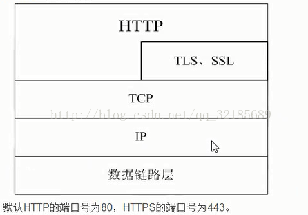
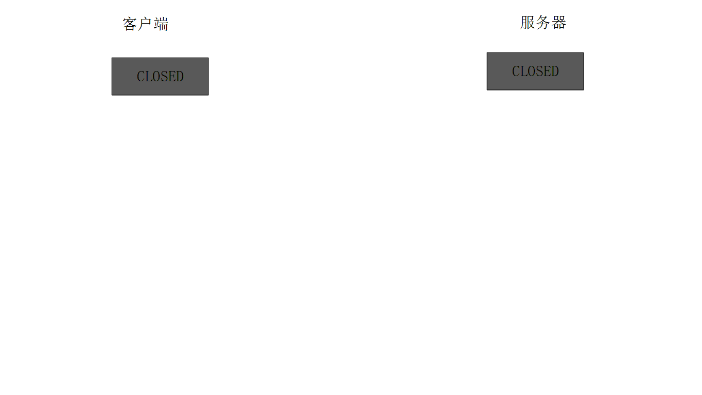

`前言`
> java成神之路进阶篇-网络编程知识。
不积跬步无以至千里，不积小流无以成江海。
<!--more-->
**************

## 网络编程知识
### tcp、udp、http、https 等常用协议
- 网络层：IP协议、ICMP协议、ARP协议、RARP协议、BOOTP协议
- 传输层：TCP协议、UDP协议
- 应用层：FTP、HTTP、telnet、smtp、dns协议

http协议通常承载与TCP协议之上，有时也承载与TLS或SSL协议之上，这个时候就成了https.https（全称：Hypertext Transfer Protocol over Secure Socket Layer）是以安全为目标的HTTP通道,简单讲是HTTP的安全版.即HTTP下加入了SSL层。所以比http安全，但是https加密之后对信息传输速度有一定的影响，所以任何一种协议都没有一种完美的状态。https在日常用的也比较多，比如我们聊天信息。http是超文本传输协议，信息是明文传输，https则是具有安全性的ssl加密传输协议，http和https使用的是完全不同的连接方式用的端口也不一样,前者是80,后者是443
- HTTP 的URL 以http:// 开头，而HTTPS 的URL 以https:// 开头
- HTTP 是不安全的，而 HTTPS 是安全的
- HTTP 标准端口是80 ，而 HTTPS 的标准端口是443
- 在OSI 网络模型中，HTTP工作于应用层，而HTTPS 的安全传输机制工作在传输层
- HTTP 无法加密，而HTTPS 对传输的数据进行加密
- HTTP无需证书，而HTTPS 需要CA机构wosign的颁发的SSL证书

|  | TCP | UDP |
| ------ | ------ | ------ |
| 是否连接 | 面向连接 | 面向非连接 |
| 传输可靠性 | 可靠 | 不可靠 |
| 应用场合 | 传输大量的数据，对可靠性要求较高的场合 | 传送少量数据、对可靠性要求不高的场景 |
| 速度 | 慢 | 快 |
| | 保证数据按序发送，按序到达，提供超时重传来保证可靠性 | 相反，只是努力交付 |
| | 存在流量控制和拥塞控制 | 无 |
| | 一对一连接 | 支持一对一，多对多，一对多 |
| | 面向字节流服务 | 报文服务 |

一次HTTP操作称为一个事务，其工作过程分为四步：
- 首先客户机与服务器需要建立连接。只要单击某个超级连接，HTTP的工作开始。
- 建立连接后，客户机发送一个请求给服务器，请求方式的格式为：统一资源标识符（URL），协议版本号，后面是MIME信息包括请求修饰符，客户机信息和可能的内容。
- 服务器接收到请求后，给予相应的响应信息，其格式为一个状态行，包括信息的协议版本号，一个成功或错误的代码，后面是MIME信息包括服务器信息，实体信息和可能的内容。
- 客服端接收服务器所返回的信息通过浏览器显示在用户的显示屏上，然后客户机与服务器断开连接。如果在以上过程中的某一步出现错误，那么产生错误的信息将返回到客户端，由显示屏输出，对于用户来说，这些过程是由HTTP自己完成的，用户只要用鼠标点击，等待信息显示就可以了。

#### 三次握手与四次关闭
TCP报文首部部分：
- 源端口和目的端口，各占2个字节，分别写入源端口和目的端口；
- 序号seq，占4个字节，TCP连接中传送的字节流中的每个字节都按顺序编号。例如，一段报文的序号字段值是 301 ，而携带的数据共有100字段，显然下一个报文段（如果还有的话）的数据序号应该从401开始；
- 确认号ack，占4个字节，是期望收到对方下一个报文的第一个数据字节的序号。例如，B收到了A发送过来的报文，其序列号字段是501，而数据长度是200字节，这表明B正确的收到了A发送的到序号700为止的数据。因此，B期望收到A的下一个数据序号是701，于是B在发送给A的确认报文段中把确认号置为701；
- 确认ACK，仅当ACK=1时，确认号字段才有效。TCP规定，在连接建立后所有报文的传输都必须把ACK置1；
- 同步SYN，在连接建立时用来同步序号。当SYN=1，ACK=0，表明是连接请求报文，若同意连接，则响应报文中应该使SYN=1，ACK=1

三次握手的过程：
- TCP服务器进程先创建传输控制块TCB，时刻准备接受客户进程的连接请求，此时服务器就进入了LISTEN（监听）状态；
- TCP客户进程也是先创建传输控制块TCB，然后向服务器发出连接请求报文，这是报文首部中的同部位SYN=1，同时选择一个初始序列号 seq=x ，此时，TCP客户端进程进入了 SYN-SENT（同步已发送状态）状态。TCP规定，SYN报文段（SYN=1的报文段）不能携带数据，但需要消耗掉一个序号。
- TCP服务器收到请求报文后，如果同意连接，则发出确认报文。确认报文中应该 ACK=1，SYN=1，确认号是ack=x+1，同时也要为自己初始化一个序列号 seq=y，此时，TCP服务器进程进入了SYN-RCVD（同步收到）状态。这个报文也不能携带数据，但是同样要消耗一个序号。
- TCP客户进程收到确认后，还要向服务器给出确认。确认报文的ACK=1，ack=y+1，自己的序列号seq=x+1，此时，TCP连接建立，客户端进入ESTABLISHED（已建立连接）状态。TCP规定，ACK报文段可以携带数据，但是如果不携带数据则不消耗序号。
- 当服务器收到客户端的确认后也进入ESTABLISHED状态，此后双方就可以开始通信了

四次挥手(关闭)的过程
- 客户端进程发出连接释放报文，并且停止发送数据。释放数据报文首部，FIN=1，其序列号为seq=u（等于前面已经传送过来的数据的最后一个字节的序号加1），此时，客户端进入FIN-WAIT-1（终止等待1）状态。 TCP规定，FIN报文段即使不携带数据，也要消耗一个序号。
- 服务器收到连接释放报文，发出确认报文，ACK=1，ack=u+1，并且带上自己的序列号seq=v，此时，服务端就进入了CLOSE-WAIT（关闭等待）状态。TCP服务器通知高层的应用进程，客户端向服务器的方向就释放了，这时候处于半关闭状态，即客户端已经没有数据要发送了，但是服务器若发送数据，客户端依然要接受。这个状态还要持续一段时间，也就是整个CLOSE-WAIT状态持续的时间。
- 客户端收到服务器的确认请求后，此时，客户端就进入FIN-WAIT-2（终止等待2）状态，等待服务器发送连接释放报文（在这之前还需要接受服务器发送的最后的数据）。
- 服务器将最后的数据发送完毕后，就向客户端发送连接释放报文，FIN=1，ack=u+1，由于在半关闭状态，服务器很可能又发送了一些数据，假定此时的序列号为seq=w，此时，服务器就进入了LAST-ACK（最后确认）状态，等待客户端的确认。
- 客户端收到服务器的连接释放报文后，必须发出确认，ACK=1，ack=w+1，而自己的序列号是seq=u+1，此时，客户端就进入了TIME-WAIT（时间等待）状态。注意此时TCP连接还没有释放，必须经过2∗MSL（最长报文段寿命）的时间后，当客户端撤销相应的TCB后，才进入CLOSED状态。
- 服务器只要收到了客户端发出的确认，立即进入CLOSED状态。同样，撤销TCB后，就结束了这次的TCP连接。可以看到，服务器结束TCP连接的时间要比客户端早一些。

关于三次握手四次挥手的问题：
- 为什么三次握手时TCP客户端最后还要发送一次确认？

主要防止已经失效的连接请求突然又传送到了服务器，从而产生错误。若是采用两次握手，假设由于网络问题导致客户端发送的第一次请求连接滞留从而导致客户端重发该连接请求。在第二次连接请求完成两次握手并关闭连接后，滞留的第一次连接请求到达服务器，由于两次握手的机制将会导致再次建立连接，产生错误和资源浪费。

- 为什么四次挥手时客户端最后还要等待2MSL？

第一，保证客户端发送的最后一个ACK报文能够到达服务器，防止ACK报文丢失
第二，防止出现已经失效的请求连接报文。在客户端发送完最后一个ACK报文后，在2MSL时间内，可以使本连接持续的时间内所产生的所有报文段都从网络中消失，这样新的连接就不会出现旧连接的请求报文。

- 为什么建立连接是三次握手，而关闭连接却是四次呢？

这是因为服务端的LISTEN状态下的SOCKET当收到SYN报文的连接请求后，它可以把ACK和SYN(ACK起应答作用，而SYN起同步作用)放在一个报文里来发送。但关闭连接时，当收到对方的FIN报文通知时，它仅仅表示对方没有数据发送给你了；但未必你所有的数据都全部发送给对方了，所以你可能未必会马上会关闭SOCKET,也即你可能还需要发送一些数据给对方之后，再发送FIN报文给对方来表示你同意现在可以关闭连接了，所以它这里的ACK报文和FIN报文多数情况下都是分开发送的。

- 已经建立连接，但客户端出现故障如何解决？

TCP设有保活计时器，检测客户端是否在活动。

#### 流量控制和拥塞控制
#### OSI 七层模型
#### tcp 粘包与拆包

### http/1.0 http/1.1 http/2 之前的区别
HTTP/1.0每次请求都需要建立新的TCP连接，连接不能复用。HTTP/1.1新的请求可以在上次请求建立的TCP连接之上发送，连接可以复用，减少重复进行TCP三次握手的开销，提高效率。注意：在同一个TCP连接中，新的请求需要等上一次请求收到响应后，才能发送。
#### http请求到后端流程
- 首先是浏览器程序开始解析你的地址。把地址分为域名和路径(如何含有的话）两个部分，然后连接DNS服务器，查询这个域名的IP地址；
- 获得DNS返回的IP地址之后，浏览器开始按照HTTP协议的格式向该IP地址和路径请求内容；
- 服务器收到某个HTTP请求之后，就会把内容按照HTTP协议的格式返回这个请求的客户端；
- 浏览器收到服务器返回的内容后，开始渲染并显示出来；
- 浏览器与服务器对话结束；

#### http 中 get 和 post 区别
get和post本质上就是TCP链接，并无差别。但是由于HTTP的规定和浏览器/服务器的限制，导致他们在应用过程中体现出一些不同。
- get参数通过url传递，post放在request body中。
- get请求在url中传递的参数是有长度限制的，而post没有。
- post比get更安全，因为get请求参数直接暴露在url中，所以不能用来传递敏感信息。
- get请求只能进行url编码，而post支持多种编码方式
- get请求会浏览器主动cache，而post请求不会被缓存。
- get请求参数会被完整保留在浏览历史记录里，而post中的参数不会被保留。
- get产生一个TCP数据包；post产生两个TCP数据包。
  - 对于get方式的请求，浏览器会把http header和data一并发送出去，服务器响应200（返回数据）；
  - 而对于post，浏览器先发送header，服务器响应100 continue，浏览器再发送data，服务器响应200 ok（返回数据）。

#### http中请求转发与请求重定向的区别
- 请求转发：是一种服务器的行为，客户端只有一次请求，服务器端转发后会将请求对象保存，地址栏中的URL地址不会改变，得到响应后服务器端再将响应发给客户端
- 请求重定向：是一种客户端行文，从本质上讲等同于两次请求，前一次请求对象不会保存，地址栏的URL地址会改变

通俗理解：去甲地办理护照，不料护照办理却在乙地。此时甲地工作人员并没有赶走客户，背后默默联系了乙地工作人员办理护照并送至甲地，由甲地工作人员讲护照递给客户。这就是请求转发。请求重定向则没有那么轻松，甲地工作人员表明应去乙地办理护照，故客户需自己去乙地办理护照。

#### 常见的 web 请求返回的状态码
#### http优化方案
- TCP复用：TCP连接复用是将多个客户端的HTTP请求复用到一个服务器端TCP连接上，而HTTP复用则是一个客户端的多个HTTP请求通过一个TCP连接进行处理。前者是负载均衡设备的独特功能；而后者是HTTP 1.1协议所支持的新功能，目前被大多数浏览器所支持。
- 内容缓存：将经常用到的内容进行缓存起来，那么客户端就可以直接在内存中获取相应的数据了。
- 压缩：将文本数据进行压缩，减少带宽
- SSL加速（SSL Acceleration）：使用SSL协议对HTTP协议进行加密，在通道内加密并加速
- TCP缓冲：通过采用TCP缓冲技术，可以提高服务器端响应时间和处理效率，减少由于通信链路问题给服务器造成的连接负担。

#### http相应状态码
- 200：请求被正常处理
- 204：请求被受理但没有资源可以返回
- 206：客户端只是请求资源的一部分，服务器只对请求的部分资源执行GET方法，相应报文中通过Content-Range指定范围的资源。
- 301：永久性重定向
- 302：临时重定向
- 303：与302状态码有相似功能，只是它希望客户端在请求一个URI的时候，能通过GET方法重定向到另一个URI上
- 304：发送附带条件的请求时，条件不满足时返回，与重定向无关
- 307：临时重定向，与302类似，只是强制要求使用POST方法
- 400：请求报文语法有误，服务器无法识别
- 401：请求需要认证
- 403：请求的对应资源禁止被访问
- 404：服务器无法找到对应资源
- 500：服务器内部错误
- 503：服务器正忙

### http/3
### Java RMI，Socket，HttpClient
### cookie 与 session
- cookie数据存放在客户的浏览器上，session数据放在服务器上。
- cookie不是很安全，别人可以分析存放在本地的COOKIE并进行COOKIE欺骗。考虑到安全应当使用session。
- session会在一定时间内保存在服务器上。当访问增多，会比较占用你服务器的性能。考虑到减轻服务器性能方面，应当使用COOKIE。
- 单个cookie保存的数据不能超过4K，很多浏览器都限制一个站点最多保存20个cookie

#### Http协议无状态协议
无状态协议对于事务处理没有记忆能力。缺少状态意味着如果后续处理需要前面的信息。也就是说，当客户端一次HTTP请求完成以后，客户端再发送一次HTTP请求，HTTP并不知道当前客户端是一个”老用户“。
可以使用Cookie来解决无状态的问题，Cookie就相当于一个通行证，第一次访问的时候给客户端发送一个Cookie，当客户端再次来的时候，拿着Cookie(通行证)，那么服务器就知道这个是”老用户“。
#### cookie
#### session
cookie 被禁用，如何实现 session
### 用 Java 写一个简单的静态文件的 HTTP 服务器
### 了解 nginx 和 apache 服务器的特性并搭建一个对应的服务器
### 用 Java 实现 FTP、SMTP 协议
### 进程间通讯的方式
### 什么是 CDN？如果实现？
### DNS
- 什么是 DNS
- 记录类型: A 记录、CNAME 记录、AAAA 记录等
- 域名解析、根域名服务器
- DNS 污染、DNS 劫持、公共 DNS：114 DNS、Google DNS、OpenDNS

### 反向代理
- 正向代理
- 反向代理
- 反向代理服务器
