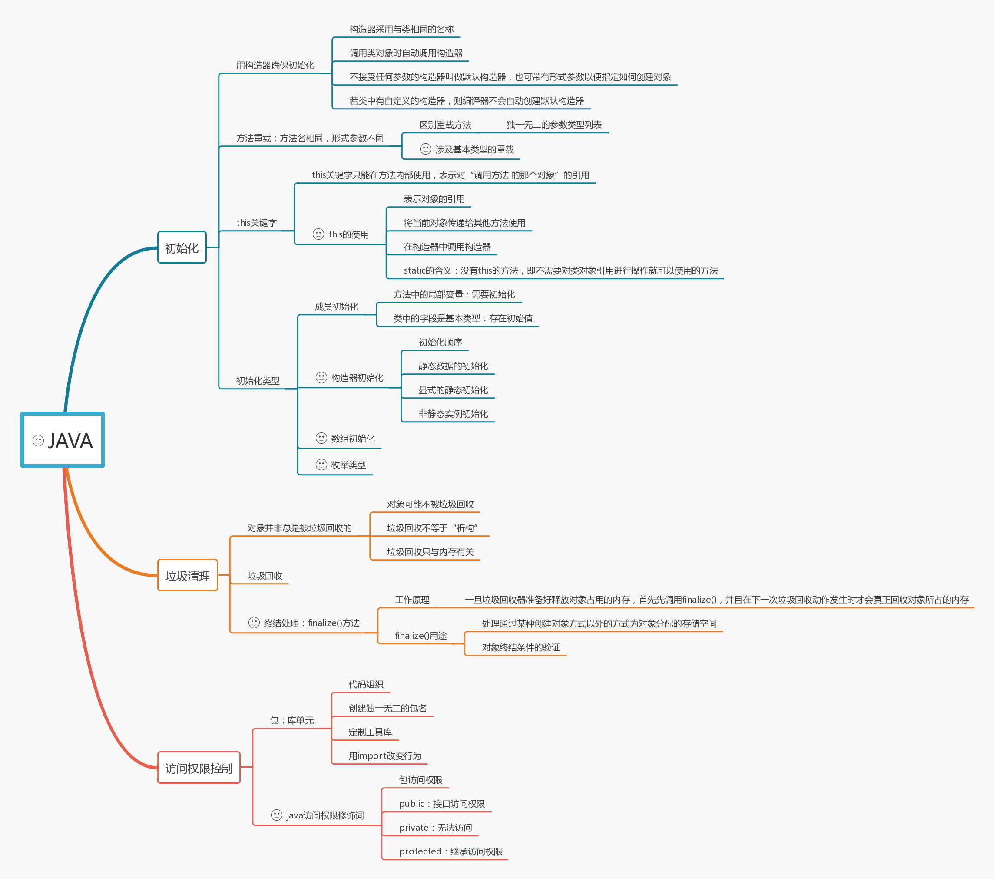

## 前言
> 这部分内容包括java的初始化、垃圾清理以及访问权限控制。其中包括静态成员、非静态成员以及特殊结构的初始化过程；垃圾回收机制与垃圾回收机制无法处理的特殊清理方法；最后是访问权限控制的部分内容。
<!--more-->
***************

   
## 基本类型的方法重载
```java
public class Test{
  void f1(char x){ System.out.print("f1(char)");}
  void f1(byte x){ System.out.print("f1(byte)");}
  void f1(short x){ System.out.print("f1(short)");}
  void f1(int x){ System.out.print("f1(int)");}

  void f2(byte x){ System.out.print("f2(byte)");}
  void f2(short x){ System.out.print("f2(short)");}
  void f2(int x){ System.out.print("f2(int)");}

  void f3(short x){ System.out.print("f3(short)");}
  void f3(int x){ System.out.print("f3(int)");}

  void f4(int x){ System.out.print("f4(int)");}

  // 小类型传入大类型的参数
  void testChar(){
    char x = 'x';
    f1(x);f2(x);f3(x);f4(x);  // output: f1(char);f2(int);f3(int);f4(int)
  }
  void testByte(){
    byte x = 0;
    f1(x);f2(x);f3(x);f4(x);  // output: f1(byte);f2(byte);f3(short);f(int)
  }
  void testShort(){
    short x = 0;
    f1(x);f2(x);f3(x);f4(x);  // output: f1(short);f2(short);f3(short);f4(int)
  }
  void testInt(){
    int x = 0;
    f1(x);f2(x);f3(x);f4(x);  // output: f1(int);f2(int);f3(int);f4(int)
  }

  // 大类型传入小类型的参数
  void test(){
    long x = 0;
    f4((int)x);
  }
}
```
涉及基本类型的重载有两种情况`byte > short > int > long > float > double`：
- 实际值的数据类型比方法形参的数据类型要小时，实际数据类型会被提升。`char`若没有对应类型的形参，直接提升至`int`
- 实际值的数据类型比方法形参的数据类型要大时，需要通过类型转换来执行窄化转换，否则编译器会报错

## this关键字的使用
### 在方法内部获得对当前对象的引用
```java
public class Leaf{
  int i = 0;
  Leaf increment(){
    i++;
    return this;
  }
  void print(){
    System.out.println("i = " + i);
  }
  public static void main(String[] args){
    Leaf x = new Leaf();
    x.increment().increment().increment().ptint();  // output: i = 3
  }
}
```
在`increment()`方法内部通过`this`关键字返回对当前对象的引用。
### 将当前对象传递给其他方法
```java
class Person{
  public void eat(Apple apple){
    Apple peeled = apple.getPeeled();
    System.out.println("JackeyZz");
  }
}
class Peeler{
  static Apple peel(Apple apple){
    return apple;
  }
}
class Apple{
  Apple getPeeled(){
    return Peeler.peel(this);
  }
}
public class PassingThis{
  public static void main(String[] args){
    new Person.eat(new Apple());         // output: JackeyZz
  }
}
```
`Apple`类需要调用`Peeler.peel()`方法，它是一个外部工具方法，将执行由于某种原因而必须放在`Apple`外部的操作(也许是因为该外部方法要应用到其他不同的类，避免重复代码),为了将其自身传递给外部方法，使用`this`关键字。
### 在构造器中调用构造器
```java
public class Flower{
  int petalCount = 0;
  String s = "JackeyZz";
  Flower(int petals){
    this.petalCount = petals;
  }
  Flower(String s){
    this.s = s;
  }
  Flower(String s, int petals){
    this(petals);
    this.s = s;
  }
  Flower(){
    this("JackeyZz", 47);
  }
}
```
调用构造器的几个特点：
- 可用`this`调用一个构造器，但是不能同时调用两个构造器
- 必须将构造器调用置于最起始处，否则编译报错
- 除构造器外，编译器禁止在其他任何方法中调用构造器

## 构造器初始化
### 初始化顺序
在类的内部，变量定义的先后顺序决定了初始化的顺序。即使变量定义散布在方法定义之间，它们仍旧会在任何方法(包括构造器)被调用之前得到初始化。
```java
class Window{
  Window(int marker){
    System.out.print("window(" + marker + ")");
  }
}
class House{
  Window w1 =new Window(1);
  House(){
    System.out.print("house");
    w3 = new Window(33);
  }
  Window w2 = new Window(2);
  void f(){
    System.out.print("f()");
  }
  Window w3 = new Window(3);
}

House h = new House();
h.f();
// output: window(1) window(2) window(3) house window(33) f()
```
### 静态数据的初始化
无论创建多少个对象，静态数据都只占用一份存储区域。`static`关键字不能应用于局部变量，只能作用于域。
```java
class Bowl{
  Bowl(int marker){
    print("Bowl(" + marker + ")");
  }
  void f1(int marker){
    print("f1(" + marker + ")");
  }
}
class Table{
  static Bowl b1 = new Bowl(1);
  Table(){
    print("table()");
    b2.f1(1);
  }
  void f2(int marker){
    print("f2(" + marker + ")");
  }
  static Bowl b2 = new Bowl(2);
}
class Cupboard{
  Bowl b3 = new Bowl(3);
  static Bowl b4 = new Bowl(4);
  Cupboard(){
    print("cupboard()");
    b4.f1(2);
  }
  void f3(int marker){
    print("f3(" + marker + ")");
  }
  static Bowl b5 = new Bowl(5);
}
public class Test{
  public static void main(String[] args){
    print("test..");
    new Cupboard();
    print("test..");
    new Cupboard();
    table.f2(1);
    cupboard.f3(1);
  }
  static Table table = new Table();
  static Cupboard cupboard = new Cupboard();
}
/*
* output:
* Bowl(1) Bowl(2) table() f1(1) Bowl(4) Bowl(5) Bowl(3) cupboard() f1(2)
* test.. Bowl(3) cupboard() f1(2) test.. Bowl(3) cupboard() f1(2) f2(1) f(2)
*/
```
静态数据初始化的几个特点：
- 静态数据只有在第一次被访问时才会初始化，此后不会再次被初始化
- 初始化的顺序是先静态对象(倘若尚未由于对象创建而被初始化)，而后是“非静态”对象


## 数组初始化
## 枚举类型
## java清理
### 垃圾回收
GC垃圾收集机制具体可见：[博客入口](http://jackeyzzhold.xyz/2018/03/20/java-GC/)
### finalize()方法
#### 作用
- `finalize()`是`Object`的`protected`方法，子类可以覆盖该方法以实现资源清理工作，GC在回收对象之前调用该方法。
- `finalize()`与C++中的析构函数不是对应的。C++中的析构函数调用的时机是确定的（对象离开作用域或delete掉），但Java中的`finalize`的调用具有不确定性
- 不建议用`finalize`方法完成“非内存资源”的清理工作，但建议用于：① 清理本地对象(通过JNI创建的对象)；② 作为确保某些非内存资源(如Socket、文件等)释放的一个补充：在`finalize`方法中显式调用其他资源释放方法。

#### 问题
- 一些与finalize相关的方法，由于一些致命的缺陷，已经被废弃了，如`System.runFinalizersOnExit()`方法、`Runtime.runFinalizersOnExit()`方法
- `System.gc()`与`System.runFinalization()`方法增加了`finalize`方法执行的机会，但不可盲目依赖它们
- Java语言规范并不保证`finalize`方法会被及时地执行、而且根本不会保证它们会被执行
- `finalize`方法可能会带来性能问题。因为JVM通常在单独的低优先级线程中完成`finalize`的执行
- 对象再生问题：`finalize`方法中，可将待回收对象赋值给`GC Roots`可达的对象引用，从而达到对象再生的目的
- `finalize`方法至多由GC执行一次(用户当然可以手动调用对象的`finalize`方法，但并不影响GC对`finalize`的行为)

#### 执行过程(生命周期)
1. 首先，大致描述一下finalize流程：当对象变成(GC Roots)不可达时，GC会判断该对象是否覆盖了finalize方法，若未覆盖，则直接将其回收。否则，若对象未执行过finalize方法，将其放入F-Queue队列，由一低优先级线程执行该队列中对象的finalize方法。执行finalize方法完毕后，GC会再次判断该对象是否可达，若不可达，则进行回收，否则，对象“复活”。
2. 具体的finalize流程：
对象可由两种状态，涉及到两类状态空间，一是终结状态空间 `F = {unfinalized, finalizable, finalized}`；二是可达状态空间 `R = {reachable, finalizer-reachable, unreachable}`。各状态含义如下：
    - unfinalized: 新建对象会先进入此状态，GC并未准备执行其finalize方法，因为该对象是可达的
    - finalizable: 表示GC可对该对象执行finalize方法，GC已检测到该对象不可达。正如前面所述，GC通过F-Queue队列和一专用线程完成finalize的执行
    - finalized: 表示GC已经对该对象执行过finalize方法
    - reachable: 表示GC Roots引用可达
    - finalizer-reachable(f-reachable)：表示不是reachable，但可通过某个finalizable对象可达
    - unreachable：对象不可通过上面两种途径可达

状态变迁图：
  
变迁说明：
1. 新建对象首先处于`[reachable, unfinalized]`状态(A)
2.  随着程序的运行，一些引用关系会消失，导致状态变迁，从`reachable`状态变迁到`f-reachable(B, C, D)`或`unreachable(E, F)`状态
3. 若JVM检测到处于`unfinalized`状态的对象变成`f-reachable`或`unreachable`，JVM会将其标记为`finalizable`状态(G,H)。若对象原处于`[unreachable, unfinalized]`状态，则同时将其标记为`f-reachable(H)`。
4. 在某个时刻，JVM取出某个`finalizable`对象，将其标记为`finalized`并在某个线程中执行其`finalize`方法。由于是在活动线程中引用了该对象，该对象将变迁到`(reachable, finalized)`状态(K或J)。该动作将影响某些其他对象从`f-reachable`状态重新回到`reachable`状态`(L, M, N)`
5. 处于`finalizable`状态的对象不能同时是`unreahable`的，由第4点可知，将对象`finalizable`对象标记为`finalized`时会由某个线程执行该对象的`finalize`方法，致使其变成`reachable`。这也是图中只有八个状态点的原因
6. 程序员手动调用`finalize`方法并不会影响到上述内部标记的变化，因此JVM只会至多调用`finalize`一次，即使该对象“复活”也是如此。程序员手动调用多少次不影响JVM的行为
7. 若JVM检测到`finalized`状态的对象变成`unreachable`，回收其内存(I)
8. 若对象并未覆盖`finalize`方法，JVM会进行优化，直接回收对象（O）
9. 注：`System.runFinalizersOnExit()`等方法可以使对象即使处于`reachable`状态，JVM仍对其执行`finalize`方法

```java
/*
*   对象复活
*/
public class GC {
    public static GC SAVE_HOOK = null;
    public static void main(String[] args) throws InterruptedException {
        // 新建对象，因为SAVE_HOOK指向这个对象，对象此时的状态是(reachable,unfinalized)
        SAVE_HOOK = new GC();
        //将SAVE_HOOK设置成null，此时刚才创建的对象就不可达了，因为没有句柄再指向它了，对象此时状态是(unreachable，unfinalized)
        SAVE_HOOK = null;
        //强制系统执行垃圾回收，系统发现刚才创建的对象处于unreachable状态，并检测到这个对象的类覆盖了finalize方法，因此把这个对象放入F-Queue队列，由低优先级线程执行它的finalize方法，此时对象的状态变成(unreachable, finalizable)或者是(finalizer-reachable,finalizable)
        System.gc();
        // sleep，目的是给低优先级线程从F-Queue队列取出对象并执行其finalize方法提供机会。在执行完对象的finalize方法中的super.finalize()时，对象的状态变成(unreachable,finalized)状态，但接下来在finalize方法中又执行了SAVE_HOOK = this;这句话，又有句柄指向这个对象了，对象又可达了。因此对象的状态又变成了(reachable, finalized)状态。
        Thread.sleep(500);
        // 这里楼主说对象处于(reachable,finalized)状态应该是合理的。对象的finalized方法被执行了，因此是finalized状态。又因为在finalize方法是执行了SAVE_HOOK=this这句话，本来是unreachable的对象，又变成reachable了。
        if (null != SAVE_HOOK) { //此时对象应该处于(reachable, finalized)状态
            // 这句话会输出，注意对象由unreachable，经过finalize复活了。
            System.out.println("Yes , I am still alive");
        } else {
            System.out.println("No , I am dead");
        }
        // 再一次将SAVE_HOOK放空，此时刚才复活的对象，状态变成(unreachable,finalized)
        SAVE_HOOK = null;
        // 再一次强制系统回收垃圾，此时系统发现对象不可达，虽然覆盖了finalize方法，但已经执行过了，因此直接回收。
        System.gc();
        // 为系统回收垃圾提供机会
        Thread.sleep(500);
        if (null != SAVE_HOOK) {
            // 这句话不会输出，因为对象已经彻底消失了。
            System.out.println("Yes , I am still alive");
        } else {
            System.out.println("No , I am dead");
        }
    }

    @Override
    protected void finalize() throws Throwable {
        super.finalize();
        System.out.println("execute method finalize()");
       // 这句话让对象的状态由unreachable变成reachable，就是对象复活
        SAVE_HOOK = this;
    }
}
```
## java访问权限
