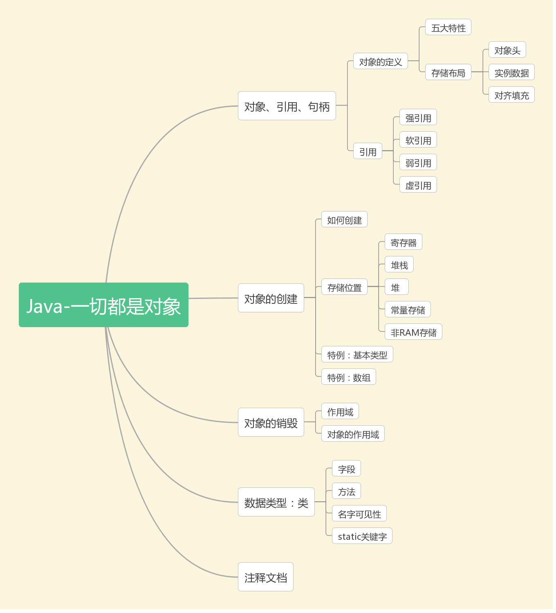
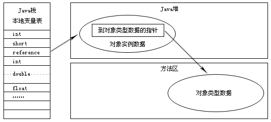

`前言`
> 这部分内容讲的是java中什么是对象，对象与引用的关系，对象如何创建的，对象如何销毁的，最后涉及到类的一些特性。
<!--more-->
**********************


## 对象、对象引用、句柄
```java
Light it = new Light();
it.on();
```
上述例子中，类的名称为`Light`，调用`new`方法创建类`Light`的新对象，然后用对象引用`it`关联创建的新对象。`.on()`作为类对象的接口，向对象发出请求执行任务。
通常对象需要关联引用才能够传递消息，执行任务；引用可以单独存在。
### 对象的定义
在Java里面，对象有五大基本特性
- 万物皆为对象：不仅仅是基本数据变量，可以是任何概念化构件
- 程序是对象的集合，通过发送消息来告知彼此所要做的                             
- 每个对象都有自己的由其他对象所构成的存储
- 每个对象都是某个类的一个实例
- 某一特定类型的所有对象都可以接受同样的消息

HotSpot虚拟机中，对象在内存中存储的布局可以分为三块区域：对象头(Header)、实例数据(Instance Data)和对齐填充(Padding)

从上面的这张图里面可以看出，对象在内存中的结构主要包含以下几个部分：
- Mark Word(标记字段)：对象的Mark Word部分占4个字节，其内容是一系列的标记位，比如轻量级锁的标记位，偏向锁标记位等等。
- class Pointer（Class对象指针）：Class对象指针的大小也是4个字节，其指向的位置是对象对应的Class对象（其对应的元数据对象）的内存地址
- 对象实际数据：这里面包括了对象的所有成员变量，其大小由各个成员变量的大小决定，比如：byte和boolean是1个字节，short和char是2个字节，int和float是4个字节，long和double是8个字节，reference是4个字节
- 对齐：最后一部分是对齐填充的字节，按8个字节填充。

对象存储布局具体可见：[博客入口](https://www.cnblogs.com/duanxz/p/4967042.html)
### 对象引用
java中的引用类型可分为：
- 强引用：默认的引用类型，例如`StringBuffer buffer = new StringBuffer()`，就是`buffer`变量持有的为`StringBuilder`的强引用类型。
- 软引用：即`SoftReference`，其指向的对象只有在内存不足的时候进行回收。
- 弱引用：即`WeakReference`,其指向的对象在GC执行时会被回收。
- 虚引用：即`PhantomReference`,与`ReferenceQueue`结合，用作记录该引用指向的对象已被销毁。

java虚拟机(JVM)是通过某些数据类型来执行计算的，其数据类型可分为：基本类型、引用类型和null类型。其中引用类型可分为：
- 类类型：对类实例的引用
- 接口类型：对实现了该接口的某个类实例的引用
- 数组类型：对数组对象的引用，在JVM中，数组是个真正的对象

JVM数据访问方式：
- 句柄形式：引用指向句柄，句柄包含对象地址和对象类型
- 指针：直接存储对象地址
指针比句柄少一步，访问更快；但是值发生改变时，前者引用不用变，后者要改变指针。

对象的访问定位：
建立对象是为了使用对象，我们的Java程序需要通过栈上的reference数据来操作堆上的具体对象。由于reference类型在Java虚拟机规范里面只规定了是一个指向对象的引用，并没有定义这个引用应该通过什么种方式去定位、访问到堆中的对象的具体位置，对象访问方式也是取决于虚拟机实现而定的。主流的访问方式有使用句柄和直接指针两种。
如果使用句柄访问的话，Java堆中将会划分出一块内存来作为句柄池，reference中存储的就是对象的句柄地址，而句柄中包含了对象实例数据与类型数据的具体各自的地址信息。

如果使用直接指针访问的话，Java堆对象的布局中就必须考虑如何放置访问类型数据的相关信息，reference中存储的直接就是对象地址

这两种对象访问方式各有优势，使用句柄来访问的最大好处就是reference中存储的是稳定句柄地址，在对象被移动（垃圾收集时移动对象是非常普遍的行为）时只会改变句柄中的实例数据指针，而reference本身不需要被修改。
使用直接指针来访问最大的好处就是速度更快，它节省了一次指针定位的时间开销，由于对象访问的在Java中非常频繁，因此这类开销积小成多也是一项非常可观的执行成本。从上一部分讲解的对象内存布局可以看出，就虚拟机HotSpot而言，它是使用第二种方式进行对象访问，但在整个软件开发的范围来看，各种语言、框架中使用句柄来访问的情况也十分常见。
## 对象的创建
### 如何创建
```java
  String s = new String("hello world");
```
通常用`new`操作符来创建一个新的对象。

Java是一门面向对象的编程语言，Java程序运行过程中无时无刻都有对象被创建出来。在语言层面上，创建对象通常(例外：克隆、反序列化)仅仅是一个`new`关键字而已，而在虚拟机中，对象(本文中讨论的对象限于普通Java对象，不包括数组和Class对象等)的创建又是怎样一个过程呢？
虚拟机遇到一条`new`指令时，
- 首先jvm要检查类A是否已经被加载到了内存，即类的符号引用是否已经在常量池中，并且检查这个符号引用代表的类是否已被加载、解析和初始化过的。如果还没有，需要先触发类的加载、解析、初始化。然后在堆上创建对象。
- 为新生对象分配内存。
对象所需内存的大小在类加载完成后便可完全确定，为对象分配空间的任务具体便等同于一块确定大小 的内存从Java堆中划分出来，怎么划呢？
  - 假设Java堆中内存是绝对规整的，所有用过的内存都被放在一边，空闲的内存被放在另一边，中间放着一个指针作 为分界点的指示器，那所分配内存就仅仅是把那个指针向空闲空间那边挪动一段与对象大小相等的距离，这种分配方式称为“指针碰撞”（Bump The Pointer）。
  - 如果Java堆中的内存并不是规整的，已被使用的内存和空闲的内存相互交错，那就没有办法简单的进行指针碰撞了，虚拟机就必须维护一个列表，记录上哪些内存块是可用的，在分配的时候从列表中找到一块足够大的空间划分给对象实例，并更新列表上的记录，这种分配方式称为“空闲列表”（Free List）。

  选择哪种分配方式由Java堆是否规整决定，而Java堆是否规整又由所采用的垃圾收集器是否带有压缩整理功能决定。因此
  - 在使用Serial、ParNew等带Compact过程的收集器时，系统采用的分配算法是指针碰撞，
  - 而使用CMS这种基于Mark-Sweep算法的收集器时（说明一下，CMS收集器可以通过UseCMSCompactAtFullCollection或CMSFullGCsBeforeCompaction来整理内存），就通常采用空闲列表。

  除如何划分可用空间之外，还有另外一个需要考虑的问题是对象创建在虚拟机中是非常频繁的行为，即使是仅仅修改一个指针所指向的位置，在并发情况下也并不是线程安全的，可能出现正在给对象A分配内存，指针还没来得及修改，对象B又同时使用了原来的指针来分配内存。解决这个问题有两个方案，
  - 一种是对分配内存空间的动作进行同步——实际上虚拟机是采用CAS配上失败重试的方式保证更新操作的原子性；
  - 另外一种是把内存分配的动作按照线程划分在不同的空间之中进行，即每个线程在Java堆中预先分配一小块内存，称为本地线程分配缓冲区，（TLAB ，Thread Local Allocation Buffer），哪个线程要分配内存，就在哪个线程的TLAB上分配，只有TLAB用完，分配新的TLAB时才需要同步锁定。虚拟机是否使用TLAB，可以通过-XX:+/-UseTLAB参数来设定。
- 完成实例数据部分的初始化工作（初始化为0值）
内存分配完成之后，虚拟机需要将分配到的内存空间都初始化为零值（不包括对象头），如果使用TLAB的话，这一个工作也可以提前至TLAB分配时进行。这 步操作保证了对象的实例字段在Java代码中可以不赋初始值就直接使用，程序能访问到这些字段的数据类型所对应的零值。
- 完成对象头的填充：如对象自身的运行时数据、类型指针等。

接下来，虚拟机要对对象进行必要的设置，例如这个对象是哪个类的实例、如何才能找到类的元数据信息、对象的哈希码、对象的GC分代年龄等信息。这些信息存放在对象的对象头（Object Header）之中。根据虚拟机当前的运行状态的不同，如是否启用偏向锁等，对象头会有不同的设置方式。
在上面工作都完成之后，在虚拟机的视角来看，一个新的对象已经产生了。但是在Java程序的视角看来，初始化才正式开始，开始调用<init>方法完成初始复制和构造函数，所有的字段都为零值。因此一般来说（由字节码中是否跟随有invokespecial指令所决定），new指令之后会接着就是执 行<init>方法，把对象按照程序员的意愿进行初始化，这样一个真正可用的对象才算完全创建出来。
下面代码是HotSpot虚拟机bytecodeInterpreter.cpp中的代码片段（这个解释器实现很少机会实际使用，大部分平台上都使用模板 解释器；当代码通过JIT编译器执行时差异就更大了。不过这段代码用于了解HotSpot的运作过程是没有什么问题的）。
```cpp
// 确保常量池中存放的是已解释的类
    if (!constants->tag_at(index).is_unresolved_klass()) {
      // 断言确保是klassOop和instanceKlassOop（这部分下一节介绍）
      oop entry = (klassOop) *constants->obj_at_addr(index);
      assert(entry->is_klass(), "Should be resolved klass");
      klassOop k_entry = (klassOop) entry;
      assert(k_entry->klass_part()->oop_is_instance(), "Should be instanceKlass");
      instanceKlass* ik = (instanceKlass*) k_entry->klass_part();
      // 确保对象所属类型已经经过初始化阶段
      if ( ik->is_initialized() && ik->can_be_fastpath_allocated() ) {
        // 取对象长度
        size_t obj_size = ik->size_helper();
        oop result = NULL;
        // 记录是否需要将对象所有字段置零值
        bool need_zero = !ZeroTLAB;
        // 是否在TLAB中分配对象
        if (UseTLAB) {
          result = (oop) THREAD->tlab().allocate(obj_size);
        }
        if (result == NULL) {
          need_zero = true;
          // 直接在eden中分配对象
    retry:
          HeapWord* compare_to = *Universe::heap()->top_addr();
          HeapWord* new_top = compare_to + obj_size;
          // cmpxchg是x86中的CAS指令，这里是一个C++方法，通过CAS方式分配空间，并发失败的话，转到retry中重试直至成功分配为止
          if (new_top <= *Universe::heap()->end_addr()) {
            if (Atomic::cmpxchg_ptr(new_top, Universe::heap()->top_addr(), compare_to) != compare_to) {
              goto retry;
            }
            result = (oop) compare_to;
          }
        }
        if (result != NULL) {
          // 如果需要，为对象初始化零值
          if (need_zero ) {
            HeapWord* to_zero = (HeapWord*) result + sizeof(oopDesc) / oopSize;
            obj_size -= sizeof(oopDesc) / oopSize;
            if (obj_size > 0 ) {
              memset(to_zero, 0, obj_size * HeapWordSize);
            }
          }
          // 根据是否启用偏向锁，设置对象头信息
          if (UseBiasedLocking) {
            result->set_mark(ik->prototype_header());
          } else {
            result->set_mark(markOopDesc::prototype());
          }
          result->set_klass_gap(0);
          result->set_klass(k_entry);
          // 将对象引用入栈，继续执行下一条指令
          SET_STACK_OBJECT(result, 0);
          UPDATE_PC_AND_TOS_AND_CONTINUE(3, 1);
        }
      }
    }
```
### 存储位置
Java数据存储位置：
- 寄存器：位于处理器内部，速度最快，数量有限，按需求分配，无法在程序中直接控制
- 堆栈：位于通用RAM(随机访问存储器)中，由堆栈指针控制分配，往上释放往下分配，故需要了解堆栈中数据的生命周期。存储数据有对象引用等
- 堆：通用的内存池(位于RAM区)，用于存放所有的Java对象，不需要了解生命周期，执行`new`时自动在堆中分配存储
- 常量存储：存放在代码内部
- 非RAM存储：把对象转化成可以存放在其他媒介上的事物，如流对象(对象转换成字节流发送至其他机器)和持久化对象(存放至磁盘)

### 特例：基本类型
当`new`创建一个特别小且简单的变量对象(如基本数据类型int、char、long等等)时存储至堆中，往往不是很有效，因此不用`new`来创建变量，而是创建一个并非是引用的“自动”变量，这个变量直接存储“值”，并置于堆栈中。
```java
  char c = 'x';
  Character ch = new Character(c);
```
其中变量`c`为基本数据类型，存储在堆栈中，而通过`Character(c)`的自动装箱功能自动地将基本类型转换成包装器类型，存储在堆中。
高精度数字：`BigInteger`和`BigDecimal`

### 特例：数组
- 数组的安全性：Java确保数组会被初始化，而且不能在它的范围之外被访问。这种范围检查，是以每个数组上少量的内存开销及运行时的下标检查为代价的
- 创建一个数组对象时，实际上就是创建一个引用数组，并且每个引用都会自动被初始化为一个特定值，该值拥有自己的关键字null。在使用任何引用前，必须为其指定一个对象。

## 对象的销毁
### 作用域
作用域由花括号的位置决定。
```java
  {
    int x = 12;
    // only x is available
    {
      int q = 30;
      // both x and q are available
    }
    // q is out of scope
    // only x is available
  }
```
而作用域里定义的变量只可用于作用域结束之前

### 对象的作用域
Java对象与基本类型的生命周期不一样，当`new`创建一个Java对象时，它可以存活于作用域之外。
```java
  {
    String s = new String("hello world");
  }
```
引用`s`在作用域终点就消失了，但是`s`指向的`String`对象仍继续占据内存空间。这就涉及到如何在作用域外传递和复制对象引用。

### 对象的销毁
Java存在一个垃圾回收器，用以监视用`new`创建的所有对象，并辨别那些不会再被引用的对象，随后释放这些对象的内存空间，以便供其他新的对象使用，消除了内存泄漏问题。
GC垃圾收集机制具体可见：[博客入口](http://jackeyzzhold.xyz/2018/03/20/java-GC/)

## 数据类型：类
### 字段
字段有时被称为数据成员
- 任何类型的对象，通过引用与其进行通信，必须初始化该引用，以便关联实际对象
- 基本类型的一种

每个对象都有用来存储其字段的空间，普通字段不能在对象间共享。可以通过“引用名称.变量名称”进行字段赋值。
若类的某个成员是基本数据类型，则其存在一个默认值，但这并不适用于局部变量(及并非是某个类的字段),如某个方法中定义了`int x;`，那么`x`的值可能为任意值。
### 方法
java的方法决定了一个对象能够接受什么样的消息，其基本组成部分为：名称、参数、返回值和方法体

### 名字可见性
反转域名确定唯一性
### static关键字
通过static关键字满足以下两种需求：
- 为某特定域分配单一存储空间，不考虑对象
- 希望某个方法不于包含它的类的任何对象关联在一起，即没有创建对象也可以调用这个方法

```java
Class StaticTest{
  static int i = 48;
}
StaticTest st1 = new StaticTest();
StaticTest st2 = new StaticTest();
```
此时`st1.i`与`st2.i`指向同一存储空间。
引用static变量既可以使用对象引用去定位，也可以使用类名去定位，如`StaticTest.i`
