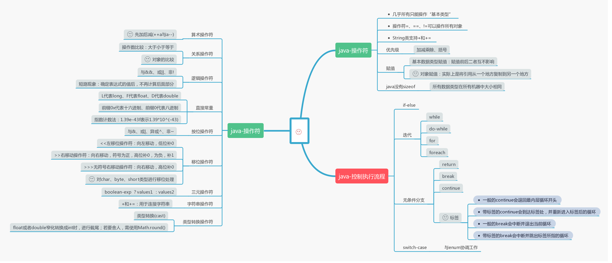

`前言`
> 这部分内容主要讲的是java操作符的一些特性以及控制流程如`for`,`while`等等。
<!--more-->
**************

                                                                    
## java操作符
### 对象赋值
对对象赋值实际是对对象引用进行操作，是将引用从一个地方复制到另一个地方，即假设`c=d`，那么c和d都指向原本只有d指向的那个对象。
```java
class Tank{
  int level;
}
Tank t1 = new Tank();
Tank t2 = new Tank();
t1.level = 9;
t2.level = 47;
t1 = t2;
/*
* output:
* t1.level = 47
* t2.level = 47
*/
t1.level = 27;
/*
* output:
* t1.level = 27
* t2.level = 27
*/
```
这是由于`t1 = t2`导致两个引用都指向了同一个对象，而原本`t1`指向的值为9的对象丢失最终被垃圾回收器自动清理。这个现象通常称作“别名现象”，为避免这种现象，可以`t1.level = t2.level`
### 对象的比较
```java
  Integer n1 = new Integer(47);
  Integer n2 = new Integer(47);
  /*
  * n1 == n2   output : false;
  * n1 != n2   output : true;
  */
```
虽然两个对象的值一样，但是==与!=比较的是对象的引用，因此得到的结果如上。若要比较对象的实际内容，可用`n1.equals(n2)`。但是在自己实现的类中使用`.equals()`还是无法比较对象的实际内容，这是由于`.equals()`默认行为是比较引用的，除非在自己类中覆盖`.equals()`方法，而在大多数的Java类库中都实现了`.equals()`。
### 对char、byte、short类型进行移位处理
对char、byte、short类型进行移位处理之前，需要转成int型，并且得到的结果也是int类型的值。
