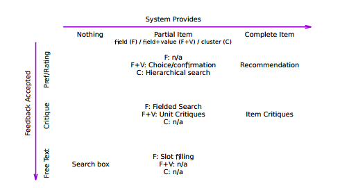

## 论文题目-会话搜索的理论框架
### 摘要
实现属性的会话系统的理论模型
### 引言
- 商业会话代理(聊天机器人)使用对话式的系统，帮助用户使用对话交互，回应用户的某些请求。
- 定义描述会话搜索过程的计算模型，特点如下：
  - 允许用户进行自然语言请求
  - 允许系统提出搜索结果，也可以在必要的时候要求用户澄清。
  - 允许用户对系统的结果和建议给予反馈
  - 允许系统根据用户的查询语句和其他相关反馈建立用户信息需求的累积图
- 为了建立会话搜索的计算模型，定义会话期间的步骤：
  - 系统和用户可以进行的语句类型
  - 系统在对话过程中建立用户信息需求的模型，以便不需要重复信息需求
  - 为了使对话更加灵活自然，大多数会采取的对话式步骤应该由系统解释，
  也可以由系统产生。
- 许多会话搜索任务是相似的：人们提供一个参考点或关键选择，以引出他们认为最重要的信息来区分他们可能推荐的地点
- 在口语对话系统领域中，已存在允许在模式中对结构化查询进行对话填充的方法；若没有固定的模式，则使用更多的自由对话来建立对用户需求的理解，并且可以提供响应以及提出澄清问题
- 对话搜索设置的两个方面：
  - 用户不知道如何描述他们的信息需求，对话的部分作用是帮助他们明确地阐明，从用户那里引出实际的需求
  - 对于多轮对话交互的任务，一组结果相互作用以产生满足需求的单个项目响应
- 目标是专门从信息检索的角度捕捉对话的理想属性，即通过询问会话代理来实现满足信息需求。在每一时间点上，会话代理执行一组固定操作中的一个，然后用户通过来回响应来响应实际的需求，即这种模式的关键部分为混合主动性和记忆力
- 两大贡献：
  - 建议从信息检索的角度对会话进行正式定义，说明为什么每个属性都是可取的
  - 提出一个理论模型的对话，使代理人能够满足形式属性，证明定义也是实用的

### 相关工作
- 搜索和推荐系统
  - 用户与提供各种响应的系统进行对话，并且一次将许多结果捆绑到单个搜索引擎结果页面中
  - 真正的对话可能有混合的主动性(即同一个任务理解系统可能会应用各种搜索策略)，对话的控制通过断言、命令、问题和提示从一侧传递到另一侧
  - 在口头对话或者屏幕较小的设备上，搜索系统选择一个响应或少量响应变得非常重要，而不是将大量结果合建议捆绑到结果页面
  - 对话推荐
  - 理想的会话信息检索系统可以允许用自然语言对建议结果进行自由形式批评
- 口语对话系统
  - 例一
  - 例二
- 人类视角
  - 对话作为揭示
  - 倡议和参与行为
  - 信任与道德品格

### 对话搜索
- 对话
  - 对话式搜索系统是一个混合主动式系统
  - 我们专注于旨在引出用户偏好的对话，并确定目标信息
  - 假设存在一个内存单元：对话是一个单元，可以在对话中引用先前的语句，允许以零碎的方式从用户获取信息，保持简单的步骤，共同描述任意复杂的信息需求。
  - 会话是适应性的
  - RRIMS属性：
    - 用户显示
    - 系统显示
    - 混合倡议
    - 记忆
    - 设置检索
- 涉及对话的搜索
  - 多面启发：用户正在搜索具有丰富属性的项目，这些属性可以单独指定，但是更容易分段提供
  - 多项目启发：尽管搜索具有容易建立相关性的项目，但用户对该项目的唯一已知描述取决于其他项目，其本身可能需要找到
  - 多项目分面启发：用户搜索一组项目，不仅要估计每个单个项目的效用，还必须结合多个项目的效用来评估整个集合
  - 边界选择/构建期望：会话界面可以通过为用户提供有限的选择来简化需求获取的问题

### 对话搜索模型
- 模型提供了系统可能提供给用户的三种基本类型的信息，即为系统可能会执行的操作
  - Nothing
  - Partial Item(部分项目)
    - 关注的特定项目功能字段(F)
    - 关注的项目功能字段(F)+功能字段的建议值(V)-(F+V)
    - 系统可以呈现一组项目(C)
  - 完整的项目
- 用户提供不同类型的反馈
  - 优先/等级(Pref/Rating)：例，系统为用户提供二进制或序数分数来回答问题，来给出两个或更多选择的偏好
  - 批评(Critiques)：指出系统呈现的项目或者部分项目不表示用户的信息需求
  - 自由文本(free test)：用户提供的最详细的反馈级别
- 动作空间模型的单元格解释  

  - 空系统-自由文本用户：大多数信息检索系统的起点，用户只需要输入一个可以输入任何查询的搜索框
  - 部分项目系统- 首选/评级用户：以各种方式向用户呈现关于匹配项目的部分信息
    - 让会话系统确认一个推断出的位置：“您正在寻找意大利餐厅，是否正确？”--F
    - 聚集项目，要求优先选择：“你愿意去一家高档餐厅，还是一个便宜的餐厅？”--C
    - 在一组(特征，价值)对上引用偏好：“你愿意用1000美元购买一台12英寸屏幕的笔记本电脑还是1200美元的14英寸屏幕的笔记本电脑”--F+V
  - 部分项目系统-批评用户  
  搜索为用户提供了已知字段的选择，并且用户可以为他们所期望的任何属性选择或指定范围，代理允许用户以这种方式澄清，而不是要求简单的是/否。例：
    - “您正在寻找一家意大利餐厅，是否正确？”
    - “不，我正在寻找一家印度餐厅”
  - 部分项目系统-自由文本用户：当系统要求用户填写信息需求的特定方面时，通常称之为插槽填充
  - 完成项目系统-Pref/Rating用户：对项目评级以提供进一步建议
    - 绝对的评价请求：“你有多少喜欢电影杀死比尔？”
    - 偏好要求：“你喜欢杀死比尔还是傲慢与偏见？”
- 系统改进
  - 系统可以选择给定的项目，然后允许用户细化其需要锚定项目属性的信息需求，来放大化系统寻找改进的可能方式
  - 对批评模型进行扩展，以便代理可以直接从用户反馈中了解有关收集的信息。例，对一部电影用户回应批评“这部电影太过分了”这可以告诉代理关于“血腥”概念的存在。
- 交互选择  
基于现有的用户/系统交互模型，将对话建模为用户和代理轮流使用的后台。为了方便起见，对话总是从代理开始，每次轮到代理，它有两个步骤：
    - 选择要执行的动作
    - 请求用户提供特定类型的响应  
- 代理可用的操作：
  - $a_0$ 空操作-不提供任何内容，请求用户描述信息需求的自由文本。
  - $a_p^1$ 系统提供单个部分项目/群集。要求用户提供评分，批评或自由文本。
  - $a_p^{2+}$ 系统提供两个或少量的部分项目，请求偏好，批评或自由文本。
  - $a_i^1$ 系统提供一个完整的项目。要求用户提供评分，批评或自由文本。
  - $a_i^{2+}$ 系统提供两个或少量的完整项目。要求用户提供偏好，批评或自由文本。
- 用户响应的类型
  - $r_r$ 当前项目圯部分项目的评分。
  - $r_p$ 所呈现的项目圯部分项目中的首选项。
  - $r_{np}$ 缺乏偏好，或者∅表明没有任何选择是合适的，或者？表明所有选项同样适用。
  - $r_c$ 对当前项目/部分项目的批评， 指示当前项目/部分项目如何被修改为与用户有更高的相
  关性。
  - $r_t$ 描述其信息需求的非结构化文本。
- 行为选择
