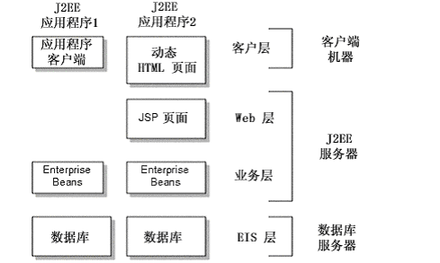
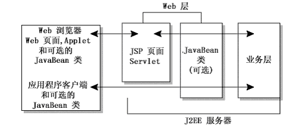
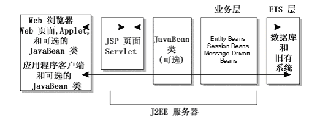
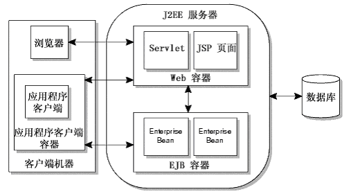
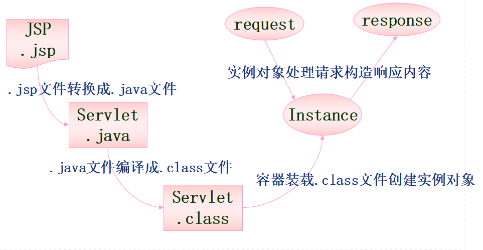

## J2EE
- J2ME:嵌入式设备及消费类电器
- J2SE:普通PC应用
- J2EE：企业网应用
  - 平台无关性
  - 支持异构环境
  - 可伸缩性强
  - 保留现有系统
  - 稳定的可用性
  - 高效开发：开发人员只需集中精力处理商业逻辑
  - 多层架构体系

## J2EE规范概述
- Sun公司为企业计算推出的企业级Java平台，工业标准、开放路线
- 用于开发、部署和管理N层结构、面向Web的，以服务器为中心的企业级应用
- 简化企业解决方案的开发、部署和管理相关的复杂问题
- 以核心Java平台和Java 2平台的标准版为技术基础
- J2EE应用编程模型：商业逻辑、表示逻辑
- J2EE平台本质上是一个分布式的服务器应用程序设计环境
  - 为应用提供运行时的基础框架环境
  - 一套用来创建应用的Java扩展编程接口API

## J2EE体系结构
J2EE使用多层的分布式应用模型，应用逻辑按功能划分为组件，各个应用组件根据他们所在的层分布在不同的机器上。事实上，sun设计J2EE的初衷正是为了解决两层模式(client/server)的弊端，在传统模式中，客户端担当了过多的角色而显得臃肿，在这种模式中，第一次部署的时候比较容易，但难于升级或改进，可伸展性也不理想，而且经常基于某种专有的协议，通常是某种数据库协议。它使得重用业务逻辑和界面逻辑非常困难。现在J2EE的多层企业级应用模型将两层化模型中的不同层面切分成许多层。一个多层化应用能够为不同的每种服务提供一个独立的层，以下是J2EE典型的四层结构:
- 运行在客户端机器上的客户层组件
- 运行在J2EE服务器上的Web层组件
- 运行在J2EE服务器上的业务逻辑层组件
- 运行在EIS服务器上的企业信息系统(Enterprise information system)层软件

### J2EE应用程序组件
J2EE应用程序是由组件构成的.J2EE组件是具有独立功能的软件单元，它们通过相关的类和文件组装成J2EE应用程序，并与其他组件交互。J2EE说明书中定义了以下的J2EE组件:
- 应用客户端程序和applets是客户层组件.
- Java Servlet和JavaServer Pages(JSP)是web层组件.
- Enterprise JavaBeans(EJB)是业务层组件.

#### 客户层组件
J2EE应用程序可以是基于web方式的,也可以是基于传统方式的.

#### web 层组件
J2EE web层组件可以是JSP 页面或Servlets.按照J2EE规范，静态的HTML页面和Applets不算是web层组件。
正如下图所示的客户层那样，web层可能包含某些 JavaBean 对象来处理用户输入，并把输入发送给运行在业务层上的enterprise bean 来进行处理。

#### 业务层组件
业务层代码的逻辑用来满足银行，零售，金融等特殊商务领域的需要,由运行在业务层上的enterprise bean 进行处理. 下图表明了一个enterprise bean 是如何从客户端程序接收数据，进行处理(如果必要的话), 并发送到EIS 层储存的，这个过程也可以逆向进行。

有三种企业级的bean: 会话(session) beans, 实体(entity) beans, 和消息驱动(message-driven)beans. 会话bean 表示与客户端程序的临时交互. 当客户端程序执行完后, 会话bean 和相关数据就会消失. 相反, 实体bean 表示数据库的表中一行永久的记录. 当客户端程序中止或服务器关闭时, 就会有潜在的服务保证实体bean 的数据得以保存.消息驱动 bean 结合了会话bean 和 JMS(java消息服务,java message service)的消息监听器的特性, 允许一个业务层组件异步接收JMS 消息.

### 企业信息系统层
企业信息系统层处理企业信息系统软件包括企业基础建设系统例如企业资源计划 (ERP), 大型机事务处理, 数据库系统,和其它的遗留信息系统. 例如，J2EE 应用组件可能为了数据库连接需要访问企业信息系统

## J2EE的结构
这种基于组件，具有平台无关性的J2EE结构使得J2EE程序的编写十分简单，因为业务逻辑被封装成可复用的组件，并且J2EE 服务器以容器的形式为所有的组件类型提供后台服务. 因为你不用自己开发这种服务, 所以你可以集中精力解决手头的业务问题.

### 容器和服务
容器设置定制了J2EE服务器所提供得内在支持，包括安全，事务管理，JNDI(Java Naming and Directory Interface)寻址,远程连接等服务，以下列出最重要的几种服务：
- **J2EE安全(Security)** 模型可以让你配置 web 组件或enterprise bean ,这样只有被授权的用户才能访问系统资源. 每一客户属于一个特别的角色，而每个角色只允许激活特定的方法。你应在enterprise bean的布置描述中声明角色和可被激活的方法。由于这种声明性的方法，你不必编写加强安全性的规则。
- **J2EE事务管理(Transaction Management)** 模型让你指定组成一个事务中所有方法间的关系，这样一个事务中的所有方法被当成一个单一的单元. 当客户端激活一个enterprise bean中的方法，容器介入一管理事务。因有容器管理事务，在enterprise bean中不必对事务的边界进行编码。要求控制分布式事务的代码会非常复杂。你只需在布置描述文件中声明enterprise bean的事务属性，而不用编写并调试复杂的代码。容器将读此文件并为你处理此enterprise bean的事务。
- **JNDI寻址(JNDI Lookup)** 服务向企业内的多重名字和目录服务提供了一个统一的接口,这样应用程序组件可以访问名字和目录服务.
- **J2EE远程连接(Remote Client Connectivity)** 模型管理客户端和enterprise bean间的低层交互. 当一个enterprise bean创建后, 一个客户端可以调用它的方法就象它和客户端位于同一虚拟机上一样.
- **生存周期管理(Life Cycle Management)** 模型管理enterprise bean的创建和移除,一个enterprise bean在其生存周期中将会历经几种状态。容器创建enterprise bean，并在可用实例池与活动状态中移动他，而最终将其从容器中移除。即使可以调用enterprise bean的create及remove方法，容器也将会在后台执行这些任务。
- **数据库连接池(Database Connection Pooling)** 模型是一个有价值的资源。获取数据库连接是一项耗时的工作，而且连接数非常有限。容器通过管理连接池来缓和这些问题。enterprise bean可从池中迅速获取连接。在bean释放连接之可为其他bean使用。

### 容器类型
J2EE应用组件可以安装部署到以下几种容器中去:
- **EJB容器** 管理所有J2EE应用程序中企业级bean的执行. enterprise bean和它们的容器运行在J2EE服务器上.
- **Web容器** 管理所有J2EE应用程序中JSP页面和Servlet组件的执行. Web组件和它们的容器运行在J2EE服务器上.
- **应用程序客户端容器** 管理所有J2EE应用程序中应用程序客户端组件的执行. 应用程序客户端和它们的容器运行在J2EE 服务器上.
- **Applet容器** 是运行在客户端机器上的web浏览器和Java插件的结合.

## J2EE核心技术
J2EE平台由一整套服务(Services)、应用程序接口(APIs)和协议构成，它对开发基于Web的多层应用提供了功能支持，下面对J2EE中的13种技术规范进行简单的描述(限于篇幅，这里只能进行简单的描述):
- **JDBC(Java Database Connectivity):** JDBC API为访问不同的数据库提供了一种统一的途径，象ODBC一样，JDBC对开发者屏蔽了一些细节问题，另外，JDCB对数据库的访问也具有平台无关性。
- **JNDI(Java Name and Directory Interface):** JNDI API被用于执行名字和目录服务。它提供了一致的模型来存取和操作企业级的资源如DNS和LDAP，本地文件系统，或应用服务器中的对象。
- **EJB(Enterprise JavaBean):** J2EE技术之所以赢得某体广泛重视的原因之一就是EJB。它们提供了一个框架来开发和实施分布式商务逻辑，由此很显著地简化了具有可伸缩性和高度复杂的企业级应用的开发。EJB规范定义了EJB组件在何时如何与它们的容器进行交互作用。容器负责提供公用的服务，例如目录服务、事务管理、安全性、资源缓冲池以及容错性。但这里值得注意的是，EJB并不是实现J2EE的唯一途径。正是由于J2EE的开放性，使得有的厂商能够以一种和EJB平行的方式来达到同样的目的。
- **RMI(Remote Method Invoke):** 正如其名字所表示的那样，RMI协议调用远程对象上方法。它使用了序列化方式在客户端和服务器端传递数据。RMI是一种被EJB使用的更底层的协议。
- **Java IDL/CORBA:** 在Java IDL的支持下，开发人员可以将Java和CORBA((Common Object Request Broker Architecture,公共对象请求代理体系结构,通用对象请求代理体系结构)是由OMG组织制订的一种标准的面向对象应用程 序体系规范)集成在一起。他们可以创建Java对象并使之可在CORBA ORB中展开, 或者他们还可以创建Java类并作为和其它ORB一起展开的CORBA对象的客户。后一种方法提供了另外一种途径，通过它Java可以被用于将你的新的应用和旧的系统相集成。
***
- **JSP(Java Server Pages):** JSP页面由HTML代码和嵌入其中的Java代码所组成。服务器在页面被客户端所请求以后对这些Java代码进行处理，然后将生成的HTML页面返回给客户端的浏览器。

**1、JSP概述**
- 在HTML语言中混合Java程序代码，由服务器端Java语言引擎解释执行
- HTML负责描述信息显示格式，JSP负责描述处理逻辑
- JSP代码执行需要JSP引擎，如Tomcat和Apache
- JSP开发的典型方式
  - 直接使用：显示简单的动态效果
  - JSP + JavaBeans：需要与数据库连接，管理诸如帐号之类的信息
  - JSP + JavaBeans + Servlet：将事务逻辑与表现逻辑分开，JSP负责表现逻辑的处理和输出，Servlet专注于处理Web的关键业务逻辑

**2、JSP引擎的工作原理**
- 将JSP页面翻译成一个Servlet(Java文件)
- JSP引擎调用Java编译器对这个Servlet进行编译，得到可执行的class文件
- JSP引擎调用java虚拟机来解释执行class文件，生成向客户端发送的应答，然后发送给客户
	**上述步骤在JSP页面第一次被访问时才会执行，以后会因为类文件已经生成而提高效率**

**3、JSP和ASP的比较**
- 相似之处
  - 均是运行于服务器，都属于动态网页生成技术
  - 都使用HTML来决定网页的版面，在HTML 代码中混合某种程序代码，由语言引擎解释执行程序代码
  - HTML负责描述显示样式，程序代码描述处理逻辑
- 区别
  - JSP基于JavaServlet及整个J2EE体系，支持跨平台
  - ASP由微软推出，只能在Windows平台上运行
  - ASP下的编程语言是 VBScript 之类的脚本语言，而JSP 使用的是Java
  - ASP与JSP还有一个更为本质的区别：两种语言引擎用完全不同的方式处理页面中嵌入的程序代码
    - 在ASP下，VBScript代码被ASP引擎解释执行
    - 在JSP下，代码被编译成Servlet并由Java虚拟机执行，这种编译操作仅在对JSP页面的第一次请求时发生

***
- **Java Servlet:** Servlet是一种小型的Java程序，它扩展了Web服务器的功能。作为一种服务器端的应用，当被请求时开始执行，这和CGI Perl脚本很相似。Servlet提供的功能大多与JSP类似，不过实现的方式不同。JSP通常是大多数HTML代码中嵌入少量的Java代码，而servlets全部由Java写成并且生成HTML。

**1、Servlet概述**
**Servlets＝Server ＋Applet**
- 运行于Web服务器端的Java小程序，用来扩展Web服务器功能
- 一种扩展Web服务器功能的技术，且由于用Java编写，所以能够访问整个Java API库，包括用于访问企业数据库的JDBC API
- 用特定的Java解决方案替代了其它的Web服Servlets务器方编程模式(如：CGI，ISAPI等)，因而继承了Java的所有特性(跨平台、多线程、OO)
- 用来编写Servlets的Servlet API对于服务器环境和协议没有任何特殊的要求，所以Servlets具有很强的可移植性，也不像利用CGI程序等其它方式那样具有性能局限
- Servlets也同样使用HTTP协议与客户端进行通讯，所以有时也称Sevlets为“HTTP Servlets”

**2、java servlet 和JSP的比较**
- 相似之处
  - 均基于Java技术，都继承了Java的所有特性，且都可以使用Java API
  - 工作方式相似：JSP代码先被JSP容器转换为Servlet代码再编译为类
  - 两者在J2EE体系结构中的工作层次相同，都负责与客户端的连接
- 区别
  - 编程方式不同：Servlets是一些运行于Web服务器端的Java小程序；而JSP是脚本，编写起来更简单容易
  - 应用目的不同：Servlet主要用于从客户端接收请求信息，而JSP主要负责将服务器端信息传送到客户端
  - JSP真正意义：可将界面设计和业务逻辑设计分离

***
- **XML(Extensible Markup Language):** XML是一种可以用来定义其它标记语言的语言。它被用来在不同的商务过程中共享数据。XML的发展和Java是相互独立的，但是，它和Java具有的相同目标正是平台独立性。通过将Java和XML的组合，您可以得到一个完美的具有平台独立性的解决方案。
- **JMS(Java Message Service):** MS是用于和面向消息的中间件相互通信的应用程序接口(API)。它既支持点对点的域，有支持发布/订阅(publish/subscribe)类型的域，并且提供对下列类型的支持：经认可的消息传递,事务型消息的传递，一致性消息和具有持久性的订阅者支持。JMS还提供了另一种方式来对您的应用与旧的后台系统相集成。
- **JTA(Java Transaction Architecture):** JTA定义了一种标准的API，应用系统由此可以访问各种事务监控。
- **JTS(Java Transaction Service):** JTS是CORBA OTS事务监控的基本的实现。JTS规定了事务管理器的实现方式。该事务管理器是在高层支持Java Transaction API (JTA)规范，并且在较底层实现OMG OTS specification的Java映像。JTS事务管理器为应用服务器、资源管理器、独立的应用以及通信资源管理器提供了事务服务。
- **JavaMail:** JavaMail是用于存取邮件服务器的API，它提供了一套邮件服务器的抽象类。不仅支持SMTP服务器，也支持IMAP服务器。
- **JAF(JavaBeans Activation Framework):** JavaMail利用JAF来处理MIME编码的邮件附件。MIME的字节流可以被转换成Java对象，或者转换自Java对象。大多数应用都可以不需要直接使用JAF。
***
- **JavaBean**

**1、概述**
- JavaBean是基于Java的组件模型，类似于Microsoft的COM组件
  - JavaBean通过Java虚拟机执行
  - 可以无限扩充Java程序的功能，通过组合快速生成新的应用程序
  - JavaBean传统的应用在于可视化的领域，如AWT下的应用
    - 自从JSP诞生后，JavaBean更多的应用在了非可视化领域，在服务器端应用方面表现出来了越来越强的生命力
- JavaBean区别于Java类的特点
  - 有公共无参数的构造函数
  - 每一个属性都要有set，get方法
  - 实现Serializable接口

**2、JavaBean的组成**
- 属性
  - 在设计Bean时可以改变的外观和行为特征
  - 开发工具通过对Bean进行内省来获知其属性，进而发布其属性
- 方法
  - JavaBean中的方法就是通常的Java方法，它可以从其他组件或在脚本环境中调用
  - 默认情况下，所有bean的公有方法都可以被外部调用，但bean一般只会引出其公有方法的一个子集
- 事件
  - Bean与其他组件交流信息的主要方式是发送和接收事件

***
## J2EE安全机制
**1、J2EE的安全概念**
- 主体(Principal)
被在企业安全服务验证了的实体，常用主体名(用户登陆名)作为他的标识，通过与主体相关的验证数据(登陆密码)进行验证
- 安全策略域(Security Policy Domain)
从安全策略角度划分的逻辑区域，同一区域内的主体采用相同的安全策略
- 安全技术域(Security Technology Domain)
在一个安全技术域中使用同样的安全机制来执行安全策略，一个安全技术域可包括多个安全策略域
- 安全属性(Security Attributes)
每个主体都有一系列与之相关的安全属性，用于访问被保护的资源，检查用户身份和完成其他安全相关功能
- 凭证(Credential)
包含或引用为J2EE系统验证一个主体的安全属性。若通过，将获得一个包含安全属性的凭证

**2、授权**
基于用户权限或用户类别管理对受保护系统资源的访问
- 代码授权(Code Authorization)
  - 通过Java 2安全模型来限制特定J2SE的类和方法的执行，以保护系统安全
- 调用者授权(Caller Authorization)
  - 由应用程序装配者或应用程序部署者分配的安全角色(具有相同安全属性的逻辑组)
- 安全角色引用
  - 由应用程序提供者用来引用安全角色的标识
- 用户和组
  - 实际环境中的用户及用户的集合
- 访问控制
  - 确保安全角色只能访问已授予它安全权限的授权对象(EJB的远程方法、Web资源等)，访问控制在应用程序描述文件中与安全角色关联
- 映射
  - 将实际环境中的用户和角色与安全角色联系起来，使实际用户具有对企业资源访问的适当权限
- 被传播的调用者身份标识(Propagated Caller Identity)
  - 用传播调用者标识作为web组件和ejb组件调用者的标识来进行验证 ,要注意的是在调用链中传递的是用户的标识，而不是凭证(credentials)

**3、验证**
用户或组件调用者向系统证明身份的过程
- Web客户端的验证
  - HTTP基本验证：利用用户名和密码作为验证信息
  - 基于表单的验证：可根据用户需求定制登陆和出错界面
  - 基于客户端证书的验证：通过HTTPS(HTTP over SSL)来保证验证的安全性
- Application客户端的验证(微信网页版怎么验证)
  - 单点登陆SSO
    - 在特定的逻辑安全区域中，只需要登陆一次即可访问不同应用系统中的授权资源
    - J2EE通过凭证来实现单点登陆
  - 惰性验证：用户访问受保护资源时才执行验证过程

**4、SSO的主要实现方式**
- 共享cookies
基于共享同域的cookie是Web刚开始阶段时使用的一种方式，它利用浏览同域名之间自动传递cookies机制，实现两个域名之间系统令牌传递问题；另外，关于跨域问题，虽然cookies本身不跨域，但可以利用它实现跨域的SSO 。如：代理、暴露SSO令牌值等。
**缺点：不灵活而且有不少安全隐患，已经被抛弃。**

**cookies原理**
当用户使用浏览器访问一个支持Cookie的网站的时候，用户会提供包括用户名在内的个人信息并且提交至服务器；接着，服务器在向客户端回传相应的超文本的同时也会发回这些个人信息，当然这些信息并不是存放在HTTP响应体（Response Body）中的，而是存放于HTTP响应头（Response Header）；当客户端浏览器接收到来自服务器的响应之后，浏览器会将这些信息存放在一个统一的位置，对于Windows操作系统而言，我们可以从： [系统盘]:\Documents and Settings[用户名]\Cookies目录中找到存储的Cookie；自此，客户端再向服务器发送请求的时候，都会把相应的Cookie再次发回至服务器。而这次，Cookie信息则存放在HTTP请求头（Request Header）了。有了Cookie这样的技术实现，服务器在接收到来自客户端浏览器的请求之后，就能够通过分析存放于请求头的Cookie得到客户端特有的信息，从而动态生成与该客户端相对应的内容。通常，我们可以从很多网站的登录界面中看到“请记住我”这样的选项，如果你勾选了它之后再登录，那么在下一次访问该网站的时候就不需要进行重复而繁琐的登录动作了，而这个功能就是通过Cookie实现的。
***

- Broker-based(基于经纪人)
这种技术的特点就是，有一个集中的认证和用户帐号管理的服务器。经纪人给被用于进一步请求的电子身份存取。中央数据库的使用减少了管理的代价，并为认证提供一个公共和独立的 "第三方"。例如Kerberos、Sesame、IBM KryptoKnight(凭证库思想)等。Kerberos是由麻省理工大学发明的安全认证服务，已经被UNIX和Windows作为默认的安全认证服务集成进操作系统。
- Agent-based(基于代理人)
在这种解决方案中，有一个自动地为不同的应用程序认证用户身份的代理程序。这个代理程序需要设计有不同的功能。比如，它可以使用口令表或加密密钥来自动地将认证的负担从用户移开。代理人被放在服务器上面，在服务器的认证系统和客户端认证方法之间充当一个“翻译”。例如SSH等。
- Token-based
例如SecureID,WebID，现在被广泛使用的口令认证，比如FTP、邮件服务器的登录认证，这是一种简单易用的方式，实现一个口令在多种应用当中使用。
- 基于网关
- 基于SAML
SAML(Security Assertion Markup Language，安全断言标记语言)的出现大大简化了SSO，并被OASIS批准为SSO的执行标准。开源组织OpenSAML实现了SAML规范。

## J2EE平台的角色分类
**角色分类**
- J2EE产品提供者
  - 实现提供了容器、API及其他特征的J2EE产品
- 应用组件提供者
  - 开发应用程序构建块(如HTML文档、EJBs、JSPs等)
  - 在许多场合该角色可进一步细分
- 应用组装者
  - 使用由组件提供者开发的组件，并将他们组装成一个完整的J2EE应用
- 部署者
  - 部署、配置和运行EJB及Web应用
- 系统管理员
  - 配置和管理架构环境
- 工具提供者
  - 提供应用组件开发和打包工具

**J2EE部署**
- JAR—Java Archive
  - Java类文件
  - EJBs
- WAR—Web Archive
  - Servlets
  - JSPs
- EAR—Enterprise Archive
  - 包含构成整个应用的所有其他JARs和WARs
- 配置描述符
  - XML
  - EJB JARs，WAR及EARs均需要
