## 大型网站架构的目标与挑战
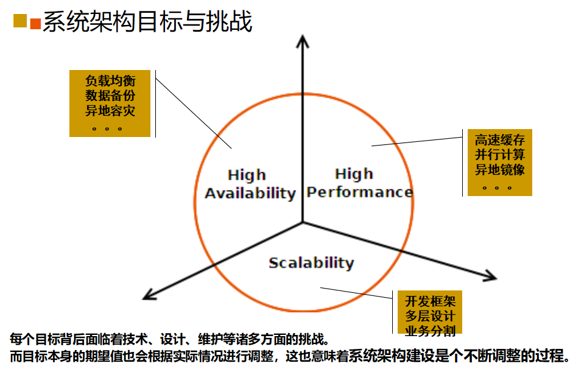

## 网站架构演变及其技术脉络
### 硬件方面
- **处理能力的提升：** 部署多颗CPU，选择多核心、具备更高运算频率、更大高速缓存的CPU；
处理能力的提升最直接的反应在于Web请求的处理效率和应用程序的执行效率。
- **内存带宽与容量：**
内存带宽与容量的提升最直接的反应在于应对数据库大量的数据交换。
- **磁盘搜索与I/O能力：** 选择更高的转速、更大的硬盘缓存、组件磁盘阵列RAID
磁盘搜索与I/O能力的提升最直接反应在于数据库大量的查询和读写以及文件的读写。
- **网络带宽的提升：** 更大带宽、多线路接入、独享带宽

### 部署方面
#### 1.web动静态资源分离及其与DB物理分离
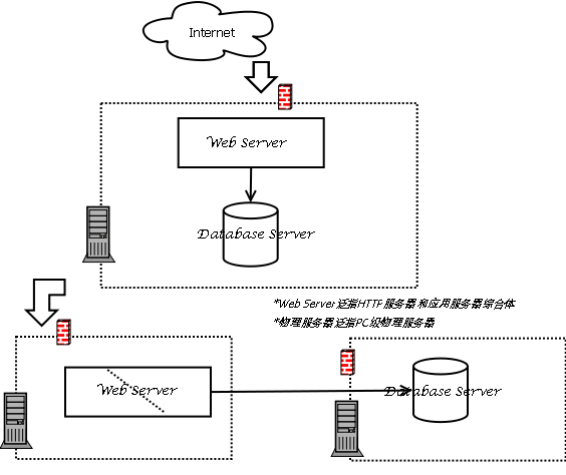
- 优点：“简单”、安全性提高
- 缺点：存在单点，谈不上高可用性(high availability架构目标)
- 技术点：应用设计要保证可扩展(framework很重要Spring/Beetle)、Web Server动/静态资源分离、Web Server(Apache\Nginx\IIS\JBoss…)、Database Server(Mysql\Oracle\Redis…)

**注意：** 一般地，本文提到的物理服务器都是泛指pc级物理服务器；Web Server泛指HTTP服务器和应用服务器综合体对于一个试水性网站来说为了节约成本，Web Server和DB Server都放在同一台pc Server服务器上是常见的事情。当网站访问量增大，cpu处理能力是瓶颈的时候，通过把web Server和Db Server简单物理分开的，效果明显！

web动静态资源分离：
- img,doc,js,css等静态资源使用单独的Web HTTP Server处理请求
- 动态页面静态化处理

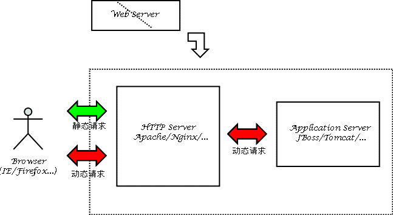
- 效率最高、消耗最小的就是纯静态化的html页面，所以网站尽可能使用静态页面来实现。但是对于大量内容且频繁更新的网站，无法全部手动实现，于是出现了常见的信息发布系统CMS，像各门户站点的新闻频道，甚至其他频道，都是通过信息发布系统来管理和实现的，信息发布系统可以实现最简单的信息录入自动生成静态页面，还能具备频道管理、权限管理、自动抓取等功能。对于一个大型网站来说，拥有一套高效、可管理的CMS是必不可少的。
- 除了门户和信息发布类型的网站，对于交互性要求很高的社区类型网站来说，尽可能的静态化也是提高性能的必要手段，将社区内的帖子、文章进行实时的静态化，有更新的时候再重新静态化也是大量使用的策略，像Mop的大杂烩就是使用了这样的策略，网易社区等也是如此。
- 同时，html静态化也是某些缓存策略使用的手段，对于系统中频繁使用数据库查询但是内容更新很小的应用，可以考虑使用html静态化来实现，比如论坛中论坛的公用设置信息，这些信息目前的主流论坛都可以进行后台管理并且存储再数据库中，这些信息其实大量被前台程序调用，但是更新频率很小，可以考虑将这部分内容进行后台更新的时候进行静态化，这样避免了大量的数据库访问请求。

#### 2.采取缓存处理
访问量持续增大，页面响应越来越慢。考虑到网站还处在试水性成长阶段，节约成本，硬件不动，着重应用本身优化。采取缓存处理机制是个必然的选择。
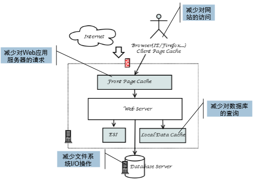
- 优点：简单有效、维护方便
- 缺点：依然存在单点
- 技术点：客户端(浏览器)缓存、前端页面缓存、页面片段缓存、本地数据缓存/数据库缓存
  - 客户端(浏览器)缓存
    能够让浏览器缓存的数据一定要缓存；浏览器能够处理的运算，决不放在服务器端来处理。
    - 根据HTTP协议特性，修改Header参数(Cache-Control、Expires、Pragma、Last-Modified、Etag)，让浏览器来缓存页面(一些优秀开发框架会对此做透明的封装，例如：Beetle)
    - 使用HTTP1.1协议，由于http pipelining技术特性，能够使用get请求的决不采取post请求
    - 为了节约带宽，压缩页面(Content-Encoding: gzip)；页面各个元素能“小”即“小”，例如：js包压缩，js合并，图片压缩等
    - 会话状态信息采取Cookie代替传统使用服务器Sessions对象存储习惯做法；使用Ajax实现页面局部刷新
    - 如果可能，可采取浏览器插件技术突破浏览器功能限制，将原本在服务器端运算，尽量迁到浏览器端。ActiveX/Applet/Flash/….HTML5(最值得期待，她的出现必定改变整个Web世界)
  - 前端页面缓存
    - 访客向网站发出访问请求,由前端页面缓存器负担原服务器的处理进程做出响应,获取原服务器的相应网页内容,将其储存在自身的内存中,与此同时,传送给访客这一缓存的内容;如有另一访客也请求访问之前的相同内容,前端页面缓存器毋须再次获取原服务器上的相应内容,而直接从自身的内存中获取,将这一内容传送给访客。反之,前端页面缓存器也可缓存访客的GET和POST请求。

    - 访客实际面对的是前端页面缓存器,与网站之间的通讯完全由前端页面缓存器反向代理,而非原服务器直接响应访客,这将大大加快访客上网流畅度,有效提升访问量,显著降低带宽占用,减轻原始服务器的繁忙度,加快响应速度,毋须不停地购置大内存,大硬盘,扩容电力设施为服务器端节省成本。
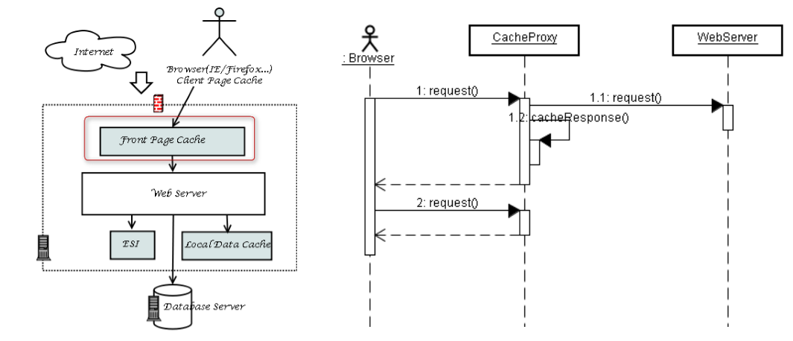
**注意：** 采用具备缓存功能的http反向代理服务器作前端页面缓存器，Varnish\Squid\Ncache\AiCache(商业)…[硬件F5]

  - 页面片段缓存ESI(Edge Side Includes)
    - ESI是一个基于XML的标记语言，目的是在HTTP中组装各种资源。在实际环境中，一个动态生成的页面，当中可能只有少量的内容是频繁变化的或是个性化的，对于传统的Cache服务器来说，为了能够保证页面的时效性，却由于页面中这些少量的动态内容而无法将整个页面进行缓存。ESI通过使用简单的标记语言来对那些可以缓存和不能缓存的网页中的内容片断进行描述，每个网页都被划分成不同的小部分分别赋予不同的缓存控制策略，使Cache服务器可以根据这些策略在将完整的网页发送给用户之前将不同的小部分动态地组合在一起。通过这种控制，可以有效地减少从服务器抓取整个页面的次数，而只用从原服务器中提取少量的不能缓存的片断，因此可以有效降低原服务器的负载，同时提高用户访问的响应时间。
    - ESI需要服务器端支持，常见apache(mod_esi)、WebLogic、JSP标签库(JESI)等。

  - 本地数据缓存
    - 关系数据库系统(如：Oracle\MySql)
    Query Cache策略：
      - 一般以sql为key来缓存查询结果，尽量不要拼sql，使用PreparedStatement的“？”模式sql；
      - Query Cache大小要根据数据库系统具体情况合理设置，过大只会浪费内存，参考值：128M
    - 关系数据库系统Data
    Buffer策略：就是数据库数据内存缓存器，其访问命中率决定数据库性能，可根据实际物理内存大小适量增大，如：MySql建议buffer值为物理内存60-80%
    - 应用服务器Cache包括：对象缓存(例如：对象线程安全，做成单例)，更新频率不大数据考虑缓存(如：基表数据、配置文件信息)，考虑使用线程池，对象池，连接池等
    - 常见java解决方案：map\OSCache\EHCache等
**注意：** 1、需要从数据库系统和Web应用服务器两个层面考虑缓存优化
     2、常见缓存算法：（贝莱蒂算法、最近最少使用算法、最近最频繁使用算法、伪LRU算法）

#### 3.增加机器做HA、数据库读写分离
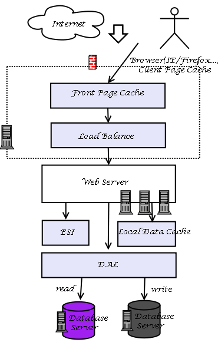
- 优点：增加服务器和HA机制，系统性能及可用性得到保证
- 缺点：读写分离，增加程序难度，架构变复杂，维护难度增加
- 技术点：负载均衡、DAL、数据库读写分离
  - 负载均衡
  LVS(LVS集群采用IP负载均衡技术和基于内容请求分发技术。调度器具有很好的吞吐率，将请求均衡地转移到不同的服务器上执行，且调度器自动屏蔽掉服务器的故障，从而将一组服务器构成一个高性能的、高可用的虚拟服务器。整个服务器集群的结构对客户是透明的，而且无需修改客户端和服务器端的程序)
  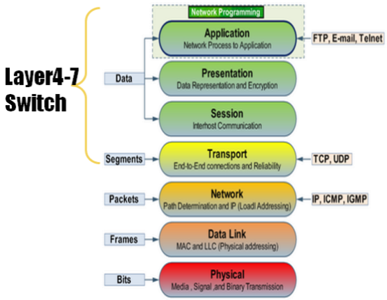
  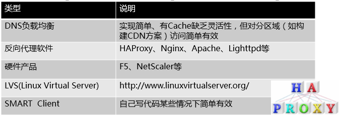
  - 数据库读写分离及DAL
  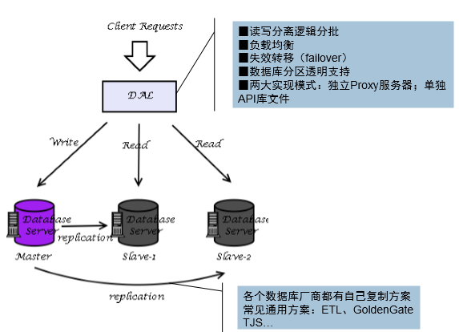
各个关系数据库厂商针对dal及replication都有自己方案
独立的DAL Proxy服务器(MySQL: mysqlproxy,Amoeba；PostgreSQL: PL/Proxy)DAL API(Java: Hibernate Shard,Ibatis Shard,HiveDB,Guzz；Python: Pyshards)

#### 4.CDN、分布式缓存、分库
网站业务发展迅速，数据量大幅增大是当前最大的挑战，用户分散各地区，某些地方用户访问响应很慢，影响体验和业务发展；同时，由于数据量过大，数据缓存在本地内存已经不现实，分布式缓存是必然选择了。
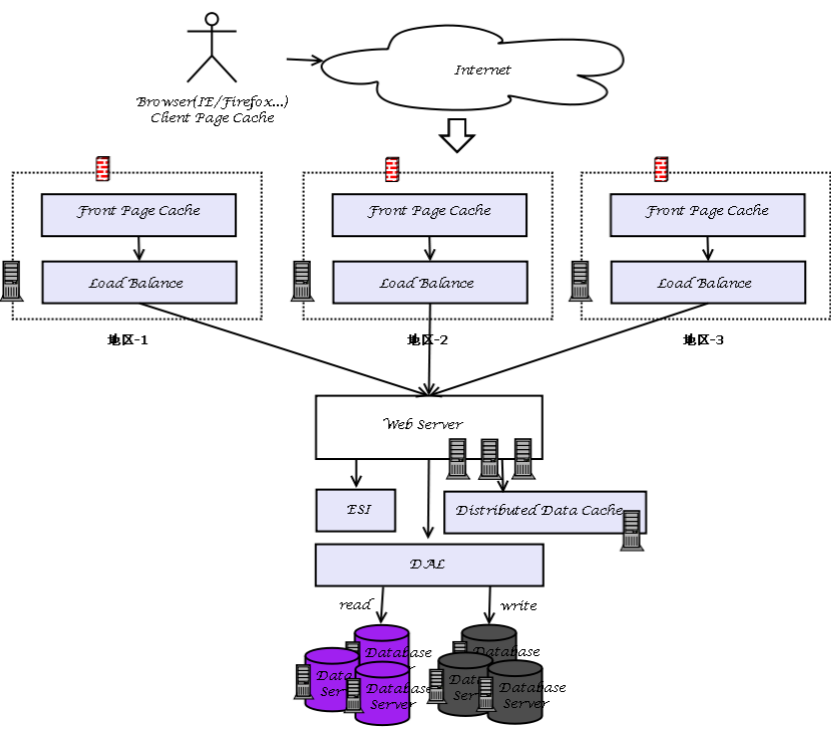
- 优点：异地缓存有效解决不同地方用户访问过慢的问题；分库策略带来网站性能整体提升
- 缺点：成本大幅增加，架构进一步复杂化，也维护难度进一步增大，架构开始臃肿了
- 技术点：CDN、分布式缓存、Shard分库
  - CDN
  CDN的全称是Content Delivery Network，即内容分发网络。其目的是通过在现有的Internet中增加一层新的网络架构，将网站的内容发布到最接近用户的网络"边缘"，使用户可以就近取得所需的内容，解决 Internet网络拥挤的状况，提高用户访问网站的响应速度。从技术上全面解决由于网络带宽小、用户访问量大、网点分布不均等原因所造成的用户访问网站响应速度慢的问题。 (也就是一个服务器的内容，平均分部到多个服务器上，服务器智能识别，让用户获取离用户最近的服务器，提高速度。
  - 分布式缓存
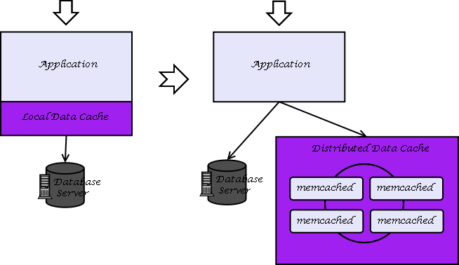
    - 本地缓存性能优秀，但容量有限，无伸缩性
    - 采用分布式缓存方案突破容量限制，具备良好伸缩性；但分布式涉及远程网络通信消耗其性能本地缓存来得优秀，并可涉及节点状态维护及数据复制问题，其稳定性和可靠性是个挑战。
    - 目前流行分布式缓存方案：memcached、membase、redis等，基本上当前的NoSQL方案都可以用来做分布式缓存方案
  - 分库：垂直分区和水平分区两种。
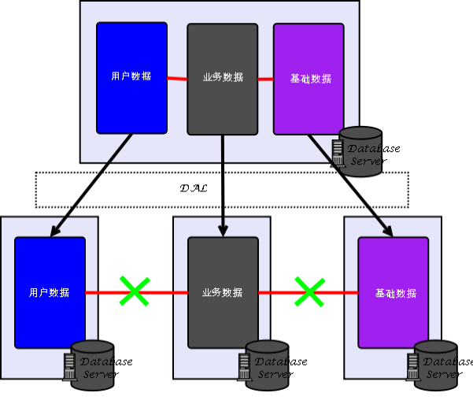
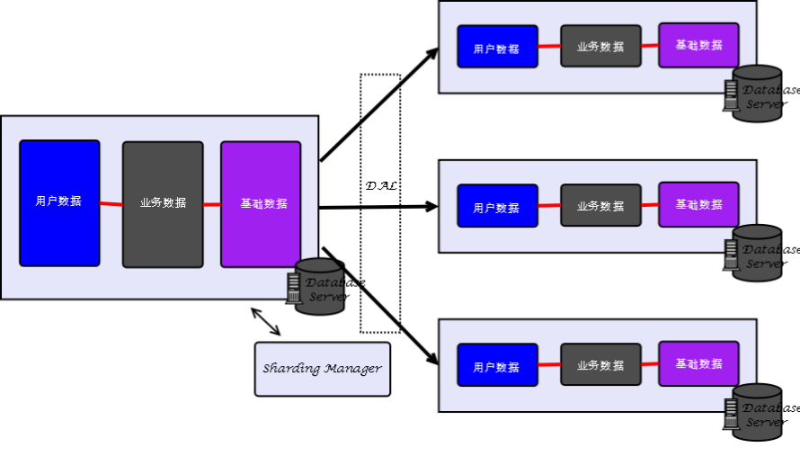
垂直分库后，各模块数据之间如何关联查询？垂直分库前提是良好的松耦合的模块化设计
水平分区中，Shard是分布式解决方案，与数据库集中式的表空间分区是两个不同方案(分片Key识别(划分检索依据)是关键)

#### 5.多个数据中心，向分布式存储和计算的架构体系迈进
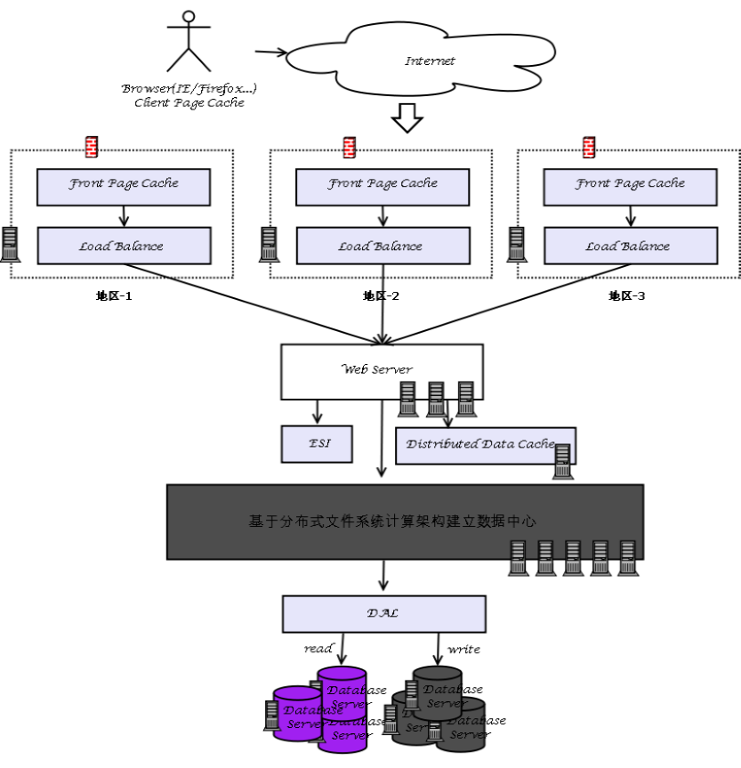
- 优点：多数据中心，带来更高质量区域服务体验；分布式存储及计算架构有效解决pb级数据量存储、检索及计算性能问题
- 缺点：架构复杂、数据同步、一致性及系统维护、技能要求等成本十分高
- 技术点：分布式文件系统、Map/Reduce、Key-Value存储
  - 分布式存储计算解决方案[DFS、Map/Reduce、Key-Value DB]
  DFS提供了一个全局命名空间的高可用(通过跨机器(和跨机架)的文件数据复制来达到高可用性，免受传统文件存储系统无法避免的许多失败的影响)文件系统，解决高容量数据高效、可靠存储问题；Map/Reduce的计算框架，它与DFS紧密协作，帮助处理收集到的海量数据;Key-Value DB代替传统的数据库，通过一些主键来组织海量数据，并实现高效的查询。
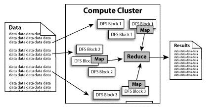
    - DFS分布式文件系统，如：Lustre\HDFS\GFS\TFS\FreeNas等
    - Map/Reduce算法（计算框架），基本上现有NoSQL数据库中都支持此算法。
    - Key-Value DB，也作为NoSQL解决方案，如：BigTable\Tair\Hbase\ HyperTable等
    - 提供完整解决方案：
      - Google(GFS|Map/Reduce|BigTable)
      - Apache Hadoop(HDFS|Map/Reduce|HBase)
## 架构设计理念与原则
