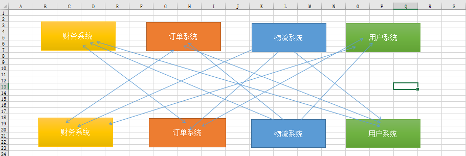

## SSH

[见另外一篇博客内容](http://jackeyzzhold.xyz/2018/03/10/java-ssh%E6%A1%86%E6%9E%B6-3/)
## SOA
SOA的全称是Service-Oriented Architecture，面向服务架构。它是一种架构，不是一种具体的开发技术。
SOA是通过功能组件化、服务化来实现系统集成、解决信息孤岛，这就是其主要目标。而更进一步则是实现更快响应业务的变化、更快推出新的应用系统。与此同时，SOA还实现了整合资源、资源复用。
**软件开发四阶段：**
- 汇编语言开发
- 面向过程的软件
- 面向对象的组件开发
- 面向服务的架构开发，即SOA

**SOA特点：**
- SOA是一种开发思想。是一种松耦合的框架。可以让软件超越开发语言。
- SOA的开发需要SOA体系的支撑，就像J2EE应用一样，离不开应用服务器。SOA也一样，也有一个类似J2EE服务器的东西支持着整个SOA体系架构----ESB(Enterprise Service Bus)，企业服务总线。通过这个总线，将多个系统连接起来。
- SOA是基于消息请求响应的一个系统，对请求类型有高度的兼容性。与一个Web应用容器相比，web应用容器只能处理HTTP请求，而 SOA的ESB可以接受HTTP、FTP、WebService、JMS...等请求。这就使得SOA架构具有高度的兼容性，可以将不同的平台集成到一起，从而相互协调工作。

**SOA的使用场景：**

通过上面的图我们可以看出，多个子系统直接相互交互，相互调用非常凌乱，这样我们就很不爽，所以我们就用到了我们的SOA架构，SOA又叫服务治理，SOA就是帮助我们把服务之间调用的乱七八糟的关系给治理起来，然后提供一个统一的标准，把我们的服务治理成下图所示，以前我们的服务是互相交互，现在是只对数据总线进行交互，这样系统就变得统一起来。

统一标准：各系统的协议、地址、交互方式。
新的交互方式：各个系统分别根据统一标准向数据总线进行注册，各子系统调用其他子系统时，我们并不关心如果找到其他子系统，我们只招数据总线，数据总线再根据统一标准找其他子系统，所以数据总线在这里充当一个只路人的作用。
**SOA的好处：**
- 降低用户成本，用户不需要关心各服务之间是什么语言的、不需要知道如果调用他们，只要通过统一标准找数据总线就可以了。
- 程序之间关系服务简单
- 识别哪些程序有问题（挂掉）

**缺点：** 提示了系统的复杂程度，性能有相应影响。

**数据总线：**

数据总线是起到调度服务的作用，数据总线不是集成服务，数据总线更新一个调度框架，每个服务需要根据约定向数据总线注册服务，那么如何注册那？其实数据总线就像一个字典结构，
数据总线里面一个key对于一个value，key指的是服务名，value则是服务的调度方式，还有一点需要说明的是，数据总线只是指路人，服务是不经过数据总线的，如上图的黄色线的路径。
数据总线通过域名解析实现:一个域名绑定多台服务器，ajax也可以，dns也可以，解析域名嘛。
其实数据总线还有一些高级应用，比如心跳检测，实现负载均衡等等，就不细说了，目前应用数据总线的有阿里的dubbo,还有zookeeper。

## ESB
ESB是一种在松散耦合的服务和应用之间的标准的集成方式，可以作用于：
- 面向服务的架构-分布式的应用由可重用的服务组成
- 面向消息的架构-应用之间通过ESB发送和接受消息
- 事件驱动的架构-应用之间异步地产生和接收消息

**ESB服务：**
- 传输服务
  - 安全、可靠的数据传输
  - 永久性/非永久性
  - 同步/异步
- 仲裁服务
  - 路由
  - 格式转换
- 事件服务
  - 事件发现和发布
  - Publish/Subscribe

**ESB功能：**
- 通信
- 集成
- 服务交互
- 服务质量
- 安全性
- 消息处理
- 服务级别
- 管理和自治
- 建模
- 基础架构智能

**WebSphere DataPower**
- 简化SOA
- 保护SOA
- 加速SOA

应用场景：
- 保护对外的web服务
- 传统系统集成
- hub式的中介服务
- 加速动态的web站点

**不采用传统架构，而采用ESB总线的原因：**
- 利用开放标准，将软件资产展现为服务的架构
- 面向服务的体系架构
- 总体性价比

***
**OSB**
- 易用性加强
- 性能提升
  - 采用Cache机制，为静态响应信息提升性能。静态响应信息是指在一段时间内不会发生变化的信息，如天气预报，手机套餐，人民币汇率等，这些数据变化的周期通常是1天，1月。
  - 实现手段：采用比较成熟的开源Memcached或者轻量级的JCACHE。
- 管控能力增强

***
**Mule**
- 社区活跃度
- 易用性
“让一切变得更简单”是Mule的宗旨。2次重构核心架构、推出接入云应用，消息流，基于模式的配置以及热部署；Mule IDE3.0，将支持图元拖拽，简化开发。
- 扩展性
增加一个新协议非常简单，只需实现5个接口类即可
- 管理性
  - 异常处理框架
  **异常策略设置级别:** model和service
  **异常处理方式：**
      - 1.将异常路由到指定的目的地
      - 2.根据异常类型过滤异常，并路由到指定目的地
      - 3.设置重试次数
      - 4.当采用了事务时，可以在异常处理策略中设置当发生异常时是继续提交还是回滚事务。
- 文档
文档非常丰富，降低了使用门槛。

***
**ServiceMix**
**优势：**
- 无缝集成CXF,ActiveMQ,Camel和ODE
- JBI的优势
- 基于OSGI
- 基于Karaf

**缺点：**
- JBI规范太复杂
- 架构复杂
- 缺少IDE的支持
- 缺少governor的支持
- 学习门槛高

***
**Synapse/WSO2 ESB**
WSO2 ESB对Synapse增加了企业级特征：
- 1.基于WSO2的Carbon平台（OSGi框架）
- 2.支持集群、负载均衡和failover routing
- 3.支持流量控制和数据缓存

还增加了外围产品：
- 1. WSO2 Governance Registry，服务注册产品
- 2. WSO2 ESB management console，ESB管理控制台
- 3. WSO2 Carbon Studio，开发ESB的studio

**WSO2 ESB的优势：**
- 基于Axis
- 基于WSO2的Carbon平台
- 支持集群
集群中节点间的通信框架基于Apache Tribes（组通信框架）
相关信息持久化在内嵌的Derby中
支持一个主节点和多个从节点
- failover routing
在集群环境中，所有的请求只能被主节点接收，从节点只能作为备份节点。
- 支持流量控制
在单个ESB实例或者集群中，可以在服务级别配置流量控制。当请求数超过阀值时，ESB将被拒绝访问。
实现机制：借助组件Throttling Mediator
- 支持数据缓存
集群中的各个ESB实例共享缓存的数据。当一个请求被ESB实例1处理完后返回响应信息，当再次向ESB实例1或者集群中其他的ESB实例发送该请求时，直接从缓存中取出原来的响应信息。
实现机制：借助组件Caching Mediator
- WSO2 Governance Registry：开源中最优秀的服务注册项目
- WSO2 ESB management console
创建和管理各组件（接入层、中介层和接出层）；
图形化地方式统计系统资源（CPU,内存）；
图像化统计ESB中各组件（接入层、中介层和接出层）接收发送消息的大小以及响应时间；
记录系统日志、SOAP日志；图形化显示消息的流向
- 文档丰富
- 大量使用实例

**缺点：**
- 架构不够清晰
- 扩展性差
- 组件比较混乱
