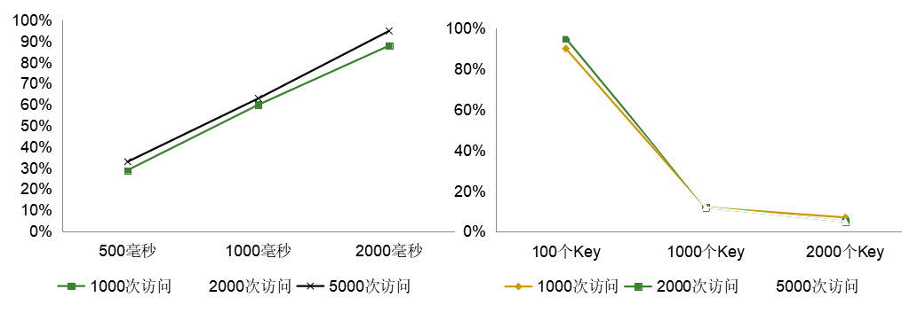
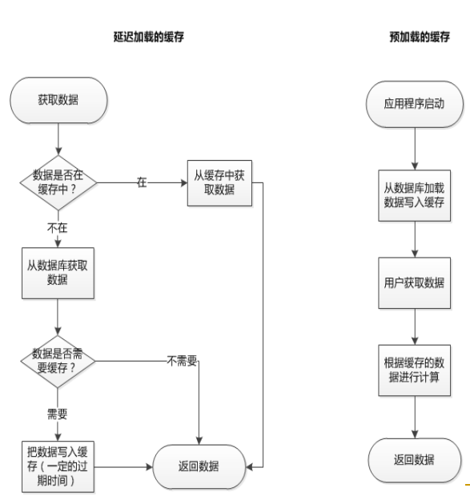

## 缓存的基本知识
### 由来
- 两种介质的速度不匹配(差距较大)的问题导致：高速方在和低速方交互的时候因等待速度趋近于低速方，并且闲置得不到有效利用
- 存在第三方介质，速度介于两者之间，价格介于两者之间。通过引入这种介质，把低速方部分内容保存在这个介质中，高速方大多情况下无须和低速方直接交互来提高整体性能
- 典型的例子：CPU缓存(高速方CPU低速方内存)，内存(高速方CPU低速方磁盘)

### 分类
- 硬件领域中缓存(某种介质)，软件领域中的缓存(不限于某种介质，只是一种手段)，这里我们讲的缓存都是软件缓存。
- 读取缓存(解决读取速度慢)，写入缓存(解决写入速度慢)，读写缓存
- 狭义上解决介质读写速度不匹配问题，广义上包括任何利用中间媒介提高速度的方法，包括空间换时间，动态操作变成静态操作

## 网站架构中缓存的分类
- 按照存储介质来分
  - 内存(网站进程内、同服务器独立进程、独立服务器、分布式服务器组)
  - 磁盘(本地文件和数据库、独立服务器、分布式服务器组)
  - 缓存可以使用磁盘而不仅仅是内存
- 按照存储的数据来分
  - 直接用于输出的整页(HTML、脚本样式、图片)
  - 片段页(可供多个客户端使用的HTML、脚本样式等)
  - 索引和聚合数据(空间换时间)
  - 耗时查询的结果数据
  - 和业务相关的大块数据(列表数据、引用数据)
  - 和业务相关的小块数据(行级数据、资源数据)
  - 和上下文(用户)相关的数据(活动数据)
- 按照实现方式来分
  - 框架或引擎内置的缓存(比如ORM缓存和SQL Server缓存)
  - 安装特定的组件根据规则自动实现缓存(比如反向代理和输出缓存)
  - 需要由开发以编程方式实现的缓存(比如业务数据缓存)
- 按照作用来分
  - 用于数据的读取
  - 用于(允许丢失)数据的写入-写到缓存的队列中，再由工作线程提交处理(写入存储)

### 缓存技术分类
- http缓存--->减少对网站的访问
- 数据库缓存--->减少文件系统I/O
- 操作系统磁盘缓存--->减少磁盘机械操作
- 应用程序缓存--->减少对数据库的查询
- web服务器缓存--->减少应用服务器请求

#### 数据库缓存
**缓存策略**
- Query Cache
  - 以SQL作为key值缓存查询结果集
  - 记录被修改，缓存就会自动删除
  - 设置合适的Query Cache会极大提高数据库性能，过大会浪费内存
  - Mysql:query_cache_size=128M
- Data Buffer
  - 数据库数据在内存中的容器，其命中率直接决定数据库的性能
  - 越大越好，多多益善
  - Mysql:innodb_buffer_pool_size=2G

#### 应用程序缓存
- 对象缓存
- 查询缓存
- 页面缓存
  - 动态页面静态化
  - Servlet缓存
  - 页面内部缓存

## 影响缓存命中率的因素
### 测试实例

假设数据库的访问操作需要5毫秒。  
第一个测试固定key的范围(即第一幅图)，第二个测试固定缓存时间(即第二幅图)
- 对于相同的请求数，随着缓存时间的上升(实时性下降)，缓存命中率明显上升(第一幅图)。
- 对于相同的缓存时间，随着请求数的上升(时间的推移)，缓存命中率保持稳定。(第一二幅图)
- 在相同的缓存时间下(2秒)，缓存key的跨度越大命中率越低，往往key的范围很大预示着缓存的粒度太粗，key所容纳的条件太多。

### 影响命中率的因素
- 业务需求决定的时效性(体现在缓存的过期时间)
- 硬件基础结构决定的容量(即使未过期都可能会删除LRU)
- 软件架构设计决定的缓存的粒度
  - key=帖子ID;value=所有跟帖数据
  - key=帖子ID;value=一条帖子的数据
  - key=帖子ID;value=跟帖ID列表
- 缓存的设计(包括替换策略等

### 提高缓存命中率的方法
- 权衡业务、基础结构和架构设计
- 预热、增加过期时间、增加存储容量、调整缓存项的键值算法、对热点问题的捕捉

## 缓存常见的模式和实现

### 延迟加载的缓存
- 主要用于缓存计算后的小块数据
- 依靠用户的请求加载数据
- 一开始命中率低(可以通过预热提高命中率)
- 随着用户访问的增多命中率逐渐提高
- 随着缓存的过期命中率保持稳定
- “冷门”的数据可能始终从数据库获取
- 适合分布式缓存

### 预加载的缓存
- 主要用于缓存计算前的原始大块数据
- 一般缓存的(元)数据不太需要更新
- 大多采用主动更新
- 一般信任缓存的数据
- 考虑初始化的时候多台服务器对数据库的冲击
- 不适合分布式缓存

## 缓存的更新过期和清除策略
## 包裹着缓存纱布的数据库
## 缓存存储方式的选择
## 缓存的同步问题
## 缓存的颠簸问题
## 分布式缓存系统的需求
## Memcache的基本介绍
## Memcache的使用误区和实践
## Windows Server AppFabric Caching
