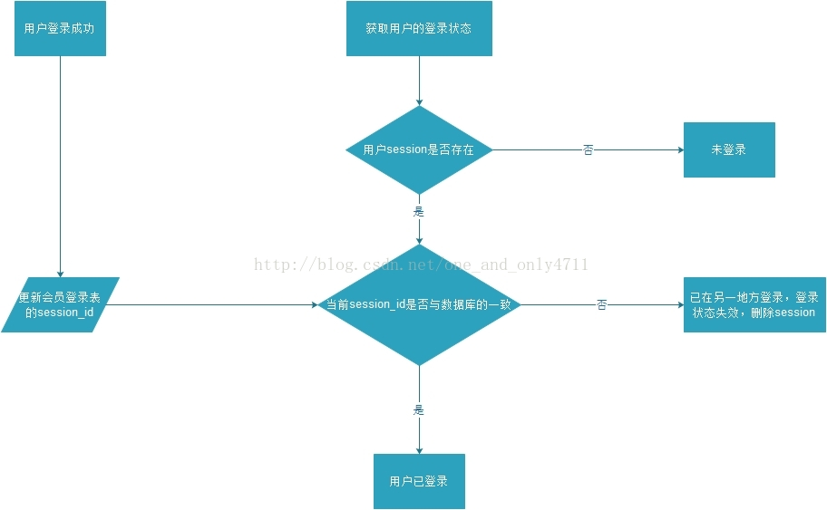
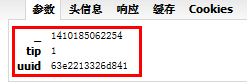
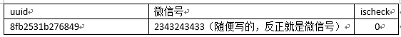
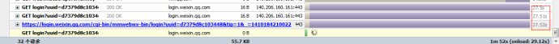
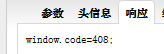

## 前言
**负载均衡** 是大型网站解决高负荷访问和大量并发请求采用的终极解决办法。一个典型的使用负载均衡策略的是：在软件或者硬件四层交换的基础上搭建squid集群，低成本、高性能还有很强的扩张性，随时往架构中增减节点都非常容易。

## 硬件四层交换
- 第四层交换使用第三层和第四层信息包的报头信息，根据应用区间识别业务流，将整个区间段的业务流分配到合适的应用服务器进行处理。
- 第四层交换功能就像是虚拟IP，指向物理服务器。

知名产品有：Alteon,F5等。Yahoo中国的近2000台服务器用了三四台Alteon。
## 软件四层交换
- YAHOO网站应用----DNS
- 简单的应用----URL重定向方式
- 不太重要的纯linux应用----LVS
- 重要、流量大、应用简单、预算充足----硬件(F5)(做双机)
- 企业应用，复杂、跨平台----专业负载均衡软件
### URL重定向方式
**存在的问题:**
- 容易在浏览器上形成死循环
- location存放位置问题、带session时重定向可能会出问题
- 一般只适用于HTTP方式
- 效率低于IP隧道
- 实时性不好

### 基于DNS
最早的负载均衡技术是通过DNS来实现的，**在DNS中为多个地址配置同一个名字，因而查询这个名字的客户机将得到其中一个地址，从而使得不同的客户访问不同的服务器，达到负载均衡的目的。**
- DNS不能区分服务器的差异，也不能反映服务器的当前运行状态，当使用DNS负载均衡时，必须尽量保证不同的客户机均匀获得不同的地址。
- 为了使得地址能随机分配，应该使DNS数据中的刷新时间尽量短，不同地方的DNS服务器能更新对应的地址，达到随机获得地址，但是若设置过短，将使DNS流量大增造成额外的网络问题。
- 若某台服务器出现错误，即使及时修改了DNS设置，也需等待足够的时间(刷新时间)才能发挥作用。
- 与专业的负载均衡软件如PCL相比，DNS的问题有：
  - 往往不能根据系统与服务的状态来判断负载
  - 往往不能建立较复杂的负载均衡算法

### 基于LVS
LVS是一个开源的软件，可以实现LINUX平台下的简单负载均衡。负载均衡集群是在应用服务器高负载的情况下，由多台节点提供可伸缩的，高负载的服务器组以保证对外提供良好的服务响应，LVS就是实现这一功能的技术，是一种Linux操作系统上基于IP层的负载均衡调度技术，**它在操作系统核心层上将来自IP层的TCP/UDP请求均衡地转移到不同的服务器。**
**优点：**
- 开源免费
- 在网上能找到一些相关技术资源
- 具有软件负载均衡的一些优点

**缺点：**
- 没有可靠的支持服务
- 功能较为简单
- 开启隧道方式需重编译内核
- 配置复杂
- 只支持linux

### 专业负载均衡软件
**特点：**
- 基于IP隧道的，独立于应用----对比URL重定向
- 支持不同平台----对比LVS
- 实时的----对比DNS
- 能够根据系统、应用的情况来决定负载----对比硬件
- 适用于企业级应用，可靠性、服务保障

## session及负载均衡
在WEB开发中，服务器可以为每个用户浏览器创建一个 **会话对象（session对象）**，注意：一个浏览器独占一个session对象(默认情况下)。因此，在需要保存用户数据时，服务器程序可以把用户数据写到用户浏览器独占的session中，当用户使用浏览器访问其它程序时，其它程序可以从用户的session中取出该用户的数据，为用户服务。
在搭建java web应用程序时，对http session的处理策略很大程度决定了应用程序的扩展性、可用性，处理方案如下：
- 在服务器端不保存session，完全无状态：**采用Stateless**，典型例子 **REST**。
- 基于浏览器CooKie的session共享
  - 把用户相关的session信息存储到浏览器的cookie中，也称为客户端session
  - **缺点：** 只能够存储字符串、数值等基本类型的数据；cookie大小存在限制；安全性；带宽及数据解压缩、网络传输性能问题。
- 基于数据库的session共享，实现分布式应用间session共享
  - 把session信息存储到数据库表，实现不同应用服务器间session信息的共享。如websphere portal、weblogic portal
  - 优点：实现简单
  - 缺点：数据库服务器相对于应用服务器更难扩展且资源更为宝贵，在高并发的web应用中，最大的性能瓶颈通常在于数据库服务器。
- 基于应用服务器/servlet容器的clustering机制
  - 这个机制可以实现session replication的功能，如tomcat clustering/session replication、Jboss buddy replication
  - 缺点：基于clustering的session复制性能很差，扩展性不行
- 基于NFS的session共享
  - 实现共享各台服务器只需要mount共享服务器的存储session的磁盘即可，实现较为简单。但NFS对高并发读写性能不高、在硬盘I/O性能和网络带宽上存在较大瓶颈。
- 基于Terracotta、Ehcache、JBossCache等java caching方案实现session共享
- 基于Memcached/Tokyo Tyrant等key-value DB的session共享：扩展性最好

## 系统拆分
- 随着业务增加拆分为小系统
- 将所有内容部署在一起，依赖于 **集群分发到多个节点上去做负载均衡**，以实现切割
- **独立工具、模块、服务的独立化和集群化，基于SOA服务的企业级应用**
- 数据库拆分
  - 散列
  - 分区
  - 分表
  - 读写分离
  - 多实例运算
  - 采用nosql或内存数据库

## 系统通信
系统拆分导致系统需要通信，拆分时要尽量减少相互之间的通信，做到系统的低耦合、高内聚、减少外部依赖。
- 早期的socket
- RMI
- 基于RPC的web services
- httpclient

## 负载均衡实例解决
### 问题1
> 怎样相对准确获取同时在线用户数，怎样实现类似于聊天室的管理员把用户踢出聊天室的功能，怎样实现类似在线聊天室的功能？

### 问题2
> 怎样实现同一账号同一时间点只能有一个账号在线

**流程图：**

- 在账户表的基础上，我新建了一个账户account_session表，用来记录登录账户的account_id和最新一次登录成功用户的session_id。
- 然后首先要修改登录方法：每次登录成功后，要将登录用户信息写入Session的同时还要更新account_session表里相应账户的session_id（当然，如果是第一次登录时，进行的便是插入动作）。
- 然后要修改获取当前用户信息的方法，在里面要做两重判断：
首先，看当前会话是否存在登录用户信息，如果没有，则肯定是未登录，不再赘述，如果有，还要再进一步要用当前会话里存的account_id去account_session表查询最新的session_id，与当前会话中的session_id作比较，如果是一致的，说明当前会话是最新的会话，登录状态正常，如果不一致，说明在当前登录会话创建后，被新的登录会话覆盖掉了，当前的登录会话已经失效，这时候，服务器应该删除当前的登录会话并返回提示给客户端，至此，限制账户同一时间单终端登录功能便实现了。

### 问题3
> 在多标签的浏览器中（例如ie8、firefox、chrome），用户开几个标签使用同一个web应用，是一个session还是多个session

在IE6中，每启动1个IE，在进程中就会增加1个iexplor.exe进程，一个此进程就表示1个session对象，就会产生1个唯一sessionID与之对应。但是在多页签的浏览器例如IE7，IE8 ，没启动一个IE，此时浏览器中会有俩个iexplor.exe进程存在，1个代表当前窗口对象，另1个代表页签对象，如果在窗口中新增加页签的话，iexplor.exe的数量会加1.
在多页签的浏览器中，进行测试，页面的page_load事件中，增加代码测试：
```java
string a = Session.SessionID;
Response.Write(a + "<br>");
```
发现在1个窗口中，无论打开多少个页签，都是同1个sessionID，那么问题就出现了，比如说：我在一个多标签的浏览器中，打开了俩个页签，分别叫A页签与B页签，那么我此时在A页签中打开1个登陆界面，输入A账户的用户名与密码，并且用session保存这个A用户的账号与密码，然后在B页签里面输入B的账户与密码，并且用session保存起来，那么此时你回头再刷新下A的页签，你会发现A页签里的session保存的A的信息全部被B的信息所覆盖了，这就是多页签使用同1sessionID的产生覆盖的核心机制。那么我们该如何处理呢？
我的解决方案是：1个IE窗口只能做1个登陆操作，如果你想再登陆，那么重新打开1个IE对象。
```java
protected void Button1_Click(object sender, EventArgs e)
        {
            if (Session["a"] != null)
            {
                PublicMethods.ShowMessageBox(this, "同一浏览器不能重复登录！");
                return;
            }
            Session["a"] = this.txtName.Text.Trim();
            Response.Redirect("Test.aspx");
        }
```
原理说明：1个多页签IE窗口无论打开多少个页签都是一个sessionID，那么这个sessionID对象下有1个key为a的session内容，如果你第一次登陆的话，这个session为a的内容为Null状态，如果你打开1个页签再做1个登陆操作的话，那么此时session a 就不为Null，提示用户新开1个窗口进行操作。因为新打开的IE会产生1个新的不重复的sessionID，此时这个sessionID对象对应的session a 还是为Null，那么可以进行登陆操作了。

### 问题4
> struts2中避免用户重复提交同一页面的机制？

防止表单重复提交，这是个很重要的知识点，而且很有用。当用户提交了一个表单，此时，地址栏显示的是处理这个表单的Action的地址，若此时刷新，则会重新发送一次表单数据，即又进行了一次提交，若这个Action是用来处理用户注册的，那么重复提交会再一次向数据库中插入之前已经插入的数据，这显然不是我们想要的。有两种方法，可以防止表单重复提交，一种是用Action的重定向，一种是用Session Token（Session令牌）。

第一种方法，Action处理完用户提交的数据后，重定向到另一个Action或是一个页面，使用户提交后，所停留的位置，不是当前处理数据的Action，这样用户再刷新时，就不会再次执行这个Action了，就会避免表单重复提交的问题了。

第二种方法，是一种很经典的处理这个问题的机制。这种方法是在用户要提交的表单中，加入一个<s:token>标签，这样，当浏览器第一次访问这个带有<s:token>标签的页面时，在服务器中，解析<s:token>标签的类（TokenTag.class），会生成一个随机的字符串（这个字符串，查看网页的源代码可以看到），并且发送给客户端的浏览器，同时，在服务器中，会把这个随机字符串保存到用户的session对象中。当第一次提交表单时，在服务器中，会比较客户端和服务器中分别保存的这个随机字符串，因为是第一次提交，所以这两个字符串相等，然后进行正常的业务处理。第一次提交后，在服务器中的session中保存的这个随机字符串，会改变为其他的随机值，注意，这是很重要的一步！此时，地址栏停留在处理用户提交数据的Action中，客户端中保存的随机字符串没有改变，若是刷新页面，即重复提交，服务器再进行两个字符串的比较，会不相等，就会跳转到name为invalid.token的结果页面中，这样就会防止表单重复提交了。
举例说明一下session token的机制:
**Login.jsp:**
```java  
<s:form action="/test/token" theme="simple">  
        username:<s:textfield name="username"></s:textfield><br>  
        password:<s:password name="password"></s:password><br>  
        <s:submit value="submit"></s:submit>  
        <s:token></s:token><!--一定要有这个标签-->  
    </s:form>  
```
**struts.xml:**
```java
<action name="token" class="com.suo.actions.TokenAction">  
            <result name="success">/WEB-INF/result/LoginResult.jsp</result>  
            <result name="invalid.token">/WEB-INF/result/TokenFailed.jsp</result>  
            <!-- 若重复提交，则会跳转到这个页面，注意这里result的名字，一定要是invalid.token -->  

            <interceptor-ref name="token"></interceptor-ref>  
            <interceptor-ref name="defaultStack"></interceptor-ref>  
            <!-- 这里一定要有这两个拦截器 -->  
        </action>  
```
**TokenAction.java:**
```java  
package com.suo.actions;  
import java.util.Map;  
import javax.servlet.http.HttpServletRequest;  
import javax.servlet.http.HttpSession;  
import org.apache.struts2.ServletActionContext;  
import com.opensymphony.xwork2.ActionContext;  
import com.opensymphony.xwork2.ActionSupport;  
public class TokenAction extends ActionSupport {  
    private String username;  
    private String password;  
    public String getUsername() {  
        return username;  
    }  
    public void setUsername(String username) {  
        this.username = username;  
    }  
    public String getPassword() {  
        return password;  
    }  
    public void setPassword(String password) {  
        this.password = password;  
    }  
    public String execute()  
    {     
        return SUCCESS;  
    }  
}  
```

### 问题5
> 怎样实现类似于gmail、sina等大型网站的用户自动登录功能

在用户登录后，将用户的用户名和密码保存到cookie中发送给浏览器，浏览器下次再次访问的时候会把cookie内容带回来，服务器从cookie中区出用户名和密码进行验证，如果验证通过，则允许进入首页等，从而达到自动登录的目的。
**降低风险：**
1.通过将cookie中保存的信息进行加密处理，用户登陆成功以后，将时间戳和随机数合并通过MD5加密处理形成Token。
```java
　　String token = Utils.MD5(System.currentTimeMillis()+Math.Rand(0,9999999));
```
当然，也可以通过用户名+系统时间生产Token或者将sessionId加密生产Token也可以。
2.将用户ID（uid或者userName）和有效时间（1个月）以及Token保存在cookie中，同时记录到数据库表中（Remember_Key）。
3.用户访问网站时，后台读取Cookie，获取uid和Token，去数据库对比，如果都存在，且在有效期内，则通过uid直接获取用户信息并保存session，直接跳转到首页。
前端可对此进行处理，获取到后台返回的数据后，展示用户名以及头像信息等。
4.后台需要做过滤器，过滤网站的所有页面，每当打开页面时，首先判断是否登陆，如果已经登陆则跳过，如果未登陆，需要先读取Cookie，判断是否匹配，如果匹配则跳过登陆，直接获取用户信息，否则跳转到登陆页面。

### 问题6
> 怎样实现类似于在线投票防止同一用户重复投票的功能。

**方法一：利用Session对象**  
在Global.asa的Session_OnStart事件中设置逻辑变量IsVoted，初始值为FALSE（表示还没有投票），投票之后在.asp程序中把IsVoted的值改为TRUE(表示已投过票)。每次投票之前都要判断IsVoted的值。如果IsVoted的值为TRUE，就不能再投票；如果值为FALSE，则可以投票。  
因为Session对象的使用必须与浏览器的Cookies功能相配合，所以在判断IsVoted值之前，必须先判断浏览器的Cookies功能是否打开。如处于关闭状态，则此种方法失效，所以在这种情况下必须给出提示信息并用Response.End命令中断.asp程序的执行，防止连续反复投票。
**漏洞：** 如果再打开一个新浏览器窗口，会发现在新打开的浏览器窗口中仍然可以投票。这是因为Session是私有的，一个Session中变量的改变并不影响另一个Session的同名变量的值。
**方法二：利用Cookies对象**  
因为Cookies对象把变量的值保存在浏览器客户端，所以可以根据Cookies保存的IsVoted的值来判断用户是否投过票。Cookies变量和Session变量一样是私有的，但是如果我们定义了Cookies变量的生存期限，则Cookies变量是公有的，凡是从同一台机器上登录的用户在规定的时间期限没有达到时，都无法投票，这在一定程度上也能防止反复投票。
**漏洞：** 在Windows 9x环境下，只要把 Windows/Cookies目录下所有＊.txt文件删除，又可重复投票。为了再进一步防止反复投票。
**方法三：验证IP地址与登录时间**  
此方法首先利用Request.ServerVariables(REMOTE_ADDR)取得用户的IP地址。在Web Server端建立一个标准的MDB类型的数据库，此数据库有一个表，该表只有两个字段：IP地址和登录时间。之所以设置登录时间这个字段，是考虑到拨号上网用户可能共用同一个IP地址，如果一个IP地址只能投一次票，那么显然不合理。同时，我们还采用方法二同样的思想，必须每隔一个设定的时间段，同一个IP地址才能再次投票。所以这种方法比方法一、方法二在防止反复投票方面要严格得多。
**方法四：小范围调查**
这种方法只适用于小范围调查，思想与方法三相同，只是把方法三中的 IP地址换成可以唯一代表用户的字段，如学生证号、工作证号等。这时建立的MDB数据库只包括两个字段：证件号码与IsVoted(其中IsVoted是逻辑型字段， TRUE表示已投过票，FALSE表示还未投票，在建库时所有记录的IsVoted的值都设为 FALSE)。在投票之前，要求先输入正确的证件号码，然后再判断IsVoted的值。
### 问题7
>微信网页版如何验证？
问题：
（1）如何将手机上的微信号与网页版上的二维码关联起来？
（2）如何验证登录并保证唯一性？
（3）为什么不直接用用户名和密码登录，而且 采用二维码？
（4）如何保证手机端和网页端信息的同步？
（5）如何保证在超时、网络断开、其他设备上登录后，原先已经登录的能够自动断开？

1、微信网页版有一个二维码，这个二维码里面的信息其实就是一个url：https://login.weixin.qq.com/l/8fb2531b276849， 当然后面带的那个参数是唯一的。
2、微信网页版打开后，就会向服务器发出一个ajax请求，请求的url却不是二维码里的url，而是这种格式：
https://login.weixin.qq.com/cgi-bin/mmwebwx-bin/login?uuid=c758718a7fb844&tip=1&__=1410184901947， (里面有三个参数，一个是二维码里面的url后面那个唯一的识别码uuid，一个是tip=1，一个是当前时间戳，参数名是一个下划线 _ )，如下图所示：

同时把很多登录后才需要的相关资源都预先加载进来了，所以长连接等待登录用户得到确认后展示用户信息的速度很快，因为无需刷页面和加载头像外的其他资源。
3、服务器收到请求，就去数据库相应的表里面查询有没有这样一条记录：即get请求传过来的参数(uuid)跟一个微信用户id(其实就是微信号)绑定的一条记录，如下图所示：

- 1）如果没有这条记录，该请求会在服务器端保持27秒左右（如果用php实现，估计就是sleep一下，再查一下数据库，sleep一下，又查一下数据库，27秒之后还没有查到上面那条记录，就返回window.code=408）


页面收到这个返回值，则又发出一条请求（还是同样的请求，在服务器端保持27秒左右没有结果，就返回window.code=408，页面收到之后，再次发出请求，如此循环下去，直接找到这条记录）
- 2）如果有这条记录，而且ischeck=0，就显示


4、微信页面继续发送刚才的请求，这次就是查询ischeck字段是不是为1了：
  - 1）如果为1，则服务器给这个uuid对应的微信号做一个登录（比如session登录的，就用写入一个session），并返回一个cookie给浏览器用于保存登录状态，说这个微信号网页版已经登录了，而且还返回了登录跳转url，微信页面根据这个返回值，用js的window.location.href类似的方法，跳转一下，并加载登录后所需要的资源，到此，微信网页版登录完成。
  - 2）如果不为1，则在服务器端保持27秒左右后，又回到原始的登录页面（相当于没有用手机扫描过，而且手机端再点登录网页版微信的时候，会提示那个二维码已经失效）

5、至于微信查询的数据库的那条信息是执行插入呢？那肯定是手机了，手机访问二维码上的链接，带着唯一的uuid和自己的微信号，去插入这条信息，插入成功后，服务器会返回一个状态给微信，微信上就变成了一个按钮，要你确认是否登录微信，如果你点了确认，那么服务器上的这个uuid对应的那条记录的ischeck字段，就会被标记为1，由于客户端一直在反复查询是否有这条记录以及如果有这条记录，ischeck字段是否为1，所以能实现手机点击了确认，客户端就立刻跳转登录了。
6、对于验证过程，Open API 一般是通过授权令牌（Token）来解决的，原理是当用户通过授权后，分配一个限定条件下的令牌（如限制本机访问、限制授权有效时间、限制同时登录设备数等），使获得授权的用户仅在有限的前提下能访问相关服务。 像计算机休眠后曾做的授权就自动收回了，这样就有效的避免了在别人电脑上（尤其是网吧）打开，但忘记关闭或退出这类安全问题了。同时，整个授权过程的验证部分在手机端进行，有效杜绝了 PC 上泛滥的各类木马、『安全工具』的监听，大大降低了帐号被盗的风险。所以说，核心过程应该是：浏览器获得一个临时 id，通过长连接等待客户端扫描带有此 id 的二维码后，从长连接中获得客户端上报给 server 的帐号信息进行展示。 并在客户端点击确认后，获得服务器授信的令牌，进行随后的信息交互过程。 在超时、网络断开、其他设备上登录后，此前获得的令牌或丢失、或失效，对授权过程形成有效的安全防护。
