## PR_Bayes(贝叶斯决策论)
### Bayes Rule(贝叶斯规则)
贝叶斯公式如下：  
$P(w_j|x)=\frac{P(x|w_j)P(w_j)}{P(x)}$
用非正式的英语表示为：
$posterior=\frac{Likelihood*Prior}{evidence}$  
贝叶斯判决规则：
- $Decide\quad w_1\quad if\quad P(w_1|x)>P(w_2|x)$
- $Decide\quad w_2\quad if\quad P(w_2|x)>P(w_1|x)$

or  
- $Decide\quad w_1\quad if\quad P(x|w_1)P(w_1)>P(x|w_2)P(w_2)$
- $Decide\quad w_2\quad if\quad P(x|w_2)P(w_2)>P(x|w_1)P(w_1)$

在两类问题的情况下：
$P(x)=\sum_{j=1}^2 P(x|w_j)P(w_j)$

#### Prior Probability(先验概率)
渔夫出海捕鲈鱼和鲑鱼，假定下一条鱼是鲈鱼的“先验概率”为$P(w_1)$，而下一条鱼是鲑鱼的“先验概率”为$P(w_2)$。由于假定没有其他类别的鱼，所以有$P(w_1)+P(w_2)=1$。这些先验概率反映了在实际的鱼没有出现之前，我们所拥有的对于可能出现的鱼的类别的先验知识。  
假定在进行实际观察之前，要求我们必须立即对下次将出现的鱼的类别做判决，而我们所唯一能利用的信息只有先验概率，那么采用下述判决规则是合乎逻辑的：如果$P(w_1)>P(w_2)$，则判为$w_1$，否则判为$w_2$。

#### Conditional Probability(条件概率)
大多数情况下，不会只用如此少的信息来做判断。如捕鱼例子，可以利用观察到的光泽度指标$x$来提高分类器性能。不同的鱼将产生不同的光泽度，将其表示成概率形式的变量，假定$x$是一个连续随机变量，其分布取决于类别状态，表示成$P(x|w)$的形式，这就是`条件概率`，即类别状态为$w$时的$x$的概率大小。

#### Posterior Probability(后验概率)
贝叶斯公式表明，通过观测$x$的值我们可将先验概率$P(w_j)$转换成后验概率$P(w_j|x)$，即假设特征值已知的条件下类别属于$w_j$的概率。我们称$P(x|w_j)$为$w_j$关于$x$的似然函数，或简称为"似然"(Likelihood)，表明在其他条件都相等的情况下，使得$P(x|w_j)$较大的$w_j$更有可能是真实的类别。  
假设先验概率$P(w_1)=\frac{2}{3}$，$P(w_2)=\frac{1}{3}$以及给定一个条件概率密度的条件，其后验概率图如下：
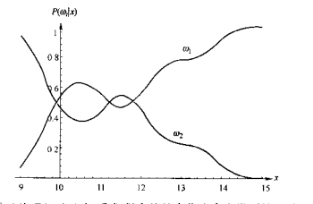  
显然，在每个$x$处的后验概率之和为1.0。如果有某个观测值$x$使得$P(w_1|x)$比$P(w_2|x)$大，自然地会作出真实类别是$w_1$的判决，反之亦然。

### Bayes Error(贝叶斯错误率)
对于某一次判决，我们观测某一特定的$x$时的误差概率为：
- $P(error|x)=P(w_1|x)\quad if\quad decide\quad w_2$
- $P(error|x)=P(w_2|x)\quad if\quad decide\quad w_1$

显然，对于某一给定的$x$，我们可以在最小化误差概率的情况下判决。如果$P(w_1|x)>P(w_2|x)$则为$w_1$，否则$w_2$。当然，我们很少有可能两次观测到严格相同的$x$。但这种规则还是可以将平均误差概率最小化，原因在于平均误差概率可表示为：  
$P(error)=\int_{-\infty}^{\infty}P(error,x)dx=\int_{-\infty}^{\infty}P(error|x)P(x)dx$  
并且如果对任意$x$，我们保证$P(error|x)$尽可能小，那么此积分的值也将任意的小，由此我们验证了下列最小化误差概率条件下的贝叶斯决策规则(使错误率最小的决策就是使后验概率最大的决策)：  
$if\quad P(w_1|x)>P(w_2|x),decide\quad w_1,else\quad w_2$  
在这个规则下，误差概率可表示为：  
$P(error|x)=min[P(w_1|x),P(w_2|x)]$
如果是多分类的情况下：$P(error|x)=1-max[P(w_1|x)...P(w_c|x)]$  
利用贝叶斯公式，将此规则以后验概率为主转换成条件概率和先验概率的形式来描述。首先，贝叶斯公式中的证据因子$P(x)$对于做出某种判决并不重要，它仅仅是一标量因子，表示我们实际测量的具有特征值$x$的模式的出现频率，它在贝叶斯公式中保证$P(w_1|x)+P(w_2|x)=1$。将此标量因子去掉，就可以得到完全等价的判决规则：  
$if\quad P(x|w_1)P(w_1)>P(x|w_2)P(w_2),decide\quad w_1,else\quad w_2$

### 分类错误率
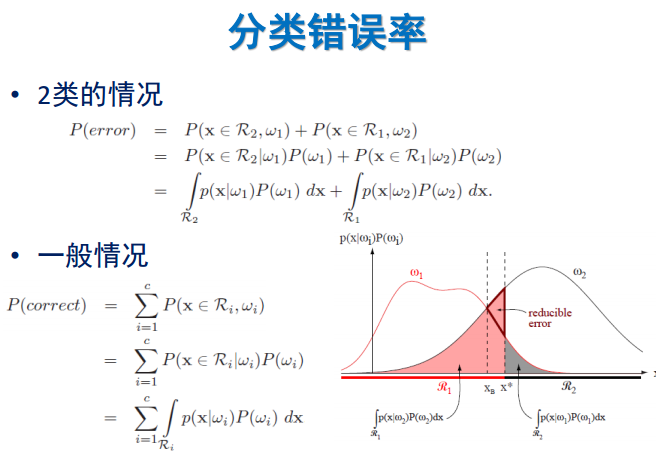  
其中$P(x\in \Re_2,w_1)$表示$x$属于2类，但错误决策为1类，故两种情况相加即为分类错误率。上面坐标图假设决策指向$x_B$，此时为最小错误率决策，即为贝叶斯错误率。因此分类错误率=贝叶斯错误率+`reducible error`。
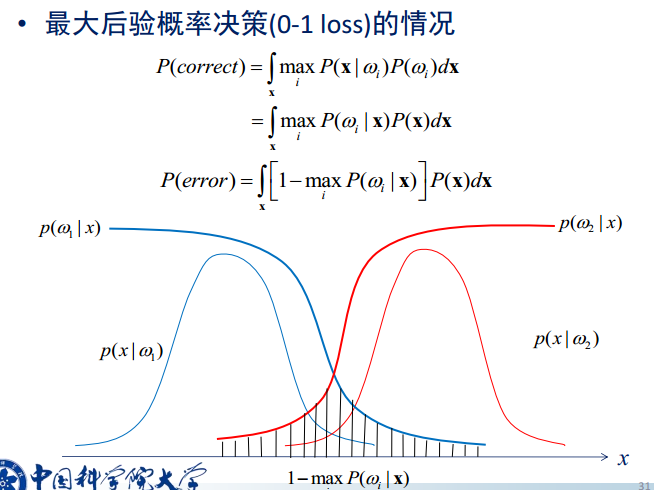

### Maximum Likelihood Rule(最大似然规则)
当$P(w_1)=P(w_2)$时，决策完全取决于似然概率$P(x|w_j)$。
- $Decide\quad w_1\quad if\quad P(x|w_1)>P(x|w_2)$
- $Decide\quad w_2\quad if\quad P(x|w_2)>P(x|w_1)$

当$P(x|w_1)=P(x|w_2)$时，说明在某次特定的观测之后并没有获得新信息，此时完全取决于先验概率。
### Decision Boundary(决策边界)
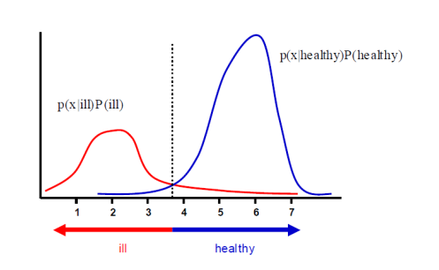

### Loss Function(损失函数)
#### 什么是行为
有时候，后验概率本身只能说明具有特征$x$的样本属于$w_j$类的可能性有多少，却没能表示如果将样本分到$w_j$类时的代价有多大。因此引入行为的概念。  
分类器的设计初衷很简单，就是进行“分类”这一动作。假设现在来了一个具有特征$x$的样本，如果将“把样本分入$w_j$类”这一行为记为动作$a_j$的话，将有不少于类别种类的行为(因为除了将样本分入到不同类别外，还可能拒绝做出判断，因此动作集的大小一般大于类别种类)。
#### 什么是风险
令$\{w_1,w_2,...,w_c\}$表示有限个类别集，$\{a_1,a_2,...,a_a\}$表示有限个$a$中可能采取的动作集，风险函数$\lambda(a_i|w_j)$描述类别状态为$w_j$时采取行动$a_i$所产生的风险。(行为导致风险，不同的行为也会使风险的大小不同)
#### 什么是损失函数
根据贝叶斯公式，可以通过先验概率$P(w_j)$、概率密度函数(似然函数)$P(x|w_j)$以及证据因子$P(x)$可以求出后验概率$P(w_j|x)$。
$P(w_j|x)=\frac{P(x|w_j)P(w_j)}{P(x)}$  
假设，样本具有特征值$x$，并且我们将采取$a_i$行动，而样本的真实归属类别为$w_j$，那么可能造成风险为$\lambda(a_i|w_j)$，而贝叶斯公式求出的后验概率$P(w_j|x)$表示了特征值为$x$时，样本属于类别$w_j$的概率，因此与行为$a_i$相关的损失为：  
$R(a_i|x)=\sum_{j=1}^c \lambda(a_i|w_j)P(w_j|x)$  
$R(a_i|x)$称为与行为$a_i$相关的损失函数。计算损失函数可以展开为以下步骤：
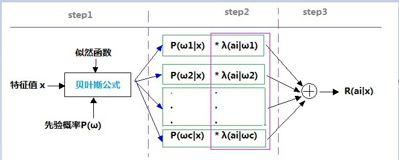  
- step 1:通过将特征值、似然函数、先验概率带入贝叶斯公式，求出具有特征值$x$的样本分属于不同类别的可能性(后验概率)
- step 2：将样本属于各个不同类别的可能性乘上将样本误判到这一类别所需付出的代价
- step 3：将step 2的结果相加即可得出对具有特征值$x$的样本进行$a_i$操作所可能产生的损失

显然，要计算损失函数，则先验概率、似然函数、风险函数都必须是`已知`的。注意：风险函数是$\lambda(a_i|w_j)$，损失函数(也称为条件风险)是$R(a_i|x)$，两者是不同的。

#### 什么是贝叶斯风险
从损失函数来看，用决策理论中的术语来表达，一个预期的损失被称为一次风险，$R(a_i|x)$称为条件风险。贝叶斯决策过程实际上提供了一个总风险的优化过程。  
假定一般的判决规则是一个函数$a(x)$，它告诉我们通过每种可能的观测该采取哪种行为，更准确来说，对于每个$x$，判决函数$a(x)$确定了$a$的值$a_1,a_2,...,a_a$。总风险$R$是与某一给定的判决规则相关的预期损失。既然$R(a_i|x)$是和行为$a_i$有关的条件风险，且决策规则指定了其行为，则总风险为：  
$\Re=\int R(a(x)|x)P(x)dx$  
显然为了最小化总风险，对所有的$i=1,2,...a$计算条件风险$R(a_i|x)$，并选择行为$a_i$使$R(a_i|x)$最小化。最小化后的总风险值称为贝叶斯风险，记为$R^* $，它是可获得的最优风险。那么，为什么贝叶斯决策规则所得出的风险是最小的呢？  
贝叶斯决策规则使得损失函数$R(a_i|x)$对每个特征值$x$都尽可能的小，那么对所有可能出现的特征值$x$，总风险将会降到最小。通俗点说，就是对特征值$x$，计算所有行为所导致的损失们(即把$R(a_1|x),R(a_2|x),...,R(a_i|x)$都算出来)，然后从中选择损失最小的一个$a_k$作为结果，这样对于每个样本都可以做到损失最小。假设有一批样本，其中的每一个都做到损失最小的话，对这一批样本而言，总体的损失就是最小了。

#### 基于损失函数的两类分类问题
假定行为$a_1$对应于类别判决$w_1$，行为$a_2$对应于类别判决$w_2$，以$\lambda_{ij}=\lambda(a_i|w_j)$表示当实际类别为$w_j$时误判为$w_i$所引起的损失。则条件风险为：  
- $R(a_1|x)=\lambda_{11}P(w_1|x)+\lambda_{12}P(w_2|x)$
- $R(a_2|x)=\lambda_{21}P(w_1|x)+\lambda_{22}P(w_2|x)$

则最小风险决策规则如下：  
- $if\quad R(a_1|x)<R(a_2|x),decide\quad w_1,else\quad w_2$
- $if\quad (\lambda_{21}-\lambda_{11})P(w_1|x)>(\lambda_{12}-\lambda_{22})P(w_2|x),decide\quad w_1,else\quad w_2$

通常一次错误判决所造成的损失比正确判决要大，故$\lambda_{21}-\lambda_{11}$和$\lambda_{12}-\lambda_{22}$都为正的。
- $if\quad (\lambda_{21}-\lambda_{11})P(x|w_1)P(w_1)>(\lambda_{12}-\lambda_{22})P(x|w_2)P(w_2),decide\quad w_1,else\quad w_2$
- $if\quad \frac{P(x|w_1)}{P(x|w_2)}>\frac{\lambda_{12}-\lambda_{22}}{\lambda_{21}-\lambda_{11}}\frac{P(w_2)}{P(w_1)},decide\quad w_1,else\quad w_2$  

$\frac{P(x|w_1)}{P(x|w_2)}$为“似然比”，因此贝叶斯决策规则可以解释为如果似然比超过某个不依赖观测值$x$的阈值，那么可判决为$w_1$。

#### 最小误差率分类(Minimum-Error-Rate Classification)
在分类问题中，行为$a_i$通常被解释为类别状态被判决为$w_i$。如果采取行为$a_i$，而实际类别为$w_j$，那么在$i=j$的情况下判决是正确的，如果$i\ne j$，则产生误判。为了避免误判，则使用一种判决规则使误判概率(即误差率)最小化。  
这种情况下的损失函数就是所谓的“对称损失”或“0-1损失”函数：
- $\lambda(a_i|w_j)=0\quad i=j$
- $\lambda(a_i|w_j)=1\quad i\ne j$  

这个损失函数将0损失赋给一个正确的判决，而将一个单位损失赋给任何一种错误判决，因此所有误判都是等代价的。与这个损失函数对应的风险准确的说就是平均误差概率，这是因为条件风险为：

$R(a_i|x)=\sum_{j=1}^{c}\lambda(a_i|w_j)P(w_j|x)=\sum_{j\ne i}P(w_j|x)=1-P(w_i|X)$  
且$P(w_i|x)$是行为$a_i$正确的条件概率。这个最小化风险的贝叶斯决策规则要求选择一种能使条件风险最小化的行为，因此，为了最小化平均误差概率，我们需要选取$i$使得后验概率$P(w_i|x)$最大，即基于最小化误差概率，决策规则为：
- 对任给$j\ne i$，如果$P(w_i|x)>P(w_j|x)$，则判决为$w_i$

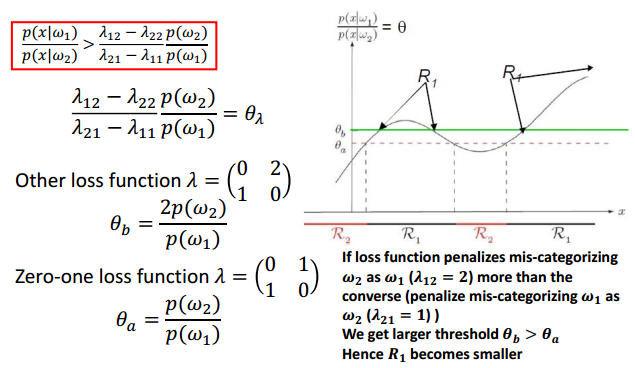  
图中纵坐标为似然比，引入一个0-1损失或分类损失，那么判决边界将由阈值$\theta_a$决定；而如果损失函数对将模式$w_2$判为$w_1$的惩罚大于反过来的情况(即($\lambda_{21}>\lambda_{12}$))，将得到较大的阈值$\theta_b$，使得$\Re_1$变小。

### 分类器、判别函数及判定面
#### 多类情况
使用判别函数$g_i(x),i=1,...,c$来表述模式分类器。如果对于所有的$j\ne i$，有$g_i(x)>g_j(x)$，则此分类器将这个特征向量$x$判为$w_i$。因此此分类器可视为一个计算$c$个判别函数并选取与最大判别值对应的类别的网络或机器。  
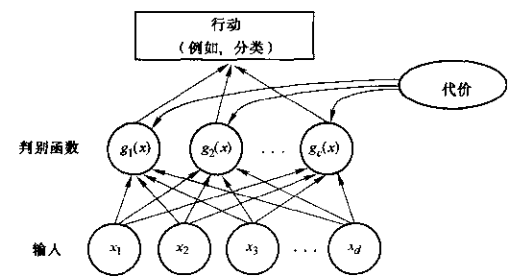  
判别函数的选择：
- $g_i(x)=-R(a_i|x)$(这是在具有一般风险的情况下，其最大的判别函数与最小的条件风险相对应)
- $g_i(x)=P(w_i|x)$(这是在最小误差概率情况下，其最大判别函数与最大后验概率相对应)  

显然，判别函数的选择不是唯一的，可以将所有的判别函数乘上相同的正常数或者加上一个相同的常量而不影响其判决结果，更一般情况下，将$g_i(x)$替换成$f(g_i(x))$，其中$f()$是一个单调递增函数，分类结果不变，例如：  
$g_i(x)=P(w_i|x)=\frac{P(x|w_i)P(w_i)}{\sum_{j=1}^c P(x|w_j)P(w_j)}$  
$g_i(x)=P(x|w_i)P(w_i)$  
$g_i(x)=lnP(x|w_i)+lnP(w_i)$  
尽管判别函数可写成各种不同的形式，但是判决规则是相同的。每种判决规则都是将特征空间分成$c$个判决区域$\Re_1,...,\Re_c$。如果对于所有的$j\ne i$，有$g_i(x)>g_j(x)$，那么$x$属于$\Re_i$，判决规则要求我们将$x$分给$w_i$。此区域由判决边界来分割，其判决边界即判决空间中使判别函数最大的曲面。  
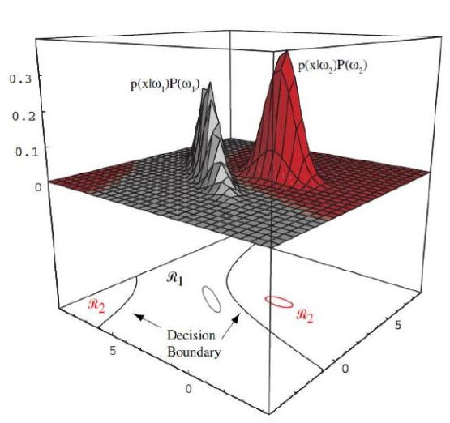  
在这个二维的两类问题的分类器中，概率密度为高斯分布。判别边界由两个双曲面构成，因此判决区域$\Re_2$并非是简单连通的。椭圆轮廓线标记出$\frac{1}{e}$乘以概率密度的峰值。

#### 两类问题
二分分类器定义了一个简单的判别函数：$g(x)=g_1(x)-g_2(x)$，且使用下列判决规则：如果$g(x)>0$，则判为$w_1$，否则判为$w_2$。  
最小误差率判别函数的两种形式：  
- $g(x)=P(w_1|x)-P(w_2|x)$
- $g(x)=ln\frac{P(x|w_1)}{P(x|w_2)}+ln\frac{P(w_1)}{P(w_2)}$

### 正态分布(Normal Distribution)
#### 正态密度
##### 单变量密度函数
- 单变量正态分布密度函数  
$p(x)=\frac{1}{\sqrt{2\pi}\sigma}exp[-\frac{1}{2}(\frac{x-\mu}{\sigma})^2]$
- 期望值  
$\mu=E(x)=\int_{-\infty}^{+\infty}xp(x)dx$  
- 方差  
$\sigma^2=E[(x-\mu)^2]=\int_{-\infty}^{\infty}(x-\mu)^2p(x)dx$
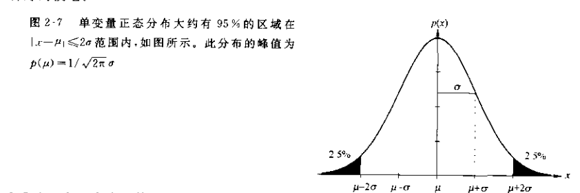
##### 多元密度函数
- 多元正态密度  
$p(x)=\frac{1}{(2\pi)^{d/2}|\sum|^{1/2}}exp[-\frac{1}{2}(x-\mu)^t\sum^{-1}(x-\mu)]$，其中$x$是一个$d$维列向量，$\mu$是$d$维均值向量，$\sum$是$d*d$的协方差矩阵，$|\sum|$和$\sum^{-1}$分别是其行列式的值和逆，$(x-\mu)^t$是$(x-\mu)$的转置  
- 协方差矩阵$\sum$通常是对称的且半正定。我们将严格限定$\sum$是正定的。对角线元素$\sigma_{ii}$是相应的$x_i$方差且非对角线元素$\sigma_{ij}$是$x_i$和$x_j$的协方差。如果$x_i$和$x_j$是统计独立，则$\sigma_{ii}=0$。如果所有的非对角线元素为0，那么$p(x)$变成了$x$中各元素的单变量正态密度函数的内积。
- 服从正态分布的随机变量的线性组合，不管这些随机变量是独立的还是非独立的，也是一个正态分布。  

#### 正态分布的判别函数
最小误差概率分类可通过判别函数获得：  
$g_i(x)=lnP(x|w_i)+lnP(w_i)$  
如果已知$p(x|w_i)\sim N(\mu_i,\sum_i)$，那么  
$g_i(x)=-\frac{1}{2}(x-\mu)^t\sum_i^{-1}(x-\mu)-\frac{d}{2}ln2\pi-\frac{1}{2}ln|\sum_i|+lnP(w_i)$
##### 情况1：$\sum_i=\sigma^2I$
- 这种情况发生在哥特征统计独立，且每个特征具有相同的$\sigma^2$方差时。此时的协方差阵是对角阵，仅仅是$\sigma^2$与单位阵$I$的乘积。
- 省略掉其他无关紧要的附加常量，可得到简单的判决函数  
$g_i(x)=-\frac{|x-\mu|^2}{2\sigma^2}+lnP(w_i)$  
展开得到  
$g_i(x)=-\frac{1}{2}[x^tx-2\mu_i^t+\mu_i^t\mu_i]+lnP(w_i)$  
省略附加常量，等价于线性判决函数  
$g_i(x)=w_i^tx+w_{i0}$，其中$w_i=\frac{1}{\sigma_i^2}\mu_i\quad w_{i0}=-\frac{1}{2\sigma^2}\mu_i^t+lnP(w_i)$  
称$w_{i0}$为第$i$个方向的阈值或者偏置  
- 上面的方程可写成：  
$w^t(x-x_0)=0$，其中$w=\mu_i-\mu_j\quad x_0=\frac{1}{2}(\mu_i+\mu_j)-\frac{\sigma^2}{|\mu_i-\mu_j|^2}ln\frac{P(w_i)}{P(w_j)}(\mu_i-\mu_j)$  
此方程定义了一个通过$x_0$且与向量$w$正交的超平面。由于$w=\mu_i-\mu_j$，将$\Re_i$与$\Re_j$分开的超平面与两中心点的连线垂直。若$P(w_i)=P(w_j)$则上式右边第二项为零，因此超平面垂直平分两中心点的连线。如图：  
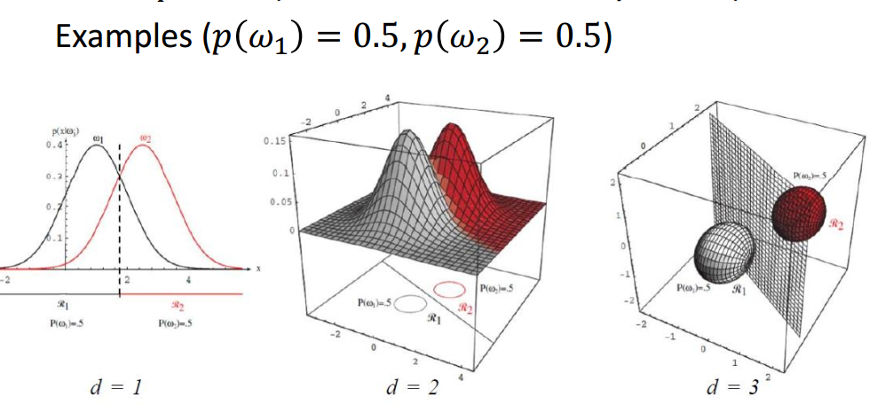  
- 如果所有的$c$类的先验概率$P(w_i)$相等，那么$lnP(w_i)$项就成了另一可省略的附加常量。此时最优判决规则为：为将某特征向量$x$归类，通过测量每一个$x$到$c$个均值向量中的每一个欧氏距离，并将$x$归为离它最近的那一类中。这样的一个分类器被称为"最小距离分类器"。如果每个均值向量被看成是其所属模式类的一个理想原型或模板，那么本质上是一个模板匹配技术。  
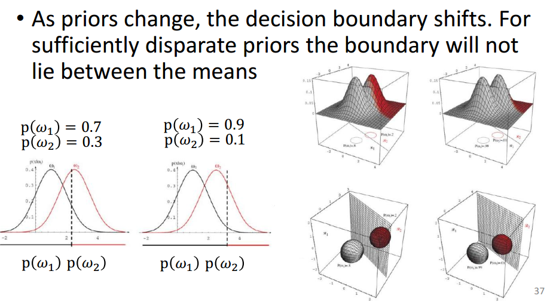

##### 情况2：$\sum_i=\sum$
- 这种情况是所有类的协方差阵都相等，但各自的均值向量是任意的。几何上，这种情况对应于样本落在相同大小和相同形状的超椭球体聚类中，第$i$类的聚类中心在向量$\mu_i$附近。此时的判决函数可简化为  
$g_i(x)=-\frac{1}{2}(x-\mu_i)^t\sum^{-1}(x-\mu_i)+lnP(w_i)$  
- 展开可得线性判决函数  
$g_i(x)=w_i^tx+w_{i0}$，其中$w_i=\sum^{-1}\mu_i$  
由于判决函数是线性的，判决边界同样是超平面  
$w^t(x-x_0)=0$，其中$w=\sum^{-1}(\mu_i-\mu_j)\quad x_0=\frac{1}{2}(\mu_i+\mu_j)-\frac{ln[P(w_i)/P(w_j)]}{(\mu_i-\mu_j)^t\sum^{-1}(\mu_i-\mu_j)}(\mu_i-\mu_j)$  
如果先验概率相等，其判决面与均值连线相交于$x_0$点；若不等，最优边界超平面将远离可能性较大的均值。如图：  
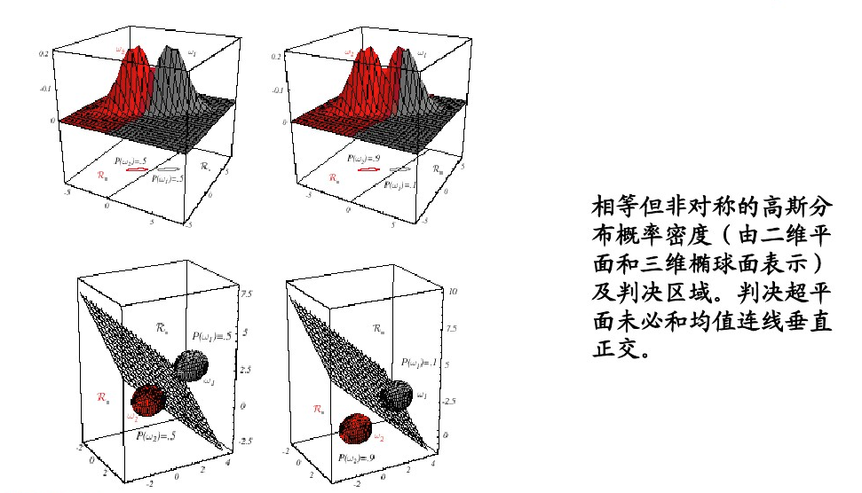

##### 情况3：$\sum_i=$任意  
在一般的多元正态分布的情况下，每一类的协方差是不同的，其判决函数显然也是二次型  
$g_i(x)=x^tW_ix+w_ix+w_{i0}$，其中$W_i=-\frac{1}{2}\sum_i^{-1}\quad w_i=\sum_i^{-1}\mu_i\quad w_{i0}=-\frac{1}{2}\mu^t\sum_i^{-1}\mu-\frac{1}{2}ln|\sum_i|+lnP(w_i)$
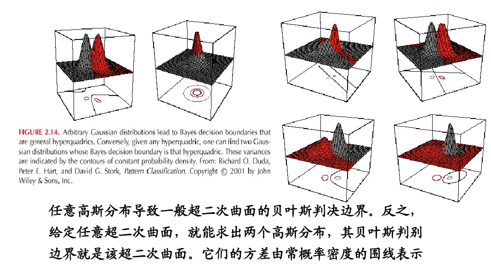
