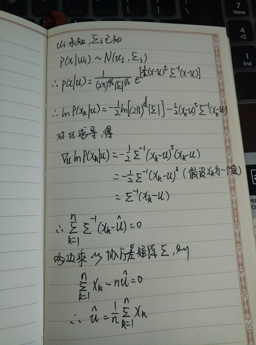
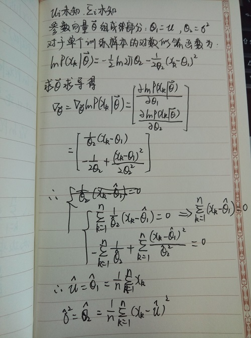
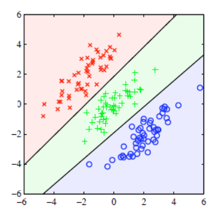
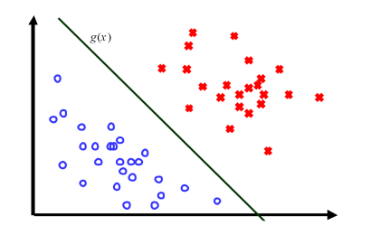
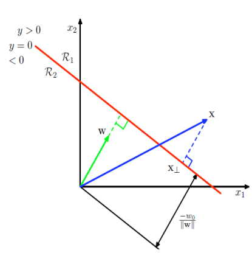

## PR_Linear(线性问题)
贝叶斯决策的目标在于获取后验概率，而后验概率又可以由先验概率和类条件概率密度(Probability Density Function,PDF)两个量估计得到。先验概率的估计较为简单，其一可以用训练数据中各类出现的频率来估计得到；其二可以依靠经验。而PDF的估计是贝叶斯决策的重点，主要有两大类：  
- 参数估计方法：先假定研究的问题具有某种数学模型，如正态分布、二项分布等，再用已知类别的学习样本估计里面的参数。例如PDF是正态性的，符合$P(x|w_j)\sim N(\mu_i,\sum_i)$，则需要估计其中的两个参数。
- 非参数估计方法：不假定数学模型，直接用已知类别的学习样本的先验知识直接估计数学模型。  

参数估计和非参数估计都属于监督学习。
### 参数估计方法(Parametric method)
PDF形式确定，部分或全部参数不确定，因此要利用样本来估计这些未知参数，主要方法有最大似然估计和贝叶斯估计。
#### 最大似然估计
在参数空间中找到一个能够使得似然函数$I(\theta)$极大化的$\theta$值，把它当做最大似然估计量，其中最大化的方法为求导。
##### 基本原理
- 根据每个样本所属的类别来对一组样本进行分类，则有$c$个样本集$D_1,D_2,...,D_c$。而每个样本集中的样本都是独立的根据PDF来抽取的。
- PDF形式确定，其未知的部分就是具体的参数向量$\theta_j$的值，例如$p(x|w_j)\sim N(\mu_j,\sum_j)$，那么参数向量$\theta_j$就由分量$\mu_j,\sum_j$所组成。
- 为了强调类条件概率密度函数$p(x|w_j)$依赖于参数向量$\theta_j$，通常写成$p(x|w_j,\theta_j)$这一形式。
- 要解决的问题为，根据已有的训练样本，尽可能正确的估计各个类别的具体的参数向量$\theta_1,\theta_2,...,\theta_c$。
- 属于类别$D_i$的训练样本对于参数向量$\theta_j(j\ne i)$的估计不提供任何信息，即每个参数向量$\theta_j$对它所属的类别起的作用都是相互独立的，因此可以对每个类别分别处理。  

对$c$个独立的问题可以表述为：已知样本集$D$，其中每个样本都是独立的根据已知形式的概率密度函数$p(x|\theta)$抽取得到的，要求使用这些样本，估计概率密度函数中的参数向量$\theta$的值。  
假设样本集$D$中有$n$个样本：$x_1,x_2,...,x_n$，由于这些样本是独立抽取的，故  
$p(D|\theta)=\prod_{k=1}^n p(x_k|\theta)$  
由于样本集$D$已知，故可以把$p(D|\theta)$看成是参数向量$\theta$的函数，被称为样本集$D$下的似然函数。根据定义，参数向量$\theta$的最大似然估计就是使$p(D|\theta)$达到最大值的相对应的$\widehat{\theta}$。  
这里有个数学的知识点：如果实际的待求参数的个数为$p$，则参数向量$\theta$可以写成如下的$p$维向量的形式：$\theta=(\theta_1,\theta_2,...,\theta_p)^t$，则对其各个参数分别求偏导得到梯度算子为：  
$\nabla_\theta=(\frac{\partial}{\partial \theta_1},\frac{\partial}{\partial \theta_2},...,\frac{\partial}{\partial \theta_p})^t$  
求解$\widehat{\theta}$的步骤如下：  
- 定义对数似然函数$l(\theta)$：$l(\theta)=lnp(D|\theta)=\sum_{k=1}^n lnp(x_k|\theta)$
- 对对数似然函数求导得到：$\nabla_\theta l=\sum_{k=1}^n \nabla_\theta lnp(x_k|\theta)$
- 令$\nabla_\theta l=0$得到由$p$个方程所组成的方程组
- 注意求解出的$\widehat{\theta}$可能是真正的全局最大值点，也可能是局部极值点，或者仅仅是拐点，需要验证  

##### 例子1：高斯分布($\mu$未知)

##### 例子2：高斯分布($\mu,\sum$均未知)
  
当高斯函数为多元时，其均值的最大似然估计依然为其样本均值，协方差的最大似然估计则是$n$个$(x_k-\widehat{\mu})(x_k-\widehat{\mu})^t$矩阵的算术平均。
#### 贝叶斯估计
贝叶斯学习方法中，我们把参数向量$\theta$本身看成一个随机变量，已有的训练样本使我们能够把对于$\theta$的初始密度的估计转化成后验概率密度。
- 用D表示现有训练样本的集合，则后验概率为$P(w_i|x)=P(w_i|x,D)$，则贝叶斯公式可化为：  
$P(w_i|x,D)=\dfrac{p(x|w_i,D)P(w_i|D)}{\sum_{j=1}^c p(x|w_j,D)P(w_j|D)}=\dfrac{p(x|w_i,D_i)P(w_i)}{\sum_{j=1}^c p(x|w_j,D_j)P(w_j)}$  
- 贝叶斯学习的核心问题的实质在于：处理$c$个独立的问题，每一问题的形式为：已知一组训练样本D，这些样本都是从固定但未知的概率密度函数$p(x)$中独立抽取的，要求根据这些样本估计$p(x|D)$。  
$p(x|D)=\int p(x,\theta|D)d\theta=\int p(x|\theta)p(\theta|D)d\theta$  
上面式子把类条件概率密度$p(x|D)$和未知参量的后验概率密度$p(\theta|D)$联系起来，如果后验密度$p(\theta|D)$在某一个值$\widehat{\theta}$附近形成最显著的尖峰，那么就有$p(x|D)\approx p(x|\widehat{\theta})$。其中条件概率密度函数$p(x|\theta)$是完全已知的，虽然参数向量$\theta$的具体数值未知。  
- 根据贝叶斯公式，有：  
$p(\theta|D)=\dfrac{p(D|\theta)p(\theta)}{\int p(D|\theta)p(\theta)d\theta}$  
其中参数向量的$\theta$的先验概率密度函数$p(\theta)$包含了我们对于$\theta$的全部先验知识。
- 根据样本间的独立性假设，有：  
$p(D|\theta)=\prod_{k=1}^n p(x_k|\theta)$

### 非参数估计方法(Non-Parametric method)
### 线性分类模型(Linear Classification Models)
分类的目的是给出一个输入向量，输出这个向量属于的类别，每一个输入只会有一个类别。因此输入空间被分为决策区域，它的边界被称为决策边界。而线性分类模型是指决策边界是关于输入向量$x$的线性函数，它在D维的输入空间中定义了D-1维的超平面。类别可以被线性决策边界分开的数据集被称为线性可分。
  
解决分类问题有三种不同的方法：  
- 简单的判别函数(DF)：直接将输入向量$x$映射到特定的类别
- 建模条件分布$p(c_k|x)$
  - 直接建模：例如表示为参数模型，然后用训练数据计算出最优的参数
  - 利用类条件和先验概率，由贝叶斯公式计算出后验概率

#### 利用判别函数求解分类问题
##### 两类问题
最简单的线性判别函数是关于输入向量$x$的线性函数，即：  
$g(x)=w^Tx+w_0$  
其中$w$是权重向量，$w_0$是偏置(bias)，偏置的负数被称为阈值。  
基于判别函数的分类决策规则为：$g(x)>0$则为$C_1$类，否则为$C_2$类。因此决策边界为$g(x)=0$。

###### 线性判别的几何意义
- 考虑两个点$x_A$和$x_B$，它们都在决策边界上，那么$g(x_A)=0,g(x_B)=0$，代入相减得到$w_T(x_A-x_B)=0$，因此显然向量$w$正交于决策边界，决定了决策边界的方向。  
- 考虑$x$是决策边界上的一点，那么$g(x)=0,w^Tx+w_0=0$，故原点到决策边界的距离为$\dfrac{w^Tx}{||w||}=\dfrac{-w_0}{||w||}$，因此偏置参数$w_0$决定了决策边界的位置

###### 任意点到决策面的距离
- $x$为任意点
- 令$x_\perp$表示$x$到决策边界的正交投影  
$x=x_\perp +r\dfrac{w}{||w||}$，其中$r$表示$x$到$x_\perp$之间的距离
- 两边同时乘上$w^T$，由于$g(x_\perp)=0,w^T\bullet w=||w||^2$，故得到  
$g(x)=0+r\bullet ||w||\Rightarrow r=\dfrac{g(x)}{||w||}$

###### 决策区域的凸性
- 在决策区域$R_k$中的两个点$x_a,x_b$
- 对于在$x_a,x_b$连线上的任意点$x$，都有  
$x=\lambda x_a+(1-\lambda)x_b\quad where\quad 0\le \lambda \le 1$  
- 由线性判别函数$g_k(x)=w_k^T+w_{k0}$可得到  
$g_k(x)=\lambda g_k(x_a)+(1-\lambda)g_k(x_b)$  
- 由于$x_a,x_b$都在决策区域$R_k$内，那么对于所有的$j!=k$，满足  
$g_k(x_a)>g_j(x_a),and\quad g_k(x_b)>g_j(x_b)\Rightarrow g_k(x)>g_j(x)$，因此$x$也在决策区域$R_k$内，故区域$R_k$是单连通并且是凸的。

###### 向量增强
[pdf](模式识别笔记.pdf)
###### 线性分类模型
###### 感知器算法
###### 最小二乘分类
###### 最小均方算法(LMS)
###### 广义线性模型
##### 多类问题
###### c分类问题

#### 利用参数模型求解分类问题
#### 利用贝叶斯公式求解分类问题
