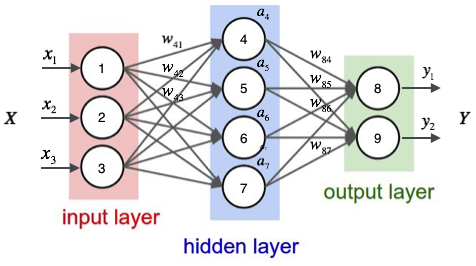

## 概念
## 感知器(Perceptron)

输出：$y=f(\mathrm{w}\bullet\mathrm{x}+b)\qquad$
### 线性可分与线性不可分
将上面的线性判别函数中的样本向量$x$增加一维常数，称之为增广样本向量，记为：$\mathrm{y}=[1,x_1,x_2,...,x_d]^T$,同样的增广权向量：$\alpha=[w_0,w_1,...,w_d]^T$。因此线性判别函数：$g(y)=\alpha^Ty$。对应的决策规则变成：$g(y)>0$决策为$w_1$类，反之决策为$w_2$类。  
满足上面决策规则的样本是线性可分的，即在样本特征空间中，至少会存在一个决策面(例如$\mathrm{w}\bullet\mathrm{x}+b=0$)可以将两类样本正确无误的区分开，反之找不到一个决策面来区分的话，即为样本是线性不可分的。  
对于感知器，要求样本必须是线性可分的。
### 感知器的训练算法
  
误分类的点$(x_i,y_i)$，则$x_i$距离决策面的距离为：
$\dfrac{1}{||\mathrm{w}||}|\mathrm{w}\bullet x_i+b|$  
其中，$||\mathrm{w}||$为$\mathrm{w}$的$L_2$范数。  
> $L_1$范数：为$x$向量各个元素绝对值之和
$L_2$范数：为$x$向量各个元素平方和的1/2次方
$L_p$范数：为$x$向量各个元素绝对值$p$次方和的$1/p$次方
$L_\infty$范数：为$x$向量各个元素绝对值最大的那个元素的绝对值

由于$|y_i|=1$，因此上式恰好等于  
$\dfrac{- y_i(\mathbf{ w\cdot x_i}+ \mathbf b)}{||\mathbf w||}$  
定义损失函数为所有误分类数据点到决策面的距离之和：  
$L_0(\mathbf w, \mathbf b)=-\dfrac{1}{||\mathbf w||}\sum_{\mathbf x_i \in M}y_i(\mathbf{w\cdot x_i}+ \mathbf {b})$  
如果没有误分类点，则$L(\mathbf w, \mathbf{b}) = 0$。感知器的训练算法就是求取使得$L(\mathbf w, \mathbf{b}) = 0$的$\mathbf w$和$\mathbf b$。  
大多数教材给出的感知器$sign(\mathbf{w\cdot x}+ \mathbf b)$学习的损失函数定义为：  
$L(\mathbf w,b)=-\sum_{\mathbf x_i \in M}y_i(\mathbf{w\cdot x_i}+b)$  
这两者是等价的。
### 感知器的学习算法
- 训练集：  
$T=\{(\mathbf {x}_1,y_1),(\mathbf {x}_2,y_2),\cdots,(\mathbf{x}_N,y_N)\}$
$\mathbf x_i \in \mathbb R^{n}$
$y_i \in \{+1,-1\}$  
- 求参数$\mathbf w$和$\mathbf b$，使得  
$\min_{\mathbf{w},\mathbf{b}} L(\mathbf w, \mathbf{b}) = \min_{\mathbf w,\mathbf{b}}\left[-\sum_{\mathbf x_i \in M}y_i(\mathbf{w\cdot x_i}+ \mathbf{b})\right]$  
- 假设误分类点集合$M$是固定的，则损失函数$L(\mathbf w,\mathbf{b})$的梯度由：  
$\nabla_\mathbf{w} L(\mathbf w,\mathbf{b})=- \sum_{\mathbf x_i \in M}y_i \mathbf x_i$
$\nabla_\mathbf{b} L(\mathbf w,b)=-\sum_{\mathbf x_i \in M}y_i$
> 这两个梯度给出的是损失函数增长的方向，我们需要的是反方向下降的方向

- 梯度下降法：随机选取一个误分类点$(\mathbf x_i,y_i)$，对$\mathbf w$和$\mathbf b$进行更新：  
$\mathbf w \leftarrow \mathbf w+\eta . y_i\mathbf x_i$
$\mathbf{b} \leftarrow \mathbf{b}+\eta . y_i$  
其中$\eta \in (0,1]$是学习率。通过迭代可以使得损失函数$L(\mathbf w,\mathbf{b})$不断减小直到0。

## 多层神经网络/多层感知器(Multi-Layer Perceptron,MLP)
### 神经网络定义
  
神经网络其实是按照一定规则连接起来的多个神经元。上图展示了一个全连接(full connected,FC)神经网络。
- 神经元按照层来布局。最左边的层叫做输入层，负责接收输入数据；最右边的层叫做输出层，可以获取神经网络输出数据。输入层和输出层之间的层叫做隐藏层，因为它们对于外部是不可见的。
- 同一层的神经元之间没有连接
- 第N层的每个神经元和第N-1层的所有神经元相连，第N-1层神经元的输出就是第N层神经元的输入
- 每个连接都有一个权值  

这些规则定义了全连接神经网络的结构，还有一些其他结构的神经网络，如CNN,RNN等
### 神经网络的输出

$a_4=sigmoid(w_{41}x_1+w_{42}x_2+w_{43}x_3+w_{4b})$
$a_5=sigmoid(w_{51}x_1+w_{52}x_2+w_{53}x_3+w_{5b})$
$a_6=sigmoid(w_{61}x_1+w_{62}x_2+w_{63}x_3+w_{6b})$
$a_7=sigmoid(w_{71}x_1+w_{72}x_2+w_{73}x_3+w_{7b})$
$\Downarrow$
$\vec{x}=[x_1,x_2,x_3,x_4]^T$
$\vec{w_4}=[w_{41},w_{42},w_{43},w_{4b}]$
$\vec{w_5}=[w_{51},w_{52},w_{53},w_{5b}]$
$\vec{w_6}=[w_{61},w_{62},w_{63},w_{6b}]$
$\vec{w_7}=[w_{71},w_{72},w_{73},w_{7b}]$
$f=sigmoid$
$\Downarrow$
$a_4=f(\vec{w_4}\centerdot\vec{x})$
$a_5=f(\vec{w_5}\centerdot\vec{x})$
$a_6=f(\vec{w_6}\centerdot\vec{x})$
$a_7=f(\vec{w_7}\centerdot\vec{x})$
$\Downarrow$

  
$\Downarrow$
$\vec{a}=f(W\centerdot\vec{x})$  

$\Downarrow$
$\vec{a}_1=f(W_1\centerdot\vec{x})$
$\vec{a}_2=f(W_2\centerdot\vec{a}_1)$
$\vec{a}_3=f(W_3\centerdot\vec{a}_2)$
$\vec{y}=f(W_4\centerdot\vec{a}_3)$

### 神经网络的训练
神经网络的训练就是为了得到每个连接上的权值。若将神经网络称为模型，那么这些权值就是模型的参数，即为模型要学习的东西。然而一个神经网络的连接方式，网络的层数、每层的节点数这些参数，则不是学习出来的，而是人为事先设置的，称之为超参数。
#### 反向传播算法(Back-Propagation Algorithm)
假设每个训练样本为$(\vec{x},\vec{t})$，其中向量$\vec{x}$是训练样本的特征，而$\vec{t}$是样本的标签。  
  
计算出每个节点的误差项$\delta_i$  
- 对于输出层节点$i$：  
$\delta_i=y_i(1-y_i)(t_i-y_i)\quad\quad$例如，$\delta_8=y_1(1-y_1)(t_1-y_1)$
- 对于隐藏层节点：  
$\delta_i=a_i(1-a_i)\sum_{k\in{outputs}}w_{ki}\delta_k\qquad$
其中，$w_{ki}$是节点$i$到它的下一层节点$k$的连接的权重，$\delta_k$是节点$i$的下一层节点$k$的误差项。
例如$\delta_4=a_4(1-a_4)(w_{84}\delta_8+w_{94}\delta_9)$  

更新每个连接的权值：  
$w_{ji}\gets w_{ji}+\eta\delta_jx_{ji}\qquad$  
> 显然,计算一个节点的误差项，需要先计算每个与其相连的下一层节点的误差项。这就要求误差项的计算顺序必须是从输出层开始，然后反向依次计算每个隐藏层的误差项，直到与输入层相连的那个隐藏层。这就是BP算法的含义
#### 径向基函数网络(radial basis function,RBF network)
#### 正则化(Regularization)
