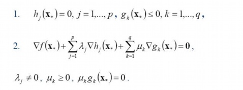
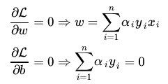
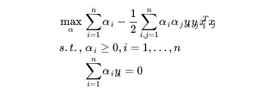
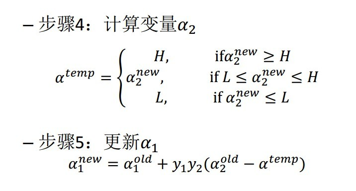

## 了解SVM
### 概念
支持向量机(SVM)是90年代中期发展起来的基于统计学习理论的一种机器学习方法，通过寻求结构化风险最小来提高学习机泛化能力，实现经验风险和置信范围的最小化，从而达到在统计样本量较少的情况下，亦能获得良好统计规律的目的。
通俗来讲，它是一种二类分类模型，其基本模型定义为特征空间上的间隔最大的线性分类器，即支持向量机的学习策略便是间隔最大化，最终可转化为一个凸二次规划问题的求解。

### 线性分类
一个线性分类器的学习目标便是要在$n$维的数据空间中找到一个 **超平面hyper plane** ，可以表示为$w^Tx+b=0$
**Logistic回归** 目的是从特征学习出一个0/1分类模型，而这个模型是将特征的线性组合作为自变量，由于自变量的取值范围是负无穷到正无穷，因此使用Logistic(或者称作sigmoid)将自变量映射到(0,1)上，映射后的值被认为是$y=1$的概率。
$h_{\theta}=g(\theta^Tx)=\dfrac{1}{1+e^{-\theta^Tx}}=P(y=1|x;\theta)$

故：当$P(y=1|x;\theta)=h_{\theta}>0.5$，则为$y=1$的类，反之属于$y=0$类
由$h_{\theta}>0.5$得$\theta^Tx>0$，即有
$$g(z)=\begin{cases}
1 & z>=0 \\
-1 & z<0
\end{cases}$$
而当$\theta^Tx>>0$时，$h_{\theta}=1$，反之$h_{\theta}=0(-1)$。因此模型的训练目标即为让训练数据中$y=1$的特征$\theta^Tx>>0$，而$y=0$的特征$\theta^Tx<<0$

### 函数间隔与几何间隔
在超平面$w^Tx+b=0$确定的情况下，$|w^T+b|$能够表示点$x$到距离超平面的远近，而通过观察$w^Tx+b$的符号与类标记$y$的符号是否一致可判断分类是否正确，故可用$y(w^Tx+b)$的正负值判定。由此引出**functional margin**
$\widehat{\gamma}=y(w^Tx+b)=yf(x)$
超平面$(w,b)$关于训练数据集$T$的函数间隔：$\widehat{\gamma}=min\widehat{\gamma}_i\quad(i=1...n)$
但是函数间隔有限制，若成比例地改变$w,b$，那么函数间隔也会成比例地改变，但是超平面却没有改变。
故引出**Geometrical margin**
$\widetilde{\gamma}=\dfrac{yf(x)}{||w||}=\dfrac{\widehat{\gamma}}{||w||}$

### 最大间隔分类器
对一个数据点进行分类，当超平面离数据点的“间隔”越大，分类的 **确信度confidence** 也越大。

由函数间隔和几何间隔的定义，可得：
$$\begin{cases}
y_i(w^Tx_i+b)=\widehat{\gamma}_i>=\widehat{\gamma} & i=1...n \\
\widetilde{\gamma}=\dfrac{\widehat{\gamma}}{||w||} & make\quad\widehat{\gamma}=1
\end{cases}$$
因此可得目标函数：
$$max\widetilde{\gamma}=max\dfrac{1}{||w||},\quad s.t.,y_i(w^T+x_i)>=1,i=1...n$$

如图，中间的实线即为 **最优超平面Optimal Hyper Plane**，虚线上的点即为支持向量，满足$y(w^Tx+b)=1$

## 深入SVM
### 从原始问题到对偶问题的求解
将目标函数变换，得到新的目标函数：
$$min\dfrac{||w||^2}{2},\quad s.t.,y_i(w^T+x_i)>=1,i=1...n$$
此时的目标函数是二次的，约束条件是线性的，因此它是一个凸二次规划问题。**目标最优，损失最小。**
由 **拉格朗日对偶性** 得到线性可分条件下支持向量机的对偶算法：
**第一步：定义拉格朗日函数**
$$\zeta(w,b,\alpha)=\dfrac{||w||^2}{2}-\sum_{i=1}^n\alpha_i(y_i(w^Tx_i+b)-1)$$
当所有的约束条件都满足时，存在：
$$\theta(w)=\underset{\alpha_i>=0}{max}\zeta(w,b,\alpha)=\dfrac{||w||^2}{2}$$
因此，目标函数可变成：
$$\underset{w,b}{min}\dfrac{||w||^2}{2}=\underset{w,b}{min}\theta(w)=\underset{w,b}{min}\underset{\alpha_i>=0}{max}\zeta(w,b,\alpha)=p^* $$

**第二步：对偶问题**
$$\underset{\alpha_i>=0}{max}\underset{w,b}{min}\zeta(w,b,\alpha)=d^* $$

**转换成对偶问题的优点：**
- 容易求解
- 自然地引入核函数，进而推广到非线性分类问题

### KKT条件
一般地，一个最优化数学模型能够表示成下列标准形式:

其中，$f(x)$是需要最小化的函数，$h(x)$是等式约束，$g(x)$是不等式约束，$p$和$q$分别为等式约束和不等式约束的数量。
同时，得明白以下两点：
- 凸优化的概念：$\mathcal{X} \subset \mathbb{R}^n$ 为一凸集， $f:\mathcal{X}\to \mathbb{R}$ 为一凸函数。凸优化就是要找出一点 $x^\ast \in \mathcal{X}$ ，使得每一 $x \in \mathcal{X}$ 满足 $f(x^\ast)\le f(x)$ 。
- KKT条件的意义：它是一个非线性规划(Nonlinear Programming)问题能有最优化解法的必要和充分条件。

而KKT条件就是指上面最优化数学模型的标准形式中的最小点 $x^\ast $ 必须满足下面的条件：

而SVM的目标函数的约束条件是满足KKT条件的，因此可以等价转换成对偶问题进行优化求解。

### 对偶问题求解的三个步骤
**第一步：对$w,b$求偏导，得到$\underset{w,b}{min}\zeta(w,b,\alpha)$**

此时得到的式子中只有$\alpha$变量，故只要求出$\alpha$,就可以求出$w,b$

**第二步：求对$\alpha$ 的极大**

若求出了$\alpha$，根据$w=\sum_{i=1}^n\alpha_iy_ix_i$可以求出$w$；根据$b^\ast=-\dfrac{max_{i;y^{(i)}=-1}w^Tx^{(i)}+min_{i;y^{(i)}=1}w^Tx^{(i)}}{2}$可以得到$b$，最终可以得到分离超平面和分类决策函数。

**第三步：利用SMO算法求解对偶问题中的拉格朗日乘子$\alpha$**
将求极大公式转换成：

**思路：**
在要求的目标函数中，未知量只有$\alpha$，即在$\alpha_i={\alpha_1,...\alpha_n}$上求目标函数的最小值。为了求解这些乘子，每次从中任意抽取两个乘子$\alpha_1,\alpha_2$，然后固定其他乘子${\alpha_3,...\alpha_n}$，使得目标函数只有关于$\alpha_1,\alpha_2$的函数。这样不断地从一堆乘子中任意抽取两个求解，不断地迭代求解子问题，最终达到求解原问题的目的。
**选取乘子的条件：**

- 情况一：表明$\alpha_i$是正常分类，在边界内部
- 情况二：表明$\alpha_i$是支持向量，在边界上
- 情况三：表明$\alpha_i$是在两条边界之间

而不满足KKT条件，需要更新的乘子满足：
- 情况一：$y_iu_i<=1\quad but\quad\alpha_i<C$
- 情况二：$y_iu_i>=1\quad but\quad\alpha_i>C$
- 情况三：$y_iu_i=1\quad but\quad\alpha_i=C\quad or\quad\alpha_i=0$

**优化$\alpha$乘子的原理解析：**
由$\sum_{i=1}^ny_i\alpha_i=0$可得约束条件：
$$\alpha_1^{new}y_1+\alpha_2^{new}y_2=\alpha_1^{old}y_1+\alpha_2^{old}y_2=-\sum_{i=3}^ny_i\alpha_i=\zeta$$
再综合$0<=\alpha_i<=C$，可得优化的$\alpha$的取值范围：

由于选取两个乘子，其他固定，故可得目标函数为：
$$\underset{\alpha_1,\alpha_2}{min}W(\alpha_1,\alpha_2)=m\alpha_1^2+n\alpha_2^2+k\alpha_1\alpha_2+q\alpha_1+p\alpha_2$$
代入转换求导，然后在范围内截断取值更新$\alpha$值

### 核函数
