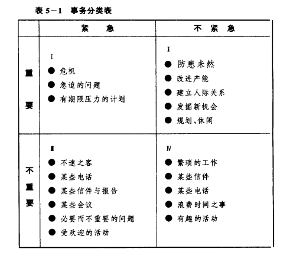
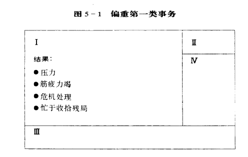
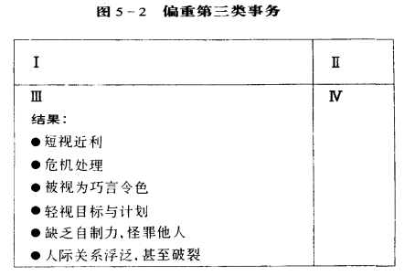
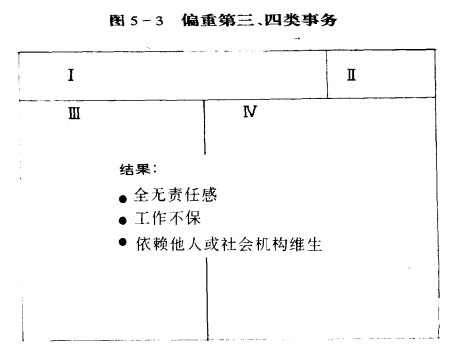

## 忙要忙得有意义-掌握重点的个人管理
综合前两个准则操之在我和确立目标，确实做到掌握重点。
> 掌握重点是透过独立意志的发挥，建立以原则为重心的处事态度，进而达到有效的自我管理  

### 个人管理的前提-独立意志
独立意志是有效自我管理的先决条件。不管是生活还是专业领域，一旦独立意志形成，往往会有超越物质的某些限制的力量展现出来，从而创造奇迹。
> 对于世界是一片黑暗和寂静的残疾人来说，大部分人是选择对自己的人生妥协的。但是海伦凯勒显然并不在其中，在这样的情况下要学会读书、写字、说话，没有强大的记忆力，简直是不可能的事。但是，海伦·凯勒没有向命运屈服。她为了能清楚地发音，用一根小绳系在一个金属棒上，叼在口中，另一端拿在手上，练习手口一心，写一个字，念一声。为了使写出来的字不至于歪歪扭扭，她还自制了一个木框，装配了一个滑轮练习写字。  

- 独立意志的强弱，可由自制力(是否言出必行、言行一致)见出端倪
- 有效管理是掌握重点式的管理。由领导力决定重点后，再靠自制力来掌握重点，以免被感觉情绪或冲动所左右。
> 葛雷《成功的共通性》：成功者能为失败者所不能为，纵使并非心甘情愿，但为了理想与目标，仍可以毅力克服心理障碍。

### 时间管理理论的演进  
如何分辨轻重缓急与培养组织能力，是时间管理的精髓所在。  
四代时间管理理论：  
- 第一代时间管理：便条与备忘录
- 第二代时间管理：行事历与日程表(反映出时间管理已注意到规划未来的重要)
- 第三代时间管理：依据轻重缓急设定短中长程目标，再逐日订定实现目标的计划(过分强调效率，过于死板拘束，忽略情感等方面)
- 第四代时间管理：否定“时间管理”，主张个人管理，将重心放在维持产品与产能的平衡上。

### 别被琐务牵着鼻子走  
根据新一代个人管理理论，将耗费时间的事务依据急迫性与重要性分为四类
  

偏向的后果：  

### 管理方法六标准  
- 一致
- 平衡
- 有重心
- 重人性
- 能变通
- 携带方便

### 个人管理四步骤
- 确定角色
- 选择目标
- 安排进度
- 逐日调整

能够一蹴而就的目标就算不上目标，所谓目标需要一步步的去实现它，就需要安排迈向目标的进度过程，再根据日常实际情况加以调整，最终达到目标。
### 执行程式
在对个人管理如电脑执行程式般执行制定的日程安排时，讲究以人为本，承认人比事情更重要，强调以原则为重心，以良知为导向，针对个人独有的使命，帮助个人平衡发展生活中的不同角色，并且全盘规划日常生活。
### 高效率的秘诀-授权
- 下达指令
- 充分信任(有效的管理之道)
  - 预期的成果
  - 应守的规范
  - 可用的资源
  - 责任的归属
  - 明确的奖惩  

对于授权事关两方，对于授权者，必须真心诚意以管理为出发点，而不是只求效果，并且授权而不是放权，需要实施监督机制，通过合作和限制来实现利益最大化；而对于受权者，既拥有一定自主权，也就无从推诿，唯有竭力达成目标，不负所托。
