## 项目管理概述
### 项目与运营
**项目(project)** 是“为创造一个特定的产品、服务或者成果而采取的临时性的努力”  
**运营(operation)** 是在组织中为了维持业务而进行的工作
### 项目的属性
- 项目有一个特定的目的
- 项目是临时性的
- 项目是通过不断完善细节而逐步开展的
- 项目通常需要来自不同领域的资源
- 项目应有一个主要客户或发起人 **(project sponsor)**--一般为项目提供方向和资金
- 项目含有不确定性

### 项目约束
**三项约束(triple constraint)**
- 范围
- 时间
- 成本
有些人将质量与三项约束合称为 **四项约束**

### 项目管理
**project management** 是指“在项目活动中运用专门的知识、技能、工具和技术，以满足项目需求”
#### 项目干系人
**stakeholder** 是指参与项目或受项目活动影响的人，包括项目发起人、项目团队、支持人员、客户、使用者、供应商，甚至是项目的反对者
#### 项目管理知识领域
**project management knowledge area** 指的是项目经理必须具备的一些重要知识和能力
- 项目范围管理
- 项目时间管理
- 项目成本管理
- 项目质量管理
- 项目人力资源管理
- 项目沟通管理
- 项目风险管理
- 项目采购管理
- 项目干系人管理
- 项目综合管理

#### 项目管理工具和技术
**project management tool and technique** 用来帮助项目经理和他们的团队进行十大知识领域的项目管理从而完成工作
- 甘特图(Gantt chart)
- 项目网络图(project network diagram)
- 关键路径分析(critical path analysis)

#### 项目成功的标准
- 项目达到了范围、时间和成本目标
- 项目使客户或者项目发起人感到满意
- 项目的结果达到了主要目标

### 项目群和项目组合管理
**program** 是指“一组相互联系的项目，宜使用协同方法进行管理来获得收益和进行控制，而这种收益和控制在单独管理这些项目时是不易获得的”
**项目群经理program manager** 对领导项目群内项目的项目经理进行领导并指明方向。同样会协调项目团队、职能部门、供应商和运营员工的努力，以支持项目并保证项目产品和过程达到最大的收益。
**项目组合管理project portfolio management** 将项目以及项目群组合并进行管理，使其作为一个投资组合，从而促成整个企业的成功
- 项目管理致力于 **战术目标Tactical goals** ，即为短期的更为具体的目标
- 项目组合管理致力于 **战略目标Strategic goals** ，即为一个组织的长期目标

### 项目经理
### 项目管理专业
**甘特图Gantt chart** 是一种标准格式，它通过在日程表上列出各种项目活动及各自的开始和结束的时间来显示项目的进度信息。
**关键路径critical path** 就是网络图中最长的路径，它决定着一个项目最早完成的日期，显示了一个项目的哪些任务影响了目标完成日期，并且它可以随着工作进展和更多信息变得可用而发生改变。
**项目管理办公室project management office,PMO** 是一个有组织的团队，负责协调整个组织中的项目管理功能。
**项目管理协会Project management Institute,PMI** ，国际性的项目管理专业协会,PMI提供 **项目管理师Project management Professional,PMP** 职业认证。
****
## 项目管理和IT背景
### 项目管理的系统观点
**系统思维system thinking** 描述了在组织的背景中执行项目的整体观点。  
**系统方法system approach** 是指采用整体的和分析的方法来解决复杂问题，包括使用系统哲学、系统分析和系统管理等方法。
**系统哲学system philosophy** 是一整套系统地思考事物的思维模式。
**系统System** 是为达到某些目的而在一个环境中运行的、由相互作用的要素组成的集合。
**系统分析system analysis** 是解决问题的一种方法，需要定义所研究系统的范围，然后将它分解成各个部分来确认与评估相应的问题、机会、约束和需求。
**系统管理system management** 处理与系统的创建、维护和改变相关的业务、技术和组织问题。
**三球模型the three-sphere model** 处理三类问题： **业务business、组织organization、技术technology**
### 组织问题
#### 组织框架
- **结构框架structural frame** 角色和责任，合作，控制。
- **人力资源框架human resources frame** 在组织需要和人力需求之间进行协调。
- **政治框架political frame** 由不同个人和利益集团联合组成，冲突和权利是关键问题。
- **符号框架symbolic frame** 事件相关的符号和意义。文化、语言、传统以及形象是这个框架的所有部分。

#### 组织结构
**组织结构organization structure** 一般分为三类：
- **职能型fuctional**
- **项目型project**
- **矩阵型matrix**

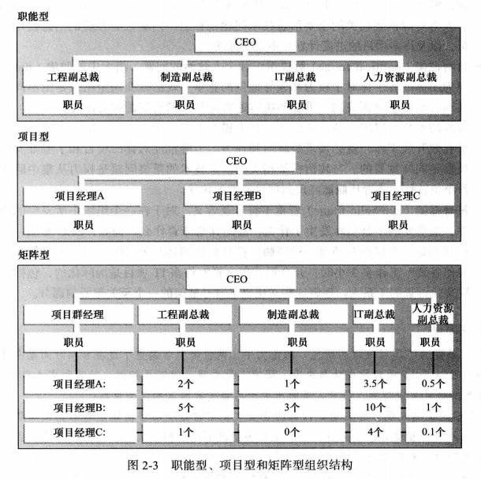
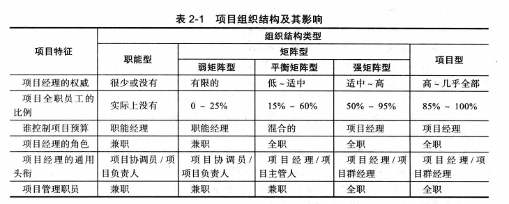
#### 组织文化
**organization culture** 是一系列共同的能够刻画组织职能的设想、价值和行为
组织文化有10个特点：
- 成员认同度member identity
- 团队专注度group emphasis
- 人员聚集度people focus
- 单元集成度unit integration
- 控制力control
- 抗风险能力risk tolerance
- 奖励标准reward criteria
- 抗冲突能力conflict tolerance
- 结果导向度means-ends orientation
- 开放系统聚集度open-systems focus

### 干系人管理
#### 高层管理承诺的重要性
一些项目有一个称为 **倡导者champion** 的高级经理，扮演着项目的关键支持者。
**Top management Commitment** 对于项目经理来说至关重要。原因如下：
- 项目经理需要足够的资源
- 项目经理经常需要及时得到对于特定项目需求的认可
- 项目经理必须与组织内其他部门的人进行合作
- 项目经理通常需要在领导力方面获得指导和帮助

#### 组织对信息技术投入的需求
**The Need for Organizational Commitment to Information Technology**
**首席信息官CIO** ，公司为IT主管设立的副总裁或者相当的职位。
#### 组织对标准的需求
**首席项目官CPO** ，进一步增加项目管理的力度。
### 项目阶段和项目生命周期
**项目生命周期project life cycle** 是一系列项目阶段的集合，定义了在每个阶段中要进行的工作，包括什么时候给出什么样的可交付成果，每个阶段涉及的人员和时间，以及管理层将如何控制和验证每个阶段中产生的工作。
**可交付成果deliverable** 是一个产品或者服务，作为项目的一部分而生产或提供的。
> 在项目生命周期的早期阶段，对资源的需求是最低的，而不确定性的程度是最高的。  

**项目可行性project feasibility** 是指前两个传统的项目阶段(概念和开发)关注计划编制。
**项目获取project acquisition** 是指后两个阶段(实施和收尾)关注实际工作的交付。
**工作分解结构WBS** 通过把工作分解成不同级别的任务粗略描述了项目的工作。
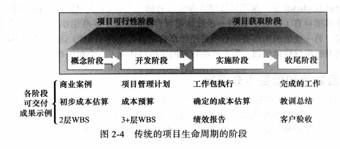
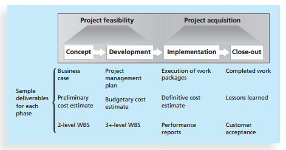
**系统开发生命周期system devalopment life cycle,SDLC** 是一个描述开发信息系统不同阶段的框架。其通用模型都是 **可预测生命周期predictive life cycle** 的模型，意味着可以很明确地表达项目的范围，并且可以精确预测进度和成本。包括：
- 瀑布模型waterfall model
- 螺旋模型spiral model
- 渐增式构建模型incremental build model
- 原型模型prototyping model
- 快速应用开发模型Rapid Application Development,RAD

**自适应软件开发adaptive software Development,ASD** 生命周期模型假定软件开发是遵循一种自适应的方法的，因为在生命周期的早期需求不能被清晰地描述。
**敏捷软件开发agile software Development** 已经成为一种流行的新方法，强调开发团队和业务专家之间的紧密协作。
高层管理的评审通常称为 **阶段出口Phase exit** 或者 **检查点kill point** ，对于保持项目的进度以及决定是否应该继续、改变方向或者终止项目是非常重要的。
### IT项目的环境
- IT项目的本质
  - IT项目可能有很多变化
  - IT项目同样支持每一种可能的行业和业务功能
- IT项目团队成员的特征
- 多样的技术

### 影响IT项目管理的最新趋势
- **全球化globalization** ，当运作全球化项目时，项目经理需要解决：
  - 沟通
  - 信任
  - 共同的工作方式
  - 工具
- **外包outsourcing** 即一个组织从外部寻找来源以获取需要的产品和服务； **海外外包offshoring** 用来描述安排在另外一个国家的外包(跨国完成的外包工作)。
- **虚拟团队virtual team** 是指运用通讯技术实现跨时间和跨地域工作的个人组成的团队

**Scrum** 是为了完成具有复杂的、创新的工作范围项目的一种领先的敏捷开发方法。
***
## 项目管理过程组
**过程process** 是针对某一特定结果的一系列行动。
**项目管理过程组project management process group** 包括：
- **预启动**：商业论证business case
- **启动过程initiating process** 包括定义和批准项目或者项目阶段。
- **计划过程planning process** 包括制定和维护一个可执行的计划，以保证项目满足组织的要求。其 **输出** 包括要完成项目范围说明、工作分解结构、项目进度表和其他内容
- **执行过程executing process** 包括协调人力和其他资源来执行项目的计划，以产生项目或者项目阶段的产品、服务或者结果。其 **主要成果** 是产生项目的实际工作。
- **监控过程monitoring and controlling process** 包括有规律地测量和监视项目进展，以保证项目团队能够满足项目目标。其 **理想产出** 是通过交付满足时间、成本和质量约束的项目来成功地完成项目。
- **收尾过程closing process** 包括对项目或者项目阶段的正式验收，并有效地终止。其 **关键产出** 是工作的正式验收和结束文档的撰写。

> 通常执行过程是最需要资源和时间的，其次是计划过程。启动和收尾过程通常是最短的，要求资源和时间也最少。

**将过程组映射到知识领域**
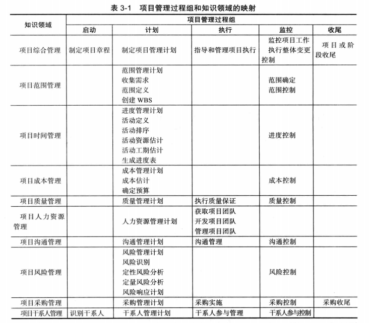
**方法学methodology** 描述应该如何去做事情，不同的组织通常有不同做事方式。
- 受控环境下的项目管理(PRINCE2)：定义了45个独立子进程，并将它们分为8个过程组
- 敏捷方法:一般用于 **项目业务团队在产品生命周期早期不能清楚表达项目范围，但团队确实想在项目早期而不是后期提供一个潜在的可交付产品** 的这类项目。
- 统一软件开发过程(RUP)框架：迭代的软件开发过程
- 六西格码方法论：DMAIC、DMADV

***
## 项目综合管理
**项目综合管理project integration management** 涉及在整个项目生命周期中协调所有其他项目管理的知识领域。主要包括：
- **制定项目章程Developing the project charter**
- **开发项目管理计划Developing the project management plan**
- **指挥并管理项目执行Directing and managing project work**
- **监控项目工作monitoring and controlling project work**
- **综合变更控制performing integrated change control**
- **项目或阶段收尾Closing the project or phase**

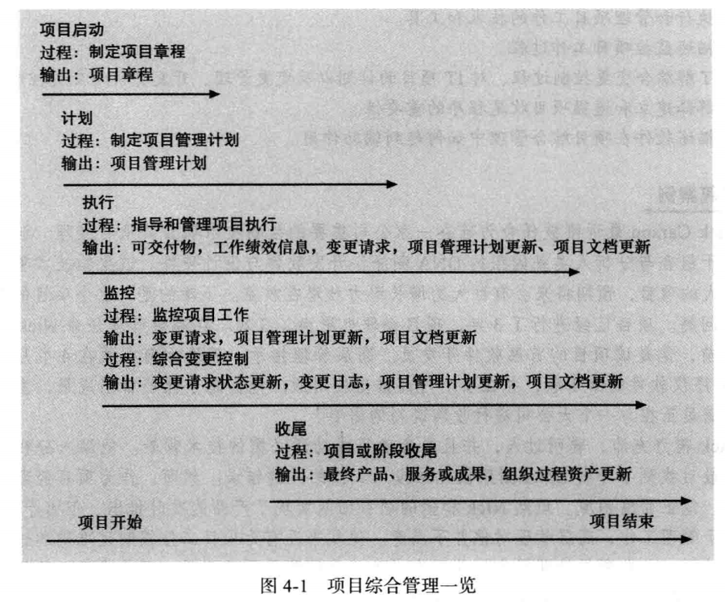
项目综合管理包括 **接口管理interface management** ，涉及识别和管理项目众多要素间相互作用的交接点。随着参与项目的人数的增加，这种接口的数量会呈指数增加。因此项目经理需要建立并维持组织界面间良好沟通和关系。
### 战略计划与项目选择
**战略计划strategic planning** 包括通过分析组织的优势和劣势，研究在商业环境中的机会和威胁，预测未来的趋势，以及预测对新产品和新服务的需求来确定长期目标。
**SWOT分析** 包括分析 **优势strength、劣势weakness、机会opportunity、威胁threat** 。
SWOT分析的流行方法有 **思维导图mind mapping** ，是一种结构分解的技术，通过从一种核心理念发散出来的方式将想法和概念结构化。
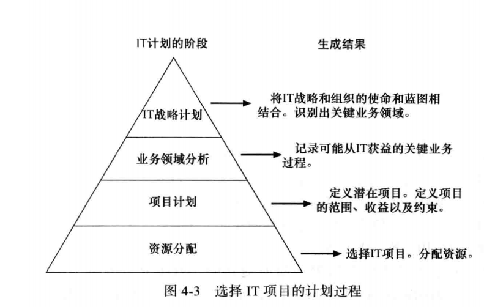

**选择项目的方法** ：
- 聚焦于广泛的组织需求:确定它们是否满足 **需求need、资金funding、意愿will**
- 将IT项目分类
  - **问题problem** 是人们不期望出现的那些造成组织无法实现其目标的情况。
  - **机遇opportunity** 是改善组织的机会。
  - **指示directive** 是由管理层、政府或者某些外部影响施加的新要求。
- 进行净现值分析、投资回报率和投资回收期分析
  - **净现值NPV分析** 就是一种计算预期净货币收益或损失的方法，该计算方法将当前时间点之后的所有未来预期现金流入和流出都作折现计算。NPV分析是一种对持续多年项目的现金流的一种公平比较。正的NPV值意味着一个项目的回报超过了其 **资本成本cost of capital** ，即把资金投资在别的地方可以获得的回报。在其他因素都一样的情况下，具有较高NPV值的项目比具有较低NPV值的项目更理想。
  要确定NPV，按照以下步骤进行：
    - 为项目生命周期和其产出的产品确定预期成本和收益
    - 确定 **折现率discount rate** ，将未来现金流折现的比率，也称为 **资本率capitalization rate、资本的机会成本opportunity cost of capital**
    - 计算NPV
    $NPV=\sum_{t=0...n}A_t/(1+r)^t$，其中t为现金流的某年，n为现金流的最后一年，A是每年的现金流数目，r是折现率。
  - **投资回报率ROI** 是项目的收益减去成本并处以成本的结果。
  **ROI=(折现收益总额-折现成本总额)/折现成本**  
  **要求回报率required rate of return** 是每项投资中要求要达到的最低回报率。
  通过发现导致项目的NPV为0的折现率，来确定投资的 **内部收益率IRR**
  - **投资回收期分析payback period** 是指净现金流的形式补偿项目总的投资所需要的时间，换言之，就是确定需经过多长时间累积收益等于累积成本以及后续成本。
- 使用加权评分模型
**weighted scoring model** 是一种基于多种标准进行项目选择的系统方法
- 实施平衡记分卡
**balanced scorecard** 是一种方法论，将组织的价值驱动因素转换成一组定义好的衡量维度。

**制定项目章程project charter** ，用来正式确认项目存在并明确项目目标和项目管理的一种文件。启动过程的主要输出为项目章程，可以有以下输入：
- **项目工作说明书a project statement of work**
- **商业论证a business case**
- **合同agreements**
- **企业环境因素enterprise environmental factors**
- **组织过程资产信息organizational process assets**

### 创建项目管理计划
**project management plan** 是用于协调所有项目计划文档，并帮助指导项目的执行和控制的一种文件。项目管理计划应该是动态的、灵活的，并且随着环境或项目的变化而变化。
### 指导和管理项目实施
主要内容是管理和实施在项目管理计划中确定的工作，还包括批准的变更请求、企业环境因素以及组织过程资产。
- 协调计划和执行
- 提供强大领导力和支持性文化
- 利用产品、业务和应用领域知识
- 项目执行工具和技术
  - 专家评审法
  - 会议
  - 项目管理信息系统

### 监控项目工作
包括收集、衡量与发布绩效信息。还涉及评估度量与分析趋势以确定可以做出怎样的过程优化。
**基线baseline** 是批准的项目管理计划加上批准的变更。
**重要输入：**
- 项目管理计划
- 进度表
- 成本预算
- 变更确认
- 工作绩效信息
- 企业环境因素
- 组织过程资产

**重要输出是：**
- 变更请求
  - 推荐的纠正措施
  - 预防措施
  - 缺陷补救措施
- 工作绩效报告

### 执行综合变更控制
**综合变更控制integrated change control** 涉及在项目的全生命周期中识别、评估及管理变更。主要的3个目标：
- 影响那些产生变更的因素以确保变更都是有利的
- 确定一个变更已经出现过
- 及时地管理真正的变更

**重要输入：**
- 项目管理计划
- 工作绩效信息
- 变更请求
- 企业环境因素
- 组织过程资产

**重要输出：**
- 被批准的变更请求
- 变更日志
- 项目管理计划
- 文档的更新

**变更控制系统change control system** 是一个正式的、文档化的过程，描述了正式文档何时以及如何可以被变更。包括;
- **变更控制委员会change control board,CCB** 是负责批准或否决项目变更的正式团体，主要职责是为准备变更请求提供指南、评价变更请求以及管理和实施核准的变更。
- **配置管理configuration management** 确保关于项目产品的描述是正确且完整的。
- **用于沟通变更的流程**

### 项目或阶段收尾
将所有活动终止，并将已完成或取消的工作移交给适当的人员。
**主要输入：**
- 项目管理计划
- 已接受的交付物
- 组织过程资产

**主要工具和技术：** 专家评审
**主要输出：**
- 最终产品、服务或成果转移
- 组织过程资产更新

**业务服务管理business service management,BSM** 有助于将项目与企业战略相匹配的工具。
***
## 项目范围管理
**范围scope** 是指开发项目产品所涉及的所有工作和用来开展工作的所有过程。
**可交付成果deliverable** 指作为项目的一部分而生产的产品。
**项目范围管理project scope management** 是指对项目包括什么与不包括什么的界定和控制的过程。
- **制定范围管理计划** 是指确定项目的范围和需求如何管理。**输出** 是范围管理计划和需求管理计划。
- **收集需求collecting requirement** 是指定义并记录项目最终产品的特点和功能，以及创造这些产品的过程。**输出** 是项目团队编制的需求文档和需求跟踪矩阵。
  - 通常是最困难的。
  - 收集方法：原型法和文档分析法
  - **基准测试bench marking** 是通过与执行组织的内部或外部的其他项目或产品进行比较，以获得具体项目实践或产品特征的需求思想。
  - **需求跟踪矩阵Requirement Traceability Matrix,RTM** 是列出各种需求、需求属性和需求状态的一种表格，以确保所有需求被跟踪。
- **定义范围scope definition** 是指评审范围管理计划、项目章程、需求文档和组织过程资产来创建一份范围说明书，并且随着需求的扩展和变更请求得到批准而增加更多的信息。**输出** 是项目范围说明书以及项目文档的更新。
- **创建工作分解结构creating the WBS** 是指将主要的项目可交付成果分解成更细小更易管理的部分。**输出** 是范围基线(工作分解结构、WBS词典)及项目文档的更新
  - **WBS** 是对项目所涉及工作面向交付成果的分组，定义了项目的全部范围。
  - **WBS分级**
    - 层级1：项目名称
    - 层级2：工作分组，“概念”
    - 层级3：定义需求
    - 层级4：定义用户需求、(工作包)
  - **工作包work package** 即为WBS最底层的一项任务。
  - 制作WBS的方法：
    - **使用指南**
    - **类比法analogy approach**
    - **自上而下法top-down approach** ，从项目最大条目开始，将它们分解为次一级的条目。
    - **自下而上法bottom-up approach** ，先识别尽可能多的与项目有关的具体任务，再将这些具体任务集中并组织成概要任务或WBS中较高层次。
    - **思维导图法**
  - **WBS字典dictionary** 是一个描述WBS每项条目详细信息的文件。
- **验证范围validation scope** 是指项目可交付成果的正式接受。**输出** 是被接受的可交付成果、变更请求、工作绩效信息以及项目文档更新。
  - **范围蔓延scope creep** 项目范围不断扩大的趋势。
- **控制范围controlling scope** 是指对整个项目生命周期内的范围变化进行控制。**输出** 是工作绩效信息、变更请求、项目管理计划、项目文档和组织过程资产的更新。
  - 主要工具：实施偏差分析。**偏差variance** 是计划的与实际的效果之间的区别。
  - 对于减少不完善和不断变化的需求的建议：
    - **原型开发prototyping** 是指开发系统或者系统的某些方面的可运行的副本，以帮助定义用户需求。
    - **用例建模** 是一种对业务事件、启动者及系统响应方式进行识别与建模的过程。
    - **联合应用设计JAD** 使用高度组织化和集中式的工作会议将项目干系人结合起来共同定义设计信息系统。

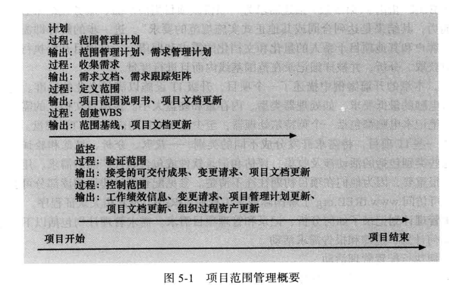
***
## 项目时间管理
**project time management** 就是确保项目按时完成所需的过程。
- **计划进度管理** 是指确定将用于计划、执行和控制项目进度的政策、流程和文档。**输出** 是进度管理计划。
  - 项目进度模型的开发
  - 在开发项目进度模型中使用的方法和工具：关键路径和关键链方法
  - 精度水平和计量单位
  - 控制阈值
  - 性能测量的规划
  - 报告格式
  - 过程描述
- **定义活动** 是指识别项目团队成员和干系人必须执行并产生项目的可交付成果的特定活动。**活动activity或任务task** 是工作的组成要素，通常出现在WBS中，有预计的工期、成本和资源要求。**输出** 是活动清单、活动属性、里程碑清单和更新的项目管理计划。
  - **活动清单activity list** 是包含在项目进度中的活动列表，包括活动名称、活动标识以及活动的简短描述。
  - **活动属性activity attribute** 提供了与进度相关的更多信息，例如前导活动predecessors、后继活动successors、逻辑关系logical relationships等。
  - **项目的里程碑milestone** 是项目中一个通常没有工期的重要事件。
  - 活动定义过程的目标是保证项目团队完全理解他们必须做的所有工作是作为项目范围的一部分，以便他们能够开始安排工作进度。
- **排序活动** 是指识别和记录项目活动之间的依赖关系。**输出** 是项目的进度网络图和更新的项目文档。
  - **依赖dependency或关系relationship** 与项目活动或任务的排序相关。
  - 为项目活动之间创建依赖关系有三个基本原因：
    - **强调依赖mandatory dependencies** 是项目工作中内在的一种关系。某些时候称为 **硬逻辑**
    - **自由依赖discretionary dependencies** 是由项目团队定义的项目活动之间的关系
    - **外部依赖external dependencies** 涉及项目和非项目活动之间的关系
  - **网络图network diagram** 是表示活动排序的首选技术，是项目活动之间的逻辑关系或者顺序的示意性的表示。
    - 网络图的格式使用的是 **双代号网络图AOA或者箭线图法ADM**
    - 网络图表示的是那些完成项目所必须执行的活动。
    - 并不是WBS的每个项都出现在网络图上，只有与活动有关的依赖项需要显示
    - **前导图法PDM** 也是一种网络图技术，使用方框表示活动
    - 活动间的4种类型的依赖或者关系：
      - 完成-开始(finish-to-start)
      - 开始-开始(start-to-start)
      - 完成-完成(finish-to-finish)
      - 开始-完成(start-to-finish)
    - 前导图比AOA网络图的优势所在:
      - 多数的项目管理软件使用前导图
      - 前导图法避免了 **虚活动dummy activity** 的需要
- **估算活动资源** 是指估算一个项目团队应该使用多少资源(人力、设备和原料)来执行项目活动。**输出** 是活动资源需求、资源分解结构(resource breakdown structure)和更新的项目文档。
- **估算活动工期** 是指估算完成单项活动所需的工作时间。**输出** 是活动工期估算和更新的项目文档。
  - **工期duration** 包括活动上花费的实际时间和占用时间。
  - 工期估算：离散的数字、时间范围、**三点估算three-point estimate** 包括乐观、最可能和悲观的估算。
- **制定进度计划** 是指分析活动序列、活动资源估算和活动工期估算来创建项目进度。**输出** 是进度基线、项目进度、进度数据、项目日历、更新的项目管理计划和更新的项目文件。
  - **甘特图Gantt chart**
    - 在甘特图上增加里程碑。根据 **SMART准则** ，里程碑应当是;
      - 明确的specific
      - 可度量的measurable
      - 可分配的assignable
      - 现实的realistic
      - 有时间限制的time-framed
    - 使用跟踪甘特图来比较计划和实际的日期
      - **跟踪甘特图tracking Gantt chart** 一个比较计划和实际项目进度信息的甘特图。
      - **基线日期baseline date** 活动的计划进度日期
      - **进度基线schedule baseline** 整个经过审批的计划进度
      - **偏移的里程碑slipped milestone** 意味着里程碑活动的实际完成时间比原来计划的要晚。白色菱形white diamond
  - **关键路径法critical path method,CPM** 又称为 **关键路径分析** ，是一种网络图技术，用来预测整个项目的工期。
    - 项目的 **关键路径** 决定了项目最早完成时间的活动序列，是网络图的最长路径，其时差或者浮动时间最少。
    - **时差slack或者浮动时间float** 指的是在不延误后继活动或者项目完成时间的情况下，任务可以推后的时间。
    - 使用关键路径分析来保持进度均衡
      - **自由时差free slack或者自由浮动时间free float** 是一个活动在不延误紧接活动的最早开始时间的情况下可以被延误的时间。
      - 一个活动的 **最早开始时间early start date** 是基于项目网络逻辑可以开始的最早的可能时间。
      - **总时差total slack或者总浮动时间** 是一个活动从它最早开始时间起，在没有拖延计划项目完成日期的情况下被耽搁的时间。
      - 利用正推和逆推计算自由时差和总时差
        - **正推法forward pass** 决定每个活动的最早开始和最早完成时间。一个活动的 **最早完成时间early finish date** 是基于项目网络逻辑最早可能完成的时间，最早开始时间加上第一个活动的工期就等于第一个活动的最早完成时间。
        - **逆推法backward pass** 可决定最晚开始和最晚完成时间。一个活动的的 **最晚开始时间late start date** 是一个活动在不延迟项目完成时间的最晚可能开始的时间；一个活动的 **最晚完成时间late finish date** 是一个活动在不延迟项目完成时间的最晚可能完成的时间。

      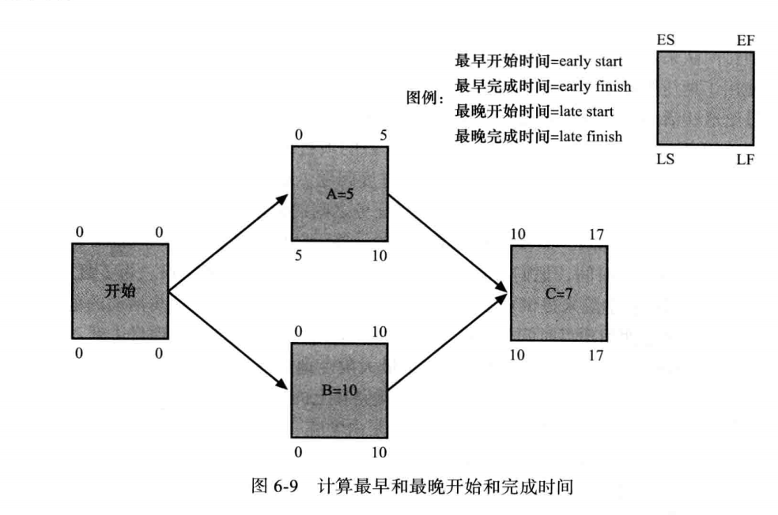
    - 使用关键路径来缩短项目的进度
      - **赶工crashing** 是一种为了以最少的成本最大限度地压缩工期，而在成本与进度之间进行均衡的技术。
      - **快速跟进fast tracking** 包括并行执行那些通常以顺序方式执行的活动。
  - **关键链调度critical chain scheduling** 是一种进度计划方法，在创建项目进度时考虑有限的资源，并且将缓冲包括进来以保护项目完成期限。
    - **约束理论TOC**
    - **多任务multitasking** 发生在一个资源在同一时间用于多个任务的时候。
    - 使用关键链调度时，提高项目完成时间：
      - **项目缓冲project buffer** 在项目的完工日期之前增加的附加时间。
      - **汇入缓冲feeding buffer** 指的是在那些前导是非关键路径任务的关键链任务之前增加的附加时间。
  - **计划评审技术PERT**
  PERT使用 **概率时间估算probabilistic time estimate**
  **PERT加权平均=(乐观时间+4*最可能时间+悲观时间)/6**
- **控制进度** 是指控制和管理项目进度的变更。**输出** 是工作绩效信息、进度预测、请求变更、项目管理计划的更新、项目文档的更新和组织过程资产的更新。

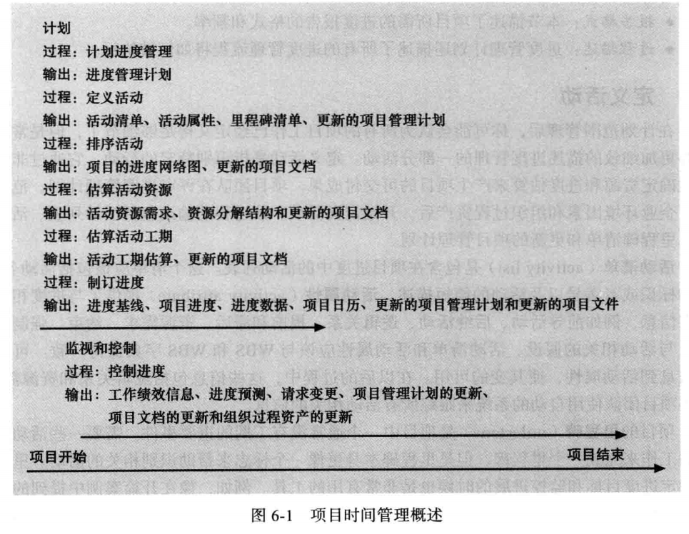
***
## 项目成本管理
**project cost management** 包括用来确保在批准的预算范围内完成项目的必要过程。有4个过程：
- 计划成本管理：包括确定用于计划、执行、控制项目成本的政策、程序和文档。**输出** 是成本管理计划。
- 成本估算：包括完成项目所需资源的近似或估算成本。**输出** 是活动的成本估算、估算的基础和更新的项目文档。
- 确定估算：包括将整体成本估算配置到各单项工作，以建立一个衡量绩效的基线。**输出** 是成本基线、项目资金需求和更新的项目文档。
- 成本控制：包括控制项目预算的变更。
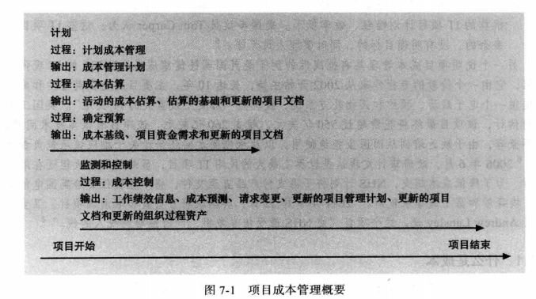

### 成本管理
**利润profit** 是收入减去支出。
**利润率profit margin** 是利润和收入的比值。
**生命周期成本life cycle costing** 是对贯穿于整个项目生命周期的成本状况的总体认识。
**现金流分析cash flow analysis** 是用于确定项目每年的估计成本和收益以及由此产生的年度现金流的一种方法。
**有形成本或有形收益tangible costs or benefits** 是能够容易地用货币来衡量的成本或收益。
**无形成本或无形收益intangible** 是那种很难用货币来衡量成本或收益。
**直接成本direct costs** 是与项目的产品和服务的生产直接相关的成本。例如工作人员的薪金，软硬件的成本等，可控的。
**间接成本indirect costs** 是与项目的产品和服务的生产不直接相关的成本，但是间接地与项目的绩效挂钩。例如电力费用、纸巾等，不可控的。
**沉没成本sunk costs** 是过去已经花掉的钱。
**学习曲线理论learning curve theory** 指出当重复生产许多产品时，那些产品的单位成本随着数量的增多而呈现规律性的递减。
**储备金reserves** 是包含于成本估算中，为减轻未来难以预测情形带来的成本风险而准备的那部分资金。
**应急储备金contingency reserves** 是为一些可以部分预计的未来情况(也称已知的不确定事件)做准备，包含于项目的成本基线中。
**管理储备金management reserves** 是为不能预测的未来情况(也称未知的不确定事件)做准备。
### 计划成本管理
成本管理计划包括：
- 精确度
- 测量单位
- 组织程序链接
- 控制临界值
- 绩效测量规划
- 报告模板
- 过程描述

### 成本估算
三种基本的成本估算类型：
- 粗粒度估算rough order of magnitude,ROM 提供了项目成本的一个粗略估算。
- 预算估算budgetary estimate 用于将资金分配到组织的预算中。
- 确定性估算definitive estimate 提供一个精确的项目成本估算

成本估算的工具和技术
- 专家判断
- 类比成本估算
- 自下而上估算
- 三点估算
- 参数估算
- 质量成本
- 项目管理估算软件
- 供应商报价分析和储备分析

### 成本预算
成本预算涉及将项目成本估算随时间分配给个体材料资源或单个工作项，这些个体材料资源或工作项是以项目工作分解结构为基础的。成本预算的目的就是编制一个成本基线，用来衡量项目绩效和资金需求。
**成本基线** 是分时段的预算，项目经理用它来衡量和监控成本性能。
### 成本控制
项目成本控制包括检测成本执行情况、确保一个修改的成本基线中仅仅包括适当的项目变更，以及通知项目干系人那些经核准、影响成本的项目变更。
**挣值管理earned value management,EVM** 是一个成本控制工具，综合了项目范围、时间和成本数据的项目绩效测量技术。其涉及WBS中的三个值：
- **计划值planned value,PV** 也叫预算，是在给定时间内计划花费在某个活动上的已批准总成本估算的部分。
- **实际成本actual cost,AC** 是在给定时间内，完成一项活动所产生的直接成本和间接成本的总和。
- **挣值earned value,EV** 是实际完成工作的估算值。它是基于项目或活动初始计划成本的，是项目组当前实际完成工作的比率。**完成百分比rate of performance,RP** 是实际完成工作与在项目或活动周期给定时间内已完成计划工作的比率。

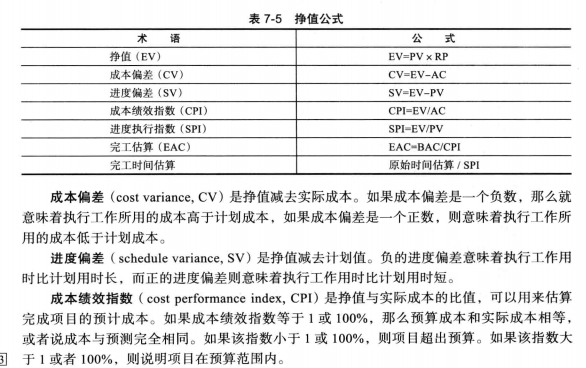
***
## 项目质量管理
**需求一致性conformance to requirement** 是指项目过程和产品满足书面规范的要求。
**适用性fitness for use** 是指产品能像它被预期的那样使用。
**项目质量管理** 的目的是确保项目满足它所应满足的需求。客户是质量是否可接受的最终裁判者。项目质量管理有三个主要过程：
- **计划质量管理planning quality management** 包括确认与项目有关的质量需求和标准以及如何满足它们。**输出** 是质量管理计划、过程改进计划、质量度量、质量检查表和项目文档更新。**度量标准metric** 是一个测量的标准，包括产品故障率、产品和服务的可行性以及客户满意度。
- **实施质量保证** 包括对整个项目绩效进行定期的评估以确保项目能够满足相关的质量标准。**输出** 是变更请求、项目管理计划更新、项目文档更新和组织过程资产更新。
- **控制质量** 包括监控特定的项目结果，确保它们遵循相关质量标准，并确定提高整体质量的方法。工具和技术：**帕累托图、质量控制图、统计抽样** ，**输出** 是质量控制度量、有效的变更、有效的可交付成果、工作绩效信息、变更请求、项目管理计划更新、项目文档更新和组织过程资产更新。

### 计划质量管理
**实验设计design of experiment** 是一种质量计划技术，用以帮助确认哪个变量对一个过程的整体结果影响最大。
IT项目中影响质量的重要范围部分包括：
- **功能性functionality** 是一个系统执行其预定功能的程度。**特色feature** 是吸引用户的系统特性。
- **系统输出system output** 是系统产生的界面和报告
- **性能performance** 是一个产品或服务如何有效执行客户预期的功能。
- **可靠性reliability** 是指一个产品或服务在正常条件下表现出符合预期情况的能力。
- **可维护性maintainability** 说明进行产品维护的容易程度。

### 质量保证
**质量保证quality assurance** 包括满足一个项目相应质量标准的所有相关活动。
**持续改善kaizen** 是一个日语词汇，意指更好的改善和改变
**精益lean** 的目的是实现客户价值最大化，同时尽量减少浪费。
几个工具用于质量保证：
- 实验设计
- 基准比较法benchmarking
- 质量审计quality audit

### 质量控制
主要输出：
- **验收决策acceptance decision** 确定作为项目的一部分而生产的产品或服务是否通过验收的决策。
- **返工rework** 指为使被拒收的项目达到和满足产品需求、规范或干系人的其他期望而采取的行动。
- **过程调整process adjustment** 指根据质量控制的度量结果，纠正或防止进一步的质量问题而作的调整。

用于质量控制的工具和技术：
- 七种质量工具
  - 因果图cause-and-effect diagram 或者 鱼骨图fishbone diagram 或者 石川图Ishikawa diagram
  - 控制图control chart、七点运行法则seven run rule(星号表示)
  - 检查表checksheet
  - 散点图scatter diagram
  - 直方图histogram
  - 帕累托图pareto diagram、帕累托分析又称为80-20法则
  - 流程图flowchart
- 统计抽样statistical sampling
- 六西格玛法则
应用六西格玛进行质量控制的项目通常遵循称为DMAIC的五阶段改进流程：
  - 界定define
  - 度量measure
  - 分析analyze
  - 改进improve
  - 控制control

### 现代质量管理
### 提高IT项目质量
- 领导
- 质量成本：是一致成本加上不一致成本。
  - 一致conformance 指交付满足要求的和适用的产品
  - 不一致成本cost of nonconformance 指对故障或没有满足质量期望负责
与质量相关的5类主要成本：
  - 预防成本prevention cost
  - 评估成本appraisal cost
  - 内部故障成本internal failure cost
  - 外部故障成本external failure cost
  - 测量和测试设备成本
- 组织影响、工作环境因素和质量
- 质量中的期望与文化差异
- 成熟度模型maturity model
  - 软件质量功能配置模型software quality function deployment(SQFD)model
  - 能力成熟度模型集成capability maturity model integration,CMMI
  - 项目管理成熟度模型OPM3

***
## 项目人力资源管理
项目人力资源管理就是最有效地发挥每个参与项目人员的作用的过程。包括：
- 计划人力资源管理
- 组建项目团队
- 建设项目团队
- 管理项目团队

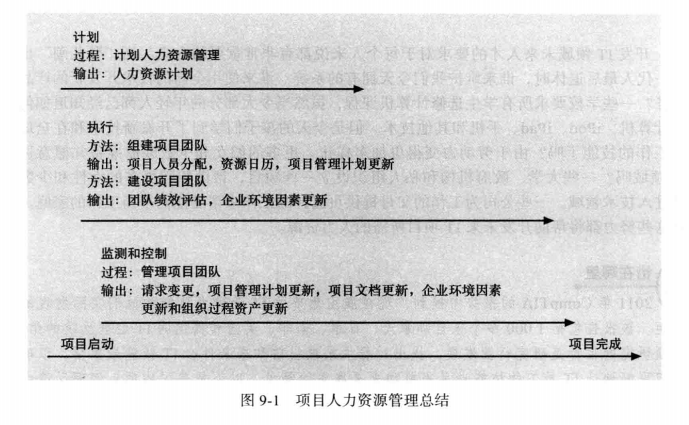
### 制定人力资源计划
- 项目组织结构图：组织分解结构OBS
- 责任分配矩阵RAM：就是将WBS中描述的项目工作与OBS中负责实施的人员相匹配的矩阵
  - 责任人responsibility
  - 批准人accountability
  - 审核人consultation
  - 告知人informed
- 人员配置管理计划staffing management plan和资源直方图resource histogram

### 组建项目团队
- 人力资源分配
- 资源负荷resource loading：是指在特定时段内，既定进度计划所需的个体资源的数量。
  - 过度分配overallocation:是指在给定时间内分配给某项工作的资源超过了它可用的资源。
- 资源平衡resource leveling

### 建设项目团队
团队建设team development的主要目标是帮助人们更有效地一起工作来提高项目绩效
- 培训
- 团队建设活动
  - 梅耶斯-布里格性格类型指示器MBTI
  - 社交类型模型
  - DISC模型
- 奖励和赏识系统

### 管理项目团队
管理项目团队的工具和技术：
- 观察与交谈
- 项目绩效评价
- 人际技能
- 冲突管理

***
## 项目沟通管理
项目沟通管理的目标是确保项目信息能够及时且适当地生成、收集、发送、存储和部署
- 计划沟通管理
- 管理沟通
  - 用技术手段加强信息的创建和分配
  - 选择适当的沟通方法和媒介
    - 互动沟通
    - 推送沟通
    - 拉式沟通
  - 报告绩效
    - 状态报告status report
    - 进度报告progress report
- 控制沟通

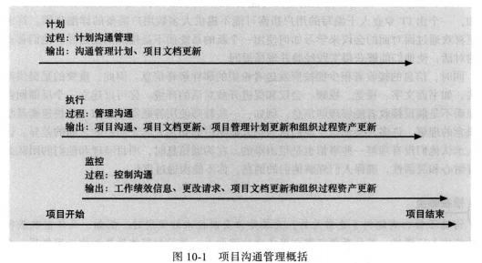

***
## 项目风险管理
项目风险管理是关于识别、分析、响应项目全生命周期内的风险，并最好地满足项目目标的科学与艺术。
**风险偏好risk appetite** 是指实体为了获得期望的回报愿意承担的不确定性程度。
**风险承受力risk tolerance** 是指在项目或业务目标的潜在影响中实体能够接受的最大的偏差。
**风险效用risk utility** 是指从潜在回报中得到的满意度。分为：
  - **风险厌恶型risk-averse**
  - **风险喜好型risk-seeking**
  - **风险中性型risk-neutral**

风险管理涉及的6个主要过程：
- 计划风险管理
  - 风险管理计划
  - 应急计划contingency plan
  - 退路计划fallback plan
  - 应急储备金contingency或者应急津贴contingency allowance
- 识别风险
**风险分解结构** 用来帮助考虑各类潜在风险的工具。
  - 识别风险的技术：
    - **头脑风暴brainstorming**
    - **德尔菲技术Delphi technique**
    - **访谈interviewing**
    - **SWOT分析**
    - 检查表
    - 假设分析
    - 创建图表
  - **风险登记表risk register** 是一份包含了各个风险管理过程结果的文档。
- 实施定性风险分析
  - 使用 **概率/影响矩阵** 计算 **风险因子**
  - 风险定性分析工具：**十大风险事项跟踪**
- 实施定量风险分析
  - 决策树是一种图像方法，可以帮助在未来结果不确定的情况下选择最好的行动路径。
  - 预期货币值EMV是风险事件概率和风险事件货币值的乘积。
  - 模拟技术：**蒙特卡罗分析MonteCarlo analysis**
  - **灵敏度分析sensitivity analysis**
- 计划风险响应
  - 应对负面风险
    - 风险规避risk avoidance
    - 风险承担risk acceptance
    - 风险转移risk transference
    - 风险缓解risk mitigation
  - 应对正面风险
    - 风险开发risk exploitation
    - 风险共享risk sharing
    - 风险增强risk enhancement
    - 风险承担risk acceptance
  - **残余风险residual risk**
  - **二次风险secondary risk**
- 控制风险

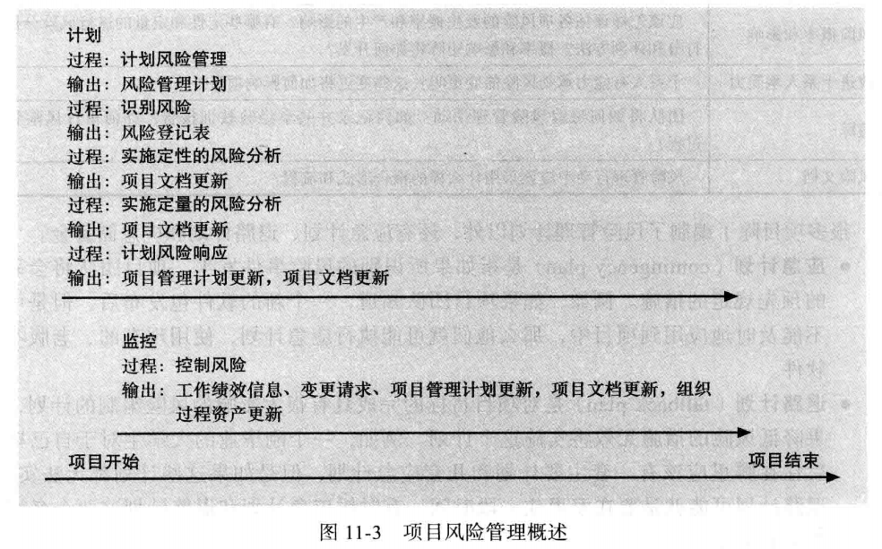

***
## 项目采购管理
**project procurement management** 包括为一个项目从外部组织获得商品或服务所需要的过程。包括4个主要过程：
- 计划采购管理:**自制/外购决策make-or-buy decision**
  - 合同类型
    - **固定价格合同fixed-price contract或总付合同lump-sum contract**--(买方风险最低)
      - **严格固定价格FFP合同**
      - **有奖励的固定价格FPIF合同**
      - **经济价格调整的固定价格合同FP-EPA**
      - 固定价格激励合同可以包括 **总假设点PTA**
      **PTA=(最高限价-目标价)/政府份额+目标成本**
    - **成本补偿合同cost-reimbursable contract** 包含向供应商支付直接与间接实际成本的合同。。以买方风险从低到高分为：
      - **成本加激励合同CPIF contract**
      - **成本加固定费合同CPFF contract**
      - **成本加奖励费合同CPAF contract**
      - **成本加百分比合同CPPC contract**
    - **时间与材料合同T&M contract** 是固定价格合同和成本补偿合同的混合。
  - 工具和技术
    - 自制/外购分析
    - 专家评判
    - 市场调研
  - 采购管理计划
  - 工作说明书SOW
  - 采购文档
    - **建议书邀请函RFP**
    - **报价邀请函RFQ**
- 实施采购
**建议性变更单 constructive change order** 指具有实际或明显权力的人，以口头或非正式的书面形式提出的意见。
- 控制采购
- 采购收尾

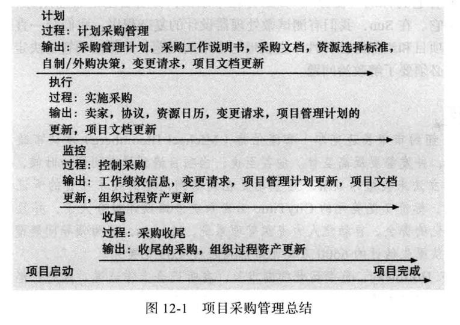
***
## 项目干系人管理
项目干系人管理第一次提出是在2012年**PMBOK Guide**上。
- 干系人识别
  - 内部internal:project sponsor,project team,support staff,internal customers。
  - 外部external：customers,competitors,suppliers

**干系人登记表stakeholder register**：识别信息、评估信息、干系人分类
**干系人分析stakeholder analysis** 是一种技术，通过分析信息来确定干系人关注什么，以及如何提高干系人对项目的支持。
- **权利兴趣网格power/interest grid**
  - **high interest and high authority** ----manage closely
  - **high interest and low authority**----keep inform
  - **low interest and high authority**----keep satisfied
  - **low interest and low authority**----monitor
- 干系人管理计划
干系人管理计划通常包括敏感信息，**不属于正式的项目文档** ，通常用于所有干系人审查。
  - 干系人登记表上的信息
  - 当前水平和期望水平
  - 干系人之间的相互关系
  - 沟通需求
  - 每个干系人的潜在管理策略
  - 干系人管理计划更新方法
- 参与干系人管理
**期望管理矩阵expectation management matrix** 平衡三项约束进行优先级排序。
**问题日志issue log** 用来记录、监控和跟踪需要解决问题的一种工具。
- 参与干系人控制(早期阶段)
- 软件辅助
  - 提高通信和协作的技术
  - 社交媒体
  - “击掌庆祝”
  - 发布评论

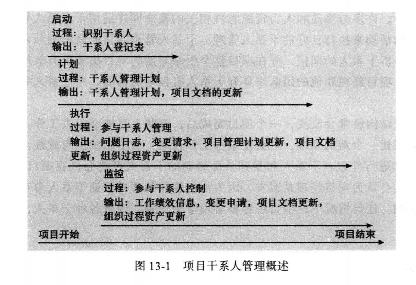
